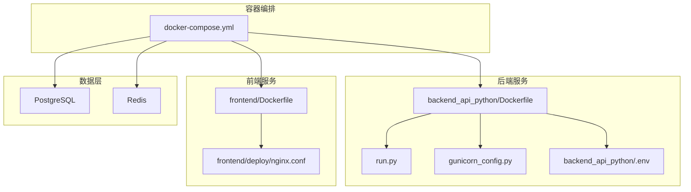
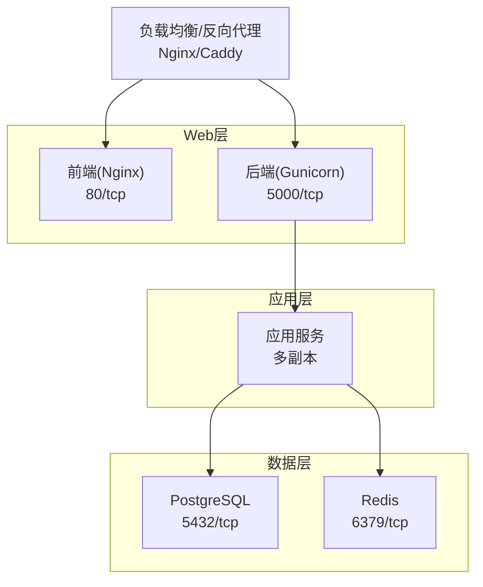
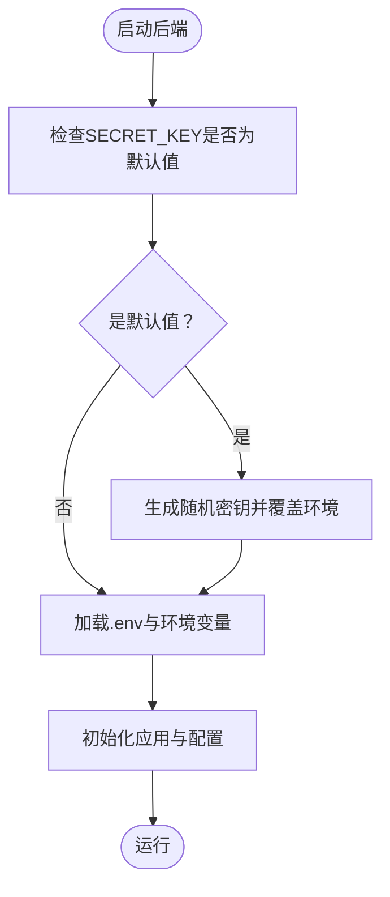
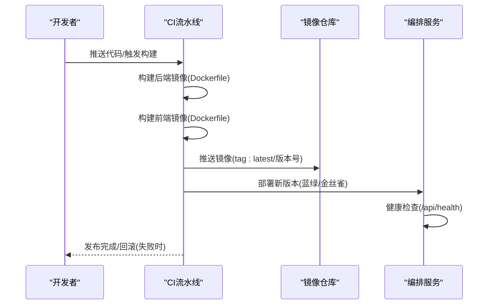
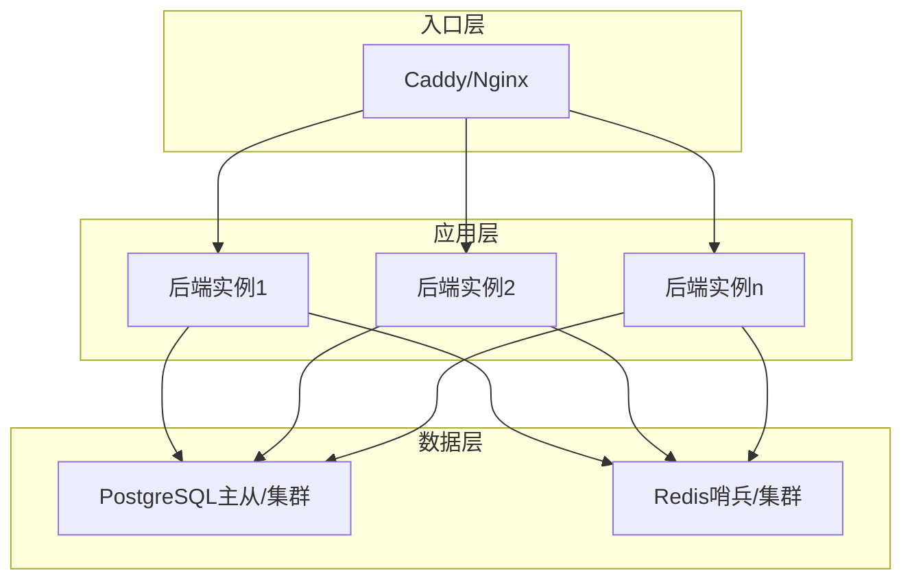
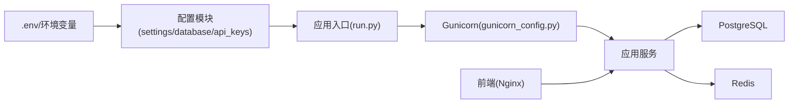

# 生产环境部署最佳实践

<cite>
**本文档引用的文件**
- [Dockerfile](file://backend_api_python/Dockerfile)
- [env.example](file://backend_api_python/env.example)
- [gunicorn_config.py](file://backend_api_python/gunicorn_config.py)
- [run.py](file://backend_api_python/run.py)
- [Dockerfile](file://frontend/Dockerfile)
- [docker-compose.yml](file://docker-compose.yml)
- [generate-secret-key.sh](file://scripts/generate-secret-key.sh)
- [build-frontend.sh](file://scripts/build-frontend.sh)
- [start.sh](file://backend_api_python/start.sh)
- [nginx.conf](file://frontend/deploy/nginx.conf)
- [caddy.conf](file://frontend/deploy/caddy.conf)
- [settings.py](file://backend_api_python/app/config/settings.py)
- [database.py](file://backend_api_python/app/config/database.py)
- [api_keys.py](file://backend_api_python/app/config/api_keys.py)
</cite>

## 目录
1. [简介](#简介)
2. [项目结构](#项目结构)
3. [核心组件](#核心组件)
4. [架构总览](#架构总览)
5. [详细组件分析](#详细组件分析)
6. [依赖关系分析](#依赖关系分析)
7. [性能考虑](#性能考虑)
8. [故障排查指南](#故障排查指南)
9. [结论](#结论)
10. [附录](#附录)

## 简介
本指南面向QuantDinger生产环境部署与运维，聚焦以下关键目标：
- 安全配置：环境变量管理、密钥轮换、访问控制与审计
- CI/CD与自动化：构建、测试、发布与回滚
- 高可用架构：负载均衡、故障转移、数据备份与监控
- 网络安全：SSL/TLS证书、域名与网络加固
- 容量规划：资源评估与扩容策略
- 灾难恢复：DRP与应急响应流程

本指南基于仓库现有配置与脚本进行提炼，并提供可操作的落地建议。

## 项目结构
QuantDinger采用前后端分离与容器化部署：
- 后端：Python/Flask + Gunicorn，通过Dockerfile构建镜像，使用docker-compose编排
- 前端：Nginx静态托管Vue产物，Dockerfile分两阶段构建
- 数据层：PostgreSQL + 可选Redis缓存
- 配置：统一通过.env与环境变量注入，支持运行时热更新

**图表来源**
- [docker-compose.yml:23-163](file://docker-compose.yml#L23-L163)
- [backend_api_python/Dockerfile:1-56](file://backend_api_python/Dockerfile#L1-L56)
- [frontend/Dockerfile:1-33](file://frontend/Dockerfile#L1-L33)
- [run.py:1-134](file://backend_api_python/run.py#L1-L134)
- [gunicorn_config.py:1-36](file://backend_api_python/gunicorn_config.py#L1-L36)
- [frontend/deploy/nginx.conf:1-25](file://frontend/deploy/nginx.conf#L1-L25)

**章节来源**
- [docker-compose.yml:1-163](file://docker-compose.yml#L1-L163)
- [backend_api_python/Dockerfile:1-56](file://backend_api_python/Dockerfile#L1-L56)
- [frontend/Dockerfile:1-33](file://frontend/Dockerfile#L1-L33)

## 核心组件
- 应用入口与配置加载
  - 后端入口：run.py负责加载.env、代理设置、创建应用实例
  - 配置体系：settings.py集中定义主机、端口、调试、日志、速率限制等；database.py定义Redis/缓存配置；api_keys.py集中管理第三方API密钥
- Web服务器与并发模型
  - Gunicorn：gunicorn_config.py定义绑定地址、工作进程数、线程数、超时、请求尺寸限制等
  - 前端：Nginx静态托管，frontend/deploy/nginx.conf提供gzip与SPA路由回退
- 容器与编排
  - 后端镜像：backend_api_python/Dockerfile，暴露5000端口，ENTRYPOINT使用docker-entrypoint.sh校验SECRET_KEY
  - 前端镜像：frontend/Dockerfile，使用nginx:1.25-alpine，暴露80端口
  - 编排：docker-compose.yml定义postgres、redis、backend、frontend四服务，含健康检查与持久卷

**章节来源**
- [run.py:17-34](file://backend_api_python/run.py#L17-L34)
- [settings.py:1-99](file://backend_api_python/app/config/settings.py#L1-L99)
- [database.py:1-90](file://backend_api_python/app/config/database.py#L1-L90)
- [api_keys.py:1-164](file://backend_api_python/app/config/api_keys.py#L1-L164)
- [gunicorn_config.py:1-36](file://backend_api_python/gunicorn_config.py#L1-L36)
- [frontend/deploy/nginx.conf:1-25](file://frontend/deploy/nginx.conf#L1-L25)
- [backend_api_python/Dockerfile:43-56](file://backend_api_python/Dockerfile#L43-L56)
- [frontend/Dockerfile:19-33](file://frontend/Dockerfile#L19-L33)
- [docker-compose.yml:23-163](file://docker-compose.yml#L23-L163)

## 架构总览
生产推荐架构要点：
- 多实例与负载均衡：后端多副本+反向代理（Nginx/Caddy）实现会话亲和或无状态转发
- 数据高可用：PostgreSQL主从/集群 + 定期逻辑备份；Redis哨兵或集群（如启用）
- 网络隔离：容器网络与宿主机网络分离；仅开放必要端口；TLS终止于边缘网关
- 安全边界：API密钥与数据库凭据通过密钥管理服务注入；审计日志与访问控制严格

[此图为概念性架构示意，无需图表来源]

## 详细组件分析

### 安全配置与密钥管理
- SECRET_KEY强制校验
  - run.py在非DEBUG模式下检测默认密钥，若发现则自动生成随机密钥并提示持久化
  - docker-compose对SECRET_KEY默认值有安全阻止机制
- 环境变量与密钥注入
  - 所有敏感信息通过环境变量注入，优先级：backend_api_python/.env > docker-compose环境变量 > OS环境
  - scripts/generate-secret-key.sh提供一键生成与替换
- 第三方API密钥轮换
  - api_keys.py支持逗号分隔的多密钥轮换（如TAVILY_API_KEYS、SERPAPI_KEYS），便于灰度切换与故障转移
- 访问控制与审计
  - settings.py提供速率限制、请求日志开关；结合Nginx/网关实现WAF与限流
  - 建议启用数据库连接池健康检查与后台任务幂等重试

**图表来源**
- [run.py:109-120](file://backend_api_python/run.py#L109-L120)
- [docker-compose.yml:14-15](file://docker-compose.yml#L14-L15)

**章节来源**
- [run.py:109-120](file://backend_api_python/run.py#L109-L120)
- [docker-compose.yml:14-15](file://docker-compose.yml#L14-L15)
- [scripts/generate-secret-key.sh:1-34](file://scripts/generate-secret-key.sh#L1-L34)
- [api_keys.py:124-145](file://backend_api_python/app/config/api_keys.py#L124-L145)

### CI/CD流水线与自动化部署
- 构建阶段
  - 后端：Dockerfile按依赖清单安装，复制源码，设置入口脚本，暴露端口
  - 前端：Dockerfile两阶段构建，先在node:18-alpine中构建，再复制到nginx:1.25-alpine
- 测试验证
  - 建议在CI中执行：单元测试、集成测试、容器健康检查
  - docker-compose内置健康检查（/api/health、/health），可用于流水线等待服务就绪
- 发布与回滚
  - 使用蓝绿/金丝雀策略：新版本镜像部署后，先健康检查通过再切流量
  - 回滚：快速拉起上一版本镜像，保留数据卷不变
- 自动化脚本
  - scripts/build-frontend.sh用于同步私有Vue仓库构建产物至frontend/dist
  - scripts/generate-secret-key.sh用于生成并注入SECRET_KEY

**图表来源**
- [backend_api_python/Dockerfile:1-56](file://backend_api_python/Dockerfile#L1-L56)
- [frontend/Dockerfile:1-33](file://frontend/Dockerfile#L1-L33)
- [docker-compose.yml:123-127](file://docker-compose.yml#L123-L127)
- [scripts/build-frontend.sh:1-53](file://scripts/build-frontend.sh#L1-L53)
- [scripts/generate-secret-key.sh:1-34](file://scripts/generate-secret-key.sh#L1-L34)

**章节来源**
- [backend_api_python/Dockerfile:1-56](file://backend_api_python/Dockerfile#L1-L56)
- [frontend/Dockerfile:1-33](file://frontend/Dockerfile#L1-L33)
- [docker-compose.yml:123-127](file://docker-compose.yml#L123-L127)
- [scripts/build-frontend.sh:1-53](file://scripts/build-frontend.sh#L1-L53)
- [scripts/generate-secret-key.sh:1-34](file://scripts/generate-secret-key.sh#L1-L34)

### 高可用架构设计
- 负载均衡
  - 前端：Nginx/Caddy作为入口，配置gzip、SPA回退路由
  - 后端：多副本Gunicorn，结合反向代理实现会话亲和或无状态转发
- 故障转移
  - docker-compose健康检查失败自动重启；建议配合外部监控告警
  - 数据库：PostgreSQL主从/集群；Redis哨兵或集群（如启用）
- 数据备份策略
  - PostgreSQL：定期逻辑备份（pg_dump/pg_restore）+ WAL归档
  - Redis：RDB快照+AOF持久化（如启用），或迁移到Redis集群
- 监控与日志
  - 后端：gunicorn access/error日志输出到标准输出，结合容器日志收集
  - 前端：Nginx访问/错误日志；结合APM与链路追踪

[此图为概念性架构示意，无需图表来源]

**章节来源**
- [frontend/deploy/nginx.conf:1-25](file://frontend/deploy/nginx.conf#L1-L25)
- [frontend/deploy/caddy.conf:1-9](file://frontend/deploy/caddy.conf#L1-L9)
- [docker-compose.yml:27-57](file://docker-compose.yml#L27-L57)
- [gunicorn_config.py:1-36](file://backend_api_python/gunicorn_config.py#L1-L36)

### SSL/TLS证书管理、域名与网络安全
- 证书与域名
  - 建议在反向代理层（Nginx/Caddy）终止TLS，使用Let’s Encrypt或商业证书
  - 域名解析指向LB，确保A/AAAA记录正确
- 网络加固
  - 仅暴露80/443（前端）、5000（后端内部）、5432/6379（数据库/缓存内部）
  - 使用防火墙/安全组限制入站；容器网络隔离
  - 启用请求尺寸限制、超时与连接复用参数，降低DDoS风险
- OAuth与CORS
  - env.example提供OAuth回调与额外重定向白名单配置，生产需严格限定

**章节来源**
- [frontend/deploy/nginx.conf:1-25](file://frontend/deploy/nginx.conf#L1-L25)
- [frontend/deploy/caddy.conf:1-9](file://frontend/deploy/caddy.conf#L1-L9)
- [docker-compose.yml:48-49](file://docker-compose.yml#L48-L49)
- [backend_api_python/env.example:23-31](file://backend_api_python/env.example#L23-L31)

### 容量规划与扩容策略
- 资源评估
  - CPU/内存：根据并发请求数、Gunicorn线程数与数据库连接池规模估算
  - 存储：PostgreSQL数据与WAL、Redis持久化、日志与静态资源
- 扩容策略
  - 垂直扩展：提升GUNICORN_WORKERS/GUNICORN_THREADS、DB_POOL_MAX
  - 水平扩展：增加后端副本数，结合LB与数据库/缓存高可用
  - 异步任务：后台任务（订单、监控、反射）应幂等并具备重试/死信队列

**章节来源**
- [gunicorn_config.py:14-28](file://backend_api_python/gunicorn_config.py#L14-L28)
- [docker-compose.yml:108-120](file://docker-compose.yml#L108-L120)
- [backend_api_python/env.example:44-57](file://backend_api_python/env.example#L44-L57)

### 灾难恢复与应急响应
- DRP
  - 数据库：主从切换演练、备份恢复流程、WAL归档与时间点恢复
  - 缓存：Redis故障转移与数据重建策略
  - 应用：多副本滚动升级与回滚预案
- 应急响应
  - 快速定位：查看gunicorn与Nginx日志、容器健康状态
  - 降级策略：关闭非关键功能（如AI分析）、启用只读模式
  - 通知机制：集成告警平台（如Prometheus Alertmanager）

**章节来源**
- [docker-compose.yml:123-127](file://docker-compose.yml#L123-L127)
- [gunicorn_config.py:30-32](file://backend_api_python/gunicorn_config.py#L30-L32)

## 依赖关系分析
- 组件耦合
  - 后端依赖数据库与可选缓存；配置通过环境变量注入，降低硬编码耦合
  - 前端静态资源由Nginx提供，与后端解耦
- 外部依赖
  - 第三方API密钥通过api_keys.py集中管理，支持轮换
  - 数据源超时与重试参数可在env.example中调整

**图表来源**
- [run.py:17-29](file://backend_api_python/run.py#L17-L29)
- [settings.py:1-99](file://backend_api_python/app/config/settings.py#L1-L99)
- [database.py:1-90](file://backend_api_python/app/config/database.py#L1-L90)
- [api_keys.py:1-164](file://backend_api_python/app/config/api_keys.py#L1-L164)
- [gunicorn_config.py:1-36](file://backend_api_python/gunicorn_config.py#L1-L36)
- [docker-compose.yml:79-127](file://docker-compose.yml#L79-L127)

**章节来源**
- [run.py:17-29](file://backend_api_python/run.py#L17-L29)
- [settings.py:1-99](file://backend_api_python/app/config/settings.py#L1-L99)
- [database.py:1-90](file://backend_api_python/app/config/database.py#L1-L90)
- [api_keys.py:1-164](file://backend_api_python/app/config/api_keys.py#L1-L164)
- [gunicorn_config.py:1-36](file://backend_api_python/gunicorn_config.py#L1-L36)
- [docker-compose.yml:79-127](file://docker-compose.yml#L79-L127)

## 性能考虑
- 并发与线程
  - Gunicorn采用gthread模型，默认1个worker与4线程；生产可根据CPU核数提升GUNICORN_WORKERS与GUNICORN_THREADS
- 数据库连接池
  - DB_POOL_MIN/MAX与获取超时需与并发线程匹配，避免“连接池耗尽”
- 缓存策略
  - Redis作为可选缓存层，需合理设置maxmemory与淘汰策略；启用时关注命中率与延迟
- 请求处理
  - 限制请求行长度与字段数，避免恶意请求导致资源耗尽

**章节来源**
- [gunicorn_config.py:14-36](file://backend_api_python/gunicorn_config.py#L14-L36)
- [docker-compose.yml:108-120](file://docker-compose.yml#L108-L120)
- [backend_api_python/env.example:44-57](file://backend_api_python/env.example#L44-L57)
- [frontend/deploy/nginx.conf:4-10](file://frontend/deploy/nginx.conf#L4-L10)

## 故障排查指南
- 启动失败
  - 检查SECRET_KEY是否为默认值；确认.env与docker-compose环境变量正确注入
  - 查看gunicorn与Nginx日志；确认健康检查端点可达
- 数据库连接问题
  - 检查DB_POOL_MAX与数据库最大连接数；确认连接字符串与网络连通
- 缓存异常
  - 若启用Redis，检查maxmemory策略与连接参数
- API密钥失效
  - 使用api_keys.py提供的轮换机制，逐步切换并验证接口可用性

**章节来源**
- [run.py:109-120](file://backend_api_python/run.py#L109-L120)
- [docker-compose.yml:123-127](file://docker-compose.yml#L123-L127)
- [backend_api_python/env.example:44-57](file://backend_api_python/env.example#L44-L57)
- [api_keys.py:124-145](file://backend_api_python/app/config/api_keys.py#L124-L145)

## 结论
本指南基于仓库现有配置与脚本，总结了QuantDinger生产环境部署的关键实践：以环境变量为中心的安全配置、容器化与编排、可扩展的并发模型、以及可落地的高可用与灾备方案。建议在生产中结合企业安全基线与合规要求，完善密钥管理、审计与监控体系。

## 附录
- 关键配置参考
  - 环境变量模板：backend_api_python/env.example
  - 后端并发与超时：gunicorn_config.py
  - 前端Nginx配置：frontend/deploy/nginx.conf
  - 容器编排：docker-compose.yml
- 工具脚本
  - 生成密钥：scripts/generate-secret-key.sh
  - 同步前端构建：scripts/build-frontend.sh
  - 后端启动脚本：backend_api_python/start.sh

**章节来源**
- [backend_api_python/env.example:1-268](file://backend_api_python/env.example#L1-L268)
- [gunicorn_config.py:1-36](file://backend_api_python/gunicorn_config.py#L1-L36)
- [frontend/deploy/nginx.conf:1-25](file://frontend/deploy/nginx.conf#L1-L25)
- [docker-compose.yml:1-163](file://docker-compose.yml#L1-L163)
- [scripts/generate-secret-key.sh:1-34](file://scripts/generate-secret-key.sh#L1-L34)
- [scripts/build-frontend.sh:1-53](file://scripts/build-frontend.sh#L1-L53)
- [backend_api_python/start.sh:1-27](file://backend_api_python/start.sh#L1-L27)