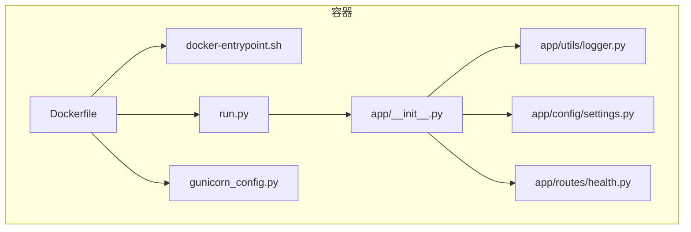
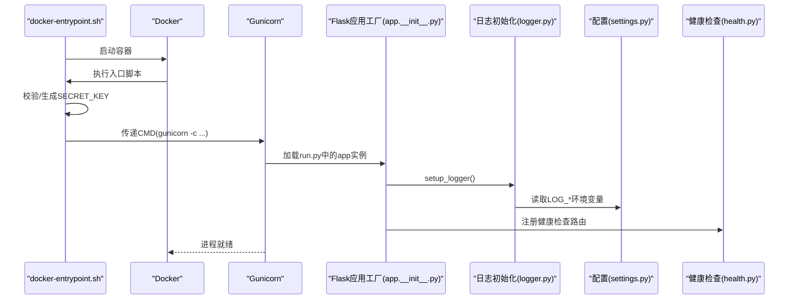
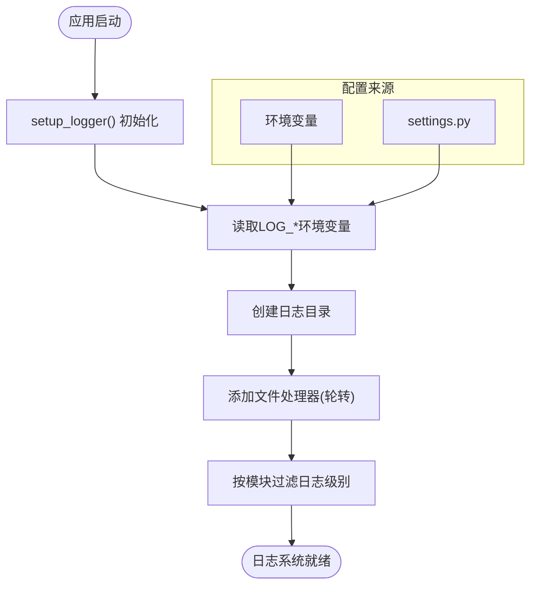
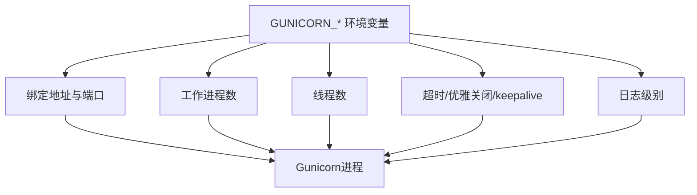
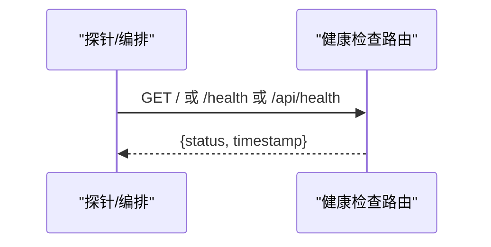
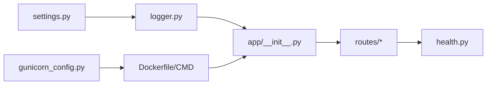

# 监控与日志管理

<cite>
**本文引用的文件**
- [backend_api_python/app/utils/logger.py](file://backend_api_python/app/utils/logger.py)
- [backend_api_python/app/config/settings.py](file://backend_api_python/app/config/settings.py)
- [backend_api_python/gunicorn_config.py](file://backend_api_python/gunicorn_config.py)
- [backend_api_python/Dockerfile](file://backend_api_python/Dockerfile)
- [backend_api_python/start.sh](file://backend_api_python/start.sh)
- [backend_api_python/run.py](file://backend_api_python/run.py)
- [backend_api_python/app/__init__.py](file://backend_api_python/app/__init__.py)
- [backend_api_python/app/routes/health.py](file://backend_api_python/app/routes/health.py)
- [backend_api_python/docker-entrypoint.sh](file://backend_api_python/docker-entrypoint.sh)
- [backend_api_python/app/utils/strategy_runtime_logs.py](file://backend_api_python/app/utils/strategy_runtime_logs.py)
</cite>

## 目录
1. [简介](#简介)
2. [项目结构](#项目结构)
3. [核心组件](#核心组件)
4. [架构总览](#架构总览)
5. [详细组件分析](#详细组件分析)
6. [依赖分析](#依赖分析)
7. [性能考虑](#性能考虑)
8. [故障排查指南](#故障排查指南)
9. [结论](#结论)
10. [附录](#附录)

## 简介
本指南面向QuantDinger后端服务的监控与日志管理，覆盖以下主题：
- 应用程序日志系统的配置与使用：Python logging模块配置、日志级别、输出格式与文件轮转。
- Gunicorn进程监控配置：工作进程与线程模型、健康检查与重启策略。
- 容器日志收集与聚合：Docker日志驱动与外部日志系统集成思路。
- 性能监控指标：响应时间、错误率与资源使用监控建议。
- 日志分析与告警最佳实践：工具选择、规则设计与告警策略。

## 项目结构
后端服务采用Flask应用工厂模式，生产环境通过Gunicorn运行；日志系统集中初始化于应用工厂中，容器镜像内默认输出到标准流并落盘到本地文件系统；健康检查接口提供基础可用性探测。

图表来源
- [backend_api_python/Dockerfile:1-56](file://backend_api_python/Dockerfile#L1-L56)
- [backend_api_python/docker-entrypoint.sh:1-49](file://backend_api_python/docker-entrypoint.sh#L1-L49)
- [backend_api_python/gunicorn_config.py:1-36](file://backend_api_python/gunicorn_config.py#L1-L36)
- [backend_api_python/run.py:1-134](file://backend_api_python/run.py#L1-L134)
- [backend_api_python/app/__init__.py:1-288](file://backend_api_python/app/__init__.py#L1-L288)
- [backend_api_python/app/utils/logger.py:1-63](file://backend_api_python/app/utils/logger.py#L1-L63)
- [backend_api_python/app/config/settings.py:1-99](file://backend_api_python/app/config/settings.py#L1-L99)
- [backend_api_python/app/routes/health.py:1-109](file://backend_api_python/app/routes/health.py#L1-L109)

章节来源
- [backend_api_python/Dockerfile:1-56](file://backend_api_python/Dockerfile#L1-L56)
- [backend_api_python/docker-entrypoint.sh:1-49](file://backend_api_python/docker-entrypoint.sh#L1-L49)
- [backend_api_python/gunicorn_config.py:1-36](file://backend_api_python/gunicorn_config.py#L1-L36)
- [backend_api_python/run.py:1-134](file://backend_api_python/run.py#L1-L134)
- [backend_api_python/app/__init__.py:1-288](file://backend_api_python/app/__init__.py#L1-L288)
- [backend_api_python/app/utils/logger.py:1-63](file://backend_api_python/app/utils/logger.py#L1-L63)
- [backend_api_python/app/config/settings.py:1-99](file://backend_api_python/app/config/settings.py#L1-L99)
- [backend_api_python/app/routes/health.py:1-109](file://backend_api_python/app/routes/health.py#L1-L109)

## 核心组件
- 日志系统：集中初始化、按模块分级、文件轮转与目录创建。
- 配置体系：日志级别、日志文件路径、最大大小与备份数量等通过环境变量控制。
- 进程管理：Gunicorn配置工作进程数、线程数、超时、访问/错误日志输出级别。
- 健康检查：提供多条健康检查路径，便于容器编排与反向代理探针。
- 容器入口：自动校验与生成密钥，确保安全启动；生产默认以Gunicorn运行。

章节来源
- [backend_api_python/app/utils/logger.py:9-48](file://backend_api_python/app/utils/logger.py#L9-L48)
- [backend_api_python/app/config/settings.py:43-91](file://backend_api_python/app/config/settings.py#L43-L91)
- [backend_api_python/gunicorn_config.py:10-36](file://backend_api_python/gunicorn_config.py#L10-L36)
- [backend_api_python/app/routes/health.py:10-109](file://backend_api_python/app/routes/health.py#L10-L109)
- [backend_api_python/docker-entrypoint.sh:25-42](file://backend_api_python/docker-entrypoint.sh#L25-L42)
- [backend_api_python/Dockerfile:54-55](file://backend_api_python/Dockerfile#L54-L55)

## 架构总览
下图展示生产环境启动流程与日志输出路径：

图表来源
- [backend_api_python/docker-entrypoint.sh:1-49](file://backend_api_python/docker-entrypoint.sh#L1-L49)
- [backend_api_python/Dockerfile:54-55](file://backend_api_python/Dockerfile#L54-L55)
- [backend_api_python/run.py:96-101](file://backend_api_python/run.py#L96-L101)
- [backend_api_python/app/__init__.py:213-288](file://backend_api_python/app/__init__.py#L213-L288)
- [backend_api_python/app/utils/logger.py:9-48](file://backend_api_python/app/utils/logger.py#L9-L48)
- [backend_api_python/app/config/settings.py:43-91](file://backend_api_python/app/config/settings.py#L43-L91)
- [backend_api_python/app/routes/health.py:10-109](file://backend_api_python/app/routes/health.py#L10-L109)

## 详细组件分析

### 日志系统与配置
- 初始化流程
  - 在应用工厂中调用日志初始化函数，设置全局日志级别与格式。
  - 为特定子系统（如数据源、路由）设置独立日志级别，降低噪声。
  - 自动创建日志目录并添加文件处理器，启用文件轮转（单文件最大大小与备份数可配置）。
- 环境变量与配置
  - 日志级别、日志目录、日志文件名、单文件最大字节、备份数量均支持通过环境变量覆盖。
  - 默认日志格式包含时间戳、模块名、级别与消息体。
- 使用方式
  - 通过工具函数获取命名日志记录器，在业务模块中直接使用。
  - 策略运行日志可持久化至数据库表，便于UI展示与检索。

图表来源
- [backend_api_python/app/utils/logger.py:9-48](file://backend_api_python/app/utils/logger.py#L9-L48)
- [backend_api_python/app/config/settings.py:43-91](file://backend_api_python/app/config/settings.py#L43-L91)
- [backend_api_python/app/__init__.py:250-251](file://backend_api_python/app/__init__.py#L250-L251)

章节来源
- [backend_api_python/app/utils/logger.py:9-48](file://backend_api_python/app/utils/logger.py#L9-L48)
- [backend_api_python/app/config/settings.py:43-91](file://backend_api_python/app/config/settings.py#L43-L91)
- [backend_api_python/app/utils/strategy_runtime_logs.py:11-29](file://backend_api_python/app/utils/strategy_runtime_logs.py#L11-L29)

### Gunicorn进程监控配置
- 工作进程与线程
  - 默认使用gthread线程模型，每工作进程4个线程，适合I/O密集型场景。
  - 可通过环境变量调整工作进程数量以提升吞吐。
- 超时与连接
  - 请求超时、优雅关闭超时、keepalive等参数已预设，满足一般生产需求。
- 日志输出
  - 访问日志与错误日志输出级别可通过环境变量控制，默认输出到标准流。
- 重要限制
  - 明确禁止预加载应用，以保证后台线程在实际工作进程中启动。

图表来源
- [backend_api_python/gunicorn_config.py:10-36](file://backend_api_python/gunicorn_config.py#L10-L36)

章节来源
- [backend_api_python/gunicorn_config.py:10-36](file://backend_api_python/gunicorn_config.py#L10-L36)

### 健康检查与重启策略
- 健康检查接口
  - 提供多条健康检查路径，返回服务状态与时间戳，便于容器编排与反向代理探针使用。
- 重启策略建议
  - 结合容器编排平台的重启策略与探针配置，确保在进程异常时自动恢复。
  - 建议将Gunicorn的优雅关闭超时与容器重启策略协同设置，避免请求中断。

图表来源
- [backend_api_python/app/routes/health.py:10-109](file://backend_api_python/app/routes/health.py#L10-L109)

章节来源
- [backend_api_python/app/routes/health.py:10-109](file://backend_api_python/app/routes/health.py#L10-L109)

### 容器日志收集与聚合
- Docker日志驱动
  - 生产默认以Gunicorn运行，日志输出到标准流；容器平台可使用默认json-file驱动收集。
- 外部日志系统集成
  - 建议在容器编排层启用集中式日志采集（如Filebeat、Fluent Bit、Promtail等），将标准流日志转发至ELK/EFK或云日志服务。
  - 对于本地开发，可结合启动脚本在容器外挂载日志目录，实现宿主机聚合。

章节来源
- [backend_api_python/Dockerfile:47-55](file://backend_api_python/Dockerfile#L47-L55)
- [backend_api_python/start.sh:18-22](file://backend_api_python/start.sh#L18-L22)

### 性能监控指标建议
- 响应时间
  - 在网关或反向代理层统计请求耗时，结合业务埋点记录关键路径耗时。
- 错误率
  - 统计HTTP 5xx错误占比与各路由错误分布，结合日志分析定位异常。
- 资源使用
  - 监控CPU、内存、磁盘IO与Gunicorn工作进程状态；对日志文件大小进行阈值告警。
- 建议的采集面
  - 业务指标：交易执行延迟、策略回测耗时、数据源请求耗时。
  - 平台指标：Gunicorn活跃连接数、队列长度、超时次数。

[本节为通用指导，无需具体文件分析]

### 日志分析与告警最佳实践
- 分析工具
  - 使用结构化日志（当前格式已包含关键字段）配合正则或解析器提取时间、级别、模块与消息。
- 告警策略
  - 将ERROR/WARNING级别作为触发条件，结合上下文（模块、用户、策略ID）进行去重与收敛。
  - 对高频重复错误设置抑制窗口，避免告警风暴。
- 策略运行日志
  - 策略运行日志可持久化至数据库，便于UI查看与历史追溯。

章节来源
- [backend_api_python/app/utils/strategy_runtime_logs.py:11-29](file://backend_api_python/app/utils/strategy_runtime_logs.py#L11-L29)

## 依赖分析
- 应用工厂依赖日志工具初始化，确保在注册路由与启动后台任务前完成日志系统就绪。
- 配置模块提供日志相关参数，被日志工具与应用工厂共同使用。
- 健康检查路由独立于日志系统，但受应用工厂注册影响。

图表来源
- [backend_api_python/app/config/settings.py:43-91](file://backend_api_python/app/config/settings.py#L43-L91)
- [backend_api_python/app/utils/logger.py:9-48](file://backend_api_python/app/utils/logger.py#L9-L48)
- [backend_api_python/app/__init__.py:250-288](file://backend_api_python/app/__init__.py#L250-L288)
- [backend_api_python/app/routes/health.py:10-109](file://backend_api_python/app/routes/health.py#L10-L109)
- [backend_api_python/gunicorn_config.py:10-36](file://backend_api_python/gunicorn_config.py#L10-L36)
- [backend_api_python/Dockerfile:54-55](file://backend_api_python/Dockerfile#L54-L55)

章节来源
- [backend_api_python/app/config/settings.py:43-91](file://backend_api_python/app/config/settings.py#L43-L91)
- [backend_api_python/app/utils/logger.py:9-48](file://backend_api_python/app/utils/logger.py#L9-L48)
- [backend_api_python/app/__init__.py:250-288](file://backend_api_python/app/__init__.py#L250-L288)
- [backend_api_python/app/routes/health.py:10-109](file://backend_api_python/app/routes/health.py#L10-L109)
- [backend_api_python/gunicorn_config.py:10-36](file://backend_api_python/gunicorn_config.py#L10-L36)
- [backend_api_python/Dockerfile:54-55](file://backend_api_python/Dockerfile#L54-L55)

## 性能考虑
- I/O密集型优化
  - 使用gthread线程模型与合理的工作进程数，避免阻塞导致的并发瓶颈。
- 日志写入开销
  - 文件轮转与UTF-8编码写入可能带来额外开销，建议在高并发场景评估落盘策略与磁盘性能。
- 超时与优雅退出
  - 合理设置超时与优雅关闭时间，平衡请求处理完整性与资源回收效率。

[本节为通用指导，无需具体文件分析]

## 故障排查指南
- 启动阶段
  - 容器启动时若未检测到密钥，入口脚本会自动生成并写入.env；请确认生产环境持久化密钥。
- 日志问题
  - 若日志未输出或格式异常，检查环境变量与日志目录权限；确认文件处理器已添加且轮转参数生效。
- 健康检查
  - 使用健康检查接口验证服务可用性；若失败，结合Gunicorn与应用日志定位问题。
- 策略运行日志
  - 若策略日志缺失，检查数据库表是否存在以及写入逻辑是否抛出异常。

章节来源
- [backend_api_python/docker-entrypoint.sh:25-42](file://backend_api_python/docker-entrypoint.sh#L25-L42)
- [backend_api_python/app/utils/logger.py:35-48](file://backend_api_python/app/utils/logger.py#L35-L48)
- [backend_api_python/app/routes/health.py:10-109](file://backend_api_python/app/routes/health.py#L10-L109)
- [backend_api_python/app/utils/strategy_runtime_logs.py:11-29](file://backend_api_python/app/utils/strategy_runtime_logs.py#L11-L29)

## 结论
QuantDinger后端的日志与监控体系以集中初始化、环境变量驱动与健康检查为核心，结合Gunicorn的线程模型与容器标准流输出，形成简洁可靠的可观测性基线。建议在生产环境中完善外部日志聚合与告警策略，并根据业务特性补充关键指标采集与可视化面板。

[本节为总结性内容，无需具体文件分析]

## 附录
- 关键环境变量
  - LOG_LEVEL：日志级别
  - LOG_DIR：日志目录
  - LOG_FILE：日志文件名
  - LOG_MAX_BYTES：单文件最大字节数
  - LOG_BACKUP_COUNT：备份数量
  - GUNICORN_WORKERS/GUNICORN_THREADS：工作进程与线程数
  - GUNICORN_LOG_LEVEL：Gunicorn日志级别
  - PYTHON_API_HOST/PYTHON_API_PORT：服务绑定地址与端口
  - SECRET_KEY：应用密钥（容器入口会自动处理）
- 健康检查路径
  - /、/health、/api/health

章节来源
- [backend_api_python/app/config/settings.py:43-91](file://backend_api_python/app/config/settings.py#L43-L91)
- [backend_api_python/gunicorn_config.py:10-36](file://backend_api_python/gunicorn_config.py#L10-L36)
- [backend_api_python/docker-entrypoint.sh:25-42](file://backend_api_python/docker-entrypoint.sh#L25-L42)
- [backend_api_python/app/routes/health.py:10-109](file://backend_api_python/app/routes/health.py#L10-L109)