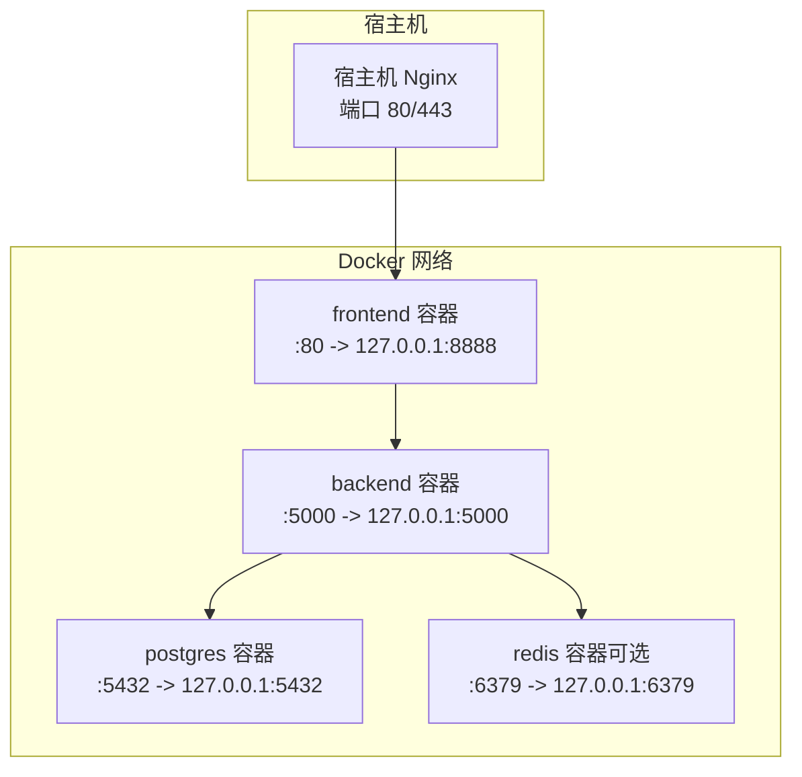
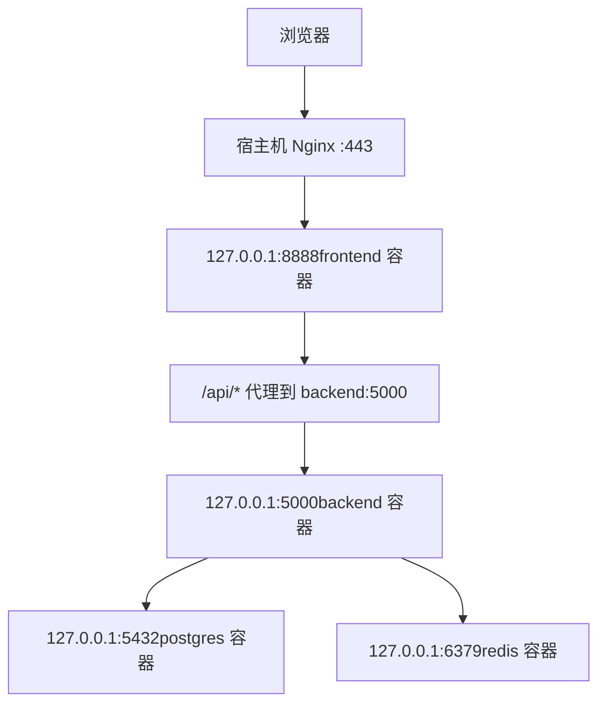
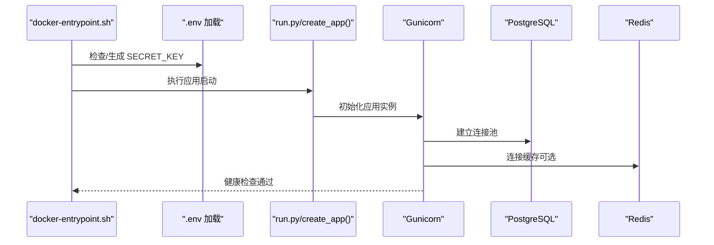
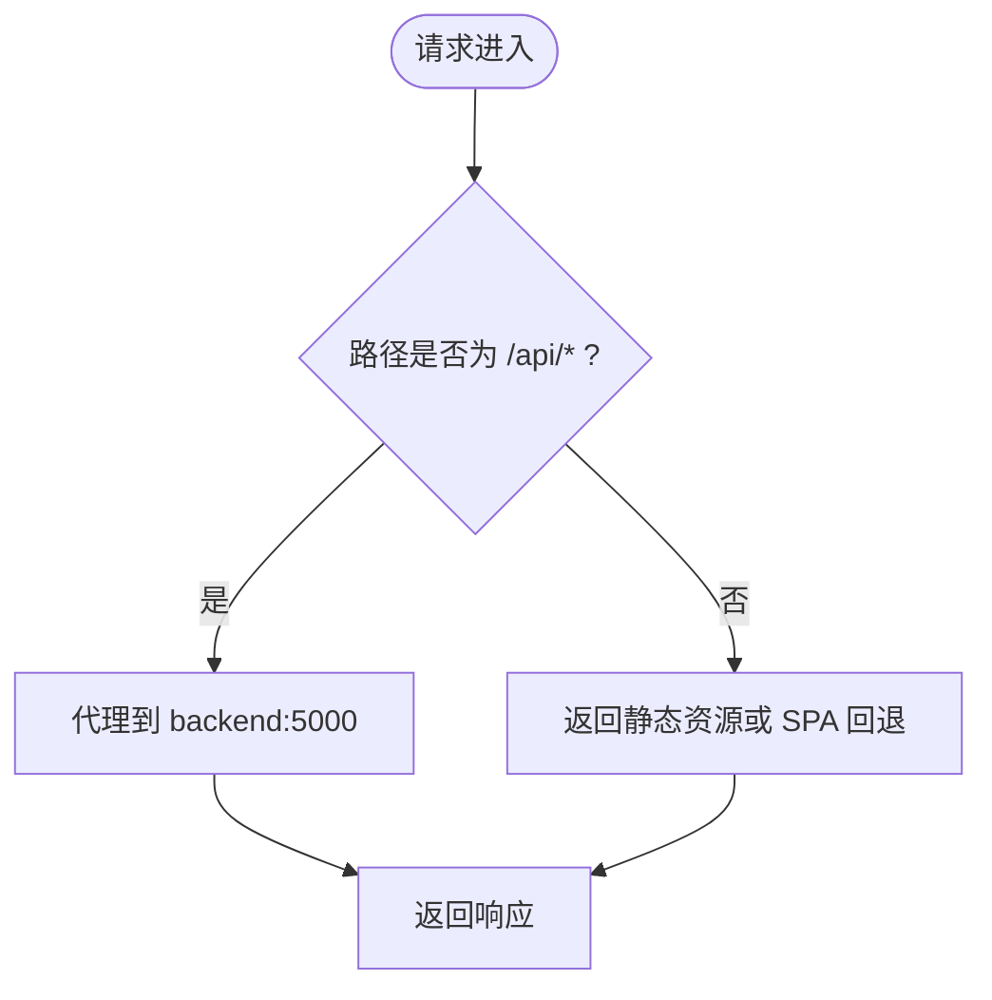
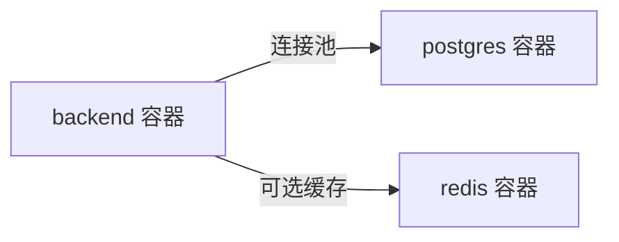
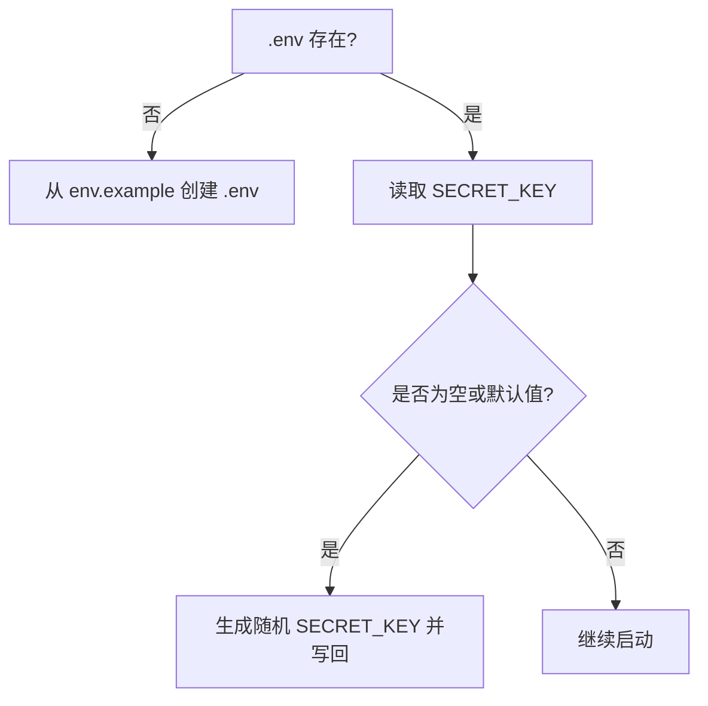
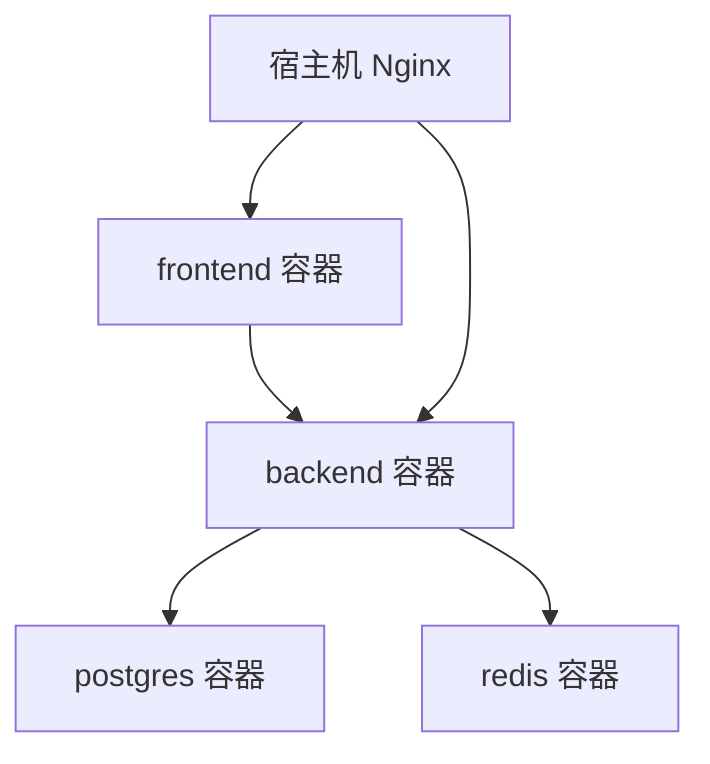

# 部署运维

<cite>
**本文引用的文件**
- [docker-compose.yml](file://docker-compose.yml)
- [backend_api_python/Dockerfile](file://backend_api_python/Dockerfile)
- [frontend/Dockerfile](file://frontend/Dockerfile)
- [backend_api_python/gunicorn_config.py](file://backend_api_python/gunicorn_config.py)
- [backend_api_python/docker-entrypoint.sh](file://backend_api_python/docker-entrypoint.sh)
- [backend_api_python/run.py](file://backend_api_python/run.py)
- [backend_api_python/env.example](file://backend_api_python/env.example)
- [scripts/generate-secret-key.sh](file://scripts/generate-secret-key.sh)
- [frontend/nginx.conf](file://frontend/nginx.conf)
- [frontend/deploy/nginx.conf](file://frontend/deploy/nginx.conf)
- [backend_api_python/start.sh](file://backend_api_python/start.sh)
- [frontend/build-docker.sh](file://frontend/build-docker.sh)
- [docs/CLOUD_DEPLOYMENT_EN.md](file://docs/CLOUD_DEPLOYMENT_EN.md)
- [docs/CLOUD_DEPLOYMENT_CN.md](file://docs/CLOUD_DEPLOYMENT_CN.md)
- [backend_api_python/app/utils/logger.py](file://backend_api_python/app/utils/logger.py)
</cite>

## 目录
1. [简介](#简介)
2. [项目结构](#项目结构)
3. [核心组件](#核心组件)
4. [架构总览](#架构总览)
5. [详细组件分析](#详细组件分析)
6. [依赖关系分析](#依赖关系分析)
7. [性能考虑](#性能考虑)
8. [故障排除指南](#故障排除指南)
9. [结论](#结论)
10. [附录](#附录)

## 简介
本指南面向生产环境，系统性介绍 QuantDinger 的部署运维实践，覆盖 Docker 容器化部署、Nginx 反向代理配置、日志管理与监控、性能优化、安全加固与高可用建议，并提供自动化部署脚本与版本管理策略，帮助团队稳定、高效地交付与运营。

## 项目结构
QuantDinger 采用多服务容器化架构，包含：
- PostgreSQL 数据库：持久化存储与初始化脚本
- Redis 缓存（可选）：提升热点数据访问性能
- Backend API（Python/Flask + Gunicorn）：业务与接口服务
- Frontend（Nginx 预编译静态资源）：SPA 前端服务

图表来源
- [docker-compose.yml:23-163](file://docker-compose.yml#L23-L163)

章节来源
- [docker-compose.yml:1-163](file://docker-compose.yml#L1-L163)

## 核心组件
- 容器编排：使用 docker-compose 统一定义服务、网络、卷与健康检查
- 后端服务：基于 Gunicorn 的 Python/Flask 应用，支持线程型工作进程模型
- 前端服务：Nginx 提供静态资源与反向代理，内置 /api/ 路由转发
- 数据库：PostgreSQL，支持连接池参数与最大连接数调优
- 缓存：Redis（可选），支持内存限制与淘汰策略
- 安全：启动前校验 SECRET_KEY，防止默认密钥导致的安全风险

章节来源
- [docker-compose.yml:23-163](file://docker-compose.yml#L23-L163)
- [backend_api_python/Dockerfile:1-56](file://backend_api_python/Dockerfile#L1-L56)
- [frontend/Dockerfile:1-33](file://frontend/Dockerfile#L1-L33)
- [backend_api_python/gunicorn_config.py:1-36](file://backend_api_python/gunicorn_config.py#L1-L36)
- [backend_api_python/docker-entrypoint.sh:1-49](file://backend_api_python/docker-entrypoint.sh#L1-L49)
- [backend_api_python/env.example:1-268](file://backend_api_python/env.example#L1-L268)

## 架构总览
推荐生产部署采用“单域名 + 宿主机 Nginx 反向代理”的拓扑，仅对外暴露 80/443，后端与数据库均绑定到 127.0.0.1，降低攻击面。

图表来源
- [docs/CLOUD_DEPLOYMENT_EN.md:1-451](file://docs/CLOUD_DEPLOYMENT_EN.md#L1-L451)
- [frontend/nginx.conf:26-42](file://frontend/nginx.conf#L26-L42)
- [docker-compose.yml:102-117](file://docker-compose.yml#L102-L117)

章节来源
- [docs/CLOUD_DEPLOYMENT_EN.md:1-451](file://docs/CLOUD_DEPLOYMENT_EN.md#L1-L451)
- [frontend/nginx.conf:1-56](file://frontend/nginx.conf#L1-L56)

## 详细组件分析

### 后端服务（Python/Flask + Gunicorn）
- 运行时：Gunicorn（线程型 worker），支持多线程并发与优雅超时
- 环境变量：通过 docker-compose 注入数据库、缓存、连接池等参数
- 启动流程：入口脚本负责 SECRET_KEY 校验与随机生成，随后以 Gunicorn 启动
- 日志：本地日志目录 logs，支持轮转与级别过滤

图表来源
- [backend_api_python/docker-entrypoint.sh:1-49](file://backend_api_python/docker-entrypoint.sh#L1-L49)
- [backend_api_python/run.py:104-134](file://backend_api_python/run.py#L104-L134)
- [backend_api_python/gunicorn_config.py:1-36](file://backend_api_python/gunicorn_config.py#L1-L36)
- [docker-compose.yml:99-127](file://docker-compose.yml#L99-L127)

章节来源
- [backend_api_python/Dockerfile:1-56](file://backend_api_python/Dockerfile#L1-L56)
- [backend_api_python/gunicorn_config.py:1-36](file://backend_api_python/gunicorn_config.py#L1-L36)
- [backend_api_python/docker-entrypoint.sh:1-49](file://backend_api_python/docker-entrypoint.sh#L1-L49)
- [backend_api_python/run.py:1-134](file://backend_api_python/run.py#L1-L134)
- [backend_api_python/env.example:1-268](file://backend_api_python/env.example#L1-L268)

### 前端服务（Nginx 静态资源与反向代理）
- 镜像：基于 Nginx 1.25-alpine，直接提供预编译静态资源
- 反向代理：将 /api/ 请求转发至 backend:5000，支持长连接与大文件上传
- 安全头：统一注入常见安全响应头
- 缓存：静态资源强缓存一年，immutable
- 健康检查：/health 返回 200

图表来源
- [frontend/nginx.conf:26-47](file://frontend/nginx.conf#L26-L47)

章节来源
- [frontend/Dockerfile:1-33](file://frontend/Dockerfile#L1-L33)
- [frontend/nginx.conf:1-56](file://frontend/nginx.conf#L1-L56)
- [frontend/deploy/nginx.conf:1-25](file://frontend/deploy/nginx.conf#L1-L25)

### 数据库与缓存
- PostgreSQL：通过 docker-compose 启动，设置 max_connections 与 shared_buffers；初始化 SQL 自动挂载
- Redis：可选缓存层，限制内存与淘汰策略，便于热点数据加速

图表来源
- [docker-compose.yml:27-74](file://docker-compose.yml#L27-L74)

章节来源
- [docker-compose.yml:27-74](file://docker-compose.yml#L27-L74)

### 安全与密钥管理
- SECRET_KEY：启动前强制检查，若为空或默认值则自动生成并写回 .env
- 环境加载：优先加载 backend_api_python/.env，其次回退到项目根 .env
- 生产建议：将 SECRET_KEY 持久化到 .env 并在容器中可写挂载以便运行时更新

图表来源
- [backend_api_python/docker-entrypoint.sh:11-44](file://backend_api_python/docker-entrypoint.sh#L11-L44)
- [backend_api_python/run.py:109-120](file://backend_api_python/run.py#L109-L120)
- [backend_api_python/env.example:13-15](file://backend_api_python/env.example#L13-L15)

章节来源
- [backend_api_python/docker-entrypoint.sh:1-49](file://backend_api_python/docker-entrypoint.sh#L1-L49)
- [backend_api_python/run.py:104-134](file://backend_api_python/run.py#L104-L134)
- [backend_api_python/env.example:1-268](file://backend_api_python/env.example#L1-L268)
- [scripts/generate-secret-key.sh:1-34](file://scripts/generate-secret-key.sh#L1-L34)

## 依赖关系分析
- 组件耦合：后端依赖数据库与缓存；前端依赖后端 API；宿主机 Nginx 作为统一入口
- 外部依赖：Docker 镜像来源可通过 IMAGE_PREFIX 全局切换
- 健康检查：各服务均配置健康检查，便于编排与运维观测

图表来源
- [docker-compose.yml:23-163](file://docker-compose.yml#L23-L163)

章节来源
- [docker-compose.yml:23-163](file://docker-compose.yml#L23-L163)

## 性能考虑
- 连接池与并发
  - 数据库连接池：DB_POOL_MIN/DB_POOL_MAX/ACQUIRE_TIMEOUT/HEALTH_CHECK 可根据并发与负载调整
  - 后端并发：GUNICORN_WORKERS 与 GUNICORN_THREADS 控制线程型 worker 的并发度
  - 路由级执行器：MARKET_EXECUTOR_WORKERS 与 PORTFOLIO_EXECUTOR_WORKERS 与连接池上限保持平衡
- 缓存策略：启用 Redis 并合理设置内存上限与淘汰策略，结合业务热点数据进行缓存
- Nginx 参数：开启 gzip、静态资源强缓存、长超时与大文件上传支持
- 数据库参数：根据负载适当提高 max_connections 与 shared_buffers

章节来源
- [backend_api_python/env.example:42-61](file://backend_api_python/env.example#L42-L61)
- [backend_api_python/gunicorn_config.py:14-28](file://backend_api_python/gunicorn_config.py#L14-L28)
- [frontend/nginx.conf:12-42](file://frontend/nginx.conf#L12-L42)
- [docker-compose.yml:36-44](file://docker-compose.yml#L36-L44)

## 故障排除指南
- 镜像拉取失败
  - 使用 IMAGE_PREFIX 切换镜像源后重建
- 后端启动异常（入口脚本缺失）
  - 清理缓存重建后端镜像
- 前端无法找到上游 backend
  - 检查后端健康状态与日志，必要时重启前端
- 前端构建报错找不到 dist
  - 检查 .dockerignore 是否排除了 frontend/dist
- 配置保存提示只读文件系统
  - 确保 .env 挂载为可写
- 代理在容器内不生效
  - 使用 host.docker.internal 替代 127.0.0.1
- 交易所符号不存在
  - 属于交易所映射/更名问题，非网络故障
- Nginx 502/504
  - 检查容器健康与本地健康检查端点

章节来源
- [docs/CLOUD_DEPLOYMENT_EN.md:320-451](file://docs/CLOUD_DEPLOYMENT_EN.md#L320-L451)
- [docs/CLOUD_DEPLOYMENT_CN.md:320-451](file://docs/CLOUD_DEPLOYMENT_CN.md#L320-L451)

## 结论
通过 docker-compose 的标准化编排、Nginx 的统一入口与安全加固、以及完善的日志与监控策略，QuantDinger 可在生产环境中实现稳定、安全与高性能的交付。建议结合业务负载持续优化连接池与并发参数，并定期评估镜像源与依赖更新。

## 附录

### 自动化部署脚本与流程
- 生成并写入 SECRET_KEY
  - 使用脚本生成安全密钥并更新 .env
- 前端镜像构建
  - 支持带 --pull 与 no-cache 回退策略
- 后端镜像构建
  - 使用 Dockerfile 构建，入口脚本负责密钥校验
- 版本管理与更新
  - 通过 git 拉取最新代码后重建并启动

章节来源
- [scripts/generate-secret-key.sh:1-34](file://scripts/generate-secret-key.sh#L1-L34)
- [frontend/build-docker.sh:1-22](file://frontend/build-docker.sh#L1-L22)
- [backend_api_python/Dockerfile:1-56](file://backend_api_python/Dockerfile#L1-L56)
- [docs/CLOUD_DEPLOYMENT_EN.md:284-318](file://docs/CLOUD_DEPLOYMENT_EN.md#L284-L318)

### 日志管理与监控
- 后端日志
  - 本地 logs 目录，支持轮转与级别过滤
- 健康检查
  - 后端 /api/health、前端 /health、数据库与 Redis 健康检查
- 建议
  - 生产环境建议接入集中式日志收集与告警平台

章节来源
- [backend_api_python/app/utils/logger.py:1-63](file://backend_api_python/app/utils/logger.py#L1-L63)
- [docker-compose.yml:52-56](file://docker-compose.yml#L52-L56)
- [docker-compose.yml:123-127](file://docker-compose.yml#L123-L127)
- [docker-compose.yml:146-150](file://docker-compose.yml#L146-L150)