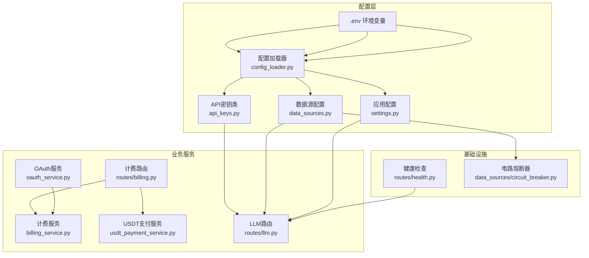
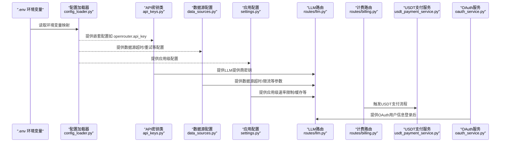
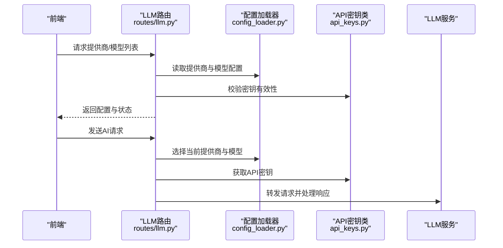
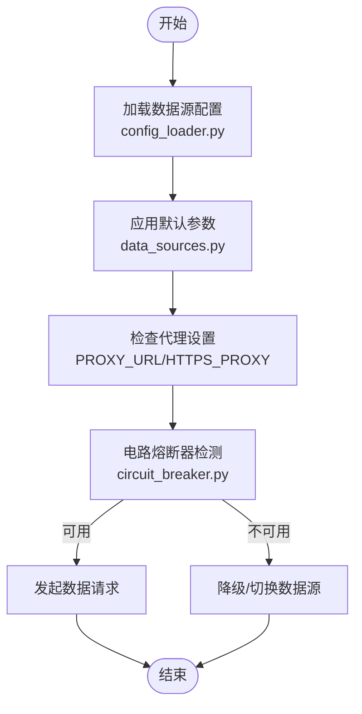
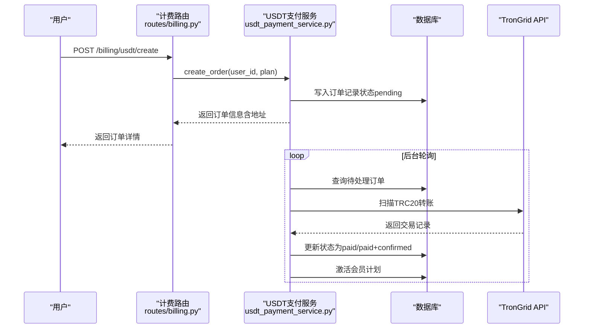
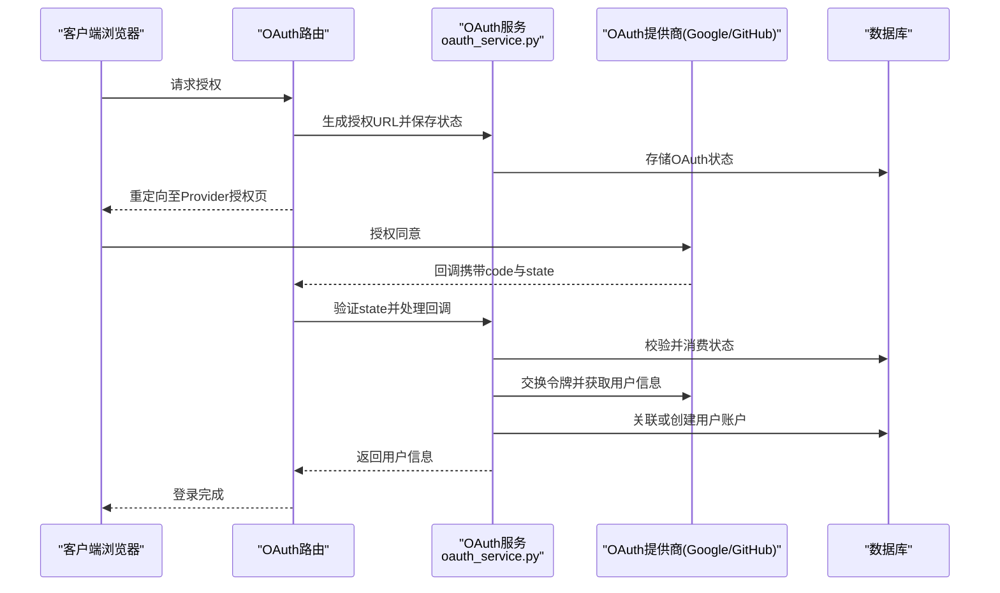
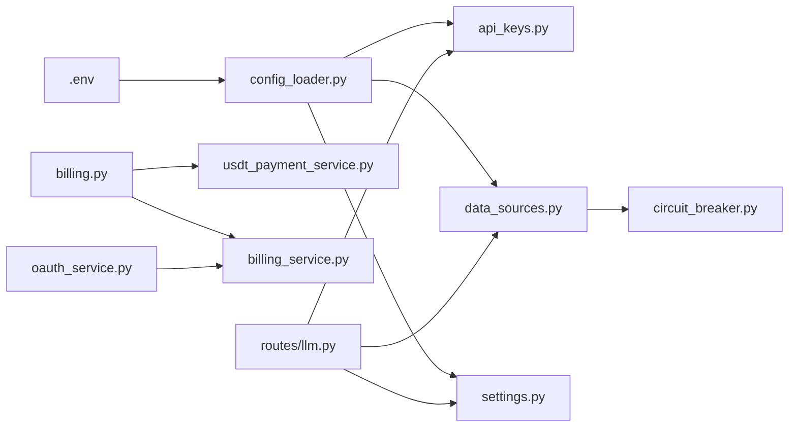

# 外部服务配置

<cite>
**本文档引用的文件**
- [api_keys.py](file://backend_api_python/app/config/api_keys.py)
- [data_sources.py](file://backend_api_python/app/config/data_sources.py)
- [settings.py](file://backend_api_python/app/config/settings.py)
- [env.example](file://backend_api_python/env.example)
- [config_loader.py](file://backend_api_python/app/utils/config_loader.py)
- [usdt_payment_service.py](file://backend_api_python/app/services/usdt_payment_service.py)
- [oauth_service.py](file://backend_api_python/app/services/oauth_service.py)
- [llm.py](file://backend_api_python/app/routes/llm.py)
- [billing.py](file://backend_api_python/app/routes/billing.py)
- [billing_service.py](file://backend_api_python/app/services/billing_service.py)
- [health.py](file://backend_api_python/app/routes/health.py)
- [circuit_breaker.py](file://backend_api_python/app/data_sources/circuit_breaker.py)
</cite>

## 目录
1. [简介](#简介)
2. [项目结构概览](#项目结构概览)
3. [核心配置组件](#核心配置组件)
4. [架构总览](#架构总览)
5. [详细组件分析](#详细组件分析)
6. [依赖关系分析](#依赖关系分析)
7. [性能考虑](#性能考虑)
8. [故障排除指南](#故障排除指南)
9. [结论](#结论)

## 简介
本文件面向QuantDinger项目的外部服务配置，系统性梳理并说明以下外部服务的配置要点与使用规范：
- AI/LLM提供商密钥：OpenRouter、OpenAI、Google Gemini、DeepSeek、xAI Grok等
- 数据源API密钥：Finnhub、Twelve Data、Tiingo、Alpha Vantage、Adanos等
- 支付服务配置：USDT支付（TRC20，基于TronGrid）
- 第三方认证配置：OAuth（Google、GitHub）

同时，文档提供各服务的配置要求、API密钥获取方式、使用限制与费用说明，并覆盖服务可用性监控、降级策略与故障转移配置。

## 项目结构概览
QuantDinger后端通过环境变量与附加配置加载器集中管理外部服务密钥与参数，关键位置如下：
- 环境变量模板：`backend_api_python/env.example`
- 配置加载器：`app/utils/config_loader.py`
- API密钥访问：`app/config/api_keys.py`
- 数据源配置：`app/config/data_sources.py`
- 应用配置：`app/config/settings.py`
- 支付服务：`app/services/usdt_payment_service.py`
- OAuth服务：`app/services/oauth_service.py`
- LLM管理路由：`app/routes/llm.py`
- 计费与USDT支付路由：`app/routes/billing.py`
- 计费服务：`app/services/billing_service.py`
- 健康检查：`app/routes/health.py`
- 电路熔断器：`app/data_sources/circuit_breaker.py`

**图表来源**
- [env.example:1-268](file://backend_api_python/env.example#L1-L268)
- [config_loader.py:24-161](file://backend_api_python/app/utils/config_loader.py#L24-L161)
- [api_keys.py:7-164](file://backend_api_python/app/config/api_keys.py#L7-L164)
- [data_sources.py:6-171](file://backend_api_python/app/config/data_sources.py#L6-L171)
- [settings.py:6-99](file://backend_api_python/app/config/settings.py#L6-L99)
- [billing_service.py:47-747](file://backend_api_python/app/services/billing_service.py#L47-L747)
- [usdt_payment_service.py:23-820](file://backend_api_python/app/services/usdt_payment_service.py#L23-L820)
- [oauth_service.py:27-715](file://backend_api_python/app/services/oauth_service.py#L27-L715)
- [llm.py:1-723](file://backend_api_python/app/routes/llm.py#L1-L723)
- [billing.py:1-243](file://backend_api_python/app/routes/billing.py#L1-L243)
- [health.py:1-109](file://backend_api_python/app/routes/health.py#L1-L109)
- [circuit_breaker.py:46-82](file://backend_api_python/app/data_sources/circuit_breaker.py#L46-L82)

**章节来源**
- [env.example:1-268](file://backend_api_python/env.example#L1-L268)
- [config_loader.py:24-161](file://backend_api_python/app/utils/config_loader.py#L24-L161)

## 核心配置组件
本节概述各类外部服务配置的关键点与获取方式。

- AI/LLM提供商密钥
  - 支持OpenRouter、OpenAI、Google Gemini、DeepSeek、xAI Grok等
  - 配置项：`LLM_PROVIDER`、各提供商的`*_API_KEY`、`*_MODEL`、`*_BASE_URL`、`*_TIMEOUT`等
  - 获取方式：在.env中设置对应环境变量；也可通过系统设置界面配置（后端会写入.env）
  - 使用限制与费用：各提供商独立定价与配额，需参考其官方文档
  - 示例键名：`OPENROUTER_API_KEY`、`OPENAI_API_KEY`、`GOOGLE_API_KEY`、`DEEPSEEK_API_KEY`、`GROK_API_KEY`

- 数据源API密钥
  - 支持Finnhub、Twelve Data、Tiingo、Alpha Vantage、Adanos等
  - 配置项：各数据源的`*_API_KEY`、`*_TIMEOUT`、`*_RATE_LIMIT`等
  - 获取方式：在.env中设置对应环境变量
  - 使用限制与费用：各数据源独立配额与定价，需参考其官方文档
  - 示例键名：`FINNHUB_API_KEY`、`TWELVE_DATA_API_KEY`、`TIINGO_API_KEY`、`ALPHA_VANTAGE_API_KEY`、`ADANOS_API_KEY`

- 支付服务配置（USDT支付）
  - 支持TRC20（TronGrid），每笔订单派生独立地址
  - 配置项：`USDT_PAY_ENABLED`、`USDT_PAY_CHAIN`、`USDT_TRC20_XPUB`、`TRONGRID_BASE_URL`、`TRONGRID_API_KEY`、`USDT_TRC20_CONTRACT`、`USDT_PAY_CONFIRM_SECONDS`、`USDT_PAY_EXPIRE_MINUTES`、`USDT_WORKER_POLL_INTERVAL`
  - 获取方式：在.env中设置对应环境变量
  - 使用限制与费用：TronGrid API配额与费用，需参考其官方文档
  - 示例键名：`USDT_PAY_ENABLED`、`USDT_TRC20_XPUB`、`TRONGRID_API_KEY`

- 第三方认证配置（OAuth）
  - 支持Google、GitHub OAuth
  - 配置项：`GOOGLE_CLIENT_ID`、`GOOGLE_CLIENT_SECRET`、`GOOGLE_REDIRECT_URI`、`GITHUB_CLIENT_ID`、`GITHUB_CLIENT_SECRET`、`GITHUB_REDIRECT_URI`、`OAUTH_ALLOWED_REDIRECTS`、`OAUTH_STATE_TTL_MINUTES`
  - 获取方式：在.env中设置对应环境变量
  - 使用限制与费用：各平台OAuth配额与政策，需参考其官方文档

**章节来源**
- [env.example:64-163](file://backend_api_python/env.example#L64-L163)
- [env.example:200-229](file://backend_api_python/env.example#L200-L229)
- [env.example:134-163](file://backend_api_python/env.example#L134-L163)
- [env.example:125-132](file://backend_api_python/env.example#L125-L132)

## 架构总览
下图展示了外部服务配置在系统中的交互关系与数据流：

**图表来源**
- [config_loader.py:24-161](file://backend_api_python/app/utils/config_loader.py#L24-L161)
- [api_keys.py:7-164](file://backend_api_python/app/config/api_keys.py#L7-L164)
- [data_sources.py:6-171](file://backend_api_python/app/config/data_sources.py#L6-L171)
- [settings.py:6-99](file://backend_api_python/app/config/settings.py#L6-L99)
- [llm.py:1-723](file://backend_api_python/app/routes/llm.py#L1-L723)
- [billing.py:129-242](file://backend_api_python/app/routes/billing.py#L129-L242)
- [usdt_payment_service.py:23-820](file://backend_api_python/app/services/usdt_payment_service.py#L23-L820)
- [oauth_service.py:27-715](file://backend_api_python/app/services/oauth_service.py#L27-L715)

## 详细组件分析

### AI/LLM提供商配置
- 配置入口
  - 环境变量：`LLM_PROVIDER`、`*_API_KEY`、`*_MODEL`、`*_BASE_URL`、`*_TIMEOUT`等
  - 配置加载：`config_loader.py`将扁平环境变量映射为嵌套字典（如`openrouter.api_key`）
  - 密钥访问：`api_keys.py`提供统一的密钥获取与校验方法
- 使用流程
  - LLM路由（`routes/llm.py`）维护提供商、模型与密钥的管理接口
  - 实际调用时通过`config_loader`与`api_keys`读取配置
- 降级与轮转
  - 支持多提供商与模型配置，结合负载均衡策略实现降级与故障转移
  - 可通过系统设置界面动态调整权重与超时

**图表来源**
- [llm.py:13-58](file://backend_api_python/app/routes/llm.py#L13-L58)
- [config_loader.py:64-104](file://backend_api_python/app/utils/config_loader.py#L64-L104)
- [api_keys.py:10-121](file://backend_api_python/app/config/api_keys.py#L10-L121)

**章节来源**
- [env.example:64-95](file://backend_api_python/env.example#L64-L95)
- [config_loader.py:64-104](file://backend_api_python/app/utils/config_loader.py#L64-L104)
- [api_keys.py:64-121](file://backend_api_python/app/config/api_keys.py#L64-L121)
- [llm.py:13-58](file://backend_api_python/app/routes/llm.py#L13-L58)

### 数据源API密钥配置
- 配置入口
  - 环境变量：`*_API_KEY`、`*_TIMEOUT`、`*_RATE_LIMIT`等
  - 配置加载：`config_loader.py`映射到嵌套结构
  - 数据源配置：`data_sources.py`提供各数据源的默认超时、重试与限流参数
- 使用流程
  - 在数据获取模块中读取配置，结合电路熔断器进行可用性判断
  - 支持代理配置（`PROXY_URL`、`HTTPS_PROXY`等）以适配网络环境

**图表来源**
- [config_loader.py:116-147](file://backend_api_python/app/utils/config_loader.py#L116-L147)
- [data_sources.py:31-55](file://backend_api_python/app/config/data_sources.py#L31-L55)
- [circuit_breaker.py:67-82](file://backend_api_python/app/data_sources/circuit_breaker.py#L67-L82)

**章节来源**
- [env.example:200-229](file://backend_api_python/env.example#L200-L229)
- [config_loader.py:116-147](file://backend_api_python/app/utils/config_loader.py#L116-L147)
- [data_sources.py:31-55](file://backend_api_python/app/config/data_sources.py#L31-L55)
- [circuit_breaker.py:46-82](file://backend_api_python/app/data_sources/circuit_breaker.py#L46-L82)

### 支付服务配置（USDT支付）
- 配置入口
  - 环境变量：`USDT_PAY_ENABLED`、`USDT_PAY_CHAIN`、`USDT_TRC20_XPUB`、`TRONGRID_BASE_URL`、`TRONGRID_API_KEY`、`USDT_TRC20_CONTRACT`、`USDT_PAY_CONFIRM_SECONDS`、`USDT_PAY_EXPIRE_MINUTES`、`USDT_WORKER_POLL_INTERVAL`
  - 路由：`routes/billing.py`提供创建订单与查询订单的接口
  - 服务：`services/usdt_payment_service.py`实现订单创建、链上扫描、确认激活与后台工作线程
- 使用流程
  - 用户在前端购买会员计划，后端创建订单并生成TRC20地址
  - 后台工作线程定期扫描TronGrid，匹配到账后确认并激活会员
  - 支持调试日志与分页扫描，避免长时间持有数据库连接

**图表来源**
- [billing.py:129-185](file://backend_api_python/app/routes/billing.py#L129-L185)
- [usdt_payment_service.py:132-187](file://backend_api_python/app/services/usdt_payment_service.py#L132-L187)
- [usdt_payment_service.py:538-600](file://backend_api_python/app/services/usdt_payment_service.py#L538-L600)
- [usdt_payment_service.py:744-800](file://backend_api_python/app/services/usdt_payment_service.py#L744-L800)

**章节来源**
- [env.example:134-163](file://backend_api_python/env.example#L134-L163)
- [billing.py:129-242](file://backend_api_python/app/routes/billing.py#L129-L242)
- [usdt_payment_service.py:23-820](file://backend_api_python/app/services/usdt_payment_service.py#L23-L820)

### 第三方认证配置（OAuth）
- 配置入口
  - 环境变量：`GOOGLE_CLIENT_ID`、`GOOGLE_CLIENT_SECRET`、`GOOGLE_REDIRECT_URI`、`GITHUB_CLIENT_ID`、`GITHUB_CLIENT_SECRET`、`GITHUB_REDIRECT_URI`、`OAUTH_ALLOWED_REDIRECTS`、`OAUTH_STATE_TTL_MINUTES`
  - 服务：`services/oauth_service.py`负责OAuth授权URL生成、回调处理、用户信息获取与账户关联
- 使用流程
  - 生成授权URL并保存CSRF状态（持久化到数据库，支持多Worker）
  - 回调时验证状态并交换令牌，拉取用户信息
  - 关联或创建用户账户，发放注册积分（如配置）

**图表来源**
- [oauth_service.py:200-298](file://backend_api_python/app/services/oauth_service.py#L200-L298)
- [oauth_service.py:303-426](file://backend_api_python/app/services/oauth_service.py#L303-L426)
- [oauth_service.py:432-640](file://backend_api_python/app/services/oauth_service.py#L432-L640)

**章节来源**
- [env.example:125-132](file://backend_api_python/env.example#L125-L132)
- [env.example:29-30](file://backend_api_python/env.example#L29-L30)
- [oauth_service.py:27-715](file://backend_api_python/app/services/oauth_service.py#L27-L715)

## 依赖关系分析
- 配置加载与密钥访问
  - `config_loader.py`负责将环境变量映射为嵌套配置字典
  - `api_keys.py`通过元类动态读取配置与环境变量，提供统一密钥访问接口
- 数据源与可用性
  - `data_sources.py`提供各数据源的默认参数
  - `circuit_breaker.py`实现熔断状态机，避免雪崩效应
- 支付与认证
  - `billing.py`与`usdt_payment_service.py`协同完成USDT支付流程
  - `oauth_service.py`提供OAuth登录与账户关联能力

**图表来源**
- [config_loader.py:24-161](file://backend_api_python/app/utils/config_loader.py#L24-L161)
- [api_keys.py:7-164](file://backend_api_python/app/config/api_keys.py#L7-L164)
- [data_sources.py:6-171](file://backend_api_python/app/config/data_sources.py#L6-L171)
- [circuit_breaker.py:46-82](file://backend_api_python/app/data_sources/circuit_breaker.py#L46-L82)
- [billing.py:1-243](file://backend_api_python/app/routes/billing.py#L1-L243)
- [usdt_payment_service.py:23-820](file://backend_api_python/app/services/usdt_payment_service.py#L23-L820)
- [billing_service.py:47-747](file://backend_api_python/app/services/billing_service.py#L47-L747)
- [oauth_service.py:27-715](file://backend_api_python/app/services/oauth_service.py#L27-L715)
- [llm.py:1-723](file://backend_api_python/app/routes/llm.py#L1-L723)

**章节来源**
- [config_loader.py:24-161](file://backend_api_python/app/utils/config_loader.py#L24-L161)
- [api_keys.py:7-164](file://backend_api_python/app/config/api_keys.py#L7-L164)
- [data_sources.py:6-171](file://backend_api_python/app/config/data_sources.py#L6-L171)
- [circuit_breaker.py:46-82](file://backend_api_python/app/data_sources/circuit_breaker.py#L46-L82)
- [billing.py:1-243](file://backend_api_python/app/routes/billing.py#L1-L243)
- [usdt_payment_service.py:23-820](file://backend_api_python/app/services/usdt_payment_service.py#L23-L820)
- [billing_service.py:47-747](file://backend_api_python/app/services/billing_service.py#L47-L747)
- [oauth_service.py:27-715](file://backend_api_python/app/services/oauth_service.py#L27-L715)
- [llm.py:1-723](file://backend_api_python/app/routes/llm.py#L1-L723)

## 性能考虑
- 配置缓存
  - `config_loader.py`对配置进行进程内缓存，减少重复解析成本
- 数据库连接池
  - 应用配置中提供数据库连接池参数（如`DB_POOL_MIN`、`DB_POOL_MAX`），需根据并发与机器人数量合理设置
- 超时与重试
  - 数据源配置提供`DATA_SOURCE_TIMEOUT`、`DATA_SOURCE_RETRY`、`DATA_SOURCE_RETRY_BACKOFF`，建议结合实际网络状况调优
- 代理与TLS
  - 支持`PROXY_URL`与`LIVE_TRADING_SSL_VERIFY`等参数，适配不同网络环境与证书校验需求

**章节来源**
- [config_loader.py:24-38](file://backend_api_python/app/utils/config_loader.py#L24-L38)
- [env.example:44-57](file://backend_api_python/env.example#L44-L57)
- [env.example:104-118](file://backend_api_python/env.example#L104-L118)
- [data_sources.py:8-24](file://backend_api_python/app/config/data_sources.py#L8-L24)

## 故障排除指南
- 健康检查
  - 提供`/api/health`等健康检查端点，便于容器编排与反向代理探针
- OAuth状态问题
  - 若出现“Invalid state parameter”，检查`qd_oauth_states`表清理与`OAUTH_STATE_TTL_MINUTES`配置
- USDT支付异常
  - 检查`USDT_PAY_ENABLED`、`USDT_TRC20_XPUB`、`TRONGRID_API_KEY`等配置
  - 查看后台工作线程日志，确认轮询间隔与调试日志开关
- 数据源不可用
  - 结合`circuit_breaker.py`的状态机，检查熔断阈值与冷却时间
  - 调整`DATA_SOURCE_TIMEOUT`、`DATA_SOURCE_RETRY`参数

**章节来源**
- [health.py:46-109](file://backend_api_python/app/routes/health.py#L46-L109)
- [oauth_service.py:125-144](file://backend_api_python/app/services/oauth_service.py#L125-L144)
- [usdt_payment_service.py:33-46](file://backend_api_python/app/services/usdt_payment_service.py#L33-L46)
- [circuit_breaker.py:67-82](file://backend_api_python/app/data_sources/circuit_breaker.py#L67-L82)

## 结论
QuantDinger通过环境变量与配置加载器实现了外部服务配置的集中化管理，配合API密钥类、数据源配置与电路熔断器，提供了灵活且可扩展的外部服务接入能力。对于AI/LLM、数据源、支付与OAuth等关键外部服务，建议：
- 在`.env`中明确配置密钥与参数，并通过系统设置界面进行动态管理
- 结合熔断与降级策略，提升系统在外部服务异常时的稳定性
- 定期检查健康检查与后台工作线程运行状态，确保支付与认证流程正常