# 安全配置

<cite>
**本文引用的文件**
- [settings.py](file://backend_api_python/app/config/settings.py)
- [api_keys.py](file://backend_api_python/app/config/api_keys.py)
- [crypto.py](file://backend_api_python/app/utils/crypto.py)
- [credential_crypto.py](file://backend_api_python/app/utils/credential_crypto.py)
- [auth.py](file://backend_api_python/app/utils/auth.py)
- [security_service.py](file://backend_api_python/app/services/security_service.py)
- [auth.py](file://backend_api_python/app/routes/auth.py)
- [config_loader.py](file://backend_api_python/app/utils/config_loader.py)
- [db.py](file://backend_api_python/app/utils/db.py)
- [generate-secret-key.sh](file://scripts/generate-secret-key.sh)
- [generate-secret-key.ps1](file://scripts/generate-secret-key.ps1)
- [index.vue](file://frontend/src/components/Turnstile/index.vue)
</cite>

## 目录
1. [简介](#简介)
2. [项目结构](#项目结构)
3. [核心组件](#核心组件)
4. [架构总览](#架构总览)
5. [详细组件分析](#详细组件分析)
6. [依赖分析](#依赖分析)
7. [性能考虑](#性能考虑)
8. [故障排查指南](#故障排查指南)
9. [结论](#结论)
10. [附录](#附录)

## 简介
本文件面向QuantDinger的安全配置，系统性说明认证配置、加密设置、访问控制与安全防护措施，覆盖API密钥管理、用户密码加密、会话管理、CSRF防护、IP限制、验证码配置等。同时提供安全最佳实践（密钥轮换、安全审计、入侵检测、数据保护策略）、常见漏洞防护指南与应急响应流程，帮助运维与开发团队建立可操作、可落地的安全体系。

## 项目结构
QuantDinger后端采用Flask微服务架构，安全相关能力主要分布在以下模块：
- 配置层：应用主配置、API密钥配置、附加配置加载器
- 工具层：通用加密工具、凭证加密工具、数据库连接工具
- 服务层：安全服务（验证码、速率限制、暴力破解防护、安全审计）
- 路由层：认证路由（登录、注册、验证码发送、密码重置等）
- 前端组件：Turnstile人机验证组件

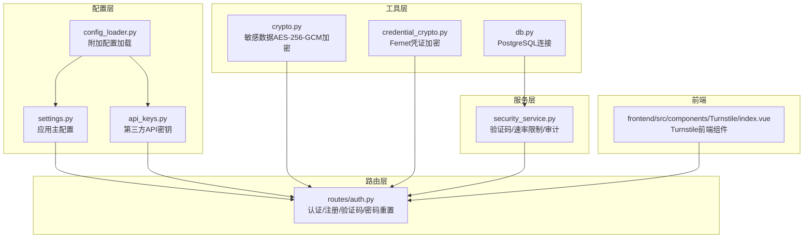

**图表来源**
- [settings.py:1-99](file://backend_api_python/app/config/settings.py#L1-L99)
- [api_keys.py:1-164](file://backend_api_python/app/config/api_keys.py#L1-L164)
- [config_loader.py:1-252](file://backend_api_python/app/utils/config_loader.py#L1-L252)
- [crypto.py:1-78](file://backend_api_python/app/utils/crypto.py#L1-L78)
- [credential_crypto.py:1-50](file://backend_api_python/app/utils/credential_crypto.py#L1-L50)
- [db.py:1-66](file://backend_api_python/app/utils/db.py#L1-L66)
- [security_service.py:1-399](file://backend_api_python/app/services/security_service.py#L1-L399)
- [auth.py:1-800](file://backend_api_python/app/routes/auth.py#L1-L800)
- [index.vue:1-53](file://frontend/src/components/Turnstile/index.vue#L1-L53)

**章节来源**
- [settings.py:1-99](file://backend_api_python/app/config/settings.py#L1-L99)
- [api_keys.py:1-164](file://backend_api_python/app/config/api_keys.py#L1-L164)
- [config_loader.py:1-252](file://backend_api_python/app/utils/config_loader.py#L1-L252)
- [crypto.py:1-78](file://backend_api_python/app/utils/crypto.py#L1-L78)
- [credential_crypto.py:1-50](file://backend_api_python/app/utils/credential_crypto.py#L1-L50)
- [db.py:1-66](file://backend_api_python/app/utils/db.py#L1-L66)
- [security_service.py:1-399](file://backend_api_python/app/services/security_service.py#L1-L399)
- [auth.py:1-800](file://backend_api_python/app/routes/auth.py#L1-L800)
- [index.vue:1-53](file://frontend/src/components/Turnstile/index.vue#L1-L53)

## 核心组件
- 应用主配置：集中管理服务参数、认证密钥、日志与功能开关，并支持从附加配置与环境变量加载运行时参数。
- API密钥管理：统一从环境变量或附加配置加载第三方API密钥，支持多供应商密钥轮换与逗号分隔的轮换列表。
- 加密工具：
  - 敏感数据加密：基于PBKDF2派生密钥的AES-256-GCM加密，用于保护内部敏感数据。
  - 凭证加密：基于SECRET_KEY派生的Fernet对交易所凭证进行加解密。
- 安全服务：集成Cloudflare Turnstile人机验证、登录尝试记录与阻断、验证码发送速率限制、密码强度校验、安全事件审计与历史清理。
- 认证路由：提供登录、邮箱验证码登录、注册、验证码发送、密码重置等接口，内置Turnstile校验与速率限制。
- 前端Turnstile组件：按需加载Cloudflare Turnstile脚本并在表单提交前渲染人机验证控件。

**章节来源**
- [settings.py:30-90](file://backend_api_python/app/config/settings.py#L30-L90)
- [api_keys.py:1-164](file://backend_api_python/app/config/api_keys.py#L1-L164)
- [crypto.py:10-78](file://backend_api_python/app/utils/crypto.py#L10-L78)
- [credential_crypto.py:17-50](file://backend_api_python/app/utils/credential_crypto.py#L17-L50)
- [security_service.py:26-399](file://backend_api_python/app/services/security_service.py#L26-L399)
- [auth.py:156-325](file://backend_api_python/app/routes/auth.py#L156-L325)
- [index.vue:16-50](file://frontend/src/components/Turnstile/index.vue#L16-L50)

## 架构总览
下图展示登录流程中的安全关键节点：前端人机验证、后端Turnstile校验、速率限制检查、用户认证、令牌签发与审计记录。

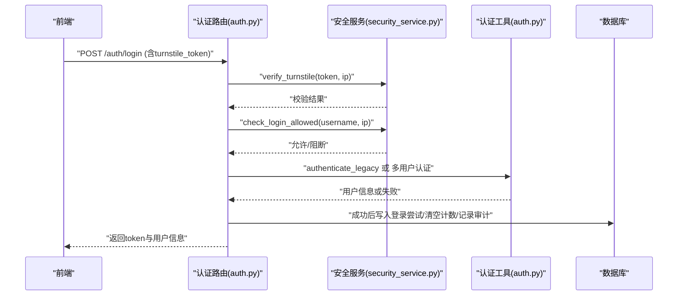

**图表来源**
- [auth.py:156-325](file://backend_api_python/app/routes/auth.py#L156-L325)
- [security_service.py:72-241](file://backend_api_python/app/services/security_service.py#L72-L241)
- [auth.py:18-114](file://backend_api_python/app/utils/auth.py#L18-L114)

**章节来源**
- [auth.py:156-325](file://backend_api_python/app/routes/auth.py#L156-L325)
- [security_service.py:72-241](file://backend_api_python/app/services/security_service.py#L72-L241)
- [auth.py:18-114](file://backend_api_python/app/utils/auth.py#L18-L114)

## 详细组件分析

### 认证配置与会话管理
- 令牌生成与校验：使用HS256算法的JWT，包含用户ID、用户名、角色与token_version；校验时验证签名与过期时间，并通过数据库比对token_version实现单一客户端登录控制。
- 角色与权限：提供管理员、经理、普通用户等角色装饰器；支持细粒度权限检查。
- 单用户模式：保留传统管理员账户校验作为降级方案，建议仅在迁移期间启用。

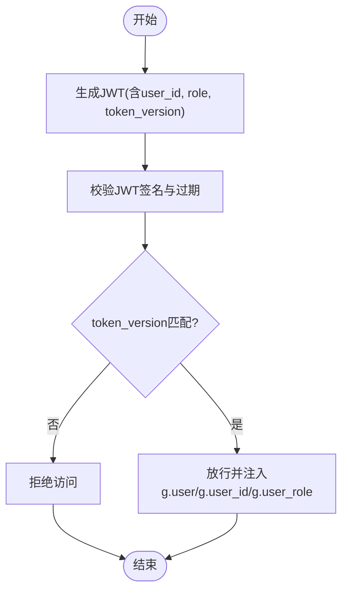

**图表来源**
- [auth.py:18-114](file://backend_api_python/app/utils/auth.py#L18-L114)

**章节来源**
- [auth.py:18-239](file://backend_api_python/app/utils/auth.py#L18-L239)

### 加密设置
- 敏感数据加密（AES-256-GCM）：从环境变量派生固定盐的PBKDF2密钥，对敏感文本进行带标签加密，返回base64编码的nonce+ciphertext+tag组合。
- 交易所凭证加密（Fernet）：基于SECRET_KEY的SHA-256摘要生成Fernet密钥，对JSON格式凭证进行对称加密；解密失败抛出明确异常，避免静默错误。
- 数据库连接：统一PostgreSQL连接封装，确保连接池与可用性检查。

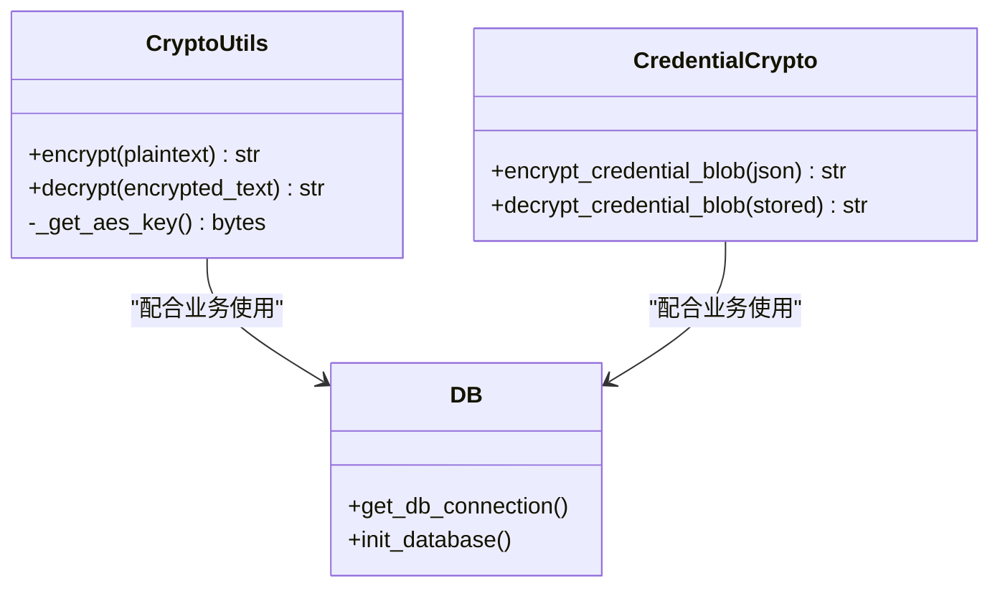

**图表来源**
- [crypto.py:10-78](file://backend_api_python/app/utils/crypto.py#L10-L78)
- [credential_crypto.py:17-50](file://backend_api_python/app/utils/credential_crypto.py#L17-L50)
- [db.py:19-35](file://backend_api_python/app/utils/db.py#L19-L35)

**章节来源**
- [crypto.py:10-78](file://backend_api_python/app/utils/crypto.py#L10-L78)
- [credential_crypto.py:17-50](file://backend_api_python/app/utils/credential_crypto.py#L17-L50)
- [db.py:19-35](file://backend_api_python/app/utils/db.py#L19-L35)

### 访问控制与CSRF防护
- CSRF防护：后端严格要求Authorization头携带Bearer令牌，未提供或无效即拒绝请求；结合前端人机验证与速率限制降低自动化攻击风险。
- 角色与权限：通过装饰器强制校验角色与权限，避免越权访问。
- 单一客户端登录：通过token_version机制，新登录即提升版本号，旧令牌立即失效，有效防止并发会话滥用。

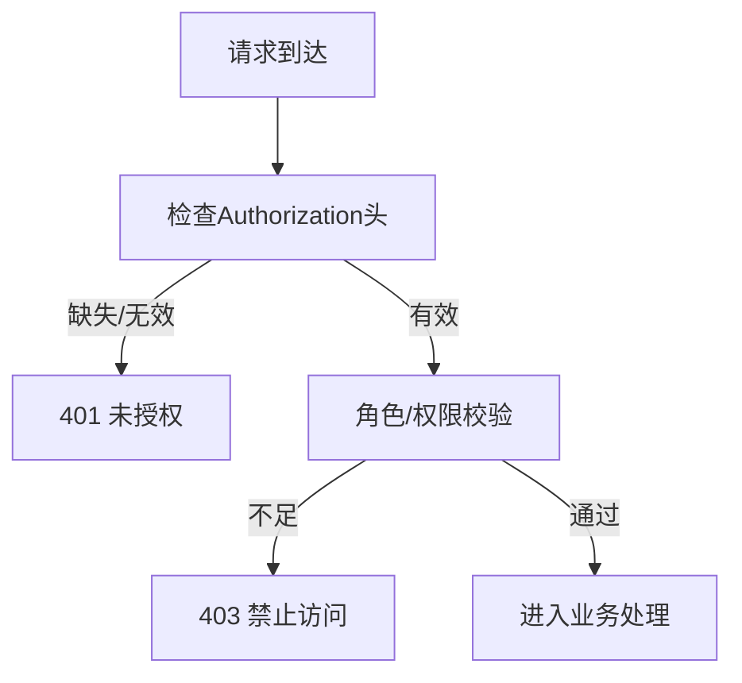

**图表来源**
- [auth.py:126-186](file://backend_api_python/app/utils/auth.py#L126-L186)

**章节来源**
- [auth.py:126-186](file://backend_api_python/app/utils/auth.py#L126-L186)

### 安全防护措施
- 人机验证（Turnstile）：支持站点/密钥配置，前端按需加载脚本并渲染；后端调用Cloudflare验证接口，失败时拒绝请求。
- 速率限制与暴力破解防护：按IP与账号维度统计失败次数，超过阈值在窗口时间内阻断；支持配置阻断时长。
- 验证码速率限制：同一邮箱每秒一次、同一IP每小时上限，防止滥用。
- 密码强度校验：至少8位且包含大小写字母与数字。
- 安全审计：记录登录/注册/验证码发送等事件，支持历史清理。

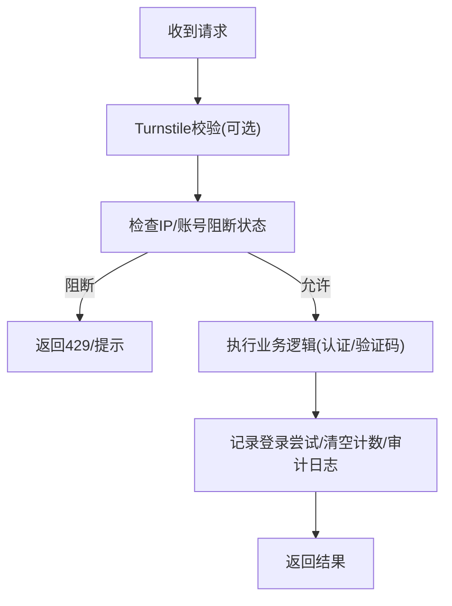

**图表来源**
- [security_service.py:72-241](file://backend_api_python/app/services/security_service.py#L72-L241)
- [auth.py:156-325](file://backend_api_python/app/routes/auth.py#L156-L325)

**章节来源**
- [security_service.py:26-399](file://backend_api_python/app/services/security_service.py#L26-L399)
- [auth.py:156-325](file://backend_api_python/app/routes/auth.py#L156-L325)

### API密钥管理
- 统一加载：优先从环境变量读取，其次从附加配置（.env映射）读取；支持逗号分隔的轮换列表（如Tavily、SerpAPI）。
- 使用场景：第三方数据源与大模型服务密钥，便于集中轮换与审计。
- 最佳实践：密钥仅存在于环境变量或附加配置，不落库；定期轮换并更新配置。

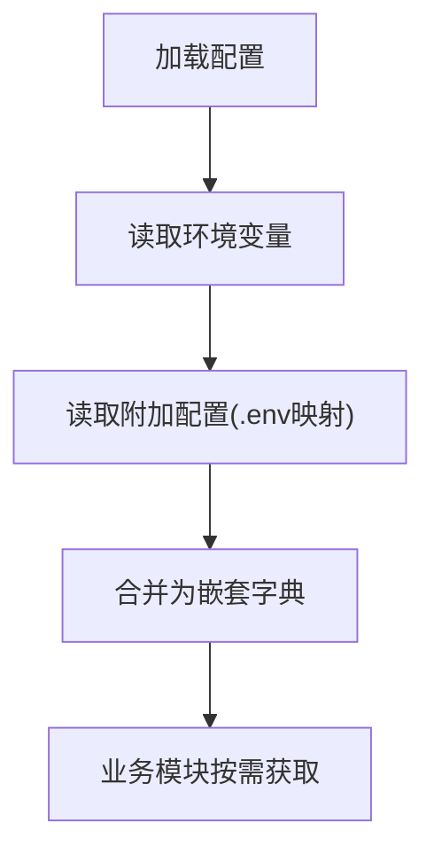

**图表来源**
- [config_loader.py:24-161](file://backend_api_python/app/utils/config_loader.py#L24-L161)
- [api_keys.py:10-145](file://backend_api_python/app/config/api_keys.py#L10-L145)

**章节来源**
- [config_loader.py:24-161](file://backend_api_python/app/utils/config_loader.py#L24-L161)
- [api_keys.py:1-164](file://backend_api_python/app/config/api_keys.py#L1-L164)

### 用户密码加密与凭证保护
- 密码强度：后端提供密码强度校验规则，前端可参考提示。
- 凭证存储：交易所凭证以JSON形式加密后存入数据库字段，解密时严格校验令牌有效性。
- 敏感数据：内部敏感数据采用AES-256-GCM加密，密钥派生过程固定盐，确保一致性。

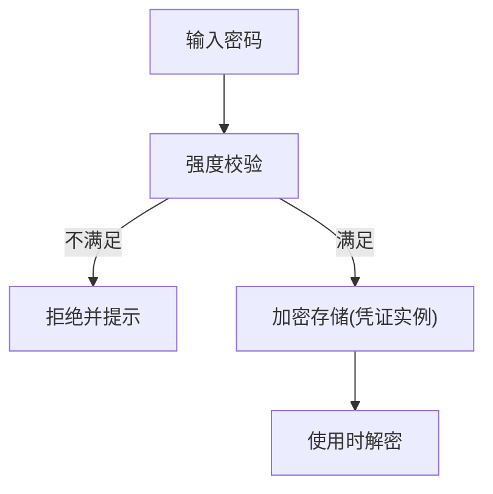

**图表来源**
- [security_service.py:331-356](file://backend_api_python/app/services/security_service.py#L331-L356)
- [credential_crypto.py:25-49](file://backend_api_python/app/utils/credential_crypto.py#L25-L49)
- [crypto.py:31-75](file://backend_api_python/app/utils/crypto.py#L31-L75)

**章节来源**
- [security_service.py:331-356](file://backend_api_python/app/services/security_service.py#L331-L356)
- [credential_crypto.py:25-49](file://backend_api_python/app/utils/credential_crypto.py#L25-L49)
- [crypto.py:31-75](file://backend_api_python/app/utils/crypto.py#L31-L75)

### 会话管理与令牌轮换
- 令牌签发：包含用户标识、角色与token_version，有效期7天。
- 单一客户端登录：每次登录成功后递增token_version，旧令牌立即失效。
- 过期处理：JWT过期自动拒绝，提示重新登录。

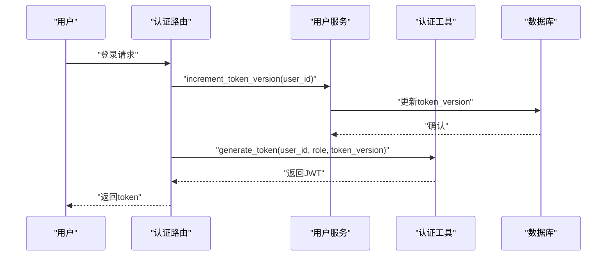

**图表来源**
- [auth.py:273-298](file://backend_api_python/app/routes/auth.py#L273-L298)
- [auth.py:18-47](file://backend_api_python/app/utils/auth.py#L18-L47)

**章节来源**
- [auth.py:273-298](file://backend_api_python/app/routes/auth.py#L273-L298)
- [auth.py:18-47](file://backend_api_python/app/utils/auth.py#L18-L47)

### CSRF防护与前端集成
- 后端：严格要求Authorization: Bearer令牌，无令牌或无效即401。
- 前端：按需加载Cloudflare Turnstile脚本，渲染人机验证控件，提交前收集token并随请求发送。
- 防护效果：降低自动化脚本与跨站请求风险，结合后端速率限制与阻断进一步加固。

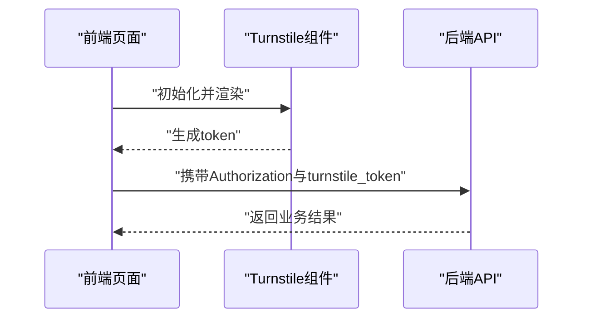

**图表来源**
- [index.vue:16-50](file://frontend/src/components/Turnstile/index.vue#L16-L50)
- [auth.py:213-221](file://backend_api_python/app/routes/auth.py#L213-L221)

**章节来源**
- [index.vue:16-50](file://frontend/src/components/Turnstile/index.vue#L16-L50)
- [auth.py:213-221](file://backend_api_python/app/routes/auth.py#L213-L221)

## 依赖分析
- 配置依赖：应用配置与API密钥均依赖附加配置加载器与环境变量；应用配置还依赖运行时附加配置覆盖。
- 安全服务依赖：数据库连接用于登录尝试记录、阻断判断与审计日志；外部服务依赖Cloudflare Turnstile验证。
- 加密工具依赖：Cryptography库与环境变量SECRET_KEY；凭证加密依赖SECRET_KEY派生Fernet密钥。
- 路由依赖：认证路由依赖安全服务、邮件服务、用户服务与账单服务；前端Turnstile组件依赖Cloudflare脚本。

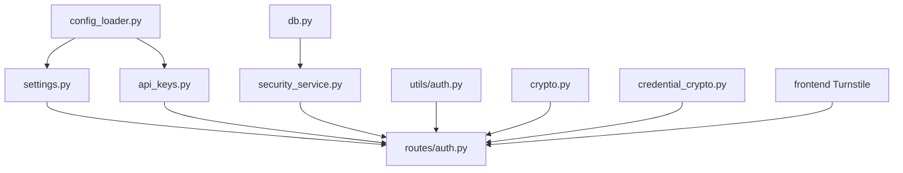

**图表来源**
- [settings.py:66-90](file://backend_api_python/app/config/settings.py#L66-L90)
- [api_keys.py:1-164](file://backend_api_python/app/config/api_keys.py#L1-L164)
- [config_loader.py:24-161](file://backend_api_python/app/utils/config_loader.py#L24-L161)
- [security_service.py:9-12](file://backend_api_python/app/services/security_service.py#L9-L12)
- [auth.py:1-16](file://backend_api_python/app/utils/auth.py#L1-L16)
- [crypto.py:1-8](file://backend_api_python/app/utils/crypto.py#L1-L8)
- [credential_crypto.py:1-16](file://backend_api_python/app/utils/credential_crypto.py#L1-L16)
- [db.py:19-25](file://backend_api_python/app/utils/db.py#L19-L25)
- [auth.py:1-16](file://backend_api_python/app/routes/auth.py#L1-L16)
- [index.vue:1-16](file://frontend/src/components/Turnstile/index.vue#L1-L16)

**章节来源**
- [settings.py:66-90](file://backend_api_python/app/config/settings.py#L66-L90)
- [api_keys.py:1-164](file://backend_api_python/app/config/api_keys.py#L1-L164)
- [config_loader.py:24-161](file://backend_api_python/app/utils/config_loader.py#L24-L161)
- [security_service.py:9-12](file://backend_api_python/app/services/security_service.py#L9-L12)
- [auth.py:1-16](file://backend_api_python/app/utils/auth.py#L1-L16)
- [crypto.py:1-8](file://backend_api_python/app/utils/crypto.py#L1-L8)
- [credential_crypto.py:1-16](file://backend_api_python/app/utils/credential_crypto.py#L1-L16)
- [db.py:19-25](file://backend_api_python/app/utils/db.py#L19-L25)
- [auth.py:1-16](file://backend_api_python/app/routes/auth.py#L1-L16)
- [index.vue:1-16](file://frontend/src/components/Turnstile/index.vue#L1-L16)

## 性能考虑
- 速率限制：合理设置IP与账号维度的失败次数与窗口时间，避免误伤正常用户。
- 数据库写入：登录尝试与审计日志写入应尽量批量或异步化，减少热点写入。
- Turnstile调用：设置超时与失败回退策略，避免因第三方服务抖动影响整体可用性。
- 加密成本：AES与Fernet均为快速对称加密，适合业务场景；注意密钥派生迭代次数与随机性。

## 故障排查指南
- 登录被阻断：检查IP/账号维度的失败次数与阻断窗口，确认是否触发速率限制。
- Turnstile失败：确认站点/密钥配置正确，网络可达性与超时设置；必要时临时关闭以定位问题。
- 令牌无效：确认SECRET_KEY一致且未变更；检查token是否过期；核对token_version是否被提升。
- 凭证解密失败：确认SECRET_KEY未变更；检查存储格式与令牌有效性。
- 审计日志缺失：检查数据库连接与写入权限；确认清理任务未过早删除。

**章节来源**
- [security_service.py:146-241](file://backend_api_python/app/services/security_service.py#L146-L241)
- [auth.py:50-80](file://backend_api_python/app/utils/auth.py#L50-L80)
- [credential_crypto.py:33-49](file://backend_api_python/app/utils/credential_crypto.py#L33-L49)

## 结论
QuantDinger在认证、加密、访问控制与安全防护方面形成了较为完整的体系：以JWT为核心的身份凭证、以环境变量与附加配置为中心的密钥管理、以Turnstile与速率限制为基础的防刷能力、以及以审计与清理为核心的可观测性。建议在生产环境中严格执行密钥轮换、最小权限原则与定期安全评估，持续完善入侵检测与应急响应流程。

## 附录

### 安全最佳实践
- 密钥轮换
  - 使用脚本生成强随机SECRET_KEY并更新至环境变量或附加配置文件。
  - 对API密钥采用逗号分隔的轮换列表，定期切换主密钥并验证下游服务可用性。
- 安全审计
  - 开启请求日志与安全事件审计，定期审查登录/注册/验证码发送等高敏操作。
  - 设置历史清理周期，避免日志无限增长。
- 入侵检测
  - 结合IP阻断与账号阻断策略，监控异常登录时段与来源。
  - 对Turnstile失败率与验证码滥用行为建立告警。
- 数据保护
  - 所有敏感数据与凭证实例均应加密存储；密钥派生过程保持稳定与可追溯。
  - 严格限制数据库访问权限，遵循最小权限原则。

**章节来源**
- [generate-secret-key.sh:16-26](file://scripts/generate-secret-key.sh#L16-L26)
- [generate-secret-key.ps1:13-24](file://scripts/generate-secret-key.ps1#L13-L24)
- [config_loader.py:24-161](file://backend_api_python/app/utils/config_loader.py#L24-L161)
- [security_service.py:242-399](file://backend_api_python/app/services/security_service.py#L242-L399)

### 应急响应流程
- 快速处置
  - 发现异常：立即冻结受影响账号、提升SECRET_KEY并重启服务。
  - 阻断策略：临时提高速率限制阈值或临时关闭验证码发送接口。
- 根因分析
  - 审计日志：定位异常时间段、来源IP与用户行为轨迹。
  - 配置回溯：确认最近一次配置变更与密钥轮换记录。
- 恢复与加固
  - 修复后逐步恢复服务，观察Turnstile成功率与登录失败趋势。
  - 补充告警策略与演练计划，形成闭环。