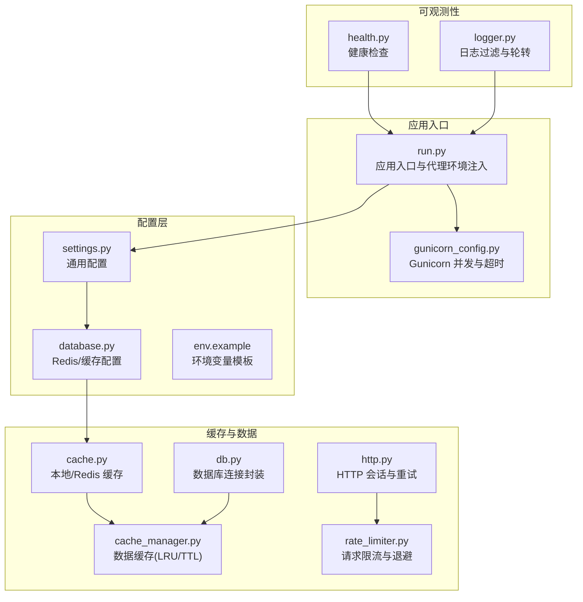
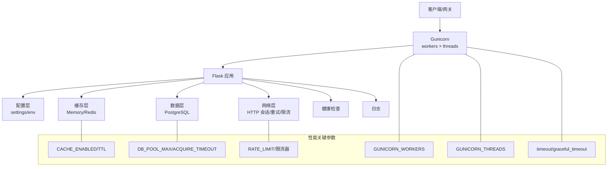
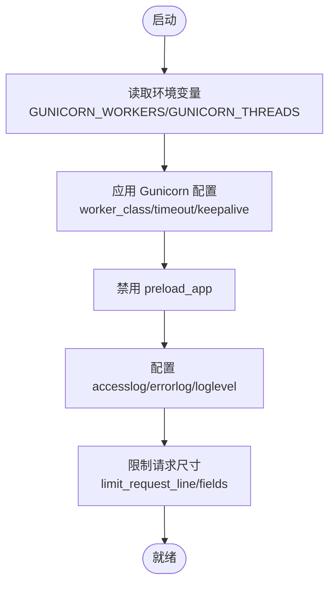
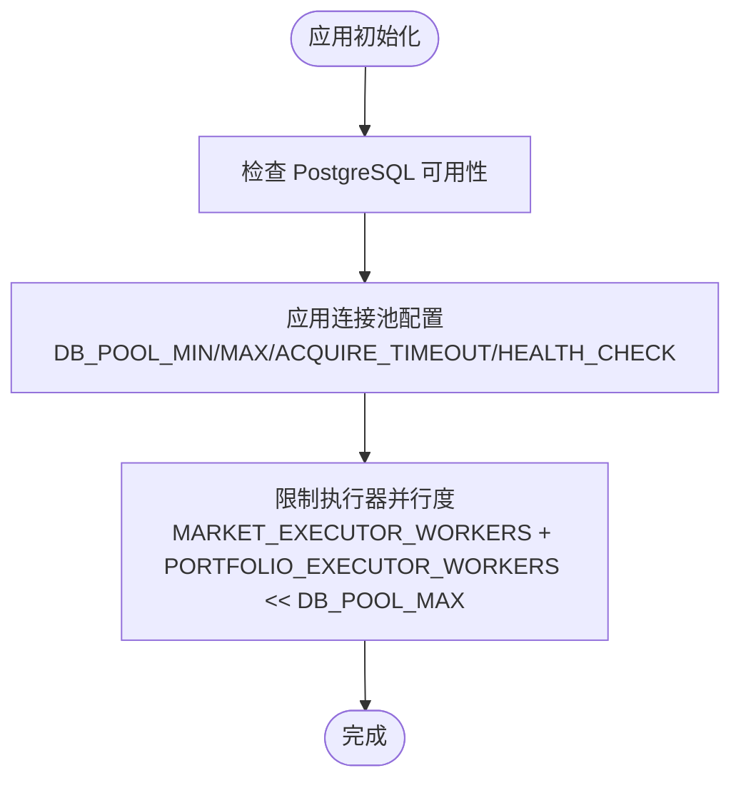
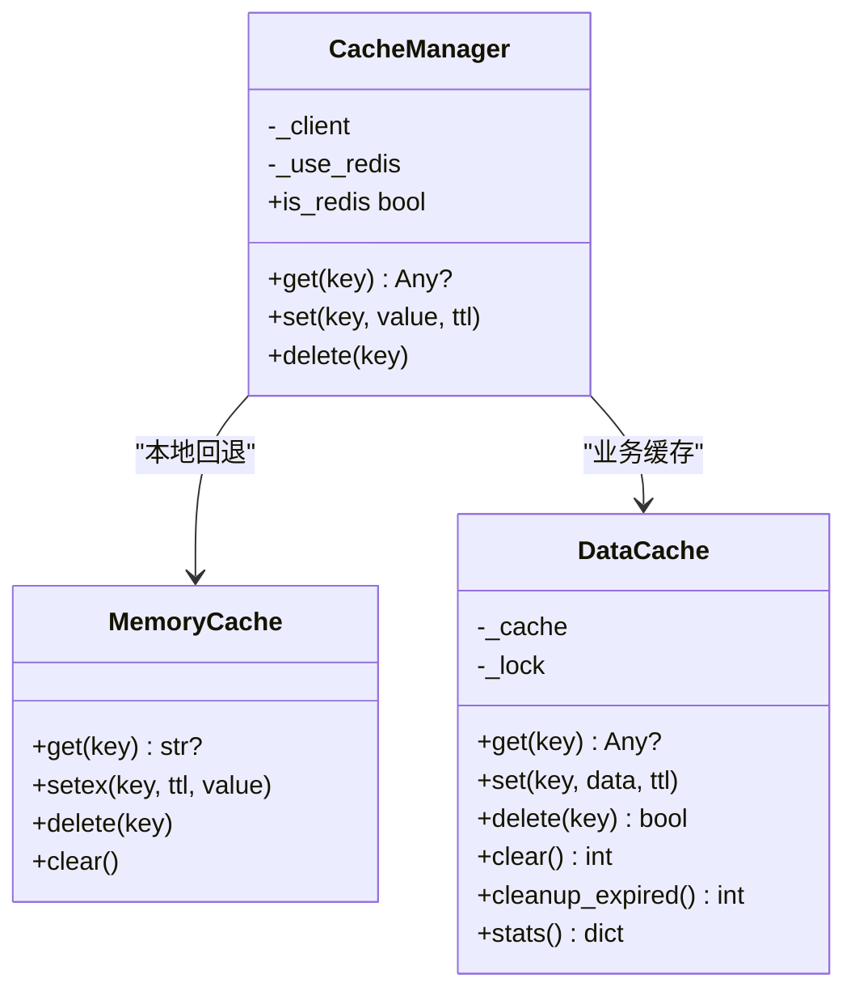
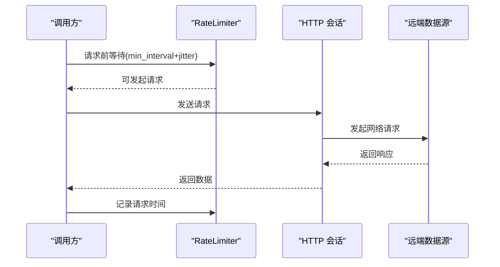
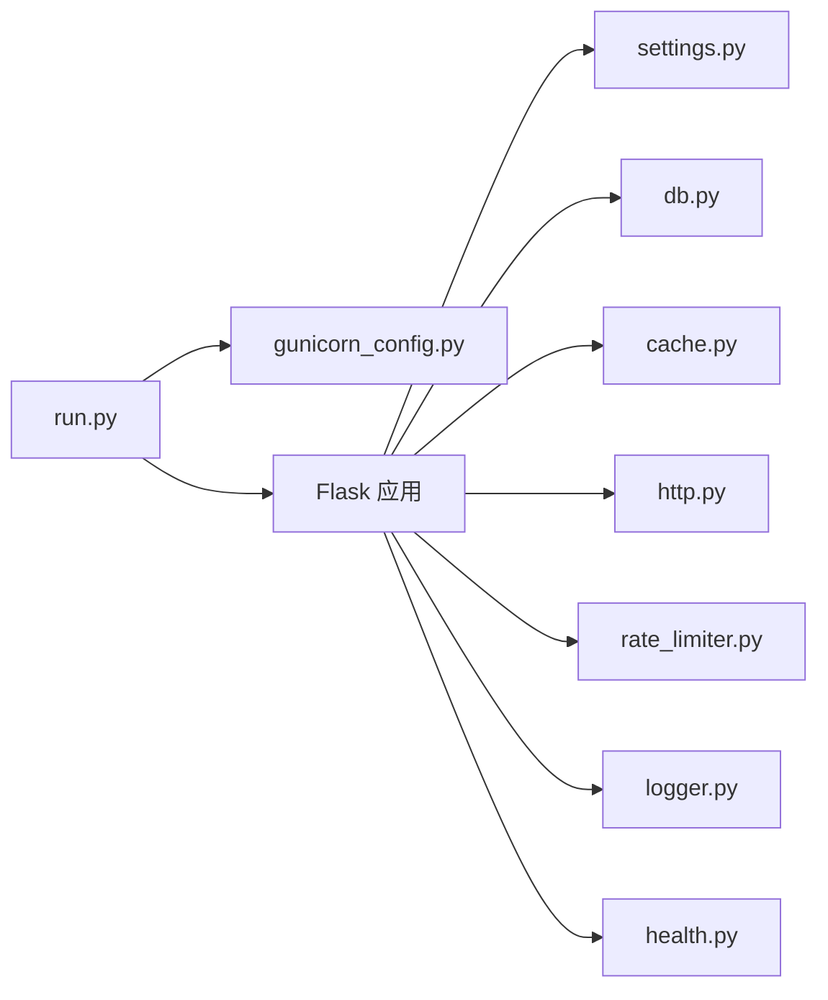

# 性能优化配置

<cite>
**本文引用的文件**
- [gunicorn_config.py](file://backend_api_python/gunicorn_config.py)
- [run.py](file://backend_api_python/run.py)
- [settings.py](file://backend_api_python/app/config/settings.py)
- [database.py](file://backend_api_python/app/config/database.py)
- [cache.py](file://backend_api_python/app/utils/cache.py)
- [cache_manager.py](file://backend_api_python/app/data_sources/cache_manager.py)
- [db.py](file://backend_api_python/app/utils/db.py)
- [http.py](file://backend_api_python/app/utils/http.py)
- [rate_limiter.py](file://backend_api_python/app/data_sources/rate_limiter.py)
- [health.py](file://backend_api_python/app/routes/health.py)
- [logger.py](file://backend_api_python/app/utils/logger.py)
- [env.example](file://backend_api_python/env.example)
</cite>

## 目录
1. [简介](#简介)
2. [项目结构](#项目结构)
3. [核心组件](#核心组件)
4. [架构总览](#架构总览)
5. [详细组件分析](#详细组件分析)
6. [依赖分析](#依赖分析)
7. [性能考虑](#性能考虑)
8. [故障排查指南](#故障排查指南)
9. [结论](#结论)
10. [附录](#附录)

## 简介
本文件面向运维与开发团队，系统化梳理 QuantDinger 后端在生产环境中的性能优化配置与最佳实践，覆盖以下主题：
- 应用服务器与并发模型：Gunicorn 工作进程与线程配置、请求超时、并发限制
- 数据库连接池与查询优化：连接池参数、执行器并行度、健康检查
- 缓存策略：本地内存缓存与 Redis 缓存、TTL 分层、LRU 淘汰
- 网络 I/O 优化：HTTP 会话复用、指数退避重试、代理与直连策略
- 内存与 CPU 使用优化：线程模型、日志级别、请求日志开关
- 性能监控指标、基准测试方法与瓶颈识别技巧
- 生产环境调优与容量规划建议

## 项目结构
后端以 Flask 应用为核心，通过 Gunicorn 提供生产级服务；性能相关配置主要分布在以下模块：
- 服务器与并发：gunicorn_config.py、run.py
- 配置体系：settings.py、database.py、env.example
- 缓存：cache.py、cache_manager.py
- 数据访问：db.py、rate_limiter.py
- 网络：http.py
- 健康检查：health.py
- 日志：logger.py

**图表来源**
- [run.py:1-134](file://backend_api_python/run.py#L1-L134)
- [gunicorn_config.py:1-36](file://backend_api_python/gunicorn_config.py#L1-L36)
- [settings.py:1-99](file://backend_api_python/app/config/settings.py#L1-L99)
- [database.py:1-90](file://backend_api_python/app/config/database.py#L1-L90)
- [cache.py:1-129](file://backend_api_python/app/utils/cache.py#L1-L129)
- [cache_manager.py:1-233](file://backend_api_python/app/data_sources/cache_manager.py#L1-L233)
- [http.py:1-42](file://backend_api_python/app/utils/http.py#L1-L42)
- [rate_limiter.py:1-273](file://backend_api_python/app/data_sources/rate_limiter.py#L1-L273)
- [db.py:1-66](file://backend_api_python/app/utils/db.py#L1-L66)
- [health.py:1-109](file://backend_api_python/app/routes/health.py#L1-L109)
- [logger.py:1-63](file://backend_api_python/app/utils/logger.py#L1-L63)

**章节来源**
- [run.py:1-134](file://backend_api_python/run.py#L1-L134)
- [gunicorn_config.py:1-36](file://backend_api_python/gunicorn_config.py#L1-L36)
- [settings.py:1-99](file://backend_api_python/app/config/settings.py#L1-L99)
- [database.py:1-90](file://backend_api_python/app/config/database.py#L1-L90)
- [env.example:1-268](file://backend_api_python/env.example#L1-L268)

## 核心组件
- Gunicorn 并发与超时：通过环境变量控制工作进程数与线程数，设置超时、优雅停止与 keepalive，避免预加载导致后台线程丢失。
- 配置体系：集中于 settings.py 与 env.example，支持日志、速率限制、缓存开关、请求日志开关等。
- 缓存策略：本地内存缓存优先，可选启用 Redis；数据缓存模块提供 TTL/LRU 管理与统计。
- 数据库连接：PostgreSQL 封装与连接池参数，配合执行器并行度限制，避免连接池耗尽。
- 网络 I/O：统一 HTTP 会话与重试策略，指数退避与随机抖动降低被限流风险；代理直连策略优化国内数据源访问。
- 健康检查与日志：健康检查路由与日志过滤，减少噪音并提升可观测性。

**章节来源**
- [gunicorn_config.py:10-36](file://backend_api_python/gunicorn_config.py#L10-L36)
- [settings.py:66-91](file://backend_api_python/app/config/settings.py#L66-L91)
- [cache.py:49-129](file://backend_api_python/app/utils/cache.py#L49-L129)
- [cache_manager.py:44-175](file://backend_api_python/app/data_sources/cache_manager.py#L44-L175)
- [db.py:19-31](file://backend_api_python/app/utils/db.py#L19-L31)
- [http.py:9-42](file://backend_api_python/app/utils/http.py#L9-L42)
- [rate_limiter.py:109-164](file://backend_api_python/app/data_sources/rate_limiter.py#L109-L164)
- [health.py:46-109](file://backend_api_python/app/routes/health.py#L46-L109)
- [logger.py:9-48](file://backend_api_python/app/utils/logger.py#L9-L48)

## 架构总览
下图展示生产部署中各组件的交互关系与性能相关配置点。

**图表来源**
- [gunicorn_config.py:12-28](file://backend_api_python/gunicorn_config.py#L12-L28)
- [env.example:42-58](file://backend_api_python/env.example#L42-L58)
- [env.example:168-185](file://backend_api_python/env.example#L168-L185)
- [settings.py:66-91](file://backend_api_python/app/config/settings.py#L66-L91)
- [cache.py:72-98](file://backend_api_python/app/utils/cache.py#L72-L98)
- [rate_limiter.py:109-164](file://backend_api_python/app/data_sources/rate_limiter.py#L109-L164)

## 详细组件分析

### Gunicorn 工作进程与线程配置
- 工作进程数与线程数：通过环境变量控制，推荐根据 CPU 核心数与任务类型调整；线程模型适合 I/O 密集型。
- 超时与优雅停止：设置请求超时、优雅停止与 keepalive，平衡吞吐与资源回收。
- 预加载禁用：避免后台线程在 fork 后丢失，确保每个 worker 内部初始化。
- 日志与请求尺寸：输出到标准流，限制请求行长度与字段数量，防止恶意请求占用资源。

**图表来源**
- [gunicorn_config.py:12-36](file://backend_api_python/gunicorn_config.py#L12-L36)
- [run.py:96-101](file://backend_api_python/run.py#L96-L101)

**章节来源**
- [gunicorn_config.py:10-36](file://backend_api_python/gunicorn_config.py#L10-L36)
- [env.example:59-62](file://backend_api_python/env.example#L59-L62)

### 数据库连接池与执行器并行度
- 连接池参数：最小/最大连接、获取超时、健康检查，避免连接池耗尽与阻塞。
- 执行器并行度：市场与组合执行器的工作线程数应低于数据库连接池上限，避免争抢。
- 数据库可用性验证：启动时进行连通性检查，失败直接报错。

**图表来源**
- [db.py:38-48](file://backend_api_python/app/utils/db.py#L38-L48)
- [env.example:42-58](file://backend_api_python/env.example#L42-L58)

**章节来源**
- [db.py:19-31](file://backend_api_python/app/utils/db.py#L19-L31)
- [env.example:42-58](file://backend_api_python/env.example#L42-L58)

### 缓存策略与 TTL 分层
- 本地优先：未显式启用缓存时使用内存缓存，避免外部依赖。
- Redis 可选：启用后自动连接并回退到内存缓存，保证可用性。
- 数据缓存：TTL 过期与 LRU 淘汰，线程安全，提供命中率统计。
- 业务 TTL：针对 K 线、分析结果、价格等设定不同 TTL，兼顾时效与性能。

**图表来源**
- [cache.py:17-129](file://backend_api_python/app/utils/cache.py#L17-L129)
- [cache_manager.py:27-175](file://backend_api_python/app/data_sources/cache_manager.py#L27-L175)
- [database.py:49-90](file://backend_api_python/app/config/database.py#L49-L90)

**章节来源**
- [cache.py:49-129](file://backend_api_python/app/utils/cache.py#L49-L129)
- [cache_manager.py:44-175](file://backend_api_python/app/data_sources/cache_manager.py#L44-L175)
- [database.py:49-90](file://backend_api_python/app/config/database.py#L49-L90)
- [env.example:261-265](file://backend_api_python/env.example#L261-L265)

### 网络 I/O 优化与请求限流
- HTTP 会话复用：全局会话与重试策略，减少连接开销与失败重试成本。
- 指数退避与抖动：降低被远端限流的概率，提升稳定性。
- 请求限流器：按数据源设定最小间隔与抖动范围，模拟人类行为。
- 代理与直连：统一代理设置并为国内金融域名绕过代理，减少跨境往返。

**图表来源**
- [rate_limiter.py:109-164](file://backend_api_python/app/data_sources/rate_limiter.py#L109-L164)
- [http.py:9-42](file://backend_api_python/app/utils/http.py#L9-L42)
- [run.py:60-91](file://backend_api_python/run.py#L60-L91)

**章节来源**
- [http.py:9-42](file://backend_api_python/app/utils/http.py#L9-L42)
- [rate_limiter.py:167-273](file://backend_api_python/app/data_sources/rate_limiter.py#L167-L273)
- [run.py:60-91](file://backend_api_python/run.py#L60-L91)

### 健康检查与日志
- 健康检查：提供多条健康检查路径，便于容器编排与反向代理探测。
- 日志过滤：抑制无关噪音日志，保留关键模块的详细日志，结合轮转文件提升可维护性。

**章节来源**
- [health.py:46-109](file://backend_api_python/app/routes/health.py#L46-L109)
- [logger.py:9-48](file://backend_api_python/app/utils/logger.py#L9-L48)

## 依赖分析
- 组件耦合：Gunicorn 配置独立于应用逻辑，通过运行入口加载；配置层与缓存层解耦，便于切换后端存储。
- 外部依赖：PostgreSQL、Redis、第三方数据源；通过连接池与限流器降低外部依赖带来的不稳定因素。
- 潜在环路：当前模块间无循环导入；注意在启用 Redis 时避免在 master 进程中初始化后台线程。

**图表来源**
- [run.py:96-101](file://backend_api_python/run.py#L96-L101)
- [gunicorn_config.py:12-28](file://backend_api_python/gunicorn_config.py#L12-L28)
- [settings.py:66-91](file://backend_api_python/app/config/settings.py#L66-L91)
- [db.py:19-31](file://backend_api_python/app/utils/db.py#L19-L31)
- [cache.py:72-98](file://backend_api_python/app/utils/cache.py#L72-L98)
- [http.py:39-42](file://backend_api_python/app/utils/http.py#L39-L42)
- [rate_limiter.py:235-273](file://backend_api_python/app/data_sources/rate_limiter.py#L235-L273)
- [logger.py:9-48](file://backend_api_python/app/utils/logger.py#L9-L48)
- [health.py:46-109](file://backend_api_python/app/routes/health.py#L46-L109)

## 性能考虑
- 并发模型选择
  - I/O 密集：优先增加线程数而非进程数，充分利用 gthread 模型。
  - CPU 密集：谨慎增加线程数，避免上下文切换开销；必要时拆分子进程。
- 连接池与执行器
  - 执行器并行度必须小于等于数据库连接池上限，避免 PoolError。
  - 合理设置获取超时，避免请求堆积。
- 缓存命中率
  - 通过数据缓存统计接口观察命中率与淘汰情况，动态调整 TTL 与容量。
  - 对高频访问的 K 线与价格数据设置更短 TTL，平衡新鲜度与压力。
- 网络与限流
  - 对高限流风险的数据源启用指数退避与抖动，减少突发峰值。
  - 代理模式下为国内数据源配置直连，降低延迟。
- 日志与监控
  - 降低日志级别，避免 IO 放大；仅在问题定位时临时提高。
  - 结合健康检查与外部监控系统（如 Prometheus/Grafana）建立告警。

[本节为通用指导，无需特定文件引用]

## 故障排查指南
- 连接池耗尽
  - 现象：出现连接池耗尽错误或请求超时。
  - 排查：核对数据库连接池参数与执行器并行度，适当增大上限或降低并发。
- 缓存不可用
  - 现象：启用 Redis 后仍回退到内存缓存。
  - 排查：确认 Redis 连接参数与网络可达性，查看启动日志中的连接信息。
- 请求频繁被限流
  - 现象：远端返回限流错误或响应缓慢。
  - 排查：检查限流器配置与指数退避参数，必要时增加最小间隔或调整抖动范围。
- 健康检查失败
  - 现象：容器编排或反向代理探测失败。
  - 排查：确认健康检查路由可用，检查应用日志与端口绑定。

**章节来源**
- [db.py:38-48](file://backend_api_python/app/utils/db.py#L38-L48)
- [cache.py:94-98](file://backend_api_python/app/utils/cache.py#L94-L98)
- [rate_limiter.py:167-231](file://backend_api_python/app/data_sources/rate_limiter.py#L167-L231)
- [health.py:46-109](file://backend_api_python/app/routes/health.py#L46-L109)

## 结论
通过合理配置 Gunicorn 并发模型、数据库连接池与执行器并行度、缓存 TTL/LRU 策略、HTTP 会话与指数退避限流，以及精简日志与健康检查，可在保证稳定性的同时显著提升系统吞吐与响应能力。建议在生产环境中持续监控关键指标，并基于实际负载动态调整参数。

[本节为总结性内容，无需特定文件引用]

## 附录

### 关键性能参数与建议
- Gunicorn
  - 工作进程数：CPU 核心数或略低，避免过度上下文切换
  - 线程数：I/O 密集建议 4–16，视请求处理复杂度调整
  - 超时：请求超时与优雅停止时间按业务 SLA 设定
- 数据库
  - 连接池上限：根据业务并发与执行器并行度计算，预留安全余量
  - 获取超时：避免长时间阻塞，影响整体响应
- 缓存
  - 启用 Redis 时关注连接超时与最大连接数
  - TTL 分层：高频短期数据与低频长期数据分别配置
- 网络
  - 重试与退避：根据远端限流策略调整
  - 代理直连：国内数据源绕过代理，减少跨境往返
- 日志
  - 降低噪音日志级别，保留关键模块详细日志
  - 文件轮转，避免磁盘空间膨胀

**章节来源**
- [gunicorn_config.py:12-28](file://backend_api_python/gunicorn_config.py#L12-L28)
- [env.example:42-58](file://backend_api_python/env.example#L42-L58)
- [env.example:168-185](file://backend_api_python/env.example#L168-L185)
- [cache.py:72-98](file://backend_api_python/app/utils/cache.py#L72-L98)
- [http.py:9-42](file://backend_api_python/app/utils/http.py#L9-L42)
- [rate_limiter.py:167-231](file://backend_api_python/app/data_sources/rate_limiter.py#L167-L231)
- [logger.py:9-48](file://backend_api_python/app/utils/logger.py#L9-L48)