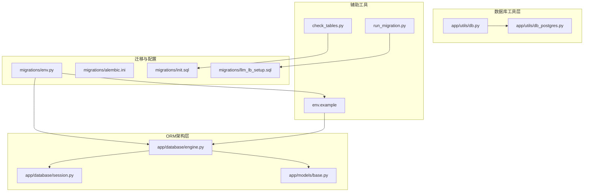
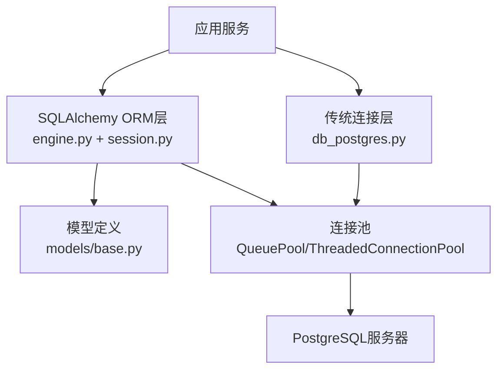
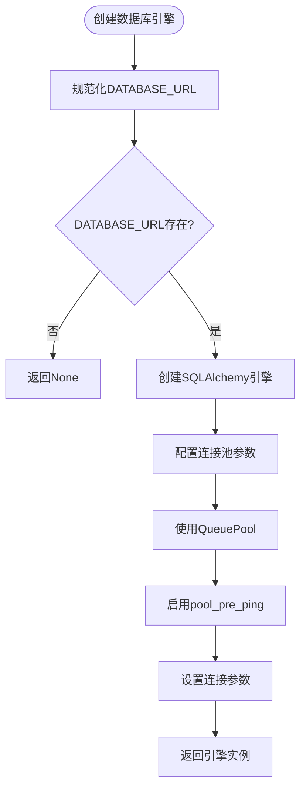
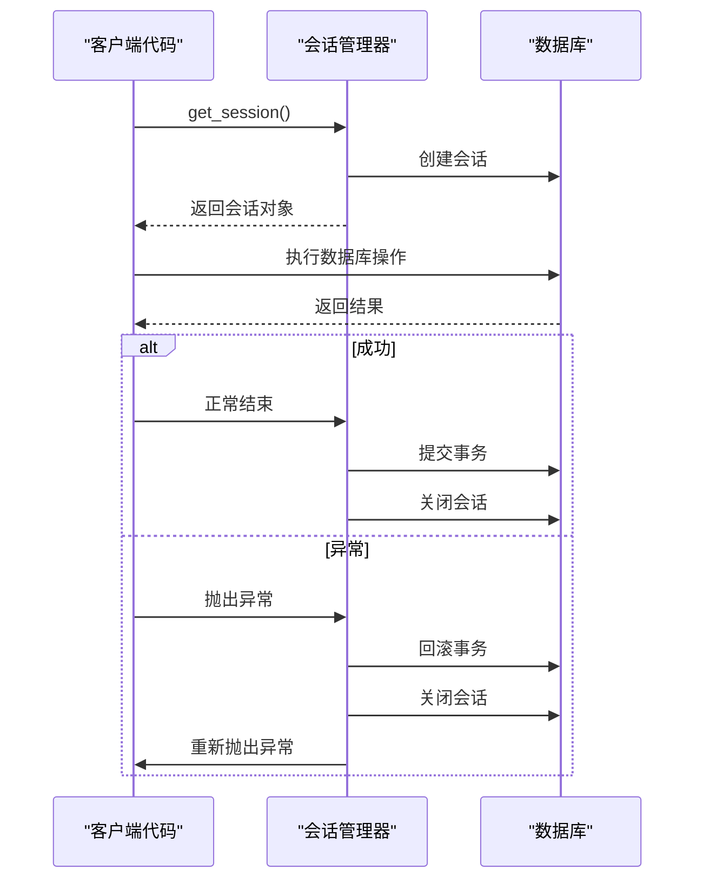
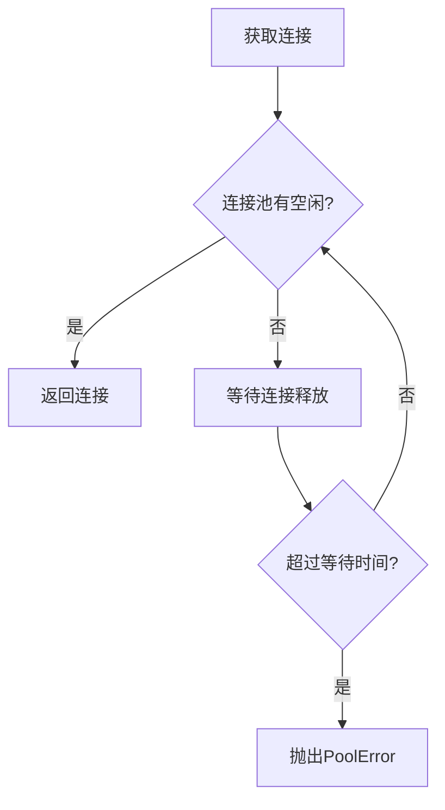
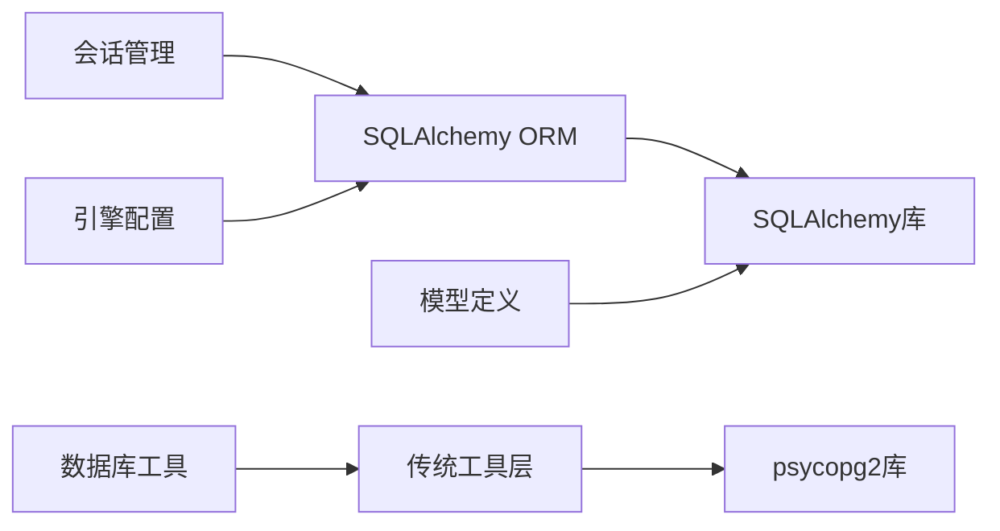

# 数据库配置

<cite>
**本文引用的文件**
- [engine.py](file://backend_api_python/app/database/engine.py)
- [session.py](file://backend_api_python/app/database/session.py)
- [db.py](file://backend_api_python/app/utils/db.py)
- [db_postgres.py](file://backend_api_python/app/utils/db_postgres.py)
- [base.py](file://backend_api_python/app/models/base.py)
- [env.example](file://backend_api_python/env.example)
- [env.py](file://backend_api_python/migrations/env.py)
- [alembic.ini](file://backend_api_python/migrations/alembic.ini)
- [init.sql](file://backend_api_python/migrations/init.sql)
- [llm_lb_setup.sql](file://backend_api_python/migrations/llm_lb_setup.sql)
- [run_migration.py](file://backend_api_python/run_migration.py)
- [check_tables.py](file://backend_api_python/check_tables.py)
</cite>

## 更新摘要
**变更内容**
- 新增SQLAlchemy ORM数据库引擎和会话管理架构
- 更新依赖注入数据库连接系统
- 引入现代化的数据库配置和连接池管理
- 重构数据库工具层以支持新架构
- 更新迁移和版本控制配置

## 目录
1. [简介](#简介)
2. [项目结构](#项目结构)
3. [核心组件](#核心组件)
4. [架构总览](#架构总览)
5. [详细组件分析](#详细组件分析)
6. [依赖关系分析](#依赖关系分析)
7. [性能考虑](#性能考虑)
8. [故障排查指南](#故障排查指南)
9. [结论](#结论)
10. [附录](#附录)

## 简介
本文件面向QuantDinger后端数据库配置，聚焦于现代化的SQLAlchemy ORM架构、依赖注入数据库连接系统、连接池设置、健康检查与并发限制、初始化脚本与表结构、性能优化建议、连接池故障排查以及迁移升级流程。内容基于仓库中的实际实现与示例配置进行整理，帮助开发者快速理解并正确部署数据库层。

## 项目结构
与数据库配置直接相关的文件主要分布在以下位置：
- ORM架构：app/database/engine.py、app/database/session.py、app/models/base.py
- 数据库工具：app/utils/db.py、app/utils/db_postgres.py
- 迁移与配置：migrations/env.py、migrations/alembic.ini、migrations/init.sql、migrations/llm_lb_setup.sql
- 环境变量示例：env.example
- 辅助脚本：run_migration.py、check_tables.py

**图表来源**
- [engine.py:1-52](file://backend_api_python/app/database/engine.py#L1-L52)
- [session.py:1-26](file://backend_api_python/app/database/session.py#L1-L26)
- [base.py:1-19](file://backend_api_python/app/models/base.py#L1-L19)
- [db.py:1-94](file://backend_api_python/app/utils/db.py#L1-L94)
- [db_postgres.py:1-335](file://backend_api_python/app/utils/db_postgres.py#L1-L335)
- [env.py:1-45](file://backend_api_python/migrations/env.py#L1-L45)
- [alembic.ini:1-38](file://backend_api_python/migrations/alembic.ini#L1-L38)
- [env.example:1-268](file://backend_api_python/env.example#L1-L268)

## 核心组件
- **SQLAlchemy ORM引擎**：app/database/engine.py提供现代化的数据库引擎配置，支持连接池管理和预连接检查
- **依赖注入会话管理**：app/database/session.py通过上下文管理器提供依赖注入式的数据库会话
- **混合连接模式**：app/utils/db.py同时支持新的SQLAlchemy ORM模式和传统psycopg2模式，确保向后兼容
- **连接池与健康检查**：app/utils/db_postgres.py提供高性能的psycopg2连接池，支持智能等待和健康检查
- **模型基类**：app/models/base.py定义了SQLAlchemy模型基类和时间戳混入

**章节来源**
- [engine.py:1-52](file://backend_api_python/app/database/engine.py#L1-L52)
- [session.py:1-26](file://backend_api_python/app/database/session.py#L1-L26)
- [db.py:1-94](file://backend_api_python/app/utils/db.py#L1-L94)
- [db_postgres.py:1-335](file://backend_api_python/app/utils/db_postgres.py#L1-L335)
- [base.py:1-19](file://backend_api_python/app/models/base.py#L1-L19)

## 架构总览
下图展示了QuantDinger现代化数据库架构的核心组件与交互关系。

**图表来源**
- [engine.py:19-47](file://backend_api_python/app/database/engine.py#L19-L47)
- [session.py:8-21](file://backend_api_python/app/database/session.py#L8-L21)
- [db_postgres.py:107-161](file://backend_api_python/app/utils/db_postgres.py#L107-L161)

## 详细组件分析

### SQLAlchemy ORM引擎配置
- **连接池配置**：使用SQLAlchemy的QueuePool，支持动态调整连接池大小
- **预连接检查**：启用pool_pre_ping确保连接有效性，自动处理断开的连接
- **连接参数优化**：设置连接超时、时区、keepalives等参数
- **环境变量驱动**：通过DB_POOL_MIN、DB_POOL_MAX、DB_POOL_ACQUIRE_TIMEOUT等参数配置

**图表来源**
- [engine.py:19-43](file://backend_api_python/app/database/engine.py#L19-L43)

**章节来源**
- [engine.py:19-47](file://backend_api_python/app/database/engine.py#L19-L47)

### 依赖注入会话管理系统
- **上下文管理器**：通过get_session()提供自动化的会话生命周期管理
- **事务处理**：自动提交成功事务，异常时自动回滚
- **资源清理**：确保会话正确关闭，避免连接泄漏
- **错误处理**：提供清晰的错误信息和异常传播

**图表来源**
- [session.py:8-21](file://backend_api_python/app/database/session.py#L8-L21)

**章节来源**
- [session.py:8-21](file://backend_api_python/app/database/session.py#L8-L21)

### 混合连接模式支持
- **向后兼容**：app/utils/db.py同时支持新的SQLAlchemy模式和传统psycopg2模式
- **渐进式迁移**：允许新旧代码并存，逐步迁移到ORM模式
- **工具函数**：提供数据库可用性检查、连接池关闭等实用功能
- **弃用警告**：对传统API发出弃用警告，引导开发者使用新接口

**章节来源**
- [db.py:1-94](file://backend_api_python/app/utils/db.py#L1-L94)

### 传统连接池与健康检查
- **智能等待策略**：当连接池耗尽时，采用指数退避等待策略
- **健康检查机制**：可选的连接健康检查，自动剔除不可用连接
- **异常处理**：完善的异常捕获和错误恢复机制
- **连接管理**：自动处理连接的获取、使用和归还

**图表来源**
- [db_postgres.py:184-235](file://backend_api_python/app/utils/db_postgres.py#L184-L235)

**章节来源**
- [db_postgres.py:184-235](file://backend_api_python/app/utils/db_postgres.py#L184-L235)

### 模型基类与时间戳管理
- **声明式基类**：继承SQLAlchemy的DeclarativeBase，提供ORM功能
- **时间戳混入**：自动管理created_at和updated_at字段
- **类型注解**：使用Python类型注解提供更好的开发体验
- **时区支持**：支持UTC时区的时间戳存储

**章节来源**
- [base.py:1-19](file://backend_api_python/app/models/base.py#L1-L19)

### 迁移和版本控制配置
- **Alembic集成**：通过migrations/env.py配置Alembic迁移环境
- **在线迁移**：支持在线模式下的数据库迁移
- **离线迁移**：支持离线模式下的数据库迁移
- **元数据注册**：自动注册所有模型到目标元数据

**章节来源**
- [env.py:1-45](file://backend_api_python/migrations/env.py#L1-L45)
- [alembic.ini:1-38](file://backend_api_python/migrations/alembic.ini#L1-L38)

## 依赖关系分析
- **模块层次**：ORM层依赖于SQLAlchemy，工具层提供传统连接支持
- **依赖注入**：会话管理器通过依赖注入提供数据库连接
- **向后兼容**：传统连接池与新ORM架构并存，支持渐进式迁移
- **外部依赖**：PostgreSQL服务器、SQLAlchemy、psycopg2等

**图表来源**
- [engine.py:8-10](file://backend_api_python/app/database/engine.py#L8-L10)
- [db_postgres.py:22-28](file://backend_api_python/app/utils/db_postgres.py#L22-L28)

**章节来源**
- [engine.py:8-10](file://backend_api_python/app/database/engine.py#L8-L10)
- [db_postgres.py:22-28](file://backend_api_python/app/utils/db_postgres.py#L22-L28)

## 性能考虑
- **连接池优化**：DB_POOL_MIN和DB_POOL_MAX应根据实际负载调整
- **预连接检查**：pool_pre_ping提高连接可靠性，但会增加少量开销
- **连接复用**：依赖注入会话管理器确保连接的有效复用
- **异步处理**：结合GUNICORN_WORKERS和GUNICORN_THREADS优化并发性能
- **索引优化**：初始化脚本已包含高频查询索引，需持续监控查询性能

**章节来源**
- [engine.py:27-43](file://backend_api_python/app/database/engine.py#L27-L43)
- [env.example:42-62](file://backend_api_python/env.example#L42-L62)

## 故障排查指南
- **连接失败**：检查DATABASE_URL格式和PostgreSQL服务状态
- **连接池耗尽**：调整DB_POOL_MAX和DB_POOL_ACQUIRE_TIMEOUT参数
- **会话异常**：检查事务处理和异常捕获逻辑
- **迁移失败**：验证Alembic配置和数据库权限
- **性能问题**：监控连接池使用率和查询执行计划

**章节来源**
- [engine.py:20-22](file://backend_api_python/app/database/engine.py#L20-L22)
- [session.py:10-11](file://backend_api_python/app/database/session.py#L10-L11)
- [env.py:24-34](file://backend_api_python/migrations/env.py#L24-L34)

## 结论
QuantDinger的数据库层已成功从传统psycopg2连接池模式迁移到现代化的SQLAlchemy ORM架构。新的依赖注入数据库连接系统提供了更好的代码组织、更强的类型安全性和更清晰的依赖管理。通过混合连接模式支持，项目实现了平滑的渐进式迁移，既保证了现有功能的稳定性，又为未来的扩展奠定了坚实基础。

## 附录
- **环境变量配置**：DATABASE_URL、DB_POOL_MIN、DB_POOL_MAX、DB_POOL_ACQUIRE_TIMEOUT、DB_POOL_HEALTH_CHECK
- **ORM配置**：SQLAlchemy引擎参数、连接池设置、预连接检查
- **迁移工具**：Alembic配置、迁移脚本、版本控制
- **性能监控**：连接池使用率、查询性能、事务处理

**章节来源**
- [env.example:21](file://backend_api_python/env.example#L21)
- [env.example:48-51](file://backend_api_python/env.example#L48-L51)
- [env.py:24-34](file://backend_api_python/migrations/env.py#L24-L34)