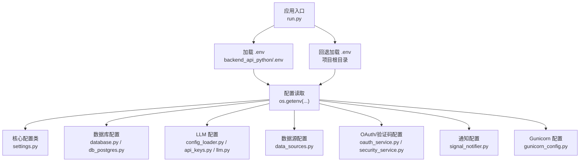
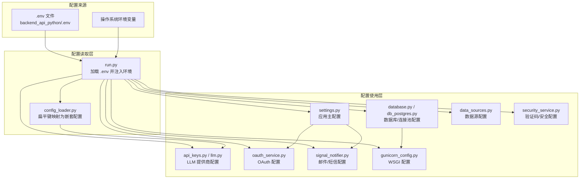
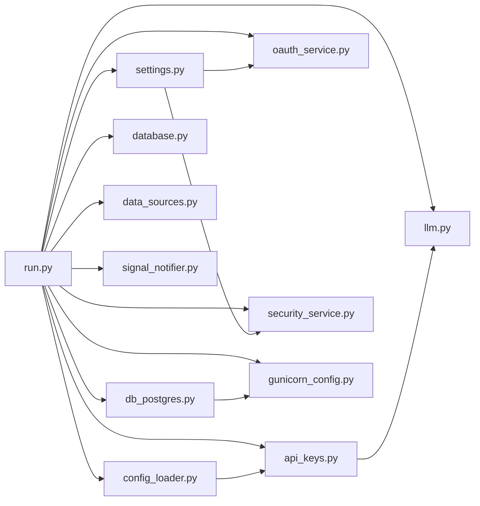

# 环境变量配置

<cite>
**本文引用的文件**
- [env.example](file://backend_api_python/env.example)
- [run.py](file://backend_api_python/run.py)
- [settings.py](file://backend_api_python/app/config/settings.py)
- [database.py](file://backend_api_python/app/config/database.py)
- [config_loader.py](file://backend_api_python/app/utils/config_loader.py)
- [api_keys.py](file://backend_api_python/app/config/api_keys.py)
- [data_sources.py](file://backend_api_python/app/config/data_sources.py)
- [db_postgres.py](file://backend_api_python/app/utils/db_postgres.py)
- [gunicorn_config.py](file://backend_api_python/gunicorn_config.py)
- [oauth_service.py](file://backend_api_python/app/services/oauth_service.py)
- [OAUTH_CONFIG_EN.md](file://docs/OAUTH_CONFIG_EN.md)
- [OAUTH_CONFIG_CN.md](file://docs/OAUTH_CONFIG_CN.md)
- [docker-entrypoint.sh](file://backend_api_python/docker-entrypoint.sh)
- [Dockerfile](file://backend_api_python/Dockerfile)
- [generate-secret-key.sh](file://scripts/generate-secret-key.sh)
- [llm.py](file://backend_api_python/app/services/llm.py)
- [security_service.py](file://backend_api_python/app/services/security_service.py)
- [signal_notifier.py](file://backend_api_python/app/services/signal_notifier.py)
- [settings.py](file://backend_api_python/app/routes/settings.py)
- [db.py](file://backend_api_python/app/utils/db.py)
</cite>

## 目录
1. [简介](#简介)
2. [项目结构](#项目结构)
3. [核心组件](#核心组件)
4. [架构总览](#架构总览)
5. [详细组件分析](#详细组件分析)
6. [依赖关系分析](#依赖关系分析)
7. [性能考量](#性能考量)
8. [故障排查指南](#故障排查指南)
9. [结论](#结论)
10. [附录](#附录)

## 简介
本文件系统性梳理 QuantDinger 的环境变量配置，覆盖认证与安全、核心应用、数据库连接池、AI/LLM 提供商、数据源、网络与应用调优、OAuth 与验证码、邮件与短信通知、计费与支付等模块。文档提供变量作用、格式要求、配置方法、必填项与可选项区分、多环境差异、配置验证与常见错误排查，帮助你在本地开发、容器化部署与生产环境中正确配置。

## 项目结构
QuantDinger 的环境变量主要来源于以下位置：
- 应用入口会优先加载 backend_api_python/.env，其次回退到仓库根目录 .env
- 大部分配置通过 os.getenv 读取；部分高级配置通过专用配置类或工具模块解析
- Docker 镜像构建时设置默认主机与端口，运行前通过入口脚本进行安全检查与初始化

图表来源
- [run.py:17-29](file://backend_api_python/run.py#L17-L29)
- [settings.py:10-91](file://backend_api_python/app/config/settings.py#L10-L91)
- [database.py:6-36](file://backend_api_python/app/config/database.py#L6-L36)
- [db_postgres.py:38-56](file://backend_api_python/app/utils/db_postgres.py#L38-L56)
- [config_loader.py:60-148](file://backend_api_python/app/utils/config_loader.py#L60-L148)
- [api_keys.py:7-122](file://backend_api_python/app/config/api_keys.py#L7-L122)
- [data_sources.py:6-28](file://backend_api_python/app/config/data_sources.py#L6-L28)
- [oauth_service.py:145-191](file://backend_api_python/app/services/oauth_service.py#L145-L191)
- [security_service.py:29-41](file://backend_api_python/app/services/security_service.py#L29-L41)
- [signal_notifier.py:148-164](file://backend_api_python/app/services/signal_notifier.py#L148-L164)
- [gunicorn_config.py:10-18](file://backend_api_python/gunicorn_config.py#L10-L18)

章节来源
- [run.py:17-29](file://backend_api_python/run.py#L17-L29)
- [Dockerfile:46-55](file://backend_api_python/Dockerfile#L46-L55)

## 核心组件
本节对关键配置模块进行要点归纳，便于快速定位与理解。

- 认证与安全
  - SECRET_KEY：应用密钥，用于加密与签发令牌，必须强随机且不可使用默认示例值
  - ADMIN_USER/ADMIN_PASSWORD/ADMIN_EMAIL：管理员账户信息
  - RATE_LIMIT、ENABLE_CACHE、ENABLE_REQUEST_LOG：应用级功能开关与限流
  - TURNSTILE_*：Cloudflare Turnstile 验证配置
  - SECURITY_*：IP/账号尝试次数与封禁窗口配置

- 核心应用
  - DATABASE_URL：PostgreSQL 连接串
  - FRONTEND_URL、OAUTH_ALLOWED_REDIRECTS：前端地址与 OAuth 允许重定向来源
  - OAUTH_STATE_TTL_MINUTES：OAuth 状态存储有效期
  - ENABLE_REGISTRATION：是否允许注册

- 数据库连接池
  - DB_POOL_MIN/MAX、DB_POOL_ACQUIRE_TIMEOUT、DB_POOL_HEALTH_CHECK：连接池大小、等待超时与健康检查
  - MARKET_EXECUTOR_WORKERS、PORTFOLIO_EXECUTOR_WORKERS：路由级并发执行器数量
  - GUNICORN_WORKERS/GUNICORN_THREADS：WSGI 工作进程与线程模型

- AI/LLM 提供商
  - LLM_PROVIDER：选择提供商（openrouter/openai/google/deepseek/grok/ollama）
  - OPENROUTER_*、OPENAI_*、GOOGLE_*、DEEPSEEK_*、GROK_*：各提供商的 API Key、模型、基础 URL、温度、最大 Token、超时等
  - AI_CODE_GEN_MODEL：AI 代码生成专用模型覆盖
  - OPENROUTER_FALLBACK_MODEL、OPENAI_FALLBACK_MODEL 等：备用模型

- 数据源
  - DATA_SOURCE_*：通用超时、重试次数与回退系数
  - FINNHUB_*、TIINGO_*、YFINANCE_*、AKSHARE_*：第三方数据源配置
  - CCXT_*：加密货币数据源默认交易所与超时
  - PROXY_URL、HTTPS_PROXY/HTTP_PROXY/ALL_PROXY：出站代理与绕过规则
  - LIVE_TRADING_*：代理场景下的证书校验与 CA Bundle

- 通知与验证
  - SMTP_*：邮件通知配置
  - TWILIO_*：短信通知配置
  - SIGNAL_NOTIFY_TIMEOUT_SEC：通知 HTTP 超时

- 计费与支付
  - BILLING_ENABLED、MEMBERSHIP_*：计费与会员套餐配置
  - USDT_*：USDT 支付链、钱包、确认时间、过期时间、轮询间隔等

- 高级/不常变更
  - LOG_LEVEL/LOG_DIR/LOG_FILE/LOG_MAX_BYTES/LOG_BACKUP_COUNT：日志配置
  - INTERNAL_API_KEY：内部 API 密钥

章节来源
- [env.example:10-268](file://backend_api_python/env.example#L10-L268)
- [settings.py:10-91](file://backend_api_python/app/config/settings.py#L10-L91)
- [database.py:6-36](file://backend_api_python/app/config/database.py#L6-L36)
- [db_postgres.py:38-56](file://backend_api_python/app/utils/db_postgres.py#L38-L56)
- [config_loader.py:60-148](file://backend_api_python/app/utils/config_loader.py#L60-L148)
- [api_keys.py:7-122](file://backend_api_python/app/config/api_keys.py#L7-L122)
- [data_sources.py:6-28](file://backend_api_python/app/config/data_sources.py#L6-L28)
- [oauth_service.py:145-191](file://backend_api_python/app/services/oauth_service.py#L145-L191)
- [security_service.py:29-41](file://backend_api_python/app/services/security_service.py#L29-L41)
- [signal_notifier.py:148-164](file://backend_api_python/app/services/signal_notifier.py#L148-L164)
- [gunicorn_config.py:10-18](file://backend_api_python/gunicorn_config.py#L10-L18)

## 架构总览
下图展示环境变量在应用中的流向与依赖关系：

图表来源
- [run.py:17-29](file://backend_api_python/run.py#L17-L29)
- [config_loader.py:24-161](file://backend_api_python/app/utils/config_loader.py#L24-L161)
- [settings.py:10-91](file://backend_api_python/app/config/settings.py#L10-L91)
- [database.py:6-36](file://backend_api_python/app/config/database.py#L6-L36)
- [db_postgres.py:38-56](file://backend_api_python/app/utils/db_postgres.py#L38-L56)
- [api_keys.py:7-122](file://backend_api_python/app/config/api_keys.py#L7-L122)
- [llm.py:76-150](file://backend_api_python/app/services/llm.py#L76-L150)
- [data_sources.py:6-28](file://backend_api_python/app/config/data_sources.py#L6-L28)
- [oauth_service.py:145-191](file://backend_api_python/app/services/oauth_service.py#L145-L191)
- [security_service.py:29-41](file://backend_api_python/app/services/security_service.py#L29-L41)
- [signal_notifier.py:148-164](file://backend_api_python/app/services/signal_notifier.py#L148-L164)
- [gunicorn_config.py:10-18](file://backend_api_python/gunicorn_config.py#L10-L18)

## 详细组件分析

### 认证与安全配置
- SECRET_KEY
  - 作用：JWT 签发与加密用途，必须强随机且不可使用默认示例值
  - 格式：十六进制字符串，长度足够大
  - 配置方法：在 .env 中设置；Docker 入口脚本会在默认值时自动生成并写回 .env
  - 必填项：是
  - 参考路径：[env.example:13](file://backend_api_python/env.example#L13)，[docker-entrypoint.sh:36-42](file://backend_api_python/docker-entrypoint.sh#L36-L42)，[run.py:112-120](file://backend_api_python/run.py#L112-L120)

- ADMIN_USER/ADMIN_PASSWORD/ADMIN_EMAIL
  - 作用：管理员账户信息
  - 格式：字符串
  - 配置方法：在 .env 中设置
  - 必填项：否（但建议设置）

- RATE_LIMIT、ENABLE_CACHE、ENABLE_REQUEST_LOG
  - 作用：全局限流、缓存开关、请求日志开关
  - 格式：整数/布尔
  - 配置方法：在 .env 中设置；部分值可通过附加配置覆盖
  - 必填项：否

- TURNSTILE_* 与 SECURITY_*
  - 作用：Cloudflare Turnstile 验证与登录防护（IP/账号尝试次数与封禁窗口）
  - 格式：字符串/整数
  - 配置方法：在 .env 中设置
  - 必填项：否（启用验证码时必填）

章节来源
- [env.example:10-31](file://backend_api_python/env.example#L10-L31)
- [settings.py:66-91](file://backend_api_python/app/config/settings.py#L66-L91)
- [security_service.py:29-41](file://backend_api_python/app/services/security_service.py#L29-L41)
- [docker-entrypoint.sh:36-42](file://backend_api_python/docker-entrypoint.sh#L36-L42)
- [run.py:112-120](file://backend_api_python/run.py#L112-L120)

### 核心应用配置
- DATABASE_URL
  - 作用：PostgreSQL 连接串
  - 格式：标准连接串（协议、用户名、密码、主机、端口、数据库名）
  - 配置方法：在 .env 中设置
  - 必填项：是

- FRONTEND_URL、OAUTH_ALLOWED_REDIRECTS、OAUTH_STATE_TTL_MINUTES
  - 作用：前端地址、OAuth 允许重定向来源列表、OAuth 状态有效期
  - 格式：URL 字符串/逗号分隔字符串/整数（分钟）
  - 配置方法：在 .env 中设置
  - 必填项：否（OAuth 相关视业务需求而定）

- ENABLE_REGISTRATION
  - 作用：是否允许用户注册
  - 格式：布尔
  - 配置方法：在 .env 中设置
  - 必填项：否

章节来源
- [env.example:18-31](file://backend_api_python/env.example#L18-L31)
- [oauth_service.py:145-191](file://backend_api_python/app/services/oauth_service.py#L145-L191)
- [settings.py:10-20](file://backend_api_python/app/config/settings.py#L10-L20)

### 数据库连接池配置
- DB_POOL_MIN/MAX、DB_POOL_ACQUIRE_TIMEOUT、DB_POOL_HEALTH_CHECK
  - 作用：连接池最小/最大连接数、获取连接超时、健康检查
  - 格式：整数/布尔
  - 配置方法：在 .env 中设置
  - 必填项：否（默认安全值）

- MARKET_EXECUTOR_WORKERS、PORTFOLIO_EXECUTOR_WORKERS
  - 作用：市场数据与组合执行器并发数（每个工作线程占用一个数据库连接）
  - 格式：整数
  - 配置方法：在 .env 中设置
  - 必填项：否

- GUNICORN_WORKERS/GUNICORN_THREADS
  - 作用：WSGI 工作进程与线程模型
  - 格式：整数
  - 配置方法：在 .env 中设置
  - 必填项：否

章节来源
- [env.example:42-62](file://backend_api_python/env.example#L42-L62)
- [db_postgres.py:38-56](file://backend_api_python/app/utils/db_postgres.py#L38-L56)
- [gunicorn_config.py:10-18](file://backend_api_python/gunicorn_config.py#L10-L18)

### AI/LLM 提供商配置
- LLM_PROVIDER
  - 作用：选择 LLM 提供商（openrouter/openai/google/deepseek/grok/ollama）
  - 格式：字符串
  - 配置方法：在 .env 中设置
  - 必填项：否（默认 openrouter）

- OPENROUTER_*、OPENAI_*、GOOGLE_*、DEEPSEEK_*、GROK_*
  - 作用：各提供商的 API Key、模型、基础 URL、温度、最大 Token、超时等
  - 格式：字符串/浮点/整数
  - 配置方法：在 .env 中设置
  - 必填项：按所选提供商而定（至少一种提供商配置有效）

- AI_CODE_GEN_MODEL
  - 作用：AI 代码生成专用模型覆盖（为空则使用提供商默认模型）
  - 格式：字符串
  - 配置方法：在 .env 中设置
  - 必填项：否

- OPENROUTER_FALLBACK_MODEL、OPENAI_FALLBACK_MODEL 等
  - 作用：备用模型
  - 格式：字符串
  - 配置方法：在 .env 中设置
  - 必填项：否

章节来源
- [env.example:64-91](file://backend_api_python/env.example#L64-L91)
- [config_loader.py:60-148](file://backend_api_python/app/utils/config_loader.py#L60-L148)
- [api_keys.py:64-121](file://backend_api_python/app/config/api_keys.py#L64-L121)
- [llm.py:76-150](file://backend_api_python/app/services/llm.py#L76-L150)

### 数据源配置
- DATA_SOURCE_*：通用超时、重试次数与回退系数
- FINNHUB_*、TIINGO_*、YFINANCE_*、AKSHARE_*：第三方数据源配置
- CCXT_*：加密货币数据源默认交易所与超时
- PROXY_URL、HTTPS_PROXY/HTTP_PROXY/ALL_PROXY：出站代理与绕过规则
- LIVE_TRADING_*：代理场景下的证书校验与 CA Bundle

章节来源
- [env.example:196-229](file://backend_api_python/env.example#L196-L229)
- [data_sources.py:6-28](file://backend_api_python/app/config/data_sources.py#L6-L28)
- [data_sources.py:101-146](file://backend_api_python/app/config/data_sources.py#L101-L146)

### OAuth 与验证码配置
- GOOGLE_*、GITHUB_*：Google/GitHub OAuth 客户端配置与回调地址
- FRONTEND_URL：OAuth 成功后重定向的前端地址
- OAUTH_ALLOWED_REDIRECTS：额外允许的重定向来源（逗号分隔）
- TURNSTILE_*：Cloudflare Turnstile 验证配置

章节来源
- [env.example:120-132](file://backend_api_python/env.example#L120-L132)
- [env.example:125-127](file://backend_api_python/env.example#L125-L127)
- [env.example:129-131](file://backend_api_python/env.example#L129-L131)
- [oauth_service.py:145-191](file://backend_api_python/app/services/oauth_service.py#L145-L191)
- [OAUTH_CONFIG_EN.md:106-170](file://docs/OAUTH_CONFIG_EN.md#L106-L170)
- [OAUTH_CONFIG_CN.md:106-173](file://docs/OAUTH_CONFIG_CN.md#L106-L173)

### 通知与验证配置
- SMTP_*：邮件通知配置（主机、端口、用户、密码、发件人、TLS/SSL）
- TWILIO_*：短信通知配置（账号 SID、认证令牌、发件号码）
- SIGNAL_NOTIFY_TIMEOUT_SEC：通知 HTTP 超时

章节来源
- [env.example:93-101](file://backend_api_python/env.example#L93-L101)
- [env.example:230-234](file://backend_api_python/env.example#L230-L234)
- [signal_notifier.py:148-164](file://backend_api_python/app/services/signal_notifier.py#L148-L164)

### 计费与支付配置
- BILLING_ENABLED：是否启用计费系统
- MEMBERSHIP_*：会员套餐价格与积分配置
- USDT_*：USDT 支付链、钱包、确认时间、过期时间、轮询间隔等

章节来源
- [env.example:134-163](file://backend_api_python/env.example#L134-L163)
- [settings.py:733-767](file://backend_api_python/app/routes/settings.py#L733-L767)

### 高级/不常变更配置
- LOG_*：日志级别、目录、文件、大小与备份数
- INTERNAL_API_KEY：内部 API 密钥

章节来源
- [env.example:165-168](file://backend_api_python/env.example#L165-L168)
- [settings.py:46-64](file://backend_api_python/app/config/settings.py#L46-L64)
- [config_loader.py:218-242](file://backend_api_python/app/utils/config_loader.py#L218-L242)

## 依赖关系分析
环境变量在应用中的依赖关系如下：

图表来源
- [run.py:17-29](file://backend_api_python/run.py#L17-L29)
- [settings.py:10-91](file://backend_api_python/app/config/settings.py#L10-L91)
- [config_loader.py:24-161](file://backend_api_python/app/utils/config_loader.py#L24-L161)
- [db_postgres.py:38-56](file://backend_api_python/app/utils/db_postgres.py#L38-L56)
- [database.py:6-36](file://backend_api_python/app/config/database.py#L6-L36)
- [api_keys.py:7-122](file://backend_api_python/app/config/api_keys.py#L7-L122)
- [llm.py:76-150](file://backend_api_python/app/services/llm.py#L76-L150)
- [data_sources.py:6-28](file://backend_api_python/app/config/data_sources.py#L6-L28)
- [oauth_service.py:145-191](file://backend_api_python/app/services/oauth_service.py#L145-L191)
- [security_service.py:29-41](file://backend_api_python/app/services/security_service.py#L29-L41)
- [signal_notifier.py:148-164](file://backend_api_python/app/services/signal_notifier.py#L148-L164)
- [gunicorn_config.py:10-18](file://backend_api_python/gunicorn_config.py#L10-L18)

## 性能考量
- 数据库连接池
  - 当出现连接池耗尽时，适当提高 DB_POOL_MAX，并确保 PostgreSQL 的 max_connections 设置高于 DB_POOL_MAX
  - 合理设置 DB_POOL_ACQUIRE_TIMEOUT，避免请求长时间阻塞
  - 开启 DB_POOL_HEALTH_CHECK 可提升连接可用性，但会增加少量查询开销

- 并发与线程
  - MARKET_EXECUTOR_WORKERS + PORTFOLIO_EXECUTOR_WORKERS 应低于 DB_POOL_MAX
  - GUNICORN_WORKERS 与 GUNICORN_THREADS 组合应根据 CPU 核心数与 I/O 特性调整

- LLM 调优
  - OPENROUTER_*、OPENAI_* 等的超时与最大 Token 影响响应速度与成本
  - AI_CODE_GEN_MODEL 可针对代码生成场景优化模型

章节来源
- [env.example:42-62](file://backend_api_python/env.example#L42-L62)
- [db_postgres.py:38-56](file://backend_api_python/app/utils/db_postgres.py#L38-L56)
- [gunicorn_config.py:10-18](file://backend_api_python/gunicorn_config.py#L10-L18)
- [config_loader.py:188-216](file://backend_api_python/app/utils/config_loader.py#L188-L216)

## 故障排查指南
- SECRET_KEY 使用默认值
  - 现象：生产模式下若 SECRET_KEY 为默认示例值，系统会自动生成新的随机密钥并提示设置持久密钥
  - 排查：检查 .env 是否已设置强随机密钥；Docker 入口脚本会自动处理默认值
  - 参考：[run.py:112-120](file://backend_api_python/run.py#L112-L120)，[docker-entrypoint.sh:36-42](file://backend_api_python/docker-entrypoint.sh#L36-L42)

- OAuth 回调地址不匹配
  - 现象：redirect_uri_mismatch 错误
  - 排查：确认 .env 中 GOOGLE_REDIRECT_URI/GITHUB_REDIRECT_URI 与 OAuth 提供商后台配置完全一致（含协议、端口、路径）
  - 参考：[OAUTH_CONFIG_EN.md:185-191](file://docs/OAUTH_CONFIG_EN.md#L185-L191)，[oauth_service.py:145-191](file://backend_api_python/app/services/oauth_service.py#L145-L191)

- Turnstile 验证失败
  - 现象：验证码无法通过
  - 排查：确认 TURNSTILE_SITE_KEY/TURNSTILE_SECRET_KEY 正确，域名已在 Turnstile 控制台添加
  - 参考：[OAUTH_CONFIG_EN.md:192-198](file://docs/OAUTH_CONFIG_EN.md#L192-L198)，[security_service.py:29-41](file://backend_api_python/app/services/security_service.py#L29-L41)

- 数据库连接池耗尽
  - 现象：psycopg2.pool.PoolError: connection pool exhausted
  - 排查：提高 DB_POOL_MAX，降低并发，检查 PostgreSQL max_connections 设置
  - 参考：[env.example:42-51](file://backend_api_python/env.example#L42-L51)，[db_postgres.py:38-56](file://backend_api_python/app/utils/db_postgres.py#L38-L56)

- LLM API 调用失败
  - 现象：All LLM providers failed
  - 排查：检查所选 PROVIDER 的 API Key、模型、基础 URL、超时设置
  - 参考：[llm.py:719-722](file://backend_api_python/app/services/llm.py#L719-L722)，[config_loader.py:60-148](file://backend_api_python/app/utils/config_loader.py#L60-L148)

- 代理与证书问题
  - 现象：SSL 证书校验失败或访问受限
  - 排查：安装系统 CA 证书或指定 CA Bundle；必要时关闭 TLS 校验（仅限测试）
  - 参考：[env.example:104-118](file://backend_api_python/env.example#L104-L118)

章节来源
- [run.py:112-120](file://backend_api_python/run.py#L112-L120)
- [docker-entrypoint.sh:36-42](file://backend_api_python/docker-entrypoint.sh#L36-L42)
- [OAUTH_CONFIG_EN.md:185-191](file://docs/OAUTH_CONFIG_EN.md#L185-L191)
- [oauth_service.py:145-191](file://backend_api_python/app/services/oauth_service.py#L145-L191)
- [security_service.py:29-41](file://backend_api_python/app/services/security_service.py#L29-L41)
- [env.example:42-51](file://backend_api_python/env.example#L42-L51)
- [db_postgres.py:38-56](file://backend_api_python/app/utils/db_postgres.py#L38-L56)
- [llm.py:719-722](file://backend_api_python/app/services/llm.py#L719-L722)
- [config_loader.py:60-148](file://backend_api_python/app/utils/config_loader.py#L60-L148)
- [env.example:104-118](file://backend_api_python/env.example#L104-L118)

## 结论
QuantDinger 的环境变量体系以 .env 为中心，结合专用配置类与工具模块实现集中管理。合理配置认证与安全、数据库连接池、AI/LLM 提供商、数据源与网络参数，是保障系统稳定与性能的关键。建议在生产环境严格设置 SECRET_KEY、完善 OAuth 与验证码配置，并根据业务负载调优连接池与并发参数。

## 附录
- 配置模板说明
  - 必填项：DATABASE_URL、SECRET_KEY（生产环境不得使用默认值）、至少一种 LLM 提供商的 API Key
  - 可选项：OAuth、验证码、通知、计费与支付、代理与证书等，按需配置
  - 多环境差异：
    - 本地开发：使用默认端口与调试模式，可简化配置
    - 容器化部署：通过 .env 注入，Docker 入口脚本自动处理默认密钥
    - 生产环境：严格设置密钥与回调地址，启用健康检查与日志记录

- 配置验证方法
  - 启动时自动检查 SECRET_KEY（非调试模式下默认值会被替换）
  - 通过系统设置界面读取与写回 .env，支持热重载与服务刷新
  - 参考：[run.py:112-120](file://backend_api_python/run.py#L112-L120)，[settings.py:972-1196](file://backend_api_python/app/routes/settings.py#L972-L1196)

- 常用脚本
  - 生成随机 SECRET_KEY：[generate-secret-key.sh:1-33](file://scripts/generate-secret-key.sh#L1-L33)

章节来源
- [run.py:112-120](file://backend_api_python/run.py#L112-L120)
- [settings.py:972-1196](file://backend_api_python/app/routes/settings.py#L972-L1196)
- [generate-secret-key.sh:1-33](file://scripts/generate-secret-key.sh#L1-L33)