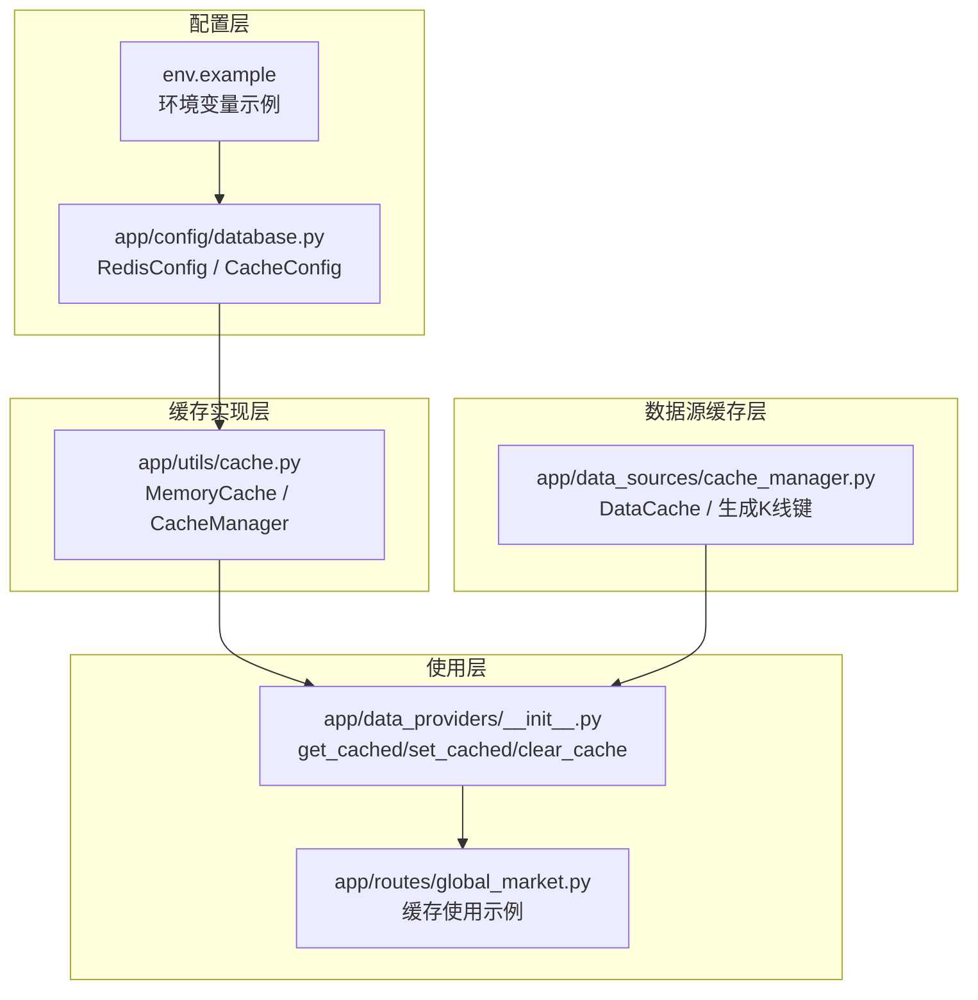
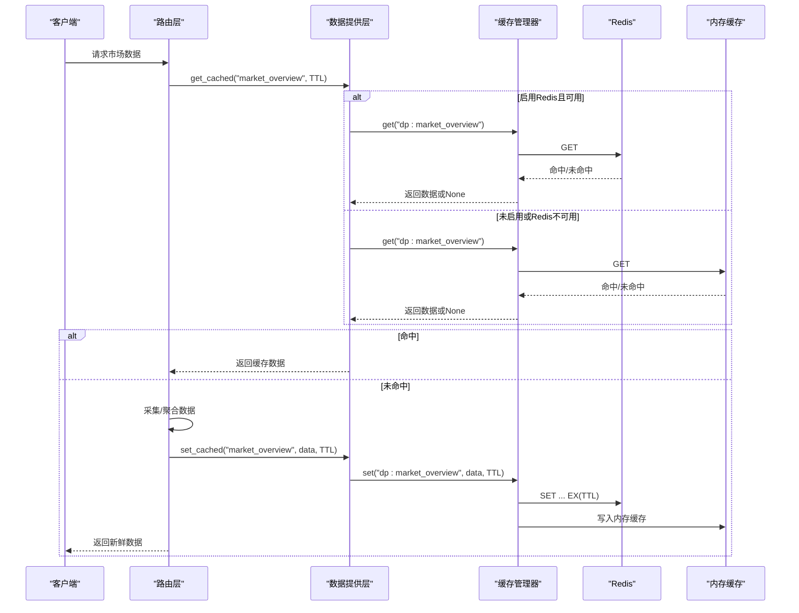
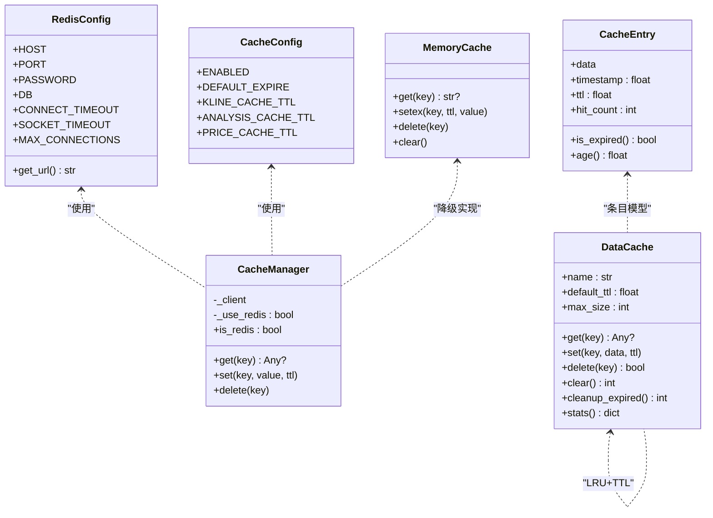
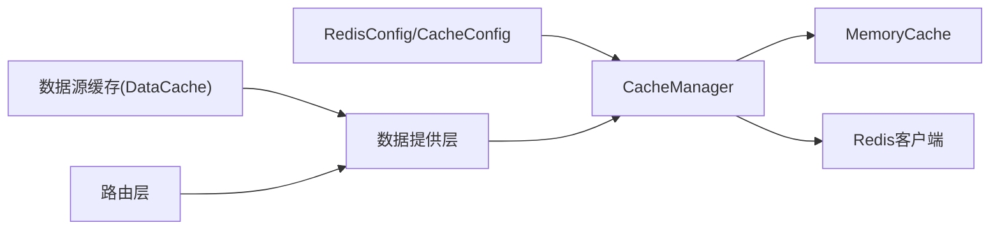

# 缓存配置

<cite>
**本文引用的文件**
- [backend_api_python/app/config/database.py](file://backend_api_python/app/config/database.py)
- [backend_api_python/app/utils/cache.py](file://backend_api_python/app/utils/cache.py)
- [backend_api_python/app/data_sources/cache_manager.py](file://backend_api_python/app/data_sources/cache_manager.py)
- [backend_api_python/app/data_providers/__init__.py](file://backend_api_python/app/data_providers/__init__.py)
- [backend_api_python/env.example](file://backend_api_python/env.example)
- [backend_api_python/app/routes/global_market.py](file://backend_api_python/app/routes/global_market.py)
</cite>

## 目录
1. [简介](#简介)
2. [项目结构](#项目结构)
3. [核心组件](#核心组件)
4. [架构总览](#架构总览)
5. [详细组件分析](#详细组件分析)
6. [依赖关系分析](#依赖关系分析)
7. [性能考量](#性能考量)
8. [故障排查指南](#故障排查指南)
9. [结论](#结论)
10. [附录](#附录)

## 简介
本文件面向QuantDinger后端的缓存配置与使用，聚焦于Redis缓存配置、缓存启用开关、缓存键命名规范、过期时间策略与缓存清理策略，并提供性能调优建议与故障处理指引。内容基于仓库中实际实现进行梳理，帮助开发者与运维人员正确配置与维护缓存层。

## 项目结构
与缓存相关的核心文件分布如下：
- 配置层：Redis连接参数、缓存业务参数、全局开关
- 缓存实现层：本地内存缓存与Redis缓存的统一管理器
- 数据源缓存层：按数据类型划分的本地缓存实例与K线键生成规则
- 使用层：路由与数据提供层通过统一接口读写缓存

图表来源
- [backend_api_python/app/config/database.py:1-90](file://backend_api_python/app/config/database.py#L1-L90)
- [backend_api_python/env.example:261-265](file://backend_api_python/env.example#L261-L265)
- [backend_api_python/app/utils/cache.py:1-129](file://backend_api_python/app/utils/cache.py#L1-L129)
- [backend_api_python/app/data_sources/cache_manager.py:1-233](file://backend_api_python/app/data_sources/cache_manager.py#L1-L233)
- [backend_api_python/app/data_providers/__init__.py:1-86](file://backend_api_python/app/data_providers/__init__.py#L1-L86)
- [backend_api_python/app/routes/global_market.py:80-279](file://backend_api_python/app/routes/global_market.py#L80-L279)

章节来源
- [backend_api_python/app/config/database.py:1-90](file://backend_api_python/app/config/database.py#L1-L90)
- [backend_api_python/env.example:261-265](file://backend_api_python/env.example#L261-L265)

## 核心组件
- Redis连接配置
  - 主机与端口：通过环境变量REDIS_HOST、REDIS_PORT配置，默认主机为本地回环地址，端口为标准Redis端口；支持密码与数据库索引配置。
  - 连接超时与最大连接数：CONNECT_TIMEOUT、SOCKET_TIMEOUT、MAX_CONNECTIONS可调。
  - 连接URL生成：支持带密码的URL格式。
- 缓存启用开关
  - CACHE_ENABLED：控制是否启用Redis缓存；默认关闭，需显式开启。
  - 应用级开关：ENABLE_CACHE（与缓存开关一致）。
- 缓存键命名规范
  - 数据提供层统一前缀“dp:”，便于批量清理与隔离。
  - K线键生成规则：symbol:timeframe:limit[:before_time]，确保不同周期、数量与时间窗口的K线数据互不冲突。
- 过期时间策略
  - 默认过期：CacheConfig.DEFAULT_EXPIRE。
  - K线缓存：按周期细分TTL，如1分钟到日线级别均有定制。
  - 分析与价格缓存：分别有独立TTL。
  - 数据提供层：针对不同热点数据定义了固定TTL字典。
- 缓存策略
  - 本地优先：未启用缓存时，自动降级为线程安全的内存缓存。
  - Redis降级：启用缓存但Redis不可用时，自动降级为内存缓存并记录日志。
  - 数据源缓存：按数据类型划分的本地缓存实例，具备TTL、LRU淘汰与命中统计。

章节来源
- [backend_api_python/app/config/database.py:6-47](file://backend_api_python/app/config/database.py#L6-L47)
- [backend_api_python/app/config/database.py:49-89](file://backend_api_python/app/config/database.py#L49-L89)
- [backend_api_python/app/data_providers/__init__.py:23-34](file://backend_api_python/app/data_providers/__init__.py#L23-L34)
- [backend_api_python/app/data_sources/cache_manager.py:218-232](file://backend_api_python/app/data_sources/cache_manager.py#L218-L232)
- [backend_api_python/env.example:261-265](file://backend_api_python/env.example#L261-L265)

## 架构总览
缓存架构采用“配置驱动 + 统一管理 + 本地优先”的设计，确保在不同部署环境下稳定运行。

图表来源
- [backend_api_python/app/data_providers/__init__.py:45-58](file://backend_api_python/app/data_providers/__init__.py#L45-L58)
- [backend_api_python/app/utils/cache.py:71-98](file://backend_api_python/app/utils/cache.py#L71-L98)
- [backend_api_python/app/routes/global_market.py:92-135](file://backend_api_python/app/routes/global_market.py#L92-L135)

## 详细组件分析

### Redis连接配置
- 关键点
  - HOST/PORT/PASSWORD/DB：均来自环境变量，支持密码与DB索引。
  - CONNECT_TIMEOUT/SOCKET_TIMEOUT：连接与读写超时可调。
  - MAX_CONNECTIONS：最大连接数可调。
  - get_url：自动生成连接URL，含密码时使用带认证的格式。
- 部署建议
  - 在容器编排中通过环境变量注入Redis地址与凭据。
  - 生产环境建议开启密码与最小权限DB。

章节来源
- [backend_api_python/app/config/database.py:6-47](file://backend_api_python/app/config/database.py#L6-L47)
- [backend_api_python/env.example:261-265](file://backend_api_python/env.example#L261-L265)

### 缓存启用开关与降级策略
- 开关逻辑
  - CACHE_ENABLED：默认关闭，仅当显式设为true时启用Redis。
  - 本地优先：未启用时使用MemoryCache；启用但Redis不可达时同样降级为MemoryCache。
- 错误处理
  - Redis ping失败会记录日志并切换到内存缓存，避免影响启动与功能。
- 使用建议
  - 开发/单机调试：默认关闭，避免外部依赖。
  - 生产/高并发：开启并确保Redis可用与网络稳定。

章节来源
- [backend_api_python/app/utils/cache.py:71-98](file://backend_api_python/app/utils/cache.py#L71-L98)
- [backend_api_python/app/config/database.py:52-55](file://backend_api_python/app/config/database.py#L52-L55)

### 缓存键命名规范
- 数据提供层统一前缀“dp:”，便于批量清理与隔离。
- K线键生成规则：symbol:timeframe:limit[:before_time]，覆盖不同周期、数量与时间窗口。
- 使用示例
  - 路由层对多个热点数据设置不同TTL，键名遵循“dp:”前缀。
  - 支持动态键名拼接（如按语言的新闻键）。

章节来源
- [backend_api_python/app/data_providers/__init__.py:52-58](file://backend_api_python/app/data_providers/__init__.py#L52-L58)
- [backend_api_python/app/data_sources/cache_manager.py:218-232](file://backend_api_python/app/data_sources/cache_manager.py#L218-L232)
- [backend_api_python/app/routes/global_market.py:233-240](file://backend_api_python/app/routes/global_market.py#L233-L240)

### 过期时间设置与策略
- 默认过期：CacheConfig.DEFAULT_EXPIRE。
- K线缓存：按周期细分TTL，兼顾实时性与存储成本。
- 分析与价格缓存：分别设定较长或较短TTL以匹配业务需求。
- 数据提供层：为热点数据定义固定TTL字典，未命中时按字典或默认TTL写入。

章节来源
- [backend_api_python/app/config/database.py:58-84](file://backend_api_python/app/config/database.py#L58-L84)
- [backend_api_python/app/data_providers/__init__.py:23-34](file://backend_api_python/app/data_providers/__init__.py#L23-L34)

### 缓存清理策略
- 批量清理：clear_cache会扫描并删除所有“dp:*”键（Redis）或清空内存缓存。
- 数据源缓存：提供清理过期条目与清空缓存的方法，便于主动回收资源。
- 使用场景：/refresh端点触发清理，或定期任务清理过期数据。

章节来源
- [backend_api_python/app/data_providers/__init__.py:61-77](file://backend_api_python/app/data_providers/__init__.py#L61-L77)
- [backend_api_python/app/data_sources/cache_manager.py:138-158](file://backend_api_python/app/data_sources/cache_manager.py#L138-L158)

### 类关系图（代码级）

图表来源
- [backend_api_python/app/config/database.py:6-89](file://backend_api_python/app/config/database.py#L6-L89)
- [backend_api_python/app/utils/cache.py:17-128](file://backend_api_python/app/utils/cache.py#L17-L128)
- [backend_api_python/app/data_sources/cache_manager.py:27-233](file://backend_api_python/app/data_sources/cache_manager.py#L27-L233)

## 依赖关系分析
- 配置依赖
  - RedisConfig与CacheConfig被CacheManager与数据提供层读取。
- 运行时依赖
  - CacheManager根据开关选择MemoryCache或Redis客户端。
  - 数据提供层通过统一接口读写缓存，屏蔽底层差异。
- 清理依赖
  - clear_cache同时兼容Redis与内存缓存的清理逻辑。

图表来源
- [backend_api_python/app/config/database.py:6-89](file://backend_api_python/app/config/database.py#L6-L89)
- [backend_api_python/app/utils/cache.py:71-98](file://backend_api_python/app/utils/cache.py#L71-L98)
- [backend_api_python/app/data_providers/__init__.py:39-77](file://backend_api_python/app/data_providers/__init__.py#L39-L77)

章节来源
- [backend_api_python/app/config/database.py:6-89](file://backend_api_python/app/config/database.py#L6-L89)
- [backend_api_python/app/utils/cache.py:71-98](file://backend_api_python/app/utils/cache.py#L71-L98)
- [backend_api_python/app/data_providers/__init__.py:39-77](file://backend_api_python/app/data_providers/__init__.py#L39-L77)

## 性能考量
- 内存使用优化
  - 本地缓存实例限制最大条目数，超过阈值按LRU淘汰最久未使用项。
  - 建议根据业务峰值合理设置max_size，避免频繁淘汰导致抖动。
- 命中率提升
  - 为热点数据设置合适的TTL，避免过早过期引发抖动。
  - 对高频访问的键（如市场概览、分轮询）优先使用Redis，降低单进程内存压力。
- Redis调优建议
  - 合理设置连接超时与最大连接数，避免阻塞与连接池耗尽。
  - 使用SCAN族命令进行批量清理，避免阻塞主线程。
  - 对热键进行拆分与分区，降低单Key体积与竞争。
- 数据源缓存统计
  - 利用stats输出命中率，持续监控并调整TTL与容量。

章节来源
- [backend_api_python/app/data_sources/cache_manager.py:55-70](file://backend_api_python/app/data_sources/cache_manager.py#L55-L70)
- [backend_api_python/app/data_sources/cache_manager.py:160-174](file://backend_api_python/app/data_sources/cache_manager.py#L160-L174)

## 故障排查指南
- 启用开关未生效
  - 确认环境变量CACHE_ENABLED与ENABLE_CACHE已正确设置为true。
- Redis不可用
  - 查看启动日志中Redis连接失败提示，确认主机、端口、密码与网络连通性。
  - 若Redis不可用，系统会自动降级为内存缓存，不影响功能。
- 缓存命中异常
  - 检查键前缀是否为“dp:”，确认TTL是否过短或过长。
  - 使用stats查看命中率，结合业务流量进行调整。
- 批量清理无效
  - 确认当前后端是否为Redis（is_redis为真），否则clear_cache仅清空内存缓存。
  - 如需清理Redis，请确保键空间包含“dp:*”。

章节来源
- [backend_api_python/app/utils/cache.py:94-98](file://backend_api_python/app/utils/cache.py#L94-L98)
- [backend_api_python/app/data_providers/__init__.py:61-77](file://backend_api_python/app/data_providers/__init__.py#L61-L77)
- [backend_api_python/app/utils/cache.py:125-127](file://backend_api_python/app/utils/cache.py#L125-L127)

## 结论
QuantDinger的缓存体系以“本地优先、配置驱动、统一管理”为核心设计，既能在无Redis环境下稳定运行，又可在生产环境中通过Redis显著提升性能。通过合理的键命名、TTL策略与容量控制，可有效平衡内存占用与命中率；配合批量清理与统计监控，可实现长期稳定的缓存治理。

## 附录
- 环境变量示例
  - Redis主机与端口、缓存开关等关键配置位于env.example中，部署时请复制并按需修改。
- 使用示例
  - 路由层对市场概览、热力图、新闻与日历等接口使用缓存，键名遵循“dp:”前缀并设置相应TTL。

章节来源
- [backend_api_python/env.example:261-265](file://backend_api_python/env.example#L261-L265)
- [backend_api_python/app/routes/global_market.py:92-135](file://backend_api_python/app/routes/global_market.py#L92-L135)
- [backend_api_python/app/routes/global_market.py:177-185](file://backend_api_python/app/routes/global_market.py#L177-L185)
- [backend_api_python/app/routes/global_market.py:233-240](file://backend_api_python/app/routes/global_market.py#L233-L240)
- [backend_api_python/app/routes/global_market.py:283-288](file://backend_api_python/app/routes/global_market.py#L283-L288)