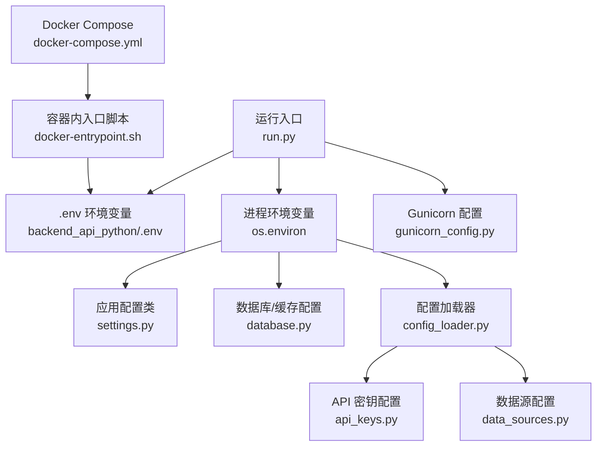
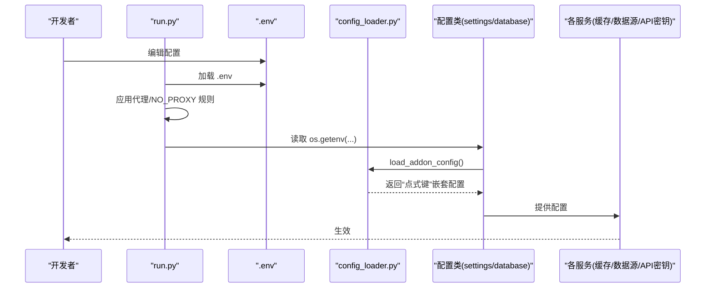
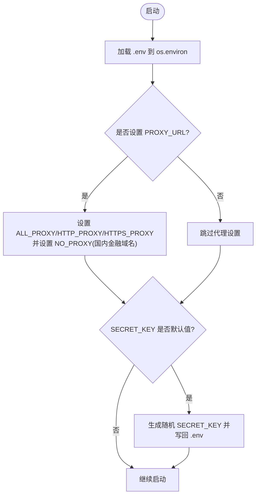
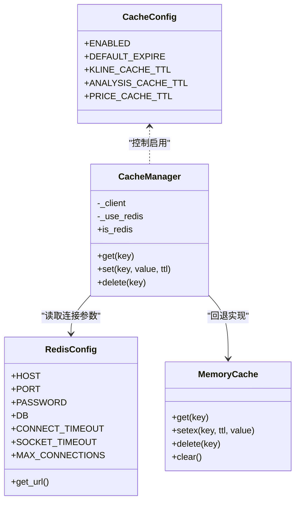
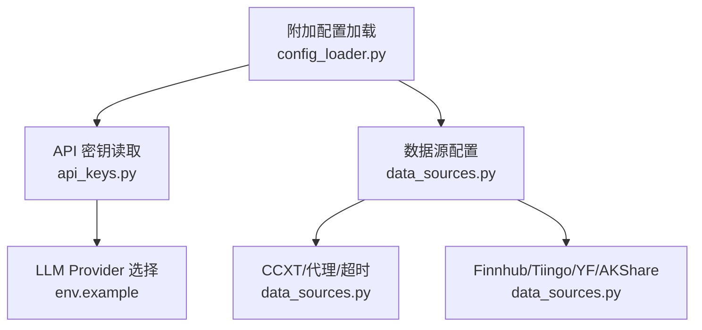
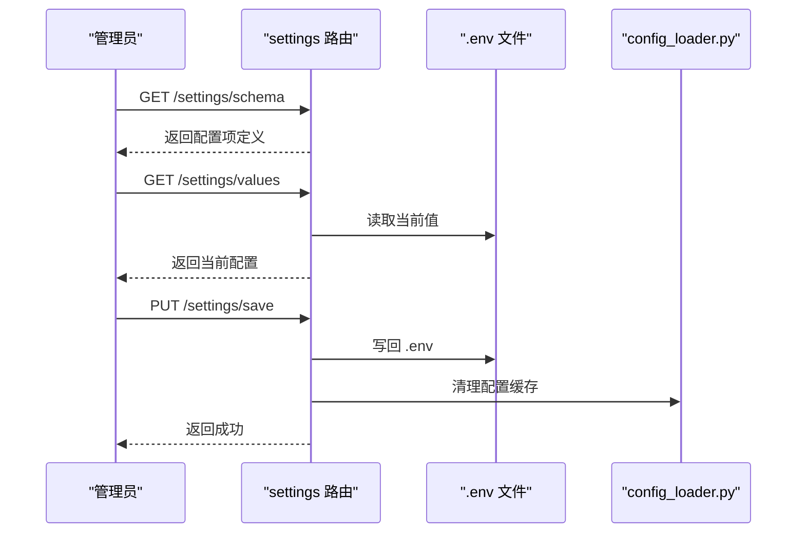
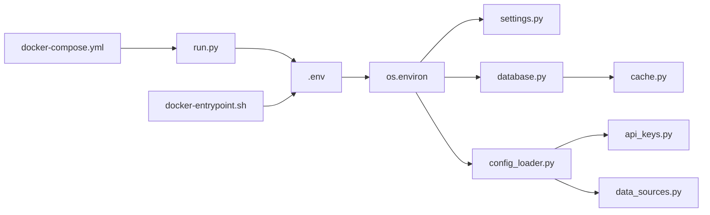

# 配置管理

<cite>
**本文引用的文件**
- [env.example](file://backend_api_python/env.example)
- [run.py](file://backend_api_python/run.py)
- [gunicorn_config.py](file://backend_api_python/gunicorn_config.py)
- [docker-entrypoint.sh](file://backend_api_python/docker-entrypoint.sh)
- [docker-compose.yml](file://docker-compose.yml)
- [settings.py](file://backend_api_python/app/config/settings.py)
- [database.py](file://backend_api_python/app/config/database.py)
- [config_loader.py](file://backend_api_python/app/utils/config_loader.py)
- [api_keys.py](file://backend_api_python/app/config/api_keys.py)
- [data_sources.py](file://backend_api_python/app/config/data_sources.py)
- [cache.py](file://backend_api_python/app/utils/cache.py)
- [settings 路由](file://backend_api_python/app/routes/settings.py)
- [安全服务](file://backend_api_python/app/services/security_service.py)
- [CLOUD_DEPLOYMENT_EN.md](file://docs/CLOUD_DEPLOYMENT_EN.md)
</cite>

## 目录
1. [简介](#简介)
2. [项目结构](#项目结构)
3. [核心组件](#核心组件)
4. [架构总览](#架构总览)
5. [详细组件分析](#详细组件分析)
6. [依赖关系分析](#依赖关系分析)
7. [性能考量](#性能考量)
8. [故障排查指南](#故障排查指南)
9. [结论](#结论)
10. [附录](#附录)

## 简介
本文件系统化梳理 QuantDinger 的配置管理体系，覆盖环境变量配置、数据库连接池与并发、缓存层（本地/Redis）、外部服务（LLM、搜索、邮件、短信、OAuth、支付等）配置，并提供配置项清单、默认值说明、最佳实践与多环境部署差异及迁移指南。目标是帮助运维与开发人员快速理解与正确配置系统。

## 项目结构
QuantDinger 的配置主要来源于以下位置：
- 后端入口加载 .env 并注入到进程环境变量
- 配置类通过 os.getenv 读取环境变量
- 额外配置（如 LLM、搜索、数据源等）通过专用配置模块读取
- 前端与后端容器通过 docker-compose 绑定端口与卷
- 守护脚本在容器启动前校验并自动补全 SECRET_KEY

**图示来源**
- [run.py:17-29](file://backend_api_python/run.py#L17-L29)
- [settings.py:10-28](file://backend_api_python/app/config/settings.py#L10-L28)
- [database.py:6-36](file://backend_api_python/app/config/database.py#L6-L36)
- [config_loader.py:24-161](file://backend_api_python/app/utils/config_loader.py#L24-L161)
- [api_keys.py:7-148](file://backend_api_python/app/config/api_keys.py#L7-L148)
- [data_sources.py:6-28](file://backend_api_python/app/config/data_sources.py#L6-L28)
- [gunicorn_config.py:10-36](file://backend_api_python/gunicorn_config.py#L10-L36)
- [docker-entrypoint.sh:11-44](file://backend_api_python/docker-entrypoint.sh#L11-L44)
- [docker-compose.yml:23-127](file://docker-compose.yml#L23-L127)

**章节来源**
- [run.py:17-29](file://backend_api_python/run.py#L17-L29)
- [docker-compose.yml:23-127](file://docker-compose.yml#L23-L127)

## 核心组件
- 应用主配置：读取服务主机、端口、调试模式、日志级别、速率限制、功能开关等
- 数据库与缓存配置：PostgreSQL 连接池参数、Redis 主机/端口/密码/DB、缓存 TTL 与启用开关
- 配置加载器：将环境变量映射为“点式键”结构，兼容旧版 PHP 风格嵌套
- API 密钥配置：统一读取各外部服务 API Key，支持环境变量与“点式键”两种形态
- 数据源配置：统一超时、重试、代理、时间框架映射等
- 缓存工具：本地内存缓存优先，可选启用 Redis；自动降级
- 运行时配置管理：后端提供设置页接口，支持读取与写回 .env，热重载部分单例服务

**章节来源**
- [settings.py:10-98](file://backend_api_python/app/config/settings.py#L10-L98)
- [database.py:6-89](file://backend_api_python/app/config/database.py#L6-L89)
- [config_loader.py:24-161](file://backend_api_python/app/utils/config_loader.py#L24-L161)
- [api_keys.py:7-148](file://backend_api_python/app/config/api_keys.py#L7-L148)
- [data_sources.py:6-171](file://backend_api_python/app/config/data_sources.py#L6-L171)
- [cache.py:49-129](file://backend_api_python/app/utils/cache.py#L49-L129)
- [settings 路由:1-200](file://backend_api_python/app/routes/settings.py#L1-L200)

## 架构总览
下图展示配置在系统中的流转：入口加载 .env → 注入进程环境 → 配置类与加载器解析 → 各服务按需读取 → 容器启动前校验关键密钥。

**图示来源**
- [run.py:17-91](file://backend_api_python/run.py#L17-L91)
- [config_loader.py:24-161](file://backend_api_python/app/utils/config_loader.py#L24-L161)
- [settings.py:10-98](file://backend_api_python/app/config/settings.py#L10-L98)
- [database.py:6-89](file://backend_api_python/app/config/database.py#L6-L89)

## 详细组件分析

### 环境变量与入口加载
- 入口脚本会优先加载 backend_api_python/.env，再回退到仓库根目录 .env，确保本地开发零配置
- 若提供 PROXY_URL，会自动设置 ALL_PROXY/HTTP_PROXY/HTTPS_PROXY，并对国内金融域名设置 NO_PROXY
- 容器入口脚本会在缺少或使用默认 SECRET_KEY 时自动生成新密钥并写回 .env

**图示来源**
- [run.py:17-91](file://backend_api_python/run.py#L17-L91)
- [docker-entrypoint.sh:25-44](file://backend_api_python/docker-entrypoint.sh#L25-L44)

**章节来源**
- [run.py:17-91](file://backend_api_python/run.py#L17-L91)
- [docker-entrypoint.sh:11-44](file://backend_api_python/docker-entrypoint.sh#L11-L44)

### 应用主配置（服务、日志、安全、功能开关）
- 服务参数：主机、端口、调试模式
- 日志：日志级别、目录、文件名、轮转大小与数量
- 安全：速率限制（可来自附加配置或环境变量）
- 功能开关：缓存开关、请求日志开关（可来自附加配置或环境变量）

默认值与来源：
- 主机/端口/调试：来自环境变量，默认值见配置类
- 日志：默认 INFO 级别，日志目录 logs，文件 app.log
- 速率限制：默认 100，可被附加配置覆盖
- 缓存/请求日志：默认关闭，可通过环境变量开启

**章节来源**
- [settings.py:10-98](file://backend_api_python/app/config/settings.py#L10-L98)

### 数据库与连接池
- 连接池参数：最小连接数、最大连接数、获取超时、健康检查
- 与 Gunicorn 工作模型配合：路由级并行执行器工作线程数应低于 DB_POOL_MAX
- PostgreSQL 命令行参数：max_connections、shared_buffers（由 docker-compose 注入）

生产建议：
- 当并发交易机器人/组合较多时，适当提高 DB_POOL_MAX，并确保 PostgreSQL max_connections 足够
- MARKET_EXECUTOR_WORKERS + PORTFOLIO_EXECUTOR_WORKERS << DB_POOL_MAX

**章节来源**
- [env.example:42-61](file://backend_api_python/env.example#L42-L61)
- [docker-compose.yml:36-44](file://docker-compose.yml#L36-L44)
- [gunicorn_config.py:17-18](file://backend_api_python/gunicorn_config.py#L17-L18)

### 缓存配置与实现
- 缓存启用：通过 CACHE_ENABLED 控制
- 默认过期：CACHE_EXPIRE（秒），K线缓存 TTL 针对不同周期有内置映射
- 实现策略：本地内存缓存优先；启用后尝试连接 Redis，失败则回退内存缓存
- Redis 参数：主机、端口、密码、DB、连接/Socket 超时、最大连接数

**图示来源**
- [database.py:49-89](file://backend_api_python/app/config/database.py#L49-L89)
- [cache.py:49-129](file://backend_api_python/app/utils/cache.py#L49-L129)

**章节来源**
- [database.py:6-89](file://backend_api_python/app/config/database.py#L6-L89)
- [cache.py:49-129](file://backend_api_python/app/utils/cache.py#L49-L129)

### 外部服务配置（LLM、搜索、数据源、OAuth、邮件/短信/支付）
- LLM 提供商选择与密钥：支持 OpenRouter、OpenAI、Google Gemini、DeepSeek、xAI Grok、OpenAI 兼容接口等
- 搜索：Google CSE、Bing、Tavily、SerpAPI
- 数据源：Finnhub、Tiingo、YFinance、CCXT（含默认交易所与超时）、AkShare
- OAuth：Google/GitHub 回调地址
- 邮件：SMTP 主机、端口、用户名、密码、发件人、TLS/SSL
- 短信：Twilio 账号、令牌、发件号码
- 支付：USDT 支付链（TRC20）、XPUB、合约、节点、确认时长、过期时间、轮询间隔

**图示来源**
- [config_loader.py:60-148](file://backend_api_python/app/utils/config_loader.py#L60-L148)
- [api_keys.py:7-148](file://backend_api_python/app/config/api_keys.py#L7-L148)
- [data_sources.py:6-171](file://backend_api_python/app/config/data_sources.py#L6-L171)
- [env.example:66-229](file://backend_api_python/env.example#L66-L229)

**章节来源**
- [config_loader.py:24-161](file://backend_api_python/app/utils/config_loader.py#L24-L161)
- [api_keys.py:7-148](file://backend_api_python/app/config/api_keys.py#L7-L148)
- [data_sources.py:6-171](file://backend_api_python/app/config/data_sources.py#L6-L171)
- [env.example:66-229](file://backend_api_python/env.example#L66-L229)

### 安全与验证码配置
- Turnstile：站点密钥/密钥，启用条件
- 登录防护：IP/账户级别的最大尝试次数、窗口与封禁时长
- 验证码：过期时间、频率限制、每IP每小时上限、最大尝试与锁定时长

这些配置直接影响前端安全提示与后端风控行为。

**章节来源**
- [安全服务:26-41](file://backend_api_python/app/services/security_service.py#L26-L41)
- [env.example:120-127](file://backend_api_python/env.example#L120-L127)
- [env.example:235-247](file://backend_api_python/env.example#L235-L247)

### 运行时配置管理（设置页）
- 后端提供设置页接口，允许管理员读取/写回 .env，支持热重载部分单例服务
- 配置项按功能分组（安全认证、AI/LLM、搜索、数据源、邮件/短信、OAuth、支付等）
- 对密码类型字段，返回“是否已配置”的标记位

**图示来源**
- [settings 路由:71-1109](file://backend_api_python/app/routes/settings.py#L71-L1109)
- [config_loader.py:244-251](file://backend_api_python/app/utils/config_loader.py#L244-L251)

**章节来源**
- [settings 路由:1-200](file://backend_api_python/app/routes/settings.py#L1-L200)
- [settings 路由:1059-1109](file://backend_api_python/app/routes/settings.py#L1059-L1109)

## 依赖关系分析
- 入口 run.py 依赖 dotenv 加载 .env，随后注入 os.environ
- 配置类 settings.py 与 database.py 直接读取 os.environ
- config_loader.py 将环境变量映射为“点式键”嵌套结构，供 api_keys.py 与 data_sources.py 使用
- cache.py 依赖 CacheConfig/RedisConfig 决定使用内存缓存还是 Redis
- docker-compose.yml 通过环境变量驱动数据库、Redis、后端、前端容器的端口与连接池参数
- docker-entrypoint.sh 在容器启动前强制安全密钥策略

**图示来源**
- [run.py:17-29](file://backend_api_python/run.py#L17-L29)
- [settings.py:10-98](file://backend_api_python/app/config/settings.py#L10-L98)
- [database.py:6-89](file://backend_api_python/app/config/database.py#L6-L89)
- [config_loader.py:24-161](file://backend_api_python/app/utils/config_loader.py#L24-L161)
- [api_keys.py:7-148](file://backend_api_python/app/config/api_keys.py#L7-L148)
- [data_sources.py:6-171](file://backend_api_python/app/config/data_sources.py#L6-L171)
- [cache.py:49-129](file://backend_api_python/app/utils/cache.py#L49-L129)
- [docker-compose.yml:23-127](file://docker-compose.yml#L23-L127)
- [docker-entrypoint.sh:11-44](file://backend_api_python/docker-entrypoint.sh#L11-L44)

**章节来源**
- [run.py:17-29](file://backend_api_python/run.py#L17-L29)
- [docker-compose.yml:23-127](file://docker-compose.yml#L23-L127)

## 性能考量
- 数据库连接池：根据并发场景调整 DB_POOL_MIN/MAX，确保 PostgreSQL max_connections 足余
- Gunicorn 线程模型：默认 gthread，线程数与 workers 组合影响吞吐；与 DB 连接池协同
- 缓存 TTL：K线/分析/价格缓存针对不同周期设定，降低外部数据源压力
- 代理与网络：PROXY_URL 与 NO_PROXY 对国内数据源直连优化，减少不必要的跨境流量
- LLM 调用：合理设置超时、重试与温度/最大 token，避免阻塞与资源浪费

[本节为通用指导，无需特定文件引用]

## 故障排查指南
- 图像拉取失败：在项目根 .env 中设置 IMAGE_PREFIX 指向镜像加速源
- 前端无法找到后端上游：检查 docker-compose 服务依赖与端口映射
- 保存设置报只读文件系统：确保挂载 backend_api_python/.env 为可写
- 代理仅在宿主生效：容器内使用 host.docker.internal:10808
- 交换所符号不存在：多为交易所市场/代币重命名导致，非网络问题
- Nginx 502/504：检查后端健康检查与容器状态

**章节来源**
- [CLOUD_DEPLOYMENT_EN.md:320-450](file://docs/CLOUD_DEPLOYMENT_EN.md#L320-L450)

## 结论
QuantDinger 的配置体系以 .env 为中心，结合专用配置类与加载器，实现了“环境变量 + 点式键配置”的双通道设计。通过 run.py/docke-entrypoint.sh 的安全前置检查、docker-compose 的容器编排与端口隔离，以及 settings 路由的在线配置能力，系统在易用性、安全性与可维护性之间取得平衡。建议在生产中严格替换默认密钥、合理规划数据库连接池与缓存 TTL，并按需启用 Redis 与代理策略。

[本节为总结，无需特定文件引用]

## 附录

### 配置项清单与默认值（摘要）
- 认证与安全
  - SECRET_KEY：默认示例值，生产必须替换
  - ADMIN_USER/ADMIN_PASSWORD/ADMIN_EMAIL：默认值，生产必须替换
  - RATE_LIMIT：默认 100，可被附加配置覆盖
  - TURNSTILE_*：可选验证码
  - OAuth：GOOGLE/GITHUB 客户端与回调地址
  - 安全防护：SECURITY_IP_* 与 SECURITY_ACCOUNT_* 系列

- 应用与日志
  - PYTHON_API_HOST/PORT/DEBUG：默认 0.0.0.0/5000/False
  - LOG_LEVEL/DIR/FILE/轮转：默认 INFO/logs/app.log 等
  - ENABLE_CACHE/ENABLE_REQUEST_LOG：默认 False/True

- 数据库与缓存
  - DATABASE_URL：默认 PostgreSQL 连接串
  - DB_POOL_*：默认 MIN=5, MAX=50, ACQUIRE_TIMEOUT=10, HEALTH_CHECK=true
  - GUNICORN_WORKERS/THREADS：默认 1/4（可调）
  - CACHE_ENABLED：默认 false；Redis_* 参数与 TTL 映射

- 外部服务
  - LLM_PROVIDER 与对应 API_KEY/Model/Base URL
  - DATA_SOURCE_*：超时、重试、回退系数
  - Finnhub/Tiingo/YFinance/AkShare：API Key 与超时
  - CCXT：默认交易所、超时、代理
  - 邮件：SMTP_HOST/PORT/USER/PASSWORD/FROM/SSL/TLS
  - 短信：Twilio 账号、令牌、发件号码
  - 支付：USDT 支付链、XPUB/合约、节点、确认/过期/轮询

- 移动端与注册
  - MOBILE_APP_*：版本与下载地址
  - ENABLE_REGISTRATION：默认 true

- AI/分析与反射
  - OPENROUTER_*、AI_CODE_GEN_MODEL、AI_ENSEMBLE_*、REFLECTION_* 等

**章节来源**
- [env.example:9-268](file://backend_api_python/env.example#L9-L268)
- [settings.py:10-98](file://backend_api_python/app/config/settings.py#L10-L98)
- [database.py:6-89](file://backend_api_python/app/config/database.py#L6-L89)
- [data_sources.py:6-171](file://backend_api_python/app/config/data_sources.py#L6-L171)
- [api_keys.py:7-148](file://backend_api_python/app/config/api_keys.py#L7-L148)

### 配置文件模板与最佳实践
- 模板位置：backend_api_python/env.example
- 最佳实践
  - 生产必须替换 SECRET_KEY、ADMIN_*、邮箱/短信/支付等敏感项
  - 根据并发与数据库负载调整 DB_POOL_* 与 GUNICORN_WORKERS/THREADS
  - 开启 Redis 并设置 CACHE_ENABLED，结合 K线/分析/价格 TTL 优化性能
  - 使用 PROXY_URL 时，确保 NO_PROXY 正确绕过国内金融域名
  - 通过设置页在线修改配置后，必要时触发服务热重载

**章节来源**
- [env.example:1-268](file://backend_api_python/env.example#L1-L268)
- [settings 路由:36-70](file://backend_api_python/app/routes/settings.py#L36-L70)

### 不同部署环境的配置差异与迁移指南
- 单域部署（推荐）
  - 前端与后端在同一域名下，仅暴露 80/443，数据库与后端仅本地绑定
- 分离部署
  - 前端域名与 API 域名分离，需正确处理跨域与回调地址
- 容器化
  - 通过 docker-compose 管理端口与镜像源，根 .env 控制镜像前缀与端口
  - 容器启动前自动校验并生成 SECRET_KEY，避免默认密钥残留

**章节来源**
- [CLOUD_DEPLOYMENT_EN.md:1-451](file://docs/CLOUD_DEPLOYMENT_EN.md#L1-L451)
- [docker-compose.yml:23-127](file://docker-compose.yml#L23-L127)
- [docker-entrypoint.sh:11-44](file://backend_api_python/docker-entrypoint.sh#L11-L44)