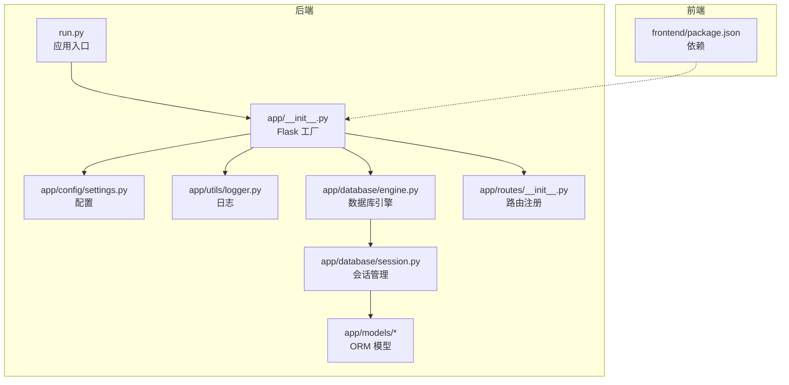
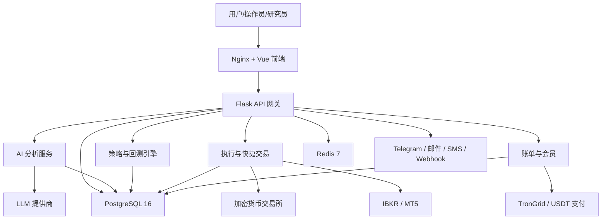
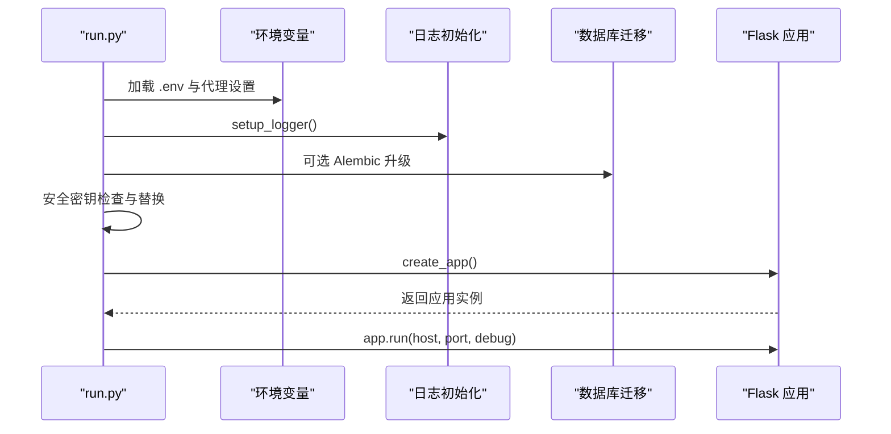
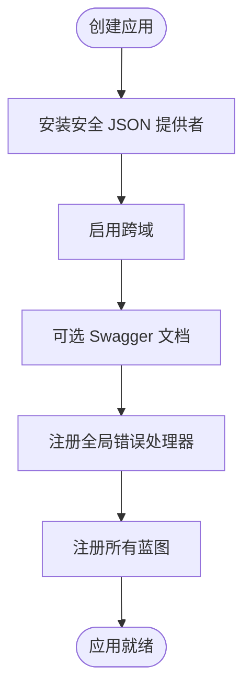
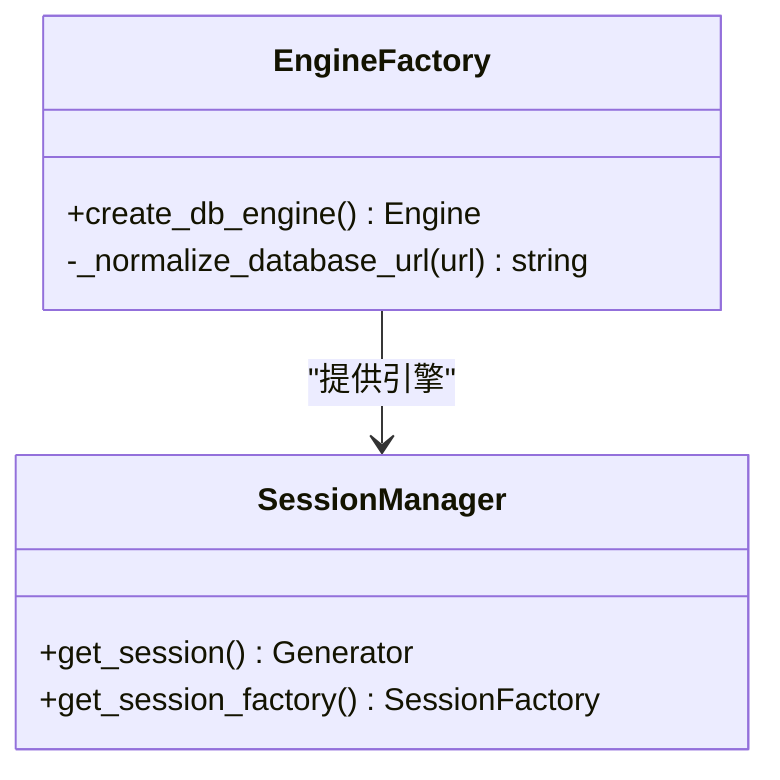
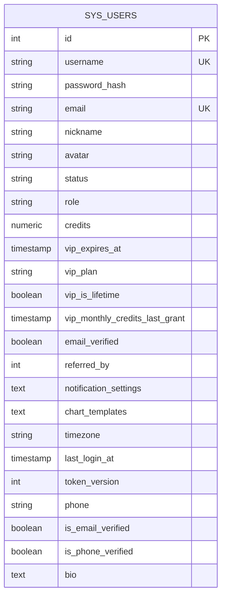
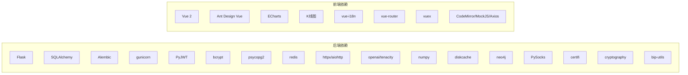

# 中文文档包

<cite>
**本文档引用的文件**
- [README.md](file://README.md)
- [run.py](file://backend/run.py)
- [app/__init__.py](file://backend/app/__init__.py)
- [settings.py](file://backend/app/config/settings.py)
- [logger.py](file://backend/app/utils/logger.py)
- [routes/__init__.py](file://backend/app/routes/__init__.py)
- [engine.py](file://backend/app/database/engine.py)
- [session.py](file://backend/app/database/session.py)
- [base.py](file://backend/app/models/base.py)
- [user.py](file://backend/app/models/user.py)
- [package.json](file://frontend/package.json)
</cite>

## 目录
1. [简介](#简介)
2. [项目结构](#项目结构)
3. [核心组件](#核心组件)
4. [架构总览](#架构总览)
5. [详细组件分析](#详细组件分析)
6. [依赖关系分析](#依赖关系分析)
7. [性能考虑](#性能考虑)
8. [故障排查指南](#故障排查指南)
9. [结论](#结论)
10. [附录](#附录)

## 简介
QuantDinger 是一个自托管、本地优先的量化交易与算法交易平台，集成了 AI 市场研究、Python 指标与策略开发、回测、实盘执行、组合监控与告警、多用户运营与商业化能力。项目采用前后端分离架构：前端为预构建的 Vue 应用，后端基于 Flask 提供 REST API，并通过 PostgreSQL 和 Redis 进行状态存储与缓存协调。

该文档面向不同技术背景的读者，提供从整体架构到关键组件的深入解析，帮助快速理解与部署系统。

章节来源
- [README.md:1-715](file://README.md#L1-L715)

## 项目结构
项目采用分层与按功能域组织的结构：
- 后端 backend/
  - app/：Flask 应用工厂、配置、模型、数据访问、服务与路由
  - migrations/：数据库迁移脚本
  - scripts/：运行辅助脚本
  - requirements.txt：Python 依赖
  - run.py：应用入口与启动流程
- 前端 frontend/
  - 预构建产物与 Nginx 配置
  - package.json：前端依赖
- 文档 docs/：产品与部署说明、策略开发指南等
- docker-compose.yml：容器化编排

图表来源
- [run.py:1-151](file://backend/run.py#L1-L151)
- [app/__init__.py:1-132](file://backend/app/__init__.py#L1-L132)
- [settings.py:1-99](file://backend/app/config/settings.py#L1-L99)
- [logger.py:1-71](file://backend/app/utils/logger.py#L1-L71)
- [engine.py:1-52](file://backend/app/database/engine.py#L1-L52)
- [session.py:1-26](file://backend/app/database/session.py#L1-L26)
- [routes/__init__.py:1-68](file://backend/app/routes/__init__.py#L1-L68)
- [package.json:1-85](file://frontend/package.json#L1-L85)

章节来源
- [README.md:527-545](file://README.md#L527-L545)
- [run.py:93-151](file://backend/run.py#L93-L151)
- [app/__init__.py:110-132](file://backend/app/__init__.py#L110-L132)
- [routes/__init__.py:5-68](file://backend/app/routes/__init__.py#L5-L68)
- [engine.py:19-52](file://backend/app/database/engine.py#L19-L52)
- [session.py:8-26](file://backend/app/database/session.py#L8-L26)
- [logger.py:9-71](file://backend/app/utils/logger.py#L9-L71)
- [package.json:1-85](file://frontend/package.json#L1-L85)

## 核心组件
- 应用入口与启动
  - run.py 负责加载 .env、设置代理、初始化日志、创建 Flask 应用实例并在启动时可选执行数据库迁移。
- Flask 应用工厂
  - app/__init__.py 提供 create_app，配置 JSON 安全序列化、CORS、全局错误处理，并注册全部蓝图。
- 配置系统
  - settings.py 通过元类封装环境变量，集中管理主机、端口、调试模式、认证密钥、日志、安全与功能开关。
- 数据库与会话
  - engine.py 创建带连接池的 SQLAlchemy 引擎；session.py 提供上下文管理的会话，自动提交/回滚/关闭。
- 日志系统
  - logger.py 统一日志配置，支持文件轮转、控制台输出与特定模块的级别调整。
- 路由注册
  - routes/__init__.py 将健康检查、认证、指标、回测、市场、AI、策略、凭证、仪表盘、设置、组合、IBKR、MT5、全局市场、社区、快查分析、账单、快捷交易、预测市场、实验、LLM、图分析、Dify 工作流、数据源、权限等蓝图统一注册。
- 前端依赖
  - frontend/package.json 列出前端运行所需依赖，包括图表库、国际化、路由与状态管理等。

章节来源
- [run.py:17-151](file://backend/run.py#L17-L151)
- [app/__init__.py:19-132](file://backend/app/__init__.py#L19-L132)
- [settings.py:6-99](file://backend/app/config/settings.py#L6-L99)
- [engine.py:13-52](file://backend/app/database/engine.py#L13-L52)
- [session.py:8-26](file://backend/app/database/session.py#L8-L26)
- [logger.py:9-71](file://backend/app/utils/logger.py#L9-L71)
- [routes/__init__.py:5-68](file://backend/app/routes/__init__.py#L5-L68)
- [package.json:15-83](file://frontend/package.json#L15-L83)

## 架构总览
系统采用“前端静态交付 + 后端 API + 数据库/缓存”的三层架构。后端通过 Flask 提供 REST 接口，集成 AI 分析、策略回测、执行适配器、账单与会员、通知通道等服务。

图表来源
- [README.md:297-351](file://README.md#L297-L351)
- [run.py:100-151](file://backend/run.py#L100-L151)
- [app/__init__.py:110-132](file://backend/app/__init__.py#L110-L132)

章节来源
- [README.md:275-351](file://README.md#L275-L351)

## 详细组件分析

### 应用入口与启动流程
- 环境加载与代理设置
  - 优先加载 backend/.env，其次回退到仓库根目录 .env；设置 TQDM_DISABLE 与代理相关环境变量，确保国内金融数据直连。
- 日志初始化
  - 在 create_app 之前调用 setup_logger，保证全局日志可用。
- 数据库迁移
  - 可选自动执行 Alembic 升级至最新版本。
- 安全密钥检查
  - 生产模式下若 SECRET_KEY 为默认值则随机生成并提示持久化配置。
- 启动服务
  - 使用 Config.HOST/PORT 启动 Flask 应用。

图表来源
- [run.py:17-151](file://backend/run.py#L17-L151)

章节来源
- [run.py:17-151](file://backend/run.py#L17-L151)

### Flask 应用工厂与路由注册
- JSON 安全序列化
  - 自定义 SafeJSONProvider 将 NaN/Infinity 转换为 null，确保前端解析稳定。
- 全局错误处理
  - 未处理异常统一记录日志并返回标准错误响应。
- 蓝图注册
  - routes/__init__.py 将各领域蓝图按前缀注册，形成清晰的 API 命名空间。

图表来源
- [app/__init__.py:19-132](file://backend/app/__init__.py#L19-L132)
- [routes/__init__.py:5-68](file://backend/app/routes/__init__.py#L5-L68)

章节来源
- [app/__init__.py:19-132](file://backend/app/__init__.py#L19-L132)
- [routes/__init__.py:5-68](file://backend/app/routes/__init__.py#L5-L68)

### 配置系统
- 主机与端口、调试模式、应用名称与版本
- 认证：SECRET_KEY、管理员账户与密码
- 日志：级别、目录、文件名、大小与备份数
- 安全：限流与附加配置加载
- 功能开关：缓存与请求日志

章节来源
- [settings.py:6-99](file://backend/app/config/settings.py#L6-L99)

### 数据库与会话管理
- 引擎创建
  - 规范化数据库 URL，配置连接池大小、超时、pre_ping 与连接选项。
- 会话管理
  - 上下文管理器确保事务提交/回滚与会话关闭，未设置 DATABASE_URL 时抛出运行时错误。

图表来源
- [engine.py:13-52](file://backend/app/database/engine.py#L13-L52)
- [session.py:8-26](file://backend/app/database/session.py#L8-L26)

章节来源
- [engine.py:13-52](file://backend/app/database/engine.py#L13-L52)
- [session.py:8-26](file://backend/app/database/session.py#L8-L26)

### 日志系统
- 统一格式化与级别控制
- 文件轮转与控制台输出
- 特定模块（如 USDT 支付、账单）强制保留 INFO 级别以保障可观测性

章节来源
- [logger.py:9-71](file://backend/app/utils/logger.py#L9-L71)

### 用户模型与关系
- 用户表字段覆盖身份、角色、积分、VIP、通知偏好、时区、登录时间等
- 与多类实体建立一对多/多对多关系，支撑策略、订单、组合、提醒、凭证、权限等业务

图表来源
- [user.py:28-77](file://backend/app/models/user.py#L28-L77)

章节来源
- [user.py:28-77](file://backend/app/models/user.py#L28-L77)
- [base.py:8-19](file://backend/app/models/base.py#L8-L19)

### 前端依赖与技术栈
- 图表与可视化：ECharts、K线图、轻量图表
- UI 框架：Ant Design Vue
- 国际化：vue-i18n
- 路由与状态：vue-router、vuex
- 编辑器与工具：CodeMirror、MockJS、Axios、Moment 等

章节来源
- [package.json:15-83](file://frontend/package.json#L15-L83)

## 依赖关系分析
- 后端依赖
  - Flask、SQLAlchemy、Alembic、gunicorn、PyJWT、bcrypt、psycopg2、redis、httpx/aiohttp、openai、tenacity、numpy、diskcache、neo4j、PySocks、certifi、PyJWT、cryptography、bip-utils 等
- 前端依赖
  - Vue 2、Ant Design Vue、ECharts、K线图、国际化、路由、状态管理、编辑器与工具库

图表来源
- [requirements.txt:1-53](file://backend/requirements.txt#L1-L53)
- [package.json:15-83](file://frontend/package.json#L15-L83)

章节来源
- [requirements.txt:1-53](file://backend/requirements.txt#L1-L53)
- [package.json:15-83](file://frontend/package.json#L15-L83)

## 性能考虑
- 数据库连接池
  - 通过池大小与超时参数平衡并发与资源占用，启用 pre_ping 与 keepalives 保障连接稳定性。
- 日志级别与输出
  - 合理设置 LOG_LEVEL 与过滤器，避免高频路由噪声影响性能。
- 代理与网络
  - 通过 NO_PROXY 避免国内金融数据经由海外代理，降低延迟与失败率。
- 前端构建与缓存
  - 使用预构建产物与 Nginx 缓存提升静态资源加载效率。

章节来源
- [engine.py:24-43](file://backend/app/database/engine.py#L24-L43)
- [logger.py:44-56](file://backend/app/utils/logger.py#L44-L56)
- [run.py:60-91](file://backend/run.py#L60-L91)

## 故障排查指南
- 启动失败
  - 检查 SECRET_KEY 是否为默认值（生产需修改），确认 DATABASE_URL 设置正确，查看日志目录权限。
- 数据库问题
  - 确认连接池参数合理，检查连接超时与 pre_ping 设置；必要时开启更详细日志定位慢查询。
- 路由访问异常
  - 核对蓝图注册前缀是否匹配，检查全局错误处理器是否拦截了预期异常。
- 日志定位
  - 使用日志级别与过滤规则缩小范围，关注特定模块（如账单、USDT 支付）的 INFO 输出。

章节来源
- [run.py:126-137](file://backend/run.py#L126-L137)
- [engine.py:19-43](file://backend/app/database/engine.py#L19-L43)
- [app/__init__.py:117-127](file://backend/app/__init__.py#L117-L127)
- [logger.py:44-56](file://backend/app/utils/logger.py#L44-L56)

## 结论
QuantDinger 通过清晰的分层设计与模块化组件，提供了从 AI 研究到实盘执行的完整闭环。后端以 Flask + SQLAlchemy 为核心，结合灵活的配置与日志体系，满足多用户、多市场的复杂场景；前端采用成熟的 Vue 技术栈，配合丰富的图表与编辑器组件，提供专业的工作界面。建议在生产环境中严格配置密钥与数据库参数，合理设置日志与缓存策略，并根据业务规模调整连接池与工作进程数量。

## 附录
- 快速开始与常见命令
  - 参考项目根 README 的“快速开始”与“常用 Docker 命令”章节，完成本地部署与健康检查。
- 环境变量参考
  - 参考 README 的“配置区域”，涵盖认证、数据库、LLM、OAuth、安全、账单、会员、USDT 支付、可选数据 API、本地 LLM、代理与工作进程等。

章节来源
- [README.md:353-410](file://README.md#L353-L410)
- [README.md:547-566](file://README.md#L547-L566)