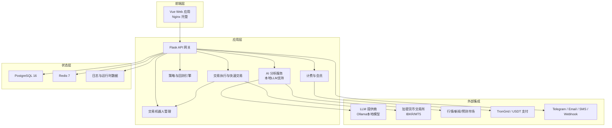
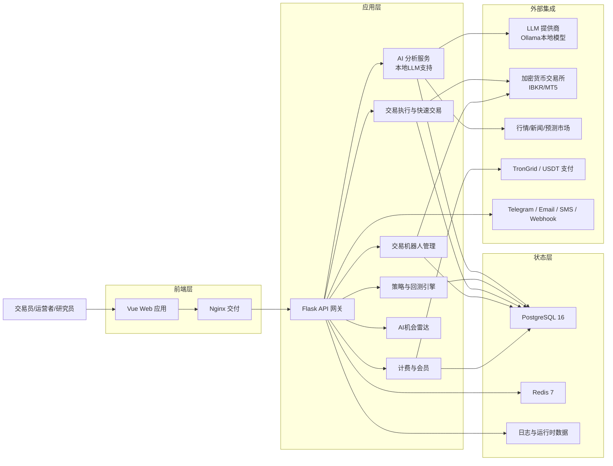
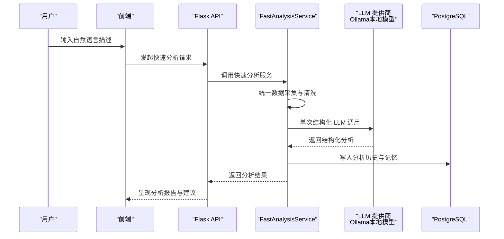
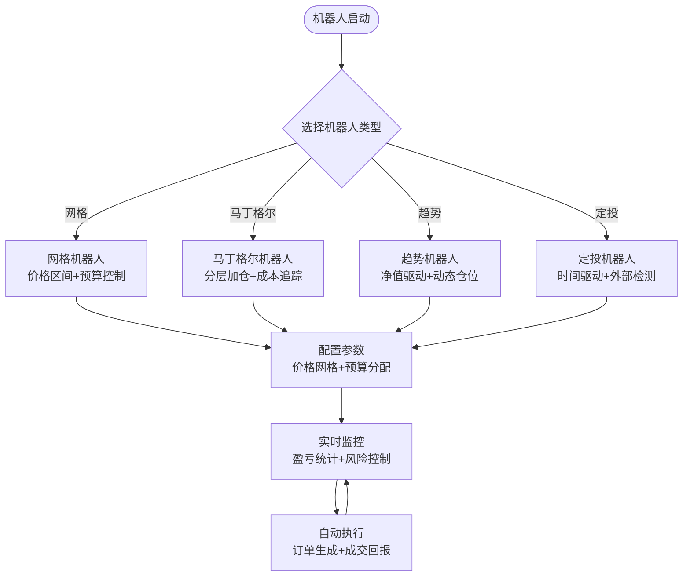
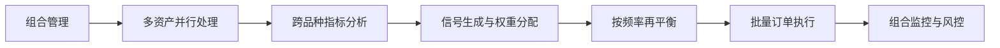
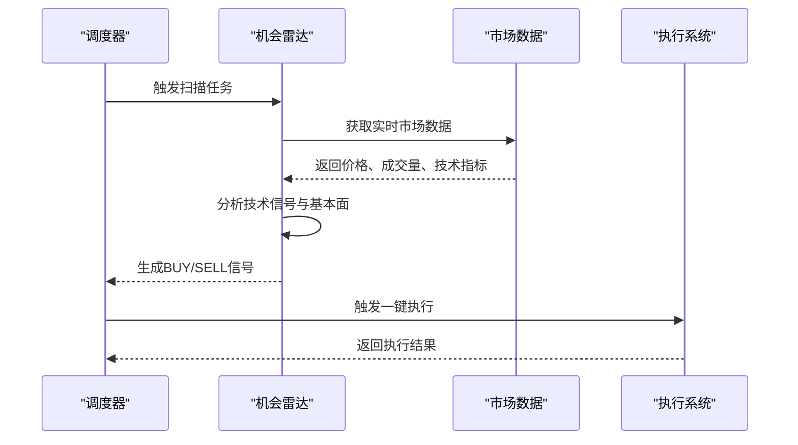
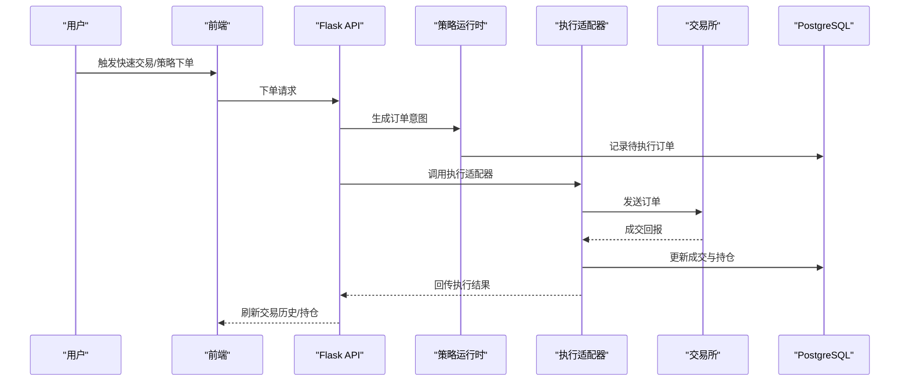
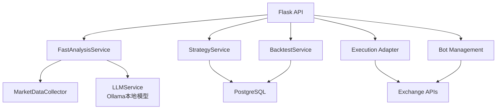

# 产品介绍

<cite>
**本文引用的文件**
- [README.md](file://README.md)
- [frontend/README.md](file://frontend/README.md)
- [docs/README_CN.md](file://docs/README_CN.md)
- [backend/app/services/fast_analysis.py](file://backend/app/services/fast_analysis.py)
- [backend/app/services/backtest.py](file://backend/app/services/backtest.py)
- [backend/app/services/strategy.py](file://backend/app/services/strategy.py)
- [backend/app/services/live_trading/base.py](file://backend/app/services/live_trading/base.py)
- [backend/app/services/live_trading/factory.py](file://backend/app/services/live_trading/factory.py)
- [backend/app/models/trading.py](file://backend/app/models/trading.py)
</cite>

## 更新摘要
**变更内容**
- 新增交易机器人功能模块，包括网格、马丁格尔、趋势和定投机器人
- 新增横截面策略支持，实现多资产组合管理
- 新增AI交易机会雷达功能，提供自动化市场扫描
- 新增Ollama本地LLM支持，实现完全私有的AI分析
- 扩展AI分析能力，包括预测市场研究和多模态协同
- 增强快速交易功能，支持一键执行和实时监控

## 目录
1. [引言](#引言)
2. [项目结构](#项目结构)
3. [核心组件](#核心组件)
4. [架构总览](#架构总览)
5. [详细组件分析](#详细组件分析)
6. [依赖关系分析](#依赖关系分析)
7. [性能考量](#性能考量)
8. [故障排查指南](#故障排查指南)
9. [结论](#结论)
10. [附录](#附录)

## 引言
QuantDinger 是一款"可自托管、以本地优先为设计原则"的量化交易与算法交易平台，现已发展为复杂的AI驱动量化交易生态系统。平台不仅提供AI市场分析、Python策略开发、回测验证与实盘执行的完整工作流，还新增了交易机器人自动化、横截面策略组合管理、AI交易机会雷达等高级功能。

QuantDinger 的核心价值主张：
- 一套系统替代多个零散工具：研究、策略、回测、执行、运营一体化
- AI 置于工作流内部，而非旁观者：快速分析、策略生成、回测反馈、校准与反思
- Python 原生与产品化体验兼顾：既保留灵活性，也提供可用性
- 私有化部署与增长能力并存：基础设施、凭证与数据由你掌控，同时具备商业化与运营能力
- **全新功能**：交易机器人自动化、横截面策略、AI机会雷达、本地LLM支持

## 项目结构
QuantDinger 采用前后端分离的可自托管架构，现已扩展为完整的AI量化生态系统：
- 前端：预构建的 Vue 应用，由 Nginx 提供静态资源服务
- 后端：Flask API + Python 服务层，承载策略引擎、AI 分析、回测、执行适配与机器人管理
- 数据层：PostgreSQL 存储用户、策略、历史与状态；Redis 提供缓存与后台工作进程支撑
- 外部集成：交易所、经纪商、AI、支付与通知通道通过适配器接入

**图表来源**
- [README.md:299-351](file://README.md#L299-L351)
- [frontend/README.md:35-87](file://frontend/README.md#L35-L87)

**章节来源**
- [README.md:267-351](file://README.md#L267-L351)
- [frontend/README.md:35-87](file://frontend/README.md#L35-L87)

## 核心组件
- **AI 快速分析与记忆**：统一数据采集器、单次 LLM 调用、分析历史与记忆存储，支持Ollama本地模型
- **策略开发与回测**：支持 IndicatorStrategy 与 ScriptStrategy，回测结果持久化与复现实验
- **实盘执行**：统一执行层对接多家加密货币交易所与 IBKR/MT5，支持快速交易与待执行订单工作进程
- **交易机器人**：网格、马丁格尔、趋势、定投机器人，支持实时监控与风险管理
- **横截面策略**：多资产组合管理，支持并行执行与风险控制
- **AI交易机会雷达**：每小时自动扫描市场，提供BUY/SELL信号与一键执行
- **多用户与商业化**：基于 PostgreSQL 的多用户体系、OAuth、通知渠道、会员与计费

**章节来源**
- [README.md:120-192](file://README.md#L120-L192)
- [docs/README_CN.md:135-207](file://docs/README_CN.md#L135-L207)

## 架构总览
下图展示了从用户到策略实盘执行的端到端路径，涵盖数据采集、AI 分析、策略回测、机器人执行与机会雷达：

**图表来源**
- [README.md:299-351](file://README.md#L299-L351)

## 详细组件分析

### AI 快速分析与策略生成
- **快速分析**：统一数据采集器、单次 LLM 调用、结构化输出、趋势展望与地缘政治影响识别
- **分析记忆**：历史分析存储、相似模式检索、用户反馈闭环
- **策略生成**：自然语言到 Python 指标与策略代码的生成骨架
- **本地LLM支持**：通过Ollama运行完全私有的本地模型
- **预测市场分析**：集成Polymarket数据，提供分歧分析与机会评分

**图表来源**
- [backend/app/services/fast_analysis.py:186-200](file://backend/app/services/fast_analysis.py#L186-L200)

**章节来源**
- [README.md:120-243](file://README.md#L120-L243)
- [docs/README_CN.md:135-258](file://docs/README_CN.md#L135-L258)

### 交易机器人与自动化
- **网格机器人**：可配置价格区间、等差/等比网格，支持多头/空头双路预算控制
- **马丁格尔机器人**：分层加仓、自动成本均摊，强制市价单执行避免漏触发
- **趋势机器人**：基于实时账户净值动态调整仓位，自动刷新余额与权益
- **定投机器人**：按真实时间间隔定期买入，与K线周期解耦，支持外部平仓检测
- **实时监控**：机器人列表与详情页展示已实现盈亏、未实现盈亏和总权益

**图表来源**
- [README.md:163-185](file://README.md#L163-L185)

**章节来源**
- [README.md:163-185](file://README.md#L163-L185)
- [docs/README_CN.md:179-185](file://docs/README_CN.md#L179-L185)

### 横截面策略与组合管理
- **多资产组合**：同时处理多个标的的持仓，支持组合规模、多空比例配置
- **并行执行**：跨品种并行执行，提高组合运营效率
- **再平衡机制**：支持每日/每周/每月再平衡频率
- **指标调用**：接收data字典（品种→DataFrame）进行跨品种分析
- **风险控制**：支持组合层面的风险管理和收益归因

**图表来源**
- [README.md:179-185](file://README.md#L179-L185)

**章节来源**
- [README.md:179-185](file://README.md#L179-L185)
- [docs/README_CN.md:194-200](file://docs/README_CN.md#L194-L200)

### AI交易机会雷达
- **自动扫描**：每小时自动扫描加密货币、美股和外汇市场
- **信号展示**：滚动轮播展示BUY/SELL信号、涨跌幅和推理说明
- **一键执行**：与闪电交易联动，雷达卡片一键下单
- **国际化支持**：内容完全国际化，支持多语言界面

**图表来源**
- [README.md:212-233](file://README.md#L212-L233)

**章节来源**
- [README.md:212-233](file://README.md#L212-L233)
- [docs/README_CN.md:227-233](file://docs/README_CN.md#L227-L233)

### 实盘执行与快速交易
- **统一执行层**：对接多家加密货币交易所与 IBKR/MT5
- **快速交易**：从分析到下单的一站式流程
- **待执行订单工作进程**：轮询队列并派发信号与通知
- **交换机适配**：针对特定交易所的直连 REST 接口与市场类型映射

**图表来源**
- [backend/app/services/strategy.py:25-45](file://backend/app/services/strategy.py#L25-L45)

**章节来源**
- [README.md:141-178](file://README.md#L141-L178)
- [docs/README_CN.md:156-193](file://docs/README_CN.md#L156-L193)

## 依赖关系分析
- **组件耦合与内聚**
  - AI 分析服务与数据采集器高度内聚，通过统一接口与 LLM 提供商交互
  - 策略引擎与回测服务共享数据访问与存储接口，保证一致性
  - 执行层通过适配器解耦具体交易所，便于扩展与替换
  - 机器人管理模块独立于核心交易系统，提供可插拔的自动化能力
- **外部依赖**
  - LLM 提供商、市场数据与新闻、交易所 REST/WS、支付网关与通知通道
  - **新增**：Ollama本地模型支持，提供完全私有的AI分析能力
- **配置与环境**
  - 通过 .env 驱动的配置项覆盖认证、数据库、AI、OAuth、计费、代理、工作进程与 AI 调优

**图表来源**
- [backend/app/services/fast_analysis.py:196-200](file://backend/app/services/fast_analysis.py#L196-L200)
- [backend/app/services/backtest.py:85-102](file://backend/app/services/backtest.py#L85-L102)
- [backend/app/services/strategy.py:20-22](file://backend/app/services/strategy.py#L20-L22)

**章节来源**
- [README.md:547-566](file://README.md#L547-L566)
- [docs/README_CN.md:562-580](file://docs/README_CN.md#L562-L580)

## 性能考量
- **回测性能与缓存**
  - K 线缓存与 TTL 控制，减少重复外部 API 调用
  - 多时间框架回测阈值配置，平衡精度与性能
- **执行与并发**
  - 待执行订单工作进程可选开启，避免阻塞主流程
  - 本地部署下，连接测试并发受信号量限制，避免资源争用
  - **新增**：机器人执行采用异步队列处理，支持高并发订单管理
- **AI分析优化**
  - **新增**：Ollama本地模型支持，减少网络延迟和隐私风险
  - **新增**：机会雷达采用增量扫描机制，避免重复计算
- **前后端分离与反向代理**
  - 生产环境推荐通过 Nginx 反向代理，仅暴露 80/443，提升安全性与稳定性

**章节来源**
- [backend/app/services/backtest.py:25-61](file://backend/app/services/backtest.py#L25-L61)
- [backend/app/services/strategy.py:17-18](file://backend/app/services/strategy.py#L17-L18)
- [docs/README_CN.md:399-415](file://docs/README_CN.md#L399-L415)

## 故障排查指南
- **数据库连接失败**
  - 检查 DATABASE_URL 格式与 PostgreSQL 服务状态
- **出站请求失败**
  - 通过 PROXY_URL 配置代理
- **禁用自动恢复与工作进程**
  - 设置 DISABLE_RESTORE_RUNNING_STRATEGIES 或关闭 ENABLE_PENDING_ORDER_WORKER
- **AI分析异常**
  - **新增**：检查Ollama服务状态，确认本地模型加载成功
  - 验证LLM提供商API密钥配置
- **机器人执行问题**
  - **新增**：检查机器人配置参数，验证交易所连接状态
  - 查看机器人执行日志，确认订单发送与成交回报
- **机会雷达不工作**
  - **新增**：验证调度器配置，检查市场数据源连接
- **健康检查与日志**
  - 后端健康检查端点与容器日志定位问题

**章节来源**
- [README.md:354-369](file://README.md#L354-L369)
- [docs/README_CN.md:615-636](file://docs/README_CN.md#L615-L636)

## 结论
QuantDinger 通过"可自托管 + AI 原生 + Python 原生 + 商业化就绪 + 机器人自动化"的组合，已成为完整的AI驱动量化交易生态系统。平台不仅缩短了从想法到实盘的距离，还通过交易机器人、横截面策略、AI机会雷达等新功能，为用户提供从研究、策略、回测到自动化执行的全链路解决方案。其完全私有的AI分析能力和丰富的自动化工具，使其在量化交易领域具有显著的竞争优势。

## 附录

### 功能对比：QuantDinger vs 传统拼装式方案
- **传统拼装式方案**
  - AI 聊天工具与真实策略流程割裂
  - 图表、脚本、机器人、通知系统各自分散
  - SaaS 工具对密钥与 alpha 控制有限
  - 只有研究工具，缺乏运营层
- **QuantDinger v3.0**
  - AI 分析、AI 生成代码、回测反馈、执行流程在同一产品闭环
  - 一套可部署平台统一承载图表、策略、运行时、通知与运营
  - 可自托管架构，基础设施、密钥与业务数据由你掌控
  - 内置多用户、权限、计费、后台管理与部署能力
  - **新增**：交易机器人自动化、横截面策略、AI机会雷达、本地LLM支持

**章节来源**
- [README.md:80-88](file://README.md#L80-L88)
- [docs/README_CN.md:80-88](file://docs/README_CN.md#L80-L88)

### 产品愿景与使命
- **愿景**：成为"你的私有化 AI 量化操作系统"，让研究、策略、回测与实盘执行在一套系统内高效流转，提供从AI分析到机器人自动化的完整量化解决方案
- **使命**：以可自托管与 AI 原生为核心，降低量化门槛，提升研发效率，保障数据与资产主权，支持商业化与运营增长，提供企业级的量化交易基础设施

**章节来源**
- [README.md:34-79](file://README.md#L34-L79)
- [docs/README_CN.md:34-79](file://docs/README_CN.md#L34-L79)

### 商业价值说明
- **降低运营成本**：自托管减少订阅费用与数据外泄风险
- **提升研发效率**：AI 辅助策略生成与回测反馈，缩短迭代周期
- **增强合规与安全**：本地化部署与细粒度权限控制，支持Ollama本地LLM实现完全私有化
- **支持商业化**：会员、积分、USDT 支付与后台管理能力
- **自动化增效**：交易机器人减少人工干预，提高执行效率与一致性
- **组合管理**：横截面策略支持多资产组合，提升风险管理能力

**章节来源**
- [README.md:63-79](file://README.md#L63-L79)
- [docs/README_CN.md:63-79](file://docs/README_CN.md#L63-L79)

### 快速开始与部署
- **Docker 一键部署**：克隆仓库、复制环境模板、生成密钥、启动容器
- **生产部署**：Nginx 反向代理、HTTPS、域名与端口配置
- **前后端分离**：前端静态资源由 Nginx 提供，后端 API 仅对内暴露
- **新增**：本地LLM部署配置，支持Ollama模型本地运行

**章节来源**
- [README.md:354-410](file://README.md#L354-L410)
- [docs/README_CN.md:368-425](file://docs/README_CN.md#L368-L425)

### 新功能特性详解

#### 交易机器人系统
QuantDinger的交易机器人系统提供了四种核心类型的自动化交易策略：

**网格机器人**
- 可配置价格区间，支持等差和等比网格
- 双向预算控制，分别管理多头和空头预算
- 自动化订单生成与跟踪，支持手动干预

**马丁格尔机器人**
- 分层加仓策略，自动追踪成本基线
- 强制市价单执行，避免滑点影响
- 风险控制机制，防止无限加仓

**趋势机器人**
- 基于实时账户净值动态调整仓位
- 自动刷新余额与权益，适应市场波动
- 支持方向性交易策略

**定投机器人**
- 时间驱动的定期投资策略
- 与K线频率解耦，按真实时间间隔执行
- 支持外部平仓检测与自动重置

#### 横截面策略
横截面策略允许用户构建多资产组合，实现更复杂的投资策略：

- **多资产并行**：同时处理多个标的的持仓
- **组合配置**：可配置组合规模、多空比例和再平衡频率
- **跨品种分析**：指标接收data字典进行跨品种分析
- **风险控制**：组合层面的风险管理和收益归因

#### AI交易机会雷达
AI机会雷达提供智能化的市场扫描和信号生成：

- **自动扫描**：每小时扫描主流市场，识别交易机会
- **信号质量**：提供BUY/SELL信号、涨跌幅预测和推理说明
- **一键执行**：与闪电交易联动，支持快速下单
- **多市场覆盖**：支持加密货币、美股、外汇市场的统一扫描

#### 本地LLM支持
通过Ollama集成，QuantDinger提供完全私有的AI分析能力：

- **本地部署**：所有AI分析在本地完成，无需网络传输
- **隐私保护**：敏感数据不出本地网络，满足合规要求
- **离线可用**：无需互联网连接即可进行AI分析
- **模型管理**：支持多种本地大语言模型的部署与管理

**章节来源**
- [README.md:163-243](file://README.md#L163-L243)
- [docs/README_CN.md:179-258](file://docs/README_CN.md#L179-L258)