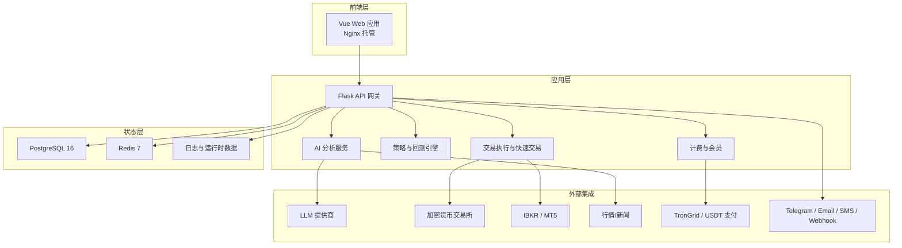
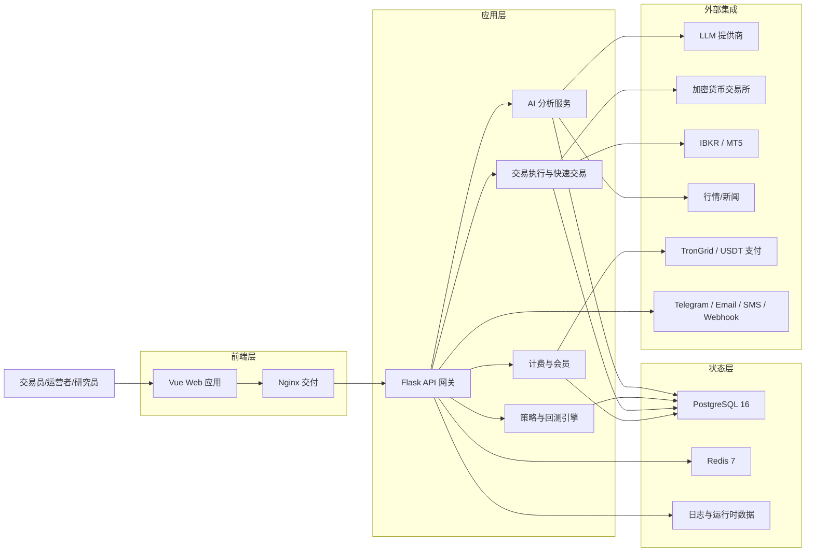
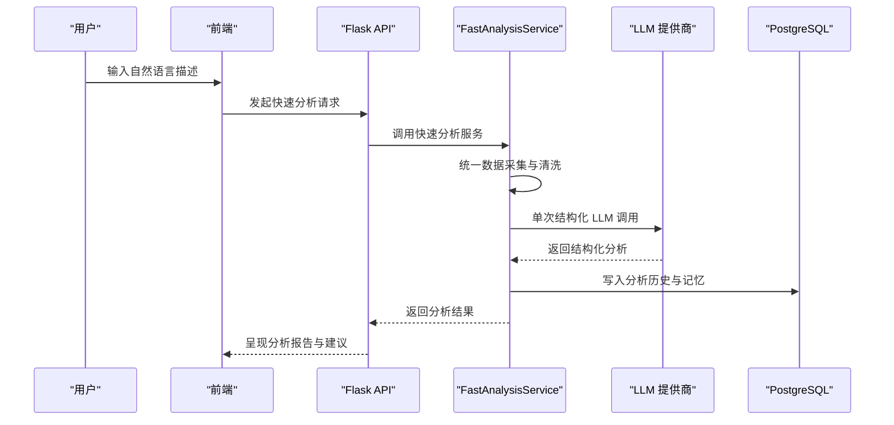
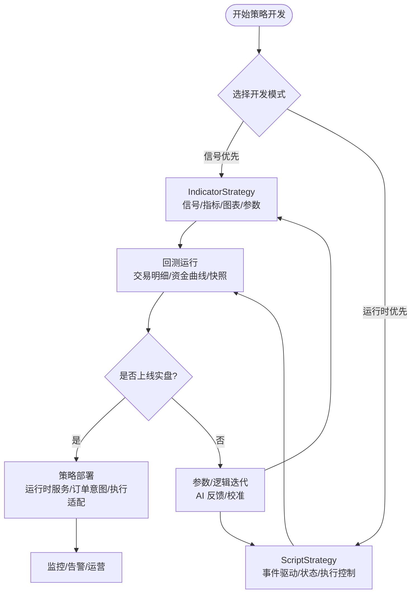
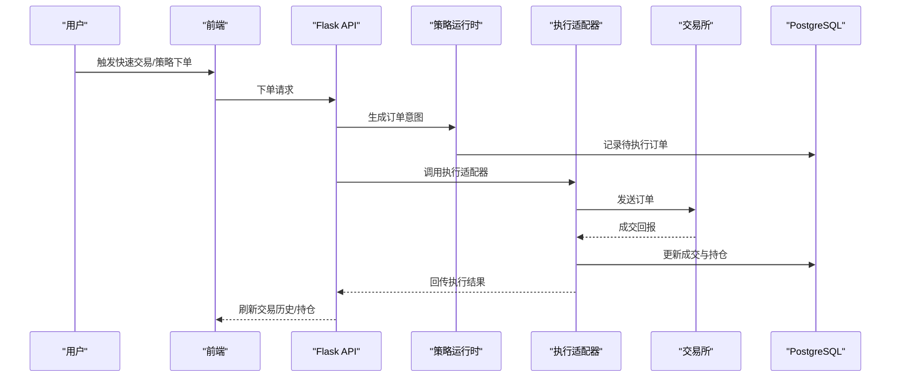
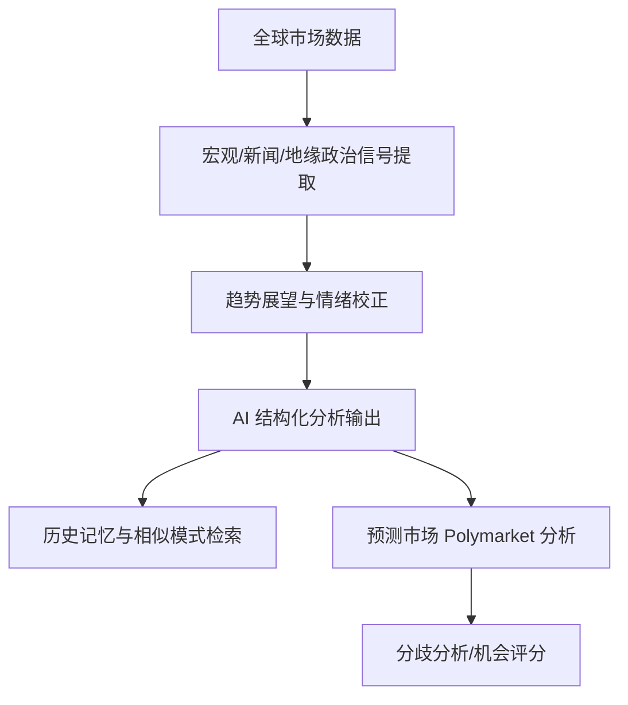
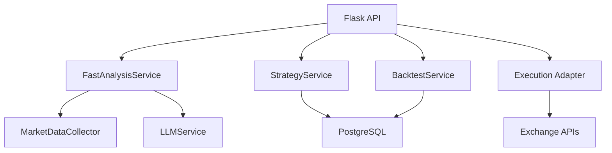

# 产品介绍

<cite>
**本文引用的文件**
- [README.md](file://README.md)
- [backend_api_python/README.md](file://backend_api_python/README.md)
- [frontend/README.md](file://frontend/README.md)
- [docs/README_CN.md](file://docs/README_CN.md)
- [docs/LAUNCH_MATERIALS.md](file://docs/LAUNCH_MATERIALS.md)
- [docs/STRATEGY_DEV_GUIDE.md](file://docs/STRATEGY_DEV_GUIDE.md)
- [docs/CLOUD_DEPLOYMENT_EN.md](file://docs/CLOUD_DEPLOYMENT_EN.md)
- [backend_api_python/app/services/fast_analysis.py](file://backend_api_python/app/services/fast_analysis.py)
- [backend_api_python/app/services/backtest.py](file://backend_api_python/app/services/backtest.py)
- [backend_api_python/app/services/strategy.py](file://backend_api_python/app/services/strategy.py)
- [backend_api_python/app/route/ai_chat.py](file://backend_api_python/app/routes/ai_chat.py)
- [backend_api_python/app/route/backtest.py](file://backend_api_python/app/routes/backtest.py)
- [backend_api_python/app/route/strategy.py](file://backend_api_python/app/routes/strategy.py)
- [backend_api_python/app/route/quick_trade.py](file://backend_api_python/app/routes/quick_trade.py)
- [backend_api_python/app/route/ibkr.py](file://backend_api_python/app/routes/ibkr.py)
- [backend_api_python/app/route/mt5.py](file://backend_api_python/app/routes/mt5.py)
- [backend_api_python/app/route/polymarket.py](file://backend_api_python/app/routes/polymarket.py)
</cite>

## 目录
1. [引言](#引言)
2. [项目结构](#项目结构)
3. [核心组件](#核心组件)
4. [架构总览](#架构总览)
5. [详细组件分析](#详细组件分析)
6. [依赖关系分析](#依赖关系分析)
7. [性能考量](#性能考量)
8. [故障排查指南](#故障排查指南)
9. [结论](#结论)
10. [附录](#附录)

## 引言
QuantDinger 是一款“可自托管、以本地优先为设计原则”的量化交易与算法交易平台，旨在将 AI 研究、Python 策略生成、回测验证与实盘执行整合到同一套系统中。它通过统一的前端与后端服务，提供从“想法到实盘”的全链路工作流，强调“AI 嵌入流程而非附加在流程之外”，并支持多用户、计费与商业化能力。

QuantDinger 的核心价值主张：
- 一套系统替代多个零散工具：研究、策略、回测、执行、运营一体化
- AI 置于工作流内部，而非旁观者：快速分析、策略生成、回测反馈、校准与反思
- Python 原生与产品化体验兼顾：既保留灵活性，也提供可用性
- 私有化部署与增长能力并存：基础设施、凭证与数据由你掌控，同时具备商业化与运营能力

## 项目结构
QuantDinger 采用前后端分离的可自托管架构，包含：
- 前端：预构建的 Vue 应用，由 Nginx 提供静态资源服务
- 后端：Flask API + Python 服务层，承载策略引擎、AI 分析、回测与执行适配
- 数据层：PostgreSQL 存储用户、策略、历史与状态；Redis 提供缓存与后台工作进程支撑
- 外部集成：交易所、经纪商、AI、支付与通知通道通过适配器接入

**图表来源**
- [README.md:267-321](file://README.md#L267-L321)
- [backend_api_python/README.md:15-33](file://backend_api_python/README.md#L15-L33)

**章节来源**
- [README.md:236-321](file://README.md#L236-L321)
- [backend_api_python/README.md:15-33](file://backend_api_python/README.md#L15-L33)
- [frontend/README.md:35-87](file://frontend/README.md#L35-L87)

## 核心组件
- AI 快速分析与记忆：统一数据采集器、单次 LLM 调用、分析历史与记忆存储
- 策略开发与回测：支持 IndicatorStrategy 与 ScriptStrategy，回测结果持久化与复现实验
- 实盘执行：统一执行层对接多家加密货币交易所与 IBKR/MT5，支持快速交易与待执行订单工作进程
- 多用户与商业化：基于 PostgreSQL 的多用户体系、OAuth、通知渠道、会员与计费
- 全球市场与预测市场：全球市场概览、地缘政治与宏观新闻影响评估、Polymarket 研究工作流

**章节来源**
- [README.md:132-175](file://README.md#L132-L175)
- [backend_api_python/README.md:5-14](file://backend_api_python/README.md#L5-L14)
- [docs/README_CN.md:132-175](file://docs/README_CN.md#L132-L175)

## 架构总览
下图展示了从用户到策略实盘执行的端到端路径，涵盖数据采集、AI 分析、策略回测与执行适配：

**图表来源**
- [README.md:267-321](file://README.md#L267-L321)

## 详细组件分析

### AI 快速分析与策略生成
- 快速分析：统一数据采集器、单次 LLM 调用、结构化输出、趋势展望与地缘政治影响识别
- 分析记忆：历史分析存储、相似模式检索、用户反馈闭环
- 策略生成：自然语言到 Python 指标与策略代码的生成骨架
- 可选增强：多模型协同、置信度校准与反思式工作进程

**图表来源**
- [backend_api_python/app/services/fast_analysis.py:186-200](file://backend_api_python/app/services/fast_analysis.py#L186-L200)
- [backend_api_python/app/routes/ai_chat.py](file://backend_api_python/app/routes/ai_chat.py)

**章节来源**
- [README.md:176-214](file://README.md#L176-L214)
- [docs/README_CN.md:176-214](file://docs/README_CN.md#L176-L214)

### 策略开发与回测
- 模式一：IndicatorStrategy（基于数据框的信号与指标）
  - 适合信号研究、可视化验证与参数调优
  - 支持固定风险默认值声明与图表输出
- 模式二：ScriptStrategy（事件驱动的运行时策略）
  - 适合需要状态管理、动态止盈止损与机器人式逻辑
- 回测：历史回测、交易明细与资金曲线持久化、策略快照与复现实验

**图表来源**
- [docs/STRATEGY_DEV_GUIDE.md:1-18](file://docs/STRATEGY_DEV_GUIDE.md#L1-L18)
- [docs/STRATEGY_DEV_GUIDE.md:93-200](file://docs/STRATEGY_DEV_GUIDE.md#L93-L200)
- [backend_api_python/app/services/backtest.py:64-82](file://backend_api_python/app/services/backtest.py#L64-L82)

**章节来源**
- [docs/STRATEGY_DEV_GUIDE.md:1-200](file://docs/STRATEGY_DEV_GUIDE.md#L1-L200)
- [backend_api_python/app/services/backtest.py:64-200](file://backend_api_python/app/services/backtest.py#L64-L200)

### 实盘执行与快速交易
- 统一执行层：对接多家加密货币交易所与 IBKR/MT5
- 快速交易：从分析到下单的一站式流程
- 待执行订单工作进程：轮询队列并派发信号与通知
- 交换机适配：针对特定交易所的直连 REST 接口与市场类型映射

**图表来源**
- [backend_api_python/app/routes/quick_trade.py](file://backend_api_python/app/routes/quick_trade.py)
- [backend_api_python/app/services/strategy.py:59-200](file://backend_api_python/app/services/strategy.py#L59-L200)

**章节来源**
- [README.md:155-161](file://README.md#L155-L161)
- [backend_api_python/app/services/strategy.py:59-200](file://backend_api_python/app/services/strategy.py#L59-L200)

### 全球市场与预测市场研究
- 全球市场概览：多资产类别与宏观因子联动
- 地缘政治与新闻影响：自动识别严重/中等程度冲突与新闻信号
- Polymarket 分析：预测市场研究工作流，对比 AI 观点与市场隐含概率

**图表来源**
- [backend_api_python/app/services/fast_analysis.py:133-184](file://backend_api_python/app/services/fast_analysis.py#L133-L184)
- [backend_api_python/app/routes/polymarket.py](file://backend_api_python/app/routes/polymarket.py)

**章节来源**
- [README.md:209-214](file://README.md#L209-L214)
- [docs/README_CN.md:209-214](file://docs/README_CN.md#L209-L214)

## 依赖关系分析
- 组件耦合与内聚
  - AI 分析服务与数据采集器高度内聚，通过统一接口与 LLM 提供商交互
  - 策略引擎与回测服务共享数据访问与存储接口，保证一致性
  - 执行层通过适配器解耦具体交易所，便于扩展与替换
- 外部依赖
  - LLM 提供商、市场数据与新闻、交易所 REST/WS、支付网关与通知通道
- 配置与环境
  - 通过 .env 驱动的配置项覆盖认证、数据库、AI、OAuth、计费、代理、工作进程与 AI 调优

**图表来源**
- [backend_api_python/app/services/fast_analysis.py:196-200](file://backend_api_python/app/services/fast_analysis.py#L196-L200)
- [backend_api_python/app/services/backtest.py:85-102](file://backend_api_python/app/services/backtest.py#L85-L102)
- [backend_api_python/app/services/strategy.py:20-22](file://backend_api_python/app/services/strategy.py#L20-L22)

**章节来源**
- [README.md:486-504](file://README.md#L486-L504)
- [backend_api_python/README.md:41-53](file://backend_api_python/README.md#L41-L53)

## 性能考量
- 回测性能与缓存
  - K 线缓存与 TTL 控制，减少重复外部 API 调用
  - 多时间框架回测阈值配置，平衡精度与性能
- 执行与并发
  - 待执行订单工作进程可选开启，避免阻塞主流程
  - 本地部署下，连接测试并发受信号量限制，避免资源争用
- 前后端分离与反向代理
  - 生产环境推荐通过 Nginx 反向代理，仅暴露 80/443，提升安全性与稳定性

**章节来源**
- [backend_api_python/app/services/backtest.py:25-61](file://backend_api_python/app/services/backtest.py#L25-L61)
- [backend_api_python/app/services/strategy.py:17-18](file://backend_api_python/app/services/strategy.py#L17-L18)
- [docs/CLOUD_DEPLOYMENT_EN.md:5-20](file://docs/CLOUD_DEPLOYMENT_EN.md#L5-L20)

## 故障排查指南
- 数据库连接失败
  - 检查 DATABASE_URL 格式与 PostgreSQL 服务状态
- 出站请求失败
  - 通过 PROXY_URL 配置代理
- 禁用自动恢复与工作进程
  - 设置 DISABLE_RESTORE_RUNNING_STRATEGIES 或关闭 ENABLE_PENDING_ORDER_WORKER
- 健康检查与日志
  - 后端健康检查端点与容器日志定位问题

**章节来源**
- [backend_api_python/README.md:231-237](file://backend_api_python/README.md#L231-L237)
- [README.md:354-369](file://README.md#L354-L369)

## 结论
QuantDinger 通过“可自托管 + AI 原生 + Python 原生 + 商业化就绪”的组合，填补了传统量化工具在“研究—策略—回测—执行—运营”链路上的碎片化与割裂。它不仅缩短了从想法到实盘的距离，还提供了稳定、可扩展且可控的基础设施，适合交易员、量化开发者、小团队与运营方在隐私优先的前提下实现规模化增长。

## 附录

### 功能对比：QuantDinger vs 传统拼装式方案
- 传统拼装式方案
  - AI 聊天工具与真实策略流程割裂
  - 图表、脚本、机器人、通知系统各自分散
  - SaaS 工具对密钥与 alpha 控制有限
  - 只有研究工具，缺乏运营层
- QuantDinger
  - AI 分析、AI 生成代码、回测反馈、执行流程在同一产品闭环
  - 一套可部署平台统一承载图表、策略、运行时、通知与运营
  - 可自托管架构，基础设施、密钥与业务数据由你掌控
  - 内置多用户、权限、计费、后台管理与部署能力

**章节来源**
- [README.md:80-88](file://README.md#L80-L88)
- [docs/README_CN.md:80-88](file://docs/README_CN.md#L80-L88)

### 产品愿景与使命
- 愿景：成为“你的私有化 AI 量化操作系统”，让研究、策略、回测与实盘执行在一套系统内高效流转
- 使命：以可自托管与 AI 原生为核心，降低量化门槛，提升研发效率，保障数据与资产主权，支持商业化与运营增长

**章节来源**
- [README.md:34-79](file://README.md#L34-L79)
- [docs/README_CN.md:34-79](file://docs/README_CN.md#L34-L79)

### 商业价值说明
- 降低运营成本：自托管减少订阅费用与数据外泄风险
- 提升研发效率：AI 辅助策略生成与回测反馈，缩短迭代周期
- 增强合规与安全：本地化部署与细粒度权限控制
- 支持商业化：会员、积分、USDT 支付与后台管理能力

**章节来源**
- [README.md:63-79](file://README.md#L63-L79)
- [docs/README_CN.md:63-79](file://docs/README_CN.md#L63-L79)

### 快速开始与部署
- Docker 一键部署：克隆仓库、复制环境模板、生成密钥、启动容器
- 生产部署：Nginx 反向代理、HTTPS、域名与端口配置
- 前后端分离：前端静态资源由 Nginx 提供，后端 API 仅对内暴露

**章节来源**
- [README.md:323-380](file://README.md#L323-L380)
- [docs/CLOUD_DEPLOYMENT_EN.md:1-150](file://docs/CLOUD_DEPLOYMENT_EN.md#L1-L150)