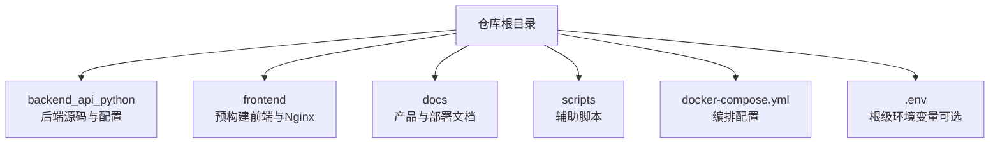
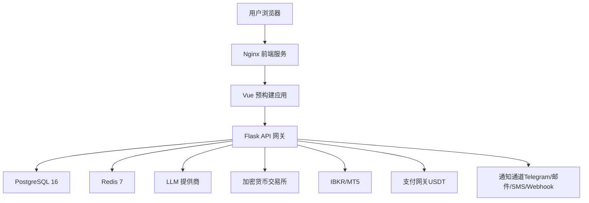
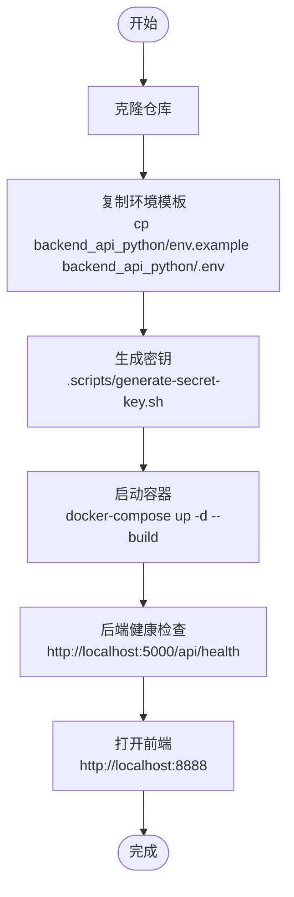
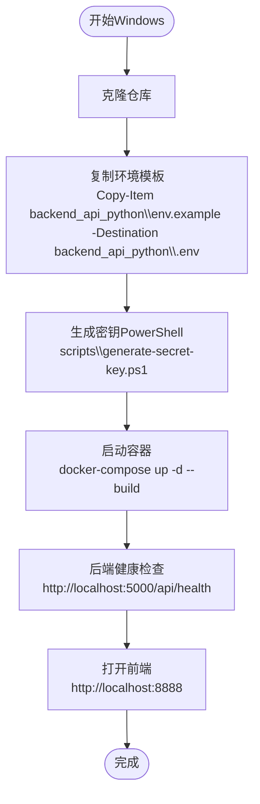
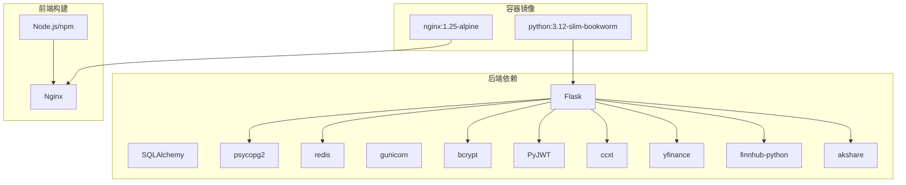

# 快速开始指南

<cite>
**本文引用的文件**
- [README.md](file://README.md)
- [backend_api_python/README.md](file://backend_api_python/README.md)
- [frontend/README.md](file://frontend/README.md)
- [backend_api_python/env.example](file://backend_api_python/env.example)
- [backend_api_python/Dockerfile](file://backend_api_python/Dockerfile)
- [frontend/Dockerfile](file://frontend/Dockerfile)
- [docker-compose.yml](file://docker-compose.yml)
- [scripts/generate-secret-key.sh](file://scripts/generate-secret-key.sh)
- [scripts/generate-secret-key.ps1](file://scripts/generate-secret-key.ps1)
- [backend_api_python/run.py](file://backend_api_python/run.py)
- [backend_api_python/start.sh](file://backend_api_python/start.sh)
- [backend_api_python/migrations/init.sql](file://backend_api_python/migrations/init.sql)
- [backend_api_python/requirements.txt](file://backend_api_python/requirements.txt)
- [backend_api_python/requirements-windows.txt](file://backend_api_python/requirements-windows.txt)
</cite>

## 目录
1. [简介](#简介)
2. [项目结构](#项目结构)
3. [核心组件](#核心组件)
4. [架构总览](#架构总览)
5. [详细组件分析](#详细组件分析)
6. [依赖关系分析](#依赖关系分析)
7. [性能注意事项](#性能注意事项)
8. [故障排除指南](#故障排除指南)
9. [结论](#结论)
10. [附录](#附录)

## 简介
QuantDinger 是一个自托管、本地优先的量化交易与算法交易平台，支持 AI 市场研究、Python 指标与策略开发、回测、实盘执行、组合监控与告警、多用户运营与商业化能力。通过 Docker Compose 一键部署，内置前端静态资源与后端 API，适合个人研究者、量化团队与运营方快速上手。

- 产品定位：研究到执行一体化的本地化工作流
- 技术栈：Vue 前端（预构建）、Nginx、Flask 后端、PostgreSQL、Redis
- 部署模式：Docker Compose（推荐），亦支持本地开发运行

章节来源
- [README.md:323-380](file://README.md#L323-L380)
- [README.md:466-484](file://README.md#L466-L484)

## 项目结构
仓库采用前后端分离与容器化部署的组织方式：
- backend_api_python：Flask 后端源码、路由、服务、数据迁移、Dockerfile、入口脚本
- frontend：预构建前端交付包与 Nginx 配置
- docs：产品文档、策略开发指南、集成指南
- scripts：辅助脚本（密钥生成等）
- 根目录：docker-compose.yml、根级 .env、README 等

章节来源
- [README.md:466-484](file://README.md#L466-L484)
- [backend_api_python/README.md:15-33](file://backend_api_python/README.md#L15-L33)

## 核心组件
- 前端层（Nginx + Vue 预构建）：提供仪表盘、AI 分析、策略 IDE、回测中心、交易助手、账单与用户管理等页面
- 应用层（Flask API）：REST 接口、认证与权限、AI 分析、策略引擎、回测、执行适配器、计费与会员
- 存储层（PostgreSQL 16）：用户、策略、历史、积分、会员、OAuth 状态、验证码、安全审计等
- 缓存/队列（Redis 7）：可选缓存与后台作业支持
- 外部集成：LLM 提供商、交易所、市场数据、支付（USDT）、通知渠道（Telegram/邮件/SMS/Webhook）

章节来源
- [README.md:246-258](file://README.md#L246-L258)
- [backend_api_python/README.md:15-33](file://backend_api_python/README.md#L15-L33)

## 架构总览
下图展示从浏览器到后端、数据库与外部服务的整体交互路径：

图表来源
- [README.md:267-321](file://README.md#L267-L321)
- [docker-compose.yml:23-163](file://docker-compose.yml#L23-L163)

章节来源
- [README.md:246-258](file://README.md#L246-L258)

## 详细组件分析

### 环境准备与安装部署（Linux/macOS）
- 安装前置条件：Docker 与 Docker Compose
- 克隆仓库并复制环境模板
- 生成安全密钥（SECRET_KEY）
- 启动容器栈（后端健康检查通过后再访问前端）

图表来源
- [README.md:327-359](file://README.md#L327-L359)
- [scripts/generate-secret-key.sh:1-34](file://scripts/generate-secret-key.sh#L1-L34)
- [docker-compose.yml:1-163](file://docker-compose.yml#L1-L163)

章节来源
- [README.md:327-359](file://README.md#L327-L359)
- [scripts/generate-secret-key.sh:1-34](file://scripts/generate-secret-key.sh#L1-L34)

### 环境准备与安装部署（Windows）
- 使用 PowerShell 执行相同流程，注意 .env 文件路径与密钥替换
- 建议在 PowerShell 中执行密钥生成脚本

图表来源
- [README.md:337-359](file://README.md#L337-L359)
- [scripts/generate-secret-key.ps1:1-32](file://scripts/generate-secret-key.ps1#L1-L32)
- [docker-compose.yml:1-163](file://docker-compose.yml#L1-L163)

章节来源
- [README.md:337-359](file://README.md#L337-L359)
- [scripts/generate-secret-key.ps1:1-32](file://scripts/generate-secret-key.ps1#L1-L32)

### 首次使用与默认凭据
- 默认管理员账户：用户名与密码可在环境模板中查看
- 首次启动会自动创建管理员用户
- 健康检查地址与前端访问地址已在 README 中给出

章节来源
- [README.md:44-48](file://README.md#L44-L48)
- [backend_api_python/env.example:14-16](file://backend_api_python/env.example#L14-L16)
- [backend_api_python/migrations/init.sql:35-37](file://backend_api_python/migrations/init.sql#L35-L37)

### 配置设置与初始建议
- 主要配置文件：backend_api_python/.env
- 关键区域（摘录）：
  - 认证与安全：SECRET_KEY、ADMIN_USER、ADMIN_PASSWORD、TURNSTILE 等
  - 数据库：DATABASE_URL
  - LLM/AI：LLM_PROVIDER、OPENROUTER_API_KEY 等
  - OAuth：GOOGLE/GITHUB 客户端 ID/Secret
  - 安全：ENABLE_REGISTRATION、登录防护参数
  - 计费与会员：BILLING_ENABLED、会员价格与积分
  - USDT 支付：USDT_PAY_ENABLED、TRON 侧链参数
  - 工作线程与缓存：ENABLE_PENDING_ORDER_WORKER、ENABLE_PORTFOLIO_MONITOR、CACHE_ENABLED
  - AI 调优：ENABLE_AI_ENSEMBLE、ENABLE_CONFIDENCE_CALIBRATION、AI_ENSEMBLE_MODELS
- 初始建议：
  - 修改 SECRET_KEY 为随机安全值
  - 配置至少一个 LLM 提供商以便使用 AI 分析
  - 如需实盘交易，按需配置交易所/券商凭证与执行适配器
  - 开启必要的后台作业（挂单处理、组合监控等）

章节来源
- [README.md:486-504](file://README.md#L486-L504)
- [backend_api_python/env.example:9-268](file://backend_api_python/env.example#L9-L268)

### 基本功能测试方法
- 健康检查：访问后端健康接口确认服务可用
- 登录测试：使用默认或自定义管理员账户登录前端
- AI 快速分析：调用 AI 分析接口进行一次快速分析
- 回测测试：创建一个简单策略并运行回测
- 快速下单：在交易助手或策略页面发起一次快速下单（模拟）

章节来源
- [README.md:348-353](file://README.md#L348-L353)
- [backend_api_python/README.md:151-185](file://backend_api_python/README.md#L151-L185)

### 本地开发运行（非容器）
- 后端本地开发：安装依赖、创建 .env、运行入口脚本
- 注意事项：本地开发仅使用 Flask 内置服务器；生产建议使用 Gunicorn

章节来源
- [backend_api_python/README.md:74-134](file://backend_api_python/README.md#L74-L134)
- [backend_api_python/start.sh:1-27](file://backend_api_python/start.sh#L1-L27)
- [backend_api_python/run.py:99-134](file://backend_api_python/run.py#L99-L134)

### Windows 特定依赖（可选）
- 若需要 MT5 外汇交易支持，请在 Windows 系统安装 MetaTrader5 依赖

章节来源
- [backend_api_python/requirements-windows.txt:1-7](file://backend_api_python/requirements-windows.txt#L1-L7)

## 依赖关系分析
- 运行时依赖（后端）：Flask、SQLAlchemy、psycopg2、redis、gunicorn、bcrypt、PyJWT、ccxt、yfinance、finnhub、akshare 等
- 前端构建：Node.js 与 npm，生产构建输出至 dist，由 Nginx 提供
- 容器镜像：后端基于 Python 3.12 slim，前端基于 nginx:1.25-alpine

图表来源
- [backend_api_python/requirements.txt:1-40](file://backend_api_python/requirements.txt#L1-L40)
- [frontend/Dockerfile:1-33](file://frontend/Dockerfile#L1-L33)
- [backend_api_python/Dockerfile:1-56](file://backend_api_python/Dockerfile#L1-L56)

章节来源
- [backend_api_python/requirements.txt:1-40](file://backend_api_python/requirements.txt#L1-L40)
- [frontend/Dockerfile:1-33](file://frontend/Dockerfile#L1-L33)
- [backend_api_python/Dockerfile:1-56](file://backend_api_python/Dockerfile#L1-L56)

## 性能注意事项
- 数据库连接池：根据并发机器人/组合数量调整 DB_POOL_MIN/MAX 与执行器线程数
- 缓存与作业：启用 Redis 与相关后台作业可提升吞吐与稳定性
- 网络代理：在代理环境下合理配置 NO_PROXY 以避免国内金融数据源绕行
- 日志与调试：生产环境建议开启请求日志与访问日志，便于问题排查

章节来源
- [backend_api_python/env.example:42-62](file://backend_api_python/env.example#L42-L62)
- [backend_api_python/env.example:104-118](file://backend_api_python/env.example#L104-L118)
- [backend_api_python/run.py:60-91](file://backend_api_python/run.py#L60-L91)

## 故障排除指南
- 后端无法启动（密钥问题）：若 SECRET_KEY 仍为默认值，容器不会启动。请生成并更新密钥后重启
- 数据库连接失败：检查 DATABASE_URL 格式与 PostgreSQL 服务状态
- 外网请求失败：配置 PROXY_URL 并确保国内金融数据源不走代理
- 禁用自动恢复/挂单作业：按需设置 DISABLE_RESTORE_RUNNING_STRATEGIES 或 ENABLE_PENDING_ORDER_WORKER
- 健康检查失败：查看后端容器日志，确认端口映射与网络连通性

章节来源
- [README.md:354-359](file://README.md#L354-L359)
- [backend_api_python/README.md:231-237](file://backend_api_python/README.md#L231-L237)
- [backend_api_python/run.py:109-120](file://backend_api_python/run.py#L109-L120)

## 结论
通过本指南，您可以在 Linux/macOS 或 Windows 上使用 Docker Compose 在约 2 分钟内完成 QuantDinger 的本地部署，并使用默认管理员账户登录体验核心功能。建议后续逐步完善密钥、LLM、计费与支付等配置，结合策略开发与回测流程深入探索平台能力。

## 附录

### 常用命令速查
- 启动/停止/重启/查看日志
- 重建镜像与重新编排
- 查看服务状态与健康检查

章节来源
- [README.md:361-369](file://README.md#L361-L369)

### 环境变量一览（节选）
- 认证与安全：SECRET_KEY、ADMIN_USER、ADMIN_PASSWORD、ENABLE_REGISTRATION、TURNSTILE_*、GOOGLE/GITHUB OAuth
- 数据库：DATABASE_URL、DB_POOL_MIN/MAX、DB_POOL_ACQUIRE_TIMEOUT、DB_POOL_HEALTH_CHECK
- AI/LLM：LLM_PROVIDER、OPENROUTER_*、OPENAI_*、GOOGLE_*、DEEPSEEK_*、GROK_*、AI_CODE_GEN_MODEL
- 工作线程与缓存：ENABLE_PENDING_ORDER_WORKER、ENABLE_PORTFOLIO_MONITOR、CACHE_ENABLED
- 计费与会员：BILLING_ENABLED、MEMBERSHIP_*、CREDITS_*、BILLING_COST_AI_ANALYSIS、BILLING_COST_AI_CODE_GEN
- USDT 支付：USDT_PAY_ENABLED、USDT_PAY_CHAIN、USDT_TRC20_*、TRONGRID_*、USDT_PAY_* 参数
- 代理与网络：PROXY_URL、LIVE_TRADING_CA_BUNDLE、LIVE_TRADING_SSL_VERIFY
- 其他：FRONTEND_URL、OAUTH_ALLOWED_REDIRECTS、MOBILE_APP_*、GUNICORN_*、MARKET_EXECUTOR_WORKERS、PORTFOLIO_EXECUTOR_WORKERS

章节来源
- [backend_api_python/env.example:9-268](file://backend_api_python/env.example#L9-L268)