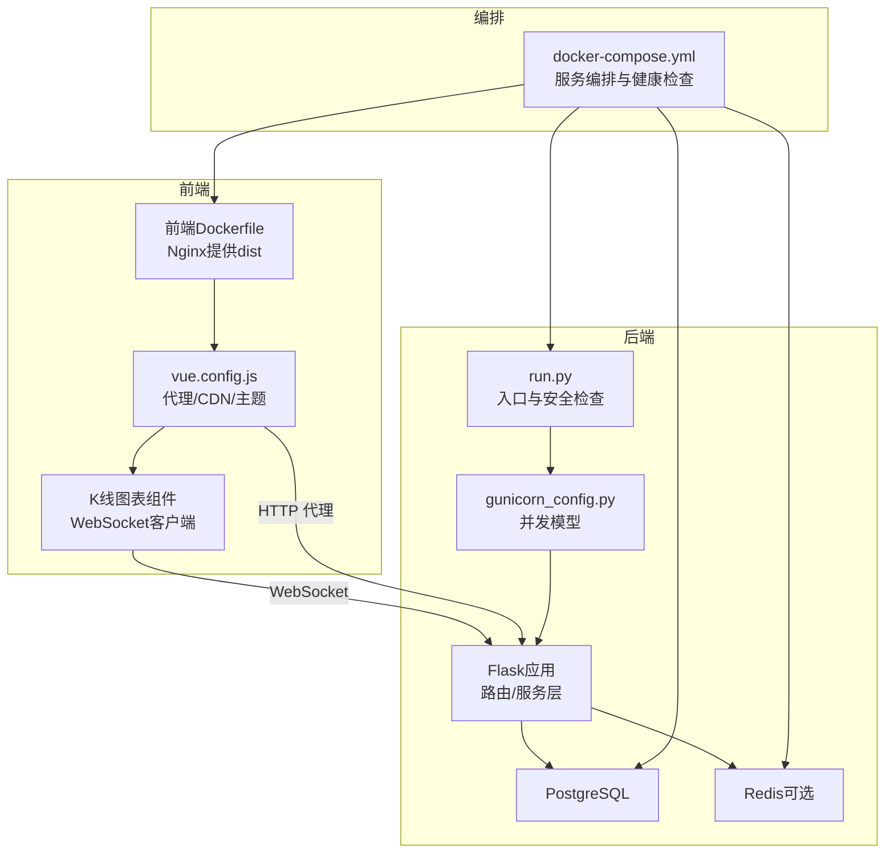
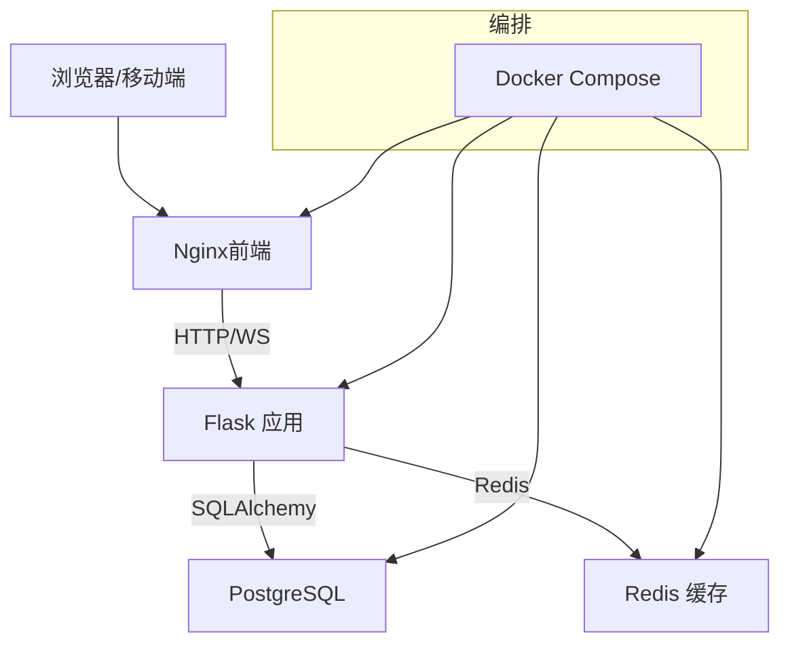
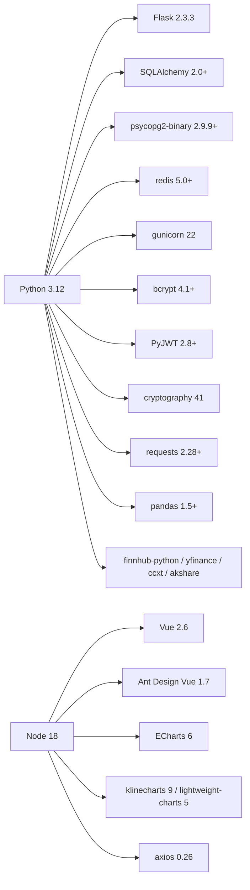

# 技术栈与依赖

<cite>
**本文引用的文件**
- [requirements.txt](file://backend_api_python/requirements.txt)
- [Dockerfile（后端）](file://backend_api_python/Dockerfile)
- [docker-compose.yml](file://docker-compose.yml)
- [run.py](file://backend_api_python/run.py)
- [gunicorn_config.py](file://backend_api_python/gunicorn_config.py)
- [settings.py](file://backend_api_python/app/config/settings.py)
- [env.example](file://backend_api_python/env.example)
- [package.json（前端）](file://frontend/package.json)
- [vue.config.js](file://frontend/vue.config.js)
- [Dockerfile（前端）](file://frontend/Dockerfile)
- [exchangeWs.js](file://frontend/src/utils/exchangeWs.js)
- [KlineChart.vue](file://frontend/src/views/indicator-analysis/components/KlineChart.vue)
- [api_keys.py](file://backend_api_python/app/config/api_keys.py)
- [auth.py（路由）](file://backend_api_python/app/routes/auth.py)
- [security_service.py](file://backend_api_python/app/services/security_service.py)
- [auth 工具](file://backend_api_python/app/utils/auth.py)
- [user_service.py](file://backend_api_python/app/services/user_service.py)
</cite>

## 目录
1. [简介](#简介)
2. [项目结构](#项目结构)
3. [核心组件](#核心组件)
4. [架构总览](#架构总览)
5. [详细组件分析](#详细组件分析)
6. [依赖分析](#依赖分析)
7. [性能考量](#性能考量)
8. [故障排查指南](#故障排查指南)
9. [结论](#结论)
10. [附录](#附录)

## 简介
本文件面向QuantDinger项目的维护者与贡献者，系统化梳理后端（Python 3.12、Flask、PostgreSQL、Redis）、前端（Vue.js、Ant Design Vue、ECharts）、基础设施（Docker、Nginx、WebSocket）与第三方服务集成，并给出版本兼容性矩阵、升级策略、安全注意事项与学习路径建议。

## 项目结构
- 后端采用单体Python应用，使用Flask作为Web框架，通过Gunicorn提供生产级WSGI服务；数据库使用PostgreSQL，缓存可选Redis；Docker Compose统一编排。
- 前端基于Vue 2生态，使用Ant Design Vue与ECharts等组件库，构建完成后由Nginx提供静态资源服务；开发时通过Vue CLI代理后端API并启用长连接以支持回测等长时间任务。

**图表来源**
- [Dockerfile（前端）:1-33](file://frontend/Dockerfile#L1-L33)
- [vue.config.js:136-148](file://frontend/vue.config.js#L136-L148)
- [exchangeWs.js:1-200](file://frontend/src/utils/exchangeWs.js#L1-L200)
- [run.py:96-134](file://backend_api_python/run.py#L96-L134)
- [gunicorn_config.py:10-36](file://backend_api_python/gunicorn_config.py#L10-L36)
- [docker-compose.yml:23-163](file://docker-compose.yml#L23-L163)

**章节来源**
- [Dockerfile（前端）:1-33](file://frontend/Dockerfile#L1-L33)
- [vue.config.js:136-148](file://frontend/vue.config.js#L136-L148)
- [exchangeWs.js:1-200](file://frontend/src/utils/exchangeWs.js#L1-L200)
- [run.py:96-134](file://backend_api_python/run.py#L96-L134)
- [gunicorn_config.py:10-36](file://backend_api_python/gunicorn_config.py#L10-L36)
- [docker-compose.yml:23-163](file://docker-compose.yml#L23-L163)

## 核心组件
- 后端运行入口与安全校验：run.py负责加载环境变量、设置代理、执行安全检查（如SECRET_KEY），并创建Flask应用实例。
- 生产WSGI：gunicorn_config.py定义绑定地址、工作进程与线程数、超时与日志级别等。
- 配置体系：settings.py集中管理主机、端口、调试、日志、速率限制、功能开关等；env.example提供完整环境变量清单。
- 数据库与缓存：PostgreSQL用于持久化，Redis用于可选缓存与限流；compose中提供独立服务与健康检查。
- 前端静态化与代理：前端Dockerfile构建产物交由Nginx提供；vue.config.js配置开发代理至后端，支持WebSocket长连接。
- 实时行情：前端K线组件通过exchangeWs.js封装多交易所WebSocket订阅，实现K线增量推送与自动重连。

**章节来源**
- [run.py:96-134](file://backend_api_python/run.py#L96-L134)
- [gunicorn_config.py:10-36](file://backend_api_python/gunicorn_config.py#L10-L36)
- [settings.py:1-99](file://backend_api_python/app/config/settings.py#L1-L99)
- [env.example:1-268](file://backend_api_python/env.example#L1-L268)
- [Dockerfile（前端）:1-33](file://frontend/Dockerfile#L1-L33)
- [vue.config.js:136-148](file://frontend/vue.config.js#L136-L148)
- [exchangeWs.js:1-200](file://frontend/src/utils/exchangeWs.js#L1-L200)

## 架构总览
后端以Flask为核心，通过Gunicorn承载并发；数据库与缓存作为外部依赖；前端通过Nginx提供静态页面，开发模式下经Vue CLI代理后端API并建立WebSocket通道。Docker Compose统一编排，包含健康检查与资源限制。

**图表来源**
- [docker-compose.yml:23-163](file://docker-compose.yml#L23-L163)
- [Dockerfile（前端）:1-33](file://frontend/Dockerfile#L1-L33)
- [run.py:96-134](file://backend_api_python/run.py#L96-L134)
- [gunicorn_config.py:10-36](file://backend_api_python/gunicorn_config.py#L10-L36)

## 详细组件分析

### 后端技术栈与版本
- Python 3.12：后端镜像基础为“python:3.12-slim-bookworm”，确保与依赖兼容。
- Flask 2.3.3：Web框架，配合Flask-CORS、Flasgger等扩展。
- 数据库：PostgreSQL 16（容器镜像），通过psycopg2-binary连接。
- 缓存：Redis 7（容器镜像），可选启用。
- 生产WSGI：Gunicorn 22，线程模型（gthread）便于在单进程模型下获得更高并发。
- 安全与认证：PyJWT 2.8.0、bcrypt 4.1.0、cryptography 41、python-dotenv 1.0.1。
- 数据与网络：pandas 1.5+、requests 2.28+、certifi 2024.2.2、PySocks 1.7.1。
- 交易与金融数据：finnhub-python、yfinance、ccxt、akshare、ib_insync、MetaTrader5（Windows专用）。
- 可选搜索与AI：tavily-python、google-search-results等（按需启用）。

**章节来源**
- [Dockerfile（后端）:1-56](file://backend_api_python/Dockerfile#L1-L56)
- [requirements.txt:1-40](file://backend_api_python/requirements.txt#L1-L40)
- [docker-compose.yml:27-51](file://docker-compose.yml#L27-L51)
- [docker-compose.yml:61-74](file://docker-compose.yml#L61-L74)

### 前端技术栈与版本
- Vue 2.6.14：核心框架，搭配vue-router、vuex。
- Ant Design Vue 1.7.8：UI组件库。
- ECharts 6、klinecharts 9、lightweight-charts 5：图表与K线展示。
- Axios 0.26、moment 2.29、lodash系列：常用工具。
- 构建与运行：Node 18（前端Dockerfile），NPM安装依赖，生产构建后由Nginx提供。

**章节来源**
- [package.json（前端）:15-48](file://frontend/package.json#L15-L48)
- [Dockerfile（前端）:1-33](file://frontend/Dockerfile#L1-L33)

### 基础设施与部署
- Docker Compose：统一编排数据库、缓存、后端与前端；提供健康检查与资源限制。
- Nginx：前端静态资源服务，前端Dockerfile中明确使用nginx:1.25-alpine。
- WebSocket：前端K线组件通过WebSocket与后端交互；vue.config.js开启ws代理，适配长时间任务。

**章节来源**
- [docker-compose.yml:23-163](file://docker-compose.yml#L23-L163)
- [vue.config.js:136-148](file://frontend/vue.config.js#L136-L148)
- [exchangeWs.js:1-200](file://frontend/src/utils/exchangeWs.js#L1-L200)

### 第三方服务集成
- OAuth与验证码：支持Google/GitHub登录，Cloudflare Turnstile人机验证；后端通过安全服务与邮件服务协同。
- LLM与AI：支持OpenRouter、OpenAI、Google Gemini、DeepSeek、xAI Grok等；可配置轮换密钥与超时。
- 金融数据源：Finnhub、YFinance、CCXT、AkShare、TwelveData、Adanos等；可配置超时与重试。
- 通知与支付：邮件SMTP、短信（Twilio）、USDT支付（Tron链）等可选模块。

**章节来源**
- [auth.py（路由）:192-637](file://backend_api_python/app/routes/auth.py#L192-L637)
- [security_service.py:1-41](file://backend_api_python/app/services/security_service.py#L1-L41)
- [api_keys.py:1-164](file://backend_api_python/app/config/api_keys.py#L1-L164)
- [env.example:64-268](file://backend_api_python/env.example#L64-L268)

## 依赖分析

### 版本兼容性矩阵（节选）
- Python 3.12 与后端依赖
  - Flask 2.3.3、SQLAlchemy 2.0+、psycopg2-binary 2.9.9+、redis 5.0+、gunicorn 22、bcrypt 4.1+、PyJWT 2.8+、cryptography 41+
- 前端依赖
  - Vue 2.6、Ant Design Vue 1.7、ECharts 6、klinecharts 9、lightweight-charts 5
- 基础设施
  - PostgreSQL 16、Redis 7、Nginx 1.25、Node 18

**章节来源**
- [requirements.txt:1-40](file://backend_api_python/requirements.txt#L1-L40)
- [package.json（前端）:15-48](file://frontend/package.json#L15-L48)
- [docker-compose.yml:27-51](file://docker-compose.yml#L27-L51)
- [docker-compose.yml:61-74](file://docker-compose.yml#L61-L74)
- [Dockerfile（前端）:1-33](file://frontend/Dockerfile#L1-L33)

### 依赖关系图

**图表来源**
- [requirements.txt:1-40](file://backend_api_python/requirements.txt#L1-L40)
- [package.json（前端）:15-48](file://frontend/package.json#L15-L48)

### 升级策略
- Python与后端依赖
  - 严格遵循语义化版本；升级前在CI中运行测试与迁移脚本；对SQLAlchemy、psycopg2-binary、redis等进行兼容性回归测试。
- 前端依赖
  - Vue 2生态稳定期，优先升级次要版本；注意Ant Design Vue与ECharts的兼容性；构建与CDN外链策略需同步验证。
- 基础设施
  - PostgreSQL/Redis/Nginx升级需评估数据迁移与配置差异；Compose中max_connections、maxmemory等参数需重新校准。
- 第三方服务
  - LLM与搜索API密钥轮换与超时策略需在env中统一管理；金融数据源接口变更需在数据提供层做向后兼容。

**章节来源**
- [env.example:64-268](file://backend_api_python/env.example#L64-L268)
- [docker-compose.yml:36-51](file://docker-compose.yml#L36-L51)
- [docker-compose.yml:65-74](file://docker-compose.yml#L65-L74)

## 性能考量
- 并发模型
  - 后端采用gthread（单进程多线程），适合I/O密集型场景；可通过GUNICORN_WORKERS与GUNICORN_THREADS调整吞吐。
- 连接池与执行器
  - DB连接池（DB_POOL_MIN/MAX/ACQUIRE_TIMEOUT/HEALTH_CHECK）与市场/组合执行器并行度（MARKET_EXECUTOR_WORKERS/PORTFOLIO_EXECUTOR_WORKERS）需结合负载与PG最大连接数综合调优。
- 缓存与限流
  - Redis可用作缓存与限流；Turnstile与IP/账户级限流降低暴力破解风险。
- 前端性能
  - CDN外链与主题色替换插件在生产环境提升首屏与主题切换体验；WebSocket长连接与重连指数退避保障实时性。

**章节来源**
- [gunicorn_config.py:10-36](file://backend_api_python/gunicorn_config.py#L10-L36)
- [env.example:42-62](file://backend_api_python/env.example#L42-L62)
- [security_service.py:26-41](file://backend_api_python/app/services/security_service.py#L26-L41)
- [vue.config.js:136-148](file://frontend/vue.config.js#L136-L148)

## 故障排查指南
- 启动与安全
  - SECRET_KEY默认值将被自动替换并提示；生产环境务必设置持久化密钥。
  - 健康检查失败：检查数据库与Redis健康状态、端口映射与网络连通性。
- WebSocket与实时数据
  - 多交易所K线订阅失败会自动回退至Binance；若持续失败，检查网络代理与NO_PROXY配置。
  - 前端代理超时：适当提高proxyTimeout与devServer.port相关配置。
- 认证与安全
  - 登录失败与限流：检查Turnstile配置、IP/账户限流阈值与数据库状态。
  - 密码哈希：bcrypt优先，回退到SHA256；确认HAS_BCRYPT与存储格式一致。

**章节来源**
- [run.py:109-120](file://backend_api_python/run.py#L109-L120)
- [docker-compose.yml:52-56](file://docker-compose.yml#L52-L56)
- [docker-compose.yml:70-74](file://docker-compose.yml#L70-L74)
- [exchangeWs.js:386-410](file://frontend/src/utils/exchangeWs.js#L386-L410)
- [vue.config.js:136-148](file://frontend/vue.config.js#L136-L148)
- [auth.py（路由）:218-227](file://backend_api_python/app/routes/auth.py#L218-L227)
- [security_service.py:34-41](file://backend_api_python/app/services/security_service.py#L34-L41)
- [user_service.py:81-100](file://backend_api_python/app/services/user_service.py#L81-L100)

## 结论
QuantDinger采用成熟稳定的全栈技术栈：后端以Python 3.12与Flask为基础，结合Gunicorn与PostgreSQL/Redis实现高可用；前端以Vue 2与Ant Design Vue为核心，配合ECharts与WebSocket提供丰富的可视化与实时体验；Docker Compose简化部署与运维。建议在升级时遵循语义化版本与充分测试，同时完善第三方服务的密钥轮换与超时策略，确保安全与稳定性。

## 附录

### 学习路径建议
- 后端（Python/Flask）
  - 掌握Python基础与虚拟环境；理解Flask路由、蓝图与中间件；熟悉SQLAlchemy ORM与数据库连接池；了解Gunicorn并发模型与Docker容器化。
  - 参考文件：[run.py:96-134](file://backend_api_python/run.py#L96-L134)、[gunicorn_config.py:10-36](file://backend_api_python/gunicorn_config.py#L10-L36)、[settings.py:1-99](file://backend_api_python/app/config/settings.py#L1-L99)
- 前端（Vue/Ant Design Vue/ECharts）
  - 熟悉Vue 2语法与生命周期；掌握组件通信、路由与状态管理；理解Axios请求与Mock；学习Ant Design Vue与ECharts/K线图表集成。
  - 参考文件：[package.json（前端）:15-48](file://frontend/package.json#L15-L48)、[vue.config.js:136-148](file://frontend/vue.config.js#L136-L148)、[exchangeWs.js:1-200](file://frontend/src/utils/exchangeWs.js#L1-L200)
- 基础设施与部署
  - Docker基础与Compose编排；Nginx配置与静态资源服务；数据库与缓存的健康检查与性能调优。
  - 参考文件：[Dockerfile（后端）:1-56](file://backend_api_python/Dockerfile#L1-L56)、[Dockerfile（前端）:1-33](file://frontend/Dockerfile#L1-L33)、[docker-compose.yml:23-163](file://docker-compose.yml#L23-L163)
- 第三方服务与安全
  - OAuth与验证码集成；LLM与搜索API配置；密码哈希与JWT令牌；限流与暴力破解防护。
  - 参考文件：[api_keys.py:1-164](file://backend_api_python/app/config/api_keys.py#L1-L164)、[auth.py（路由）:192-637](file://backend_api_python/app/routes/auth.py#L192-L637)、[security_service.py:1-41](file://backend_api_python/app/services/security_service.py#L1-L41)、[auth 工具:1-49](file://backend_api_python/app/utils/auth.py#L1-L49)