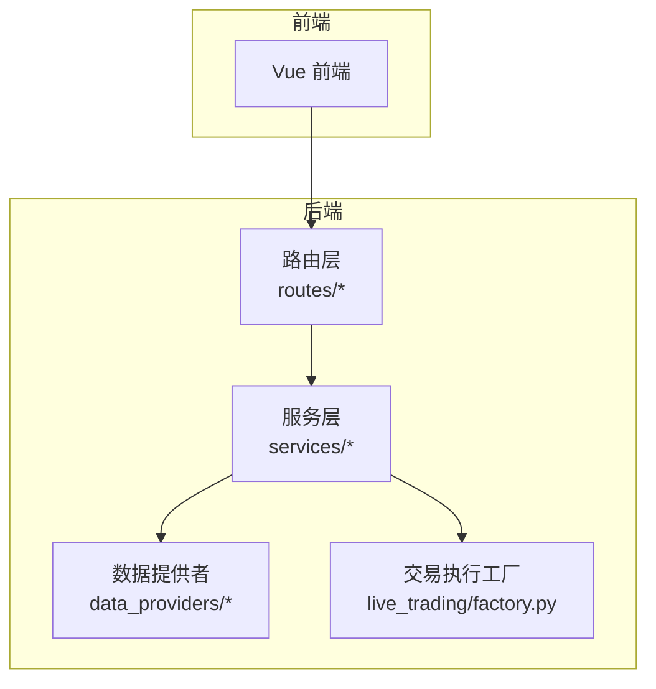
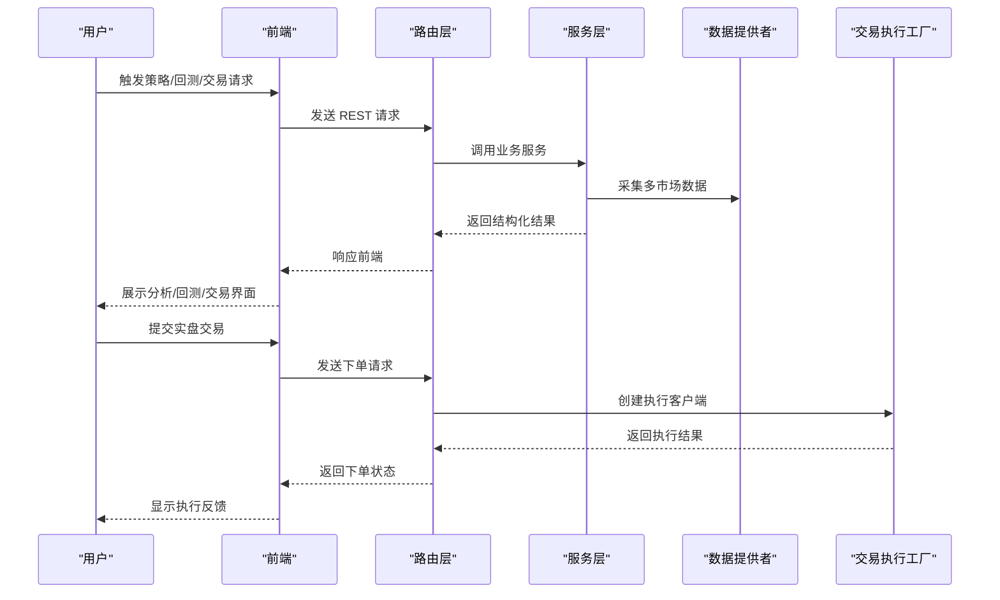
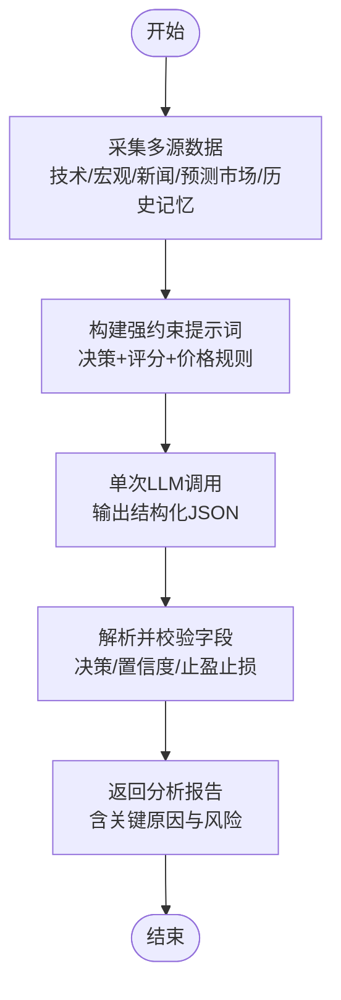
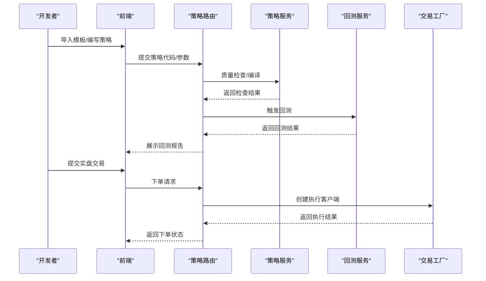
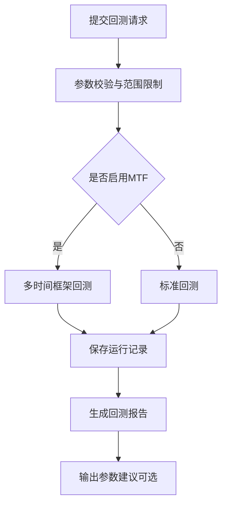
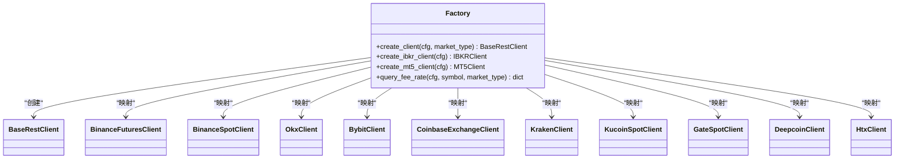
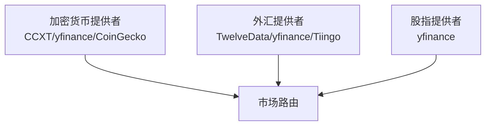
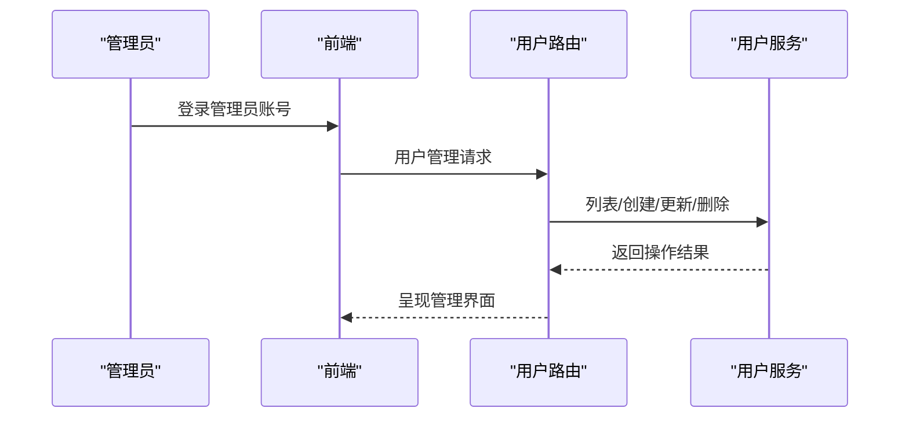
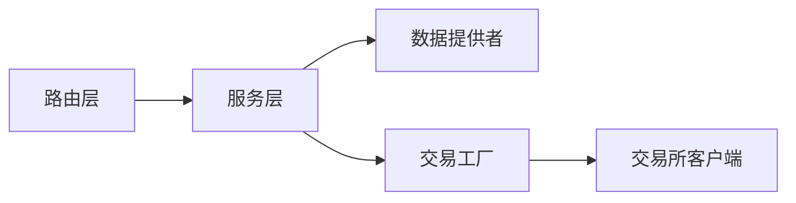

# 核心功能特性

<cite>
**本文引用的文件**
- [backend_api_python/app/services/fast_analysis.py](file://backend_api_python/app/services/fast_analysis.py)
- [backend_api_python/app/route/backtest.py](file://backend_api_python/app/routes/backtest.py)
- [backend_api_python/app/route/strategy.py](file://backend_api_python/app/routes/strategy.py)
- [backend_api_python/app/services/live_trading/factory.py](file://backend_api_python/app/services/live_trading/factory.py)
- [backend_api_python/app/route/market.py](file://backend_api_python/app/routes/market.py)
- [backend_api_python/app/route/user.py](file://backend_api_python/app/routes/user.py)
- [backend_api_python/app/data_providers/crypto.py](file://backend_api_python/app/data_providers/crypto.py)
- [backend_api_python/app/data_providers/forex.py](file://backend_api_python/app/data_providers/forex.py)
- [backend_api_python/app/data_providers/indices.py](file://backend_api_python/app/data_providers/indices.py)
- [backend_api_python/app/services/strategy.py](file://backend_api_python/app/services/strategy.py)
- [backend_api_python/app/route/ai_chat.py](file://backend_api_python/app/routes/ai_chat.py)
</cite>

## 目录
1. [简介](#简介)
2. [项目结构](#项目结构)
3. [核心组件](#核心组件)
4. [架构总览](#架构总览)
5. [详细组件分析](#详细组件分析)
6. [依赖分析](#依赖分析)
7. [性能考量](#性能考量)
8. [故障排查指南](#故障排查指南)
9. [结论](#结论)
10. [附录](#附录)

## 简介
QuantDinger 是一个面向本地部署的量化研究与交易平台，提供从 AI 辅助研究分析、Python 策略开发、回测系统、实时交易执行到多市场覆盖与多用户管理的全链路能力。本文聚焦七大核心功能模块，阐述其能力边界、典型使用场景与实现原理，并给出功能优先级排序与组合使用建议，帮助用户最大化平台价值。

## 项目结构
后端采用 Flask 微服务架构，路由层负责对外 API，服务层封装业务逻辑，数据层与数据提供者负责多市场数据接入与缓存，交易层对接多家交易所与仿真终端。前端通过 REST 接口与后端交互，形成“策略开发—回测—实盘执行—多市场覆盖—多用户管理”的闭环。

图表来源
- [backend_api_python/app/routes/backtest.py](file://backend_api_python/app/routes/backtest.py)
- [backend_api_python/app/services/fast_analysis.py](file://backend_api_python/app/services/fast_analysis.py)
- [backend_api_python/app/services/live_trading/factory.py](file://backend_api_python/app/services/live_trading/factory.py)
- [backend_api_python/app/data_providers/crypto.py](file://backend_api_python/app/data_providers/crypto.py)

章节来源
- [backend_api_python/app/routes/backtest.py](file://backend_api_python/app/routes/backtest.py)
- [backend_api_python/app/services/fast_analysis.py](file://backend_api_python/app/services/fast_analysis.py)
- [backend_api_python/app/services/live_trading/factory.py](file://backend_api_python/app/services/live_trading/factory.py)
- [backend_api_python/app/data_providers/crypto.py](file://backend_api_python/app/data_providers/crypto.py)

## 核心组件
- AI 研究分析：基于统一数据采集器的快速分析服务，整合技术面、宏观、新闻、预测市场与历史记忆，单次 LLM 输出结构化解析报告。
- Python 策略开发：提供策略模板、代码质量检查、编译与运行、回测与可视化、实盘连接测试与参数配置。
- 回测系统：支持标准与多时间框架回测，参数范围校验与持久化，支持多市场与多时间粒度。
- 实时交易执行：统一工厂模式对接多家交易所与仿真终端，支持现货/永续切换、账户信息查询与连接测试。
- 多市场覆盖：内置加密货币、外汇、股指等多类市场的数据提供者，支持多源回退与热点榜单。
- 多用户管理：管理员视角的用户 CRUD、角色权限、账务额度与 VIP 状态管理、导出与审计。

章节来源
- [backend_api_python/app/services/fast_analysis.py](file://backend_api_python/app/services/fast_analysis.py)
- [backend_api_python/app/routes/strategy.py](file://backend_api_python/app/routes/strategy.py)
- [backend_api_python/app/routes/backtest.py](file://backend_api_python/app/routes/backtest.py)
- [backend_api_python/app/services/live_trading/factory.py](file://backend_api_python/app/services/live_trading/factory.py)
- [backend_api_python/app/data_providers/crypto.py](file://backend_api_python/app/data_providers/crypto.py)
- [backend_api_python/app/data_providers/forex.py](file://backend_api_python/app/data_providers/forex.py)
- [backend_api_python/app/data_providers/indices.py](file://backend_api_python/app/data_providers/indices.py)
- [backend_api_python/app/routes/user.py](file://backend_api_python/app/routes/user.py)

## 架构总览
下图展示了从用户操作到数据采集、分析与执行的关键路径，以及与多市场数据提供者的交互关系。

图表来源
- [backend_api_python/app/services/fast_analysis.py](file://backend_api_python/app/services/fast_analysis.py)
- [backend_api_python/app/routes/backtest.py](file://backend_api_python/app/routes/backtest.py)
- [backend_api_python/app/services/live_trading/factory.py](file://backend_api_python/app/services/live_trading/factory.py)
- [backend_api_python/app/data_providers/crypto.py](file://backend_api_python/app/data_providers/crypto.py)

## 详细组件分析

### AI 研究分析（AI Research Analysis）
- 能力边界
  - 统一数据采集：技术指标、宏观因子、新闻、预测市场、公司基本面与历史记忆。
  - 结构化解析：单次 LLM 调用，输出包含决策、置信度、入场/止损/止盈、时间框架、关键原因与风险。
  - 多语言支持：中文/英文/日文等，严格约束输出语言。
- 典型场景
  - 快速评估单个资产在多因子影响下的机会点与风险，辅助决策入场与风控。
  - 对比不同市场（加密货币/股票/外汇）在相同宏观/新闻冲击下的表现差异。
- 实现原理
  - 数据采集层：统一 MarketDataCollector，按需拉取价格、K线、技术指标、宏观、新闻与预测市场事件。
  - 分析层：强约束 prompt，要求一次性输出 JSON，包含决策与评分体系；对地缘政治与重大新闻进行高权重处理。
  - 记忆层：相似历史条件下的决策与结果检索，作为上下文增强。
- 使用建议
  - 在回测前先用该分析模块确认宏观与新闻层面的共识方向，再细化参数进行回测。
  - 结合预测市场概率与衍生品结构数据，提升对加密货币的判断准确性。

图表来源
- [backend_api_python/app/services/fast_analysis.py](file://backend_api_python/app/services/fast_analysis.py)

章节来源
- [backend_api_python/app/services/fast_analysis.py](file://backend_api_python/app/services/fast_analysis.py)

### Python 策略开发（Python Strategy Development）
- 能力边界
  - 模板导入：内置策略模板分类与难度筛选，一键导入。
  - 代码质量检查：缺失函数、参数声明、交易意图等提示，支持自动修复建议。
  - 编译与运行：策略脚本编译与运行时校验，保障安全性。
  - 回测集成：策略与指标回测统一入口，支持参数覆盖与持久化。
  - 实盘连接测试：对多家交易所与仿真终端进行连接与权限校验。
- 典型场景
  - 快速迭代策略参数，结合回测结果进行 A/B 对比。
  - 在实盘前进行连接测试与账户信息核对，降低错误下单风险。
- 实现原理
  - 路由层提供模板列表、策略 CRUD、回测与历史查询。
  - 服务层封装策略编译、质量检查、运行时安全校验与回测结果持久化。
  - 交易层通过工厂模式创建具体执行客户端，支持现货/永续切换与账户信息查询。
- 使用建议
  - 先用模板快速搭建骨架，再逐步加入个性化信号与风控。
  - 在实盘前务必进行连接测试，确保密钥、IP 白名单与产品类型匹配。

图表来源
- [backend_api_python/app/routes/strategy.py](file://backend_api_python/app/routes/strategy.py)
- [backend_api_python/app/services/strategy.py](file://backend_api_python/app/services/strategy.py)
- [backend_api_python/app/services/live_trading/factory.py](file://backend_api_python/app/services/live_trading/factory.py)

章节来源
- [backend_api_python/app/routes/strategy.py](file://backend_api_python/app/routes/strategy.py)
- [backend_api_python/app/services/strategy.py](file://backend_api_python/app/services/strategy.py)
- [backend_api_python/app/services/live_trading/factory.py](file://backend_api_python/app/services/live_trading/factory.py)

### 回测系统（Backtesting System）
- 能力边界
  - 支持标准与多时间框架回测（尤其加密货币市场），自动校验时间窗口上限。
  - 参数安全校验与持久化，支持历史查询与详情查看。
  - 基于回测结果生成参数调优建议（启发式规则）。
- 典型场景
  - 在不同时间范围内对比策略稳定性与最大回撤。
  - 通过多组回测结果进行 A/B 验证，确定最优参数区间。
- 实现原理
  - 路由层接收回测请求，进行参数校验与范围限制。
  - 服务层根据市场类型选择标准或 MTF 回测路径，保存运行记录与结果。
  - 启发式建议模块基于关键指标（收益、回撤、胜率、盈亏比）给出参数调整方向。
- 使用建议
  - 优先使用 MTF 回测评估加密货币策略，关注多周期一致性。
  - 将回测结果纳入策略迭代闭环，持续优化参数与风控。

图表来源
- [backend_api_python/app/routes/backtest.py](file://backend_api_python/app/routes/backtest.py)

章节来源
- [backend_api_python/app/routes/backtest.py](file://backend_api_python/app/routes/backtest.py)

### 实时交易执行（Live Trading Execution）
- 能力边界
  - 支持多家交易所与仿真终端（加密/传统/外汇），自动识别产品类型（现货/永续）。
  - 连接测试与账户信息查询，失败时提供详细提示（如币安权限/IP 白名单）。
  - 统一工厂模式，按配置动态创建客户端。
- 典型场景
  - 在实盘前进行连接测试，确保密钥与产品类型匹配。
  - 针对不同市场（加密/外汇/股票）选择合适的执行通道。
- 实现原理
  - 工厂根据 exchange_id 与 market_type 创建对应客户端，支持模拟盘与主网切换。
  - 对特定交易所提供专用 REST 接口，避免依赖第三方库。
- 使用建议
  - 优先使用工厂提供的连接测试接口，提前发现权限与网络问题。
  - 对于币安等需要 IP 白名单的交易所，确保服务器出口 IP 已加入白名单。

图表来源
- [backend_api_python/app/services/live_trading/factory.py](file://backend_api_python/app/services/live_trading/factory.py)

章节来源
- [backend_api_python/app/services/live_trading/factory.py](file://backend_api_python/app/services/live_trading/factory.py)

### 多市场覆盖（Multi-Market Coverage）
- 能力边界
  - 加密货币：多源回退（CCXT/yfinance/CoinGecko），支持热点榜单与热词搜索。
  - 外汇：主流货币对（EUR/USD、GBP/USD 等）价格与涨跌幅。
  - 股指：主要全球股指（标普500、纳指、DAX、日经等）。
- 典型场景
  - 快速浏览多市场热点，辅助跨市场套利与宏观择时。
  - 在策略开发中引入多市场联动因子（如美元指数、VIX）。
- 实现原理
  - 各市场提供者按优先级回退，保证可用性。
  - 市场路由提供符号搜索、热门标的与自选价格批量获取。
- 使用建议
  - 在策略中加入宏观因子与预测市场事件，提升解释力与稳健性。

图表来源
- [backend_api_python/app/data_providers/crypto.py](file://backend_api_python/app/data_providers/crypto.py)
- [backend_api_python/app/data_providers/forex.py](file://backend_api_python/app/data_providers/forex.py)
- [backend_api_python/app/data_providers/indices.py](file://backend_api_python/app/data_providers/indices.py)
- [backend_api_python/app/route/market.py](file://backend_api_python/app/routes/market.py)

章节来源
- [backend_api_python/app/data_providers/crypto.py](file://backend_api_python/app/data_providers/crypto.py)
- [backend_api_python/app/data_providers/forex.py](file://backend_api_python/app/data_providers/forex.py)
- [backend_api_python/app/data_providers/indices.py](file://backend_api_python/app/data_providers/indices.py)
- [backend_api_python/app/route/market.py](file://backend_api_python/app/routes/market.py)

### 多用户管理（Multi-User Management）
- 能力边界
  - 管理员视角：用户列表、详情、创建、更新、删除、密码重置。
  - 账务管理：额度设置、VIP 状态、账务日志导出。
  - 权限控制：角色与权限枚举，仅管理员可访问。
- 典型场景
  - 团队协作中分配额度与 VIP 权限，审计用户行为。
  - 导出用户清单与账务日志，满足合规与运营需求。
- 实现原理
  - 路由层鉴权与参数校验，服务层执行数据库操作与日志记录。
- 使用建议
  - 严格区分管理员与普通用户权限，定期导出账务日志进行审计。

图表来源
- [backend_api_python/app/routes/user.py](file://backend_api_python/app/routes/user.py)

章节来源
- [backend_api_python/app/routes/user.py](file://backend_api_python/app/routes/user.py)

### AI 聊天（可选兼容层）
- 能力边界
  - 当前为兼容层，返回占位消息，未实现聊天功能。
- 典型场景
  - 保持前端兼容，后续可扩展为 AI 助手。
- 实现原理
  - 路由层返回固定响应，便于前端迁移。
- 使用建议
  - 本地模式下可忽略；上线后替换为真实 LLM 能力。

章节来源
- [backend_api_python/app/routes/ai_chat.py](file://backend_api_python/app/routes/ai_chat.py)

## 依赖分析
- 路由层依赖服务层，服务层依赖数据提供者与交易工厂。
- 交易工厂对多家交易所与仿真终端提供统一接口，降低耦合。
- 数据提供者按优先级回退，提升可用性与鲁棒性。

图表来源
- [backend_api_python/app/routes/backtest.py](file://backend_api_python/app/routes/backtest.py)
- [backend_api_python/app/services/fast_analysis.py](file://backend_api_python/app/services/fast_analysis.py)
- [backend_api_python/app/services/live_trading/factory.py](file://backend_api_python/app/services/live_trading/factory.py)
- [backend_api_python/app/data_providers/crypto.py](file://backend_api_python/app/data_providers/crypto.py)

章节来源
- [backend_api_python/app/routes/backtest.py](file://backend_api_python/app/routes/backtest.py)
- [backend_api_python/app/services/fast_analysis.py](file://backend_api_python/app/services/fast_analysis.py)
- [backend_api_python/app/services/live_trading/factory.py](file://backend_api_python/app/services/live_trading/factory.py)
- [backend_api_python/app/data_providers/crypto.py](file://backend_api_python/app/data_providers/crypto.py)

## 性能考量
- 并行与缓存
  - 市场价格批量获取使用线程池并行拉取，减少等待时间。
  - 加密货币市场列表缓存 4 小时，降低外部 API 压力。
- 回测范围限制
  - 不同时间框架设定最大回测天数，避免超长窗口导致资源耗尽。
- 连接测试并发控制
  - 交易所连接测试使用信号量限制并发，避免 CPU 与限流压力。
- 建议
  - 在大规模回测时合理设置并发与限流，避免触发外部服务限流。
  - 对高频数据源（如加密货币）启用缓存策略，减少重复请求。

[本节为通用指导，不涉及具体文件分析]

## 故障排查指南
- 回测失败
  - 检查时间范围是否超过限制；确认必填参数是否齐全；查看持久化错误日志。
- 实盘连接失败
  - 使用连接测试接口定位问题：密钥权限、IP 白名单、产品类型（现货/永续）、模拟盘/主网配置。
- 数据获取异常
  - 查看多源回退日志，确认当前使用的数据源与回退链路。
- 用户管理异常
  - 确认管理员权限与参数校验；检查导出 CSV 的编码与列顺序。

章节来源
- [backend_api_python/app/routes/backtest.py](file://backend_api_python/app/routes/backtest.py)
- [backend_api_python/app/services/live_trading/factory.py](file://backend_api_python/app/services/live_trading/factory.py)
- [backend_api_python/app/data_providers/crypto.py](file://backend_api_python/app/data_providers/crypto.py)
- [backend_api_python/app/routes/user.py](file://backend_api_python/app/routes/user.py)

## 结论
QuantDinger 通过统一的数据采集、严谨的回测与实盘执行、丰富的多市场覆盖与完善的多用户管理，形成了从研究到执行的一体化能力矩阵。建议优先使用 AI 研究分析明确方向，再以 Python 策略开发与回测系统进行参数优化，最后通过实盘连接测试与多市场监控完成闭环。多用户管理与账务审计则为团队协作与合规运营提供支撑。

[本节为总结性内容，不涉及具体文件分析]

## 附录
- 功能优先级排序（建议）
  1) AI 研究分析：快速洞察多因子影响，指导策略方向。
  2) Python 策略开发：模板导入与质量检查，加速策略迭代。
  3) 回测系统：参数验证与历史回测，保障策略稳健性。
  4) 实时交易执行：连接测试与统一工厂，降低实盘风险。
  5) 多市场覆盖：宏观与预测市场数据，提升解释力。
  6) 多用户管理：额度与 VIP 管理，支撑团队协作。
- 组合使用方式
  - 研究—回测—实盘：先用 AI 分析确定方向，再用回测验证参数，最后用实盘连接测试落地。
  - 多市场联动：在策略中加入宏观与预测市场事件，结合多时间框架回测评估一致性。
  - 团队协作：通过多用户管理分配额度与权限，定期导出账务日志进行审计。

[本节为概念性内容，不涉及具体文件分析]