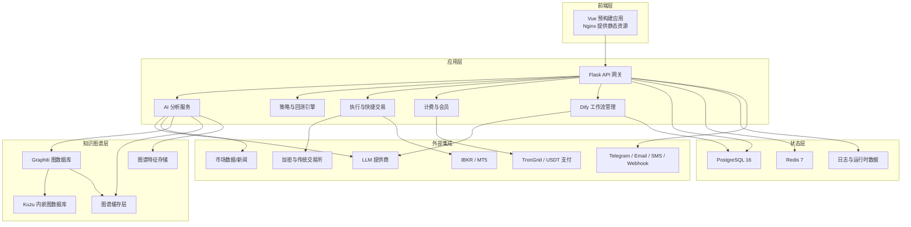
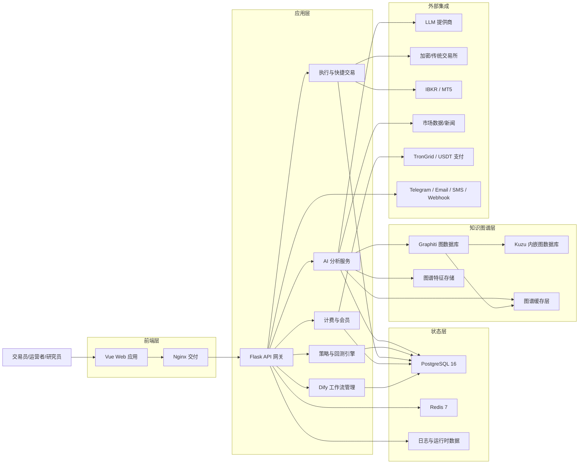
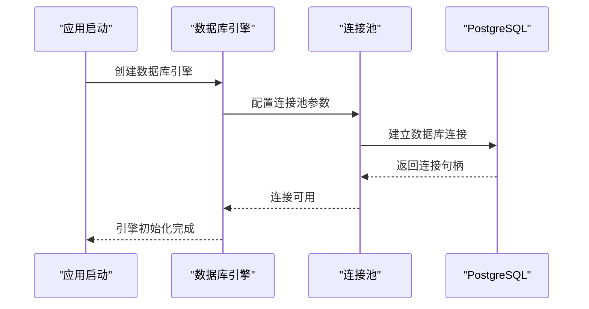
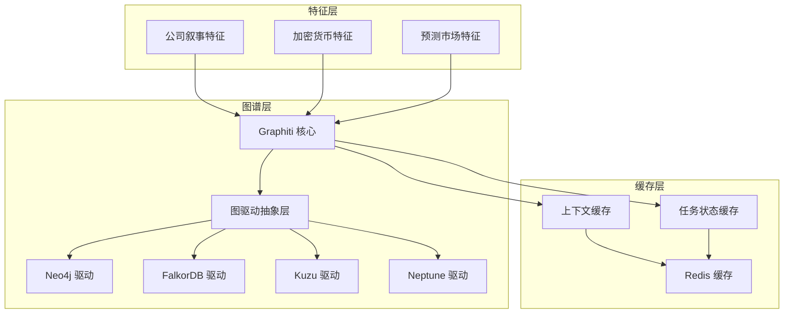
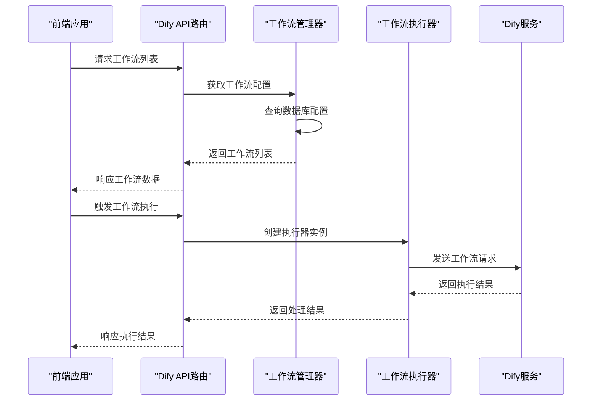
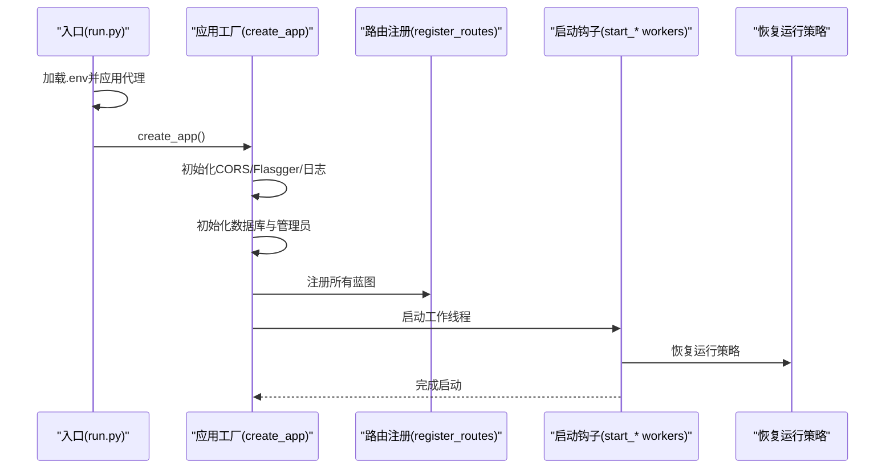
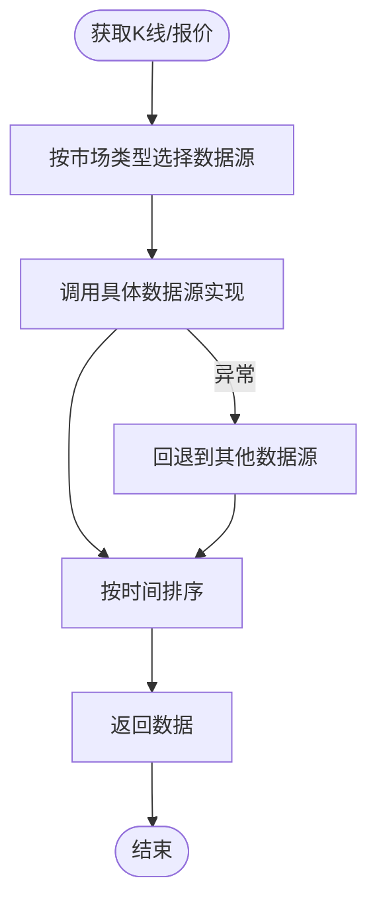
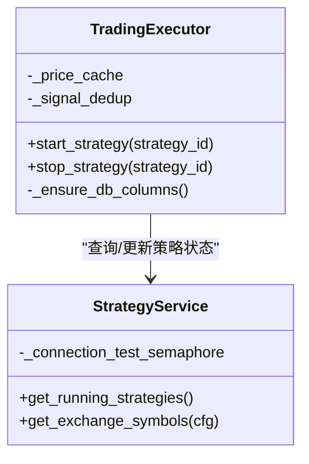
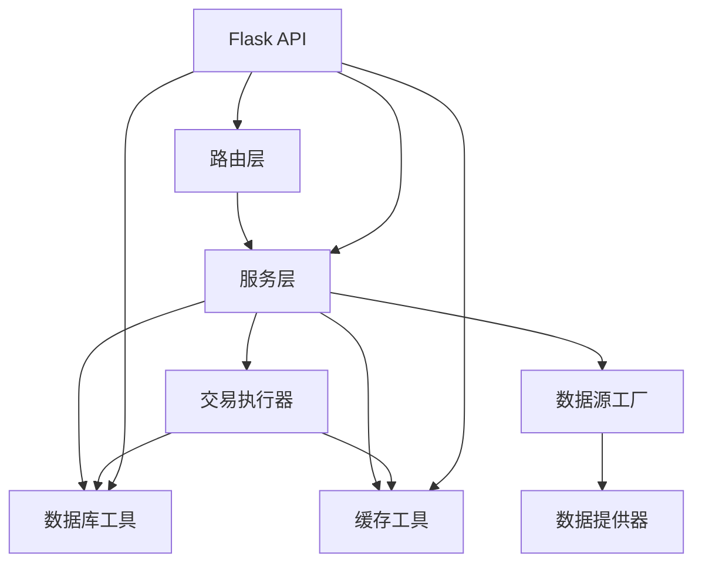

# 系统架构概览

<cite>
**本文引用的文件**
- [README.md](file://README.md)
- [backend_api_python/README.md](file://backend_api_python/README.md)
- [frontend/README.md](file://frontend/README.md)
- [docker-compose.yml](file://docker-compose.yml)
- [backend_api_python/run.py](file://backend_api_python/run.py)
- [backend_api_python/app/__init__.py](file://backend_api_python/app/__init__.py)
- [backend_api_python/app/config/settings.py](file://backend_api_python/app/config/settings.py)
- [backend_api_python/app/data_sources/factory.py](file://backend_api_python/app/data_sources/factory.py)
- [backend_api_python/app/routes/__init__.py](file://backend_api_python/app/routes/__init__.py)
- [backend_api_python/app/services/__init__.py](file://backend_api_python/app/services/__init__.py)
- [backend_api_python/app/services/strategy.py](file://backend_api_python/app/services/strategy.py)
- [backend_api_python/app/services/trading_executor.py](file://backend_api_python/app/services/trading_executor.py)
- [backend_api_python/app/utils/db.py](file://backend_api_python/app/utils/db.py)
- [backend_api_python/app/utils/cache.py](file://backend_api_python/app/utils/cache.py)
- [backend_api_python/app/data_providers/news.py](file://backend_api_python/app/data_providers/news.py)
- [backend_api_python/app/data_providers/crypto.py](file://backend_api_python/app/data_providers/crypto.py)
- [backend_api_python/requirements.txt](file://backend_api_python/requirements.txt)
- [frontend/package.json](file://frontend/package.json)
- [backend_api_python/app/database/engine.py](file://backend_api_python/app/database/engine.py)
- [backend_api_python/app/graph/graphiti_gateway.py](file://backend_api_python/app/graph/graphiti_gateway.py)
- [backend_api_python/app/graph/context_builder.py](file://backend_api_python/app/graph/context_builder.py)
- [backend_api_python/app/graph/cache_gateway.py](file://backend_api_python/app/graph/cache_gateway.py)
- [backend_api_python/app/graph/queries.py](file://backend_api_python/app/graph/queries.py)
- [backend_api_python/app/models/graph_domain.py](file://backend_api_python/app/models/graph_domain.py)
- [backend_api_python/app/models/dify.py](file://backend_api_python/app/models/dify.py)
- [backend_api_python/app/services/dify/workflow_manager.py](file://backend_api_python/app/services/dify/workflow_manager.py)
- [backend_api_python/app/services/dify/workflow_executor.py](file://backend_api_python/app/services/dify/workflow_executor.py)
- [backend_api_python/app/database/repositories/dify_workflow_repository.py](file://backend_api_python/app/database/repositories/dify_workflow_repository.py)
- [backend_api_python/app/routes/dify_workflow.py](file://backend_api_python/app/routes/dify_workflow.py)
- [frontend/src/api/dify.js](file://frontend/src/api/dify.js)
- [docs/GRAPHITI_IMPLEMENTATION_BLUEPRINT_CN.md](file://docs/GRAPHITI_IMPLEMENTATION_BLUEPRINT_CN.md)
- [backend_api_python/migrations/versions/002_sync_timestamp_columns.py](file://backend_api_python/migrations/versions/002_sync_timestamp_columns.py)
</cite>

## 更新摘要
**所做更改**
- 新增数据库现代化章节，介绍ORM迁移和数据库连接池优化
- 新增知识图谱架构章节，涵盖Graphiti统一实施蓝图
- 新增AI工作流集成章节，详细说明Dify工作流管理系统
- 更新架构总览图，反映新增的知识图谱和AI工作流组件
- 新增图谱缓存和特征存储章节
- 更新技术栈选择，增加Graphiti和Kuzu图数据库支持

## 目录
1. [简介](#简介)
2. [项目结构](#项目结构)
3. [核心组件](#核心组件)
4. [架构总览](#架构总览)
5. [数据库现代化](#数据库现代化)
6. [知识图谱架构](#知识图谱架构)
7. [AI工作流集成](#ai工作流集成)
8. [详细组件分析](#详细组件分析)
9. [依赖关系分析](#依赖关系分析)
10. [性能考量](#性能考量)
11. [故障排查指南](#故障排查指南)
12. [结论](#结论)
13. [附录](#附录)

## 简介
QuantDinger 是一个自托管、本地优先的量化交易与算法交易平台，面向希望在同一套系统中完成"AI研究、Python策略开发、回测、实盘执行、组合监控与告警、多用户运营与商业化"的团队与运营者。其核心承诺是"一套栈替代五套栈"，将AI分析、图表、策略逻辑、运行时服务与告警整合到一个可部署的产品中。

**更新** 系统已完成重大架构升级，引入数据库现代化、知识图谱和AI工作流等核心组件，显著增强了数据处理能力和智能化水平。

- 自托管设计：凭证、策略代码、市场工作流与运营数据均在用户自有基础设施内。
- 研究到执行一体化：AI分析、图表、策略逻辑、回测、快捷交易与实盘运营紧密衔接。
- Python原生与AI辅助：既支持纯Python策略开发，也支持AI加速草稿与迭代。
- 商业化就绪：会员制、积分、USDT支付与管理员控制等能力已内置。
- **新增** 知识图谱增强：通过Graphiti统一实施蓝图，提供多维度市场洞察。
- **新增** AI工作流：集成Dify工作流管理系统，支持复杂的AI分析流程。

**章节来源**
- [README.md: 34-79:34-79](file://README.md#L34-L79)

## 项目结构
仓库采用前后端分离与容器化部署的组织方式：
- 后端（Python/Flask）：位于 backend_api_python，提供REST API、策略运行时、AI分析、回测、交易执行与多用户支持，现包含数据库现代化、知识图谱和AI工作流组件。
- 前端（Vue）：位于 frontend，通过Nginx提供预构建静态资源交付。
- 部署：docker-compose 统一编排数据库、缓存、后端与前端服务。

**图表来源**
- [README.md: 269-321:269-321](file://README.md#L269-L321)
- [docker-compose.yml: 23-163:23-163](file://docker-compose.yml#L23-L163)
- [docs/GRAPHITI_IMPLEMENTATION_BLUEPRINT_CN.md: 13-31:13-31](file://docs/GRAPHITI_IMPLEMENTATION_BLUEPRINT_CN.md#L13-L31)

**章节来源**
- [README.md: 466-484:466-484](file://README.md#L466-L484)
- [backend_api_python/README.md: 15-33:15-33](file://backend_api_python/README.md#L15-L33)
- [frontend/README.md: 183-205:183-205](file://frontend/README.md#L183-L205)

## 核心组件
- 应用入口与工厂：Flask 应用工厂负责路由注册、启动钩子（工作线程、恢复运行策略）、安全与日志初始化。
- 配置系统：集中于环境变量驱动的配置类，支持主机、端口、密钥、日志、速率限制、功能开关等。
- 数据源工厂：按市场类型（加密、美股、港股、美债、外汇、商品）选择具体数据源实现，统一K线与实时报价接口。
- 服务层：策略编译、快速AI分析、实验与演化、回测、K线服务、交易执行器等，现包含图谱服务和Dify工作流服务。
- 工具与中间件：数据库连接池与PostgreSQL适配、缓存（内存/Redis可选）、请求代理与国际化等。
- 外部数据与集成：新闻与经济日历、多源加密行情、LLM提供商、支付与通知通道等。

**更新** 新增图谱网关、上下文构建器、缓存网关等知识图谱相关组件，以及Dify工作流管理器和执行器。

**章节来源**
- [backend_api_python/app/__init__.py: 213-288:213-288](file://backend_api_python/app/__init__.py#L213-L288)
- [backend_api_python/app/config/settings.py: 1-99:1-99](file://backend_api_python/app/config/settings.py#L1-L99)
- [backend_api_python/app/data_sources/factory.py: 13-134:13-134](file://backend_api_python/app/data_sources/factory.py#L13-L134)
- [backend_api_python/app/services/__init__.py: 1-26:1-26](file://backend_api_python/app/services/__init__.py#L1-L26)
- [backend_api_python/app/utils/db.py: 1-66:1-66](file://backend_api_python/app/utils/db.py#L1-L66)
- [backend_api_python/app/utils/cache.py: 1-129:1-129](file://backend_api_python/app/utils/cache.py#L1-L129)

## 架构总览
QuantDinger 的架构以"前后端分离 + 微服务化（按领域划分的服务层）+ 数据流分层"为核心设计原则，现已扩展为包含知识图谱和AI工作流的三层架构：

- 前端层：Vue 应用通过 Nginx 提供静态资源，与后端 API 通过 /api 前缀交互。
- 应用层：Flask API 网关聚合各业务服务（AI分析、策略回测、交易执行、计费、Dify工作流），并作为统一入口处理认证、权限与健康检查。
- 状态层：PostgreSQL 存储用户、策略、历史与运行时数据；Redis 用于可选的缓存与工作线程协调。
- **新增** 知识图谱层：Graphiti统一实施蓝图，支持多图数据库驱动（Neo4j、FalkorDB、Kuzu、Neptune），提供图谱缓存和特征存储。
- 外部集成：LLM提供商、市场数据/新闻、交易所/经纪商、支付与通知通道。

**图表来源**
- [README.md: 269-321:269-321](file://README.md#L269-L321)
- [docs/GRAPHITI_IMPLEMENTATION_BLUEPRINT_CN.md: 35-42:35-42](file://docs/GRAPHITI_IMPLEMENTATION_BLUEPRINT_CN.md#L35-L42)

**章节来源**
- [README.md: 246-258:246-258](file://README.md#L246-L258)
- [backend_api_python/README.md: 15-33:15-33](file://backend_api_python/README.md#L15-L33)

## 数据库现代化
QuantDinger 已完成数据库现代化升级，引入ORM基础设施与连接池优化：

### SQLAlchemy 连接池配置
- **连接池优化**：基于 QueuePool 的连接池配置，支持动态池大小调整
- **超时控制**：连接获取超时、连接预检测机制
- **连接参数**：keepalives配置，确保连接稳定性
- **URL标准化**：自动处理postgres://到postgresql://的转换

### 迁移脚本增强
- **时间戳同步**：修复历史表缺失updated_at字段的问题
- **表结构一致性**：统一各表的时间戳字段
- **数据完整性**：修正Polymarket相关表的命名和结构

**图表来源**
- [backend_api_python/app/database/engine.py: 19-47:19-47](file://backend_api_python/app/database/engine.py#L19-L47)
- [backend_api_python/migrations/versions/002_sync_timestamp_columns.py: 17-90:17-90](file://backend_api_python/migrations/versions/002_sync_timestamp_columns.py#L17-L90)

**章节来源**
- [backend_api_python/app/database/engine.py: 1-52:1-52](file://backend_api_python/app/database/engine.py#L1-L52)
- [backend_api_python/migrations/versions/002_sync_timestamp_columns.py: 1-143:1-143](file://backend_api_python/migrations/versions/002_sync_timestamp_columns.py#L1-L143)

## 知识图谱架构
QuantDinger 采用Graphiti统一实施蓝图，构建多维度市场知识图谱：

### 图数据库支持矩阵
- **多供应商支持**：Neo4j、FalkorDB、Kuzu、Neptune四种图数据库驱动
- **统一抽象层**：GraphDriver抽象类提供统一的图操作接口
- **无缝切换**：通过环境变量配置不同的图数据库后端

### 图谱缓存策略
- **缓存优先**：AI分析和查询优先从Redis缓存获取
- **任务状态管理**：专门的Redis键空间管理图谱任务状态
- **上下文缓存**：市场符号的图谱上下文信息缓存

### 图谱特征存储
- **领域特定模型**：公司叙事特征、加密货币叙事特征、预测市场特征
- **时间序列存储**：按交易日期和资产标识符存储特征值
- **唯一约束**：确保特征数据的唯一性和完整性

**图表来源**
- [docs/GRAPHITI_IMPLEMENTATION_BLUEPRINT_CN.md: 13-31:13-31](file://docs/GRAPHITI_IMPLEMENTATION_BLUEPRINT_CN.md#L13-L31)
- [backend_api_python/app/graph/graphiti_gateway.py: 10-48:10-48](file://backend_api_python/app/graph/graphiti_gateway.py#L10-L48)

**章节来源**
- [docs/GRAPHITI_IMPLEMENTATION_BLUEPRINT_CN.md: 1-51:1-51](file://docs/GRAPHITI_IMPLEMENTATION_BLUEPRINT_CN.md#L1-L51)
- [backend_api_python/app/graph/graphiti_gateway.py: 1-48:1-48](file://backend_api_python/app/graph/graphiti_gateway.py#L1-L48)
- [backend_api_python/app/graph/context_builder.py: 1-106:1-106](file://backend_api_python/app/graph/context_builder.py#L1-L106)
- [backend_api_python/app/graph/cache_gateway.py: 1-26:1-26](file://backend_api_python/app/graph/cache_gateway.py#L1-L26)
- [backend_api_python/app/models/graph_domain.py: 1-53:1-53](file://backend_api_python/app/models/graph_domain.py#L1-L53)

## AI工作流集成
QuantDinger 集成Dify工作流管理系统，提供强大的AI分析能力：

### 工作流管理系统
- **配置管理**：支持工作流的创建、查询、更新和删除
- **类型支持**：聊天、工作流、补全等多种工作流类型
- **版本控制**：支持输入输出模式的Schema定义
- **状态跟踪**：完整的工作流执行日志和状态管理

### 执行模式
- **批处理模式**：阻塞式执行，适用于长时间运行的任务
- **流式传输**：SSE流式响应，适用于实时AI分析
- **重试机制**：可配置的最大重试次数和超时设置

### 日志与监控
- **执行日志**：记录每次工作流调用的输入输出
- **性能指标**：token使用量、延迟时间等关键指标
- **错误处理**：详细的错误信息记录和状态追踪

**图表来源**
- [frontend/src/api/dify.js: 1-90:1-90](file://frontend/src/api/dify.js#L1-L90)
- [backend_api_python/app/routes/dify_workflow.py: 25-46:25-46](file://backend_api_python/app/routes/dify_workflow.py#L25-L46)
- [backend_api_python/app/services/dify/workflow_manager.py: 13-122:13-122](file://backend_api_python/app/services/dify/workflow_manager.py#L13-L122)

**章节来源**
- [frontend/src/api/dify.js: 1-90:1-90](file://frontend/src/api/dify.js#L1-L90)
- [backend_api_python/app/routes/dify_workflow.py: 1-46:1-46](file://backend_api_python/app/routes/dify_workflow.py#L1-L46)
- [backend_api_python/app/services/dify/workflow_manager.py: 1-122:1-122](file://backend_api_python/app/services/dify/workflow_manager.py#L1-L122)
- [backend_api_python/app/services/dify/workflow_executor.py: 1-42:1-42](file://backend_api_python/app/services/dify/workflow_executor.py#L1-L42)
- [backend_api_python/app/models/dify.py: 1-84:1-84](file://backend_api_python/app/models/dify.py#L1-L84)
- [backend_api_python/app/database/repositories/dify_workflow_repository.py: 1-79:1-79](file://backend_api_python/app/database/repositories/dify_workflow_repository.py#L1-L79)

## 详细组件分析

### 应用入口与启动流程
- 应用工厂：创建Flask实例、启用CORS、Swagger文档、初始化数据库与管理员账户、注册所有蓝图、启动工作线程与恢复运行策略。
- 启动钩子：挂载待处理订单工作线程、组合监控、USDT订单工作线程、Polymarket分析工作线程、AI校准与反思工作线程，并尝试恢复本地运行的IndicatorStrategy。
- 安全检查：生产模式下若SECRET_KEY仍为默认值，会自动生成随机密钥并提示持久化配置。

**图表来源**
- [backend_api_python/run.py: 96-134:96-134](file://backend_api_python/run.py#L96-L134)
- [backend_api_python/app/__init__.py: 213-288:213-288](file://backend_api_python/app/__init__.py#L213-L288)

**章节来源**
- [backend_api_python/run.py: 104-134:104-134](file://backend_api_python/run.py#L104-L134)
- [backend_api_python/app/__init__.py: 268-288:268-288](file://backend_api_python/app/__init__.py#L268-L288)

### 配置与环境管理
- 配置类：集中读取环境变量，包括服务地址、端口、调试模式、密钥、日志级别、速率限制、缓存与请求日志开关等。
- 环境加载：优先加载项目根目录下的 .env，其次回退到仓库根目录 .env，便于不同部署形态。

**章节来源**
- [backend_api_python/app/config/settings.py: 1-99:1-99](file://backend_api_python/app/config/settings.py#L1-L99)
- [backend_api_python/run.py: 17-29:17-29](file://backend_api_python/run.py#L17-L29)

### 数据源与数据流
- 数据源工厂：按市场类型返回对应数据源，统一提供K线与实时报价接口，并对结果进行排序与错误兜底。
- 多源行情：加密货币行情优先走内部数据源，回退至 yfinance、CCXT、CoinGecko 等；新闻与经济日历提供基础模板与影响评估。
- 价格缓存：交易执行器内置轻量内存缓存，降低频繁查询成本。

**图表来源**
- [backend_api_python/app/data_sources/factory.py: 74-134:74-134](file://backend_api_python/app/data_sources/factory.py#L74-L134)
- [backend_api_python/app/data_providers/crypto.py: 118-169:118-169](file://backend_api_python/app/data_providers/crypto.py#L118-L169)
- [backend_api_python/app/data_providers/news.py: 13-71:13-71](file://backend_api_python/app/data_providers/news.py#L13-L71)

**章节来源**
- [backend_api_python/app/data_sources/factory.py: 13-134:13-134](file://backend_api_python/app/data_sources/factory.py#L13-L134)
- [backend_api_python/app/data_providers/crypto.py: 1-200:1-200](file://backend_api_python/app/data_providers/crypto.py#L1-L200)
- [backend_api_python/app/data_providers/news.py: 1-150:1-150](file://backend_api_python/app/data_providers/news.py#L1-L150)

### 交易执行与策略运行
- 交易执行器：线程化策略执行，维护价格缓存与信号去重，规范化交易所符号，确保数据库字段存在，记录资源状态以便定位线程/内存问题。
- 策略服务：提供运行中策略查询、交换对查询、连接测试并发控制等；与执行器配合实现策略生命周期管理。

**图表来源**
- [backend_api_python/app/services/trading_executor.py: 37-200:37-200](file://backend_api_python/app/services/trading_executor.py#L37-L200)
- [backend_api_python/app/services/strategy.py: 14-200:14-200](file://backend_api_python/app/services/strategy.py#L14-L200)

**章节来源**
- [backend_api_python/app/services/trading_executor.py: 1-200:1-200](file://backend_api_python/app/services/trading_executor.py#L1-L200)
- [backend_api_python/app/services/strategy.py: 1-200:1-200](file://backend_api_python/app/services/strategy.py#L1-L200)

### 缓存与数据库
- 缓存策略：本地优先（内存缓存），当显式启用时使用Redis；不可用时自动回退到内存缓存，保证启动稳定性。
- 数据库：PostgreSQL 连接池与同步连接封装，初始化时验证可用性，提供统一的数据库类型标识。

**章节来源**
- [backend_api_python/app/utils/cache.py: 1-129:1-129](file://backend_api_python/app/utils/cache.py#L1-L129)
- [backend_api_python/app/utils/db.py: 1-66:1-66](file://backend_api_python/app/utils/db.py#L1-L66)

### API 路由与服务聚合
- 路由注册：统一在应用工厂中注册健康检查、认证、用户、指标、回测、市场、AI、策略、凭证、仪表盘、设置、组合、IBKR、MT5、全球市场、社区、快速交易、Polymarket、实验、LLM 等蓝图。
- 服务聚合：服务层导出K线、回测、策略编译、快速AI分析、实验相关服务等，供路由层调用。

**章节来源**
- [backend_api_python/app/routes/__init__.py: 7-55:7-55](file://backend_api_python/app/routes/__init__.py#L7-L55)
- [backend_api_python/app/services/__init__.py: 1-26:1-26](file://backend_api_python/app/services/__init__.py#L1-L26)

### 技术栈选择与架构决策
- 前端：Vue 2 + Ant Design Vue + ECharts/KLineCharts，满足专业图表与多语言需求；通过Nginx提供静态资源，降低后端压力。
- 后端：Flask + Gunicorn，轻量且易于本地开发与生产部署；通过蓝图模块化组织API。
- 数据库：PostgreSQL 16，支持多用户、角色与复杂查询；迁移脚本初始化表结构。
- 缓存：Redis 7 可选，用于高并发场景；本地模式默认内存缓存。
- **新增** 图数据库：Graphiti支持多种图数据库驱动，提供统一的图操作接口。
- **新增** AI工作流：Dify集成提供强大的AI分析和自动化能力。
- 外部集成：LLM提供商、加密与传统市场数据、IBKR/MT5、支付与通知通道，通过适配器与服务层解耦。

**章节来源**
- [README.md: 246-258:246-258](file://README.md#L246-L258)
- [frontend/README.md: 207-219:207-219](file://frontend/README.md#L207-L219)
- [backend_api_python/README.md: 15-33:15-33](file://backend_api_python/README.md#L15-L33)
- [docker-compose.yml: 27-67:27-67](file://docker-compose.yml#L27-L67)

## 依赖关系分析
- 组件耦合：路由层依赖服务层；服务层依赖工具层（数据库、缓存、日志）；数据源工厂与数据提供器相互独立，通过统一接口对接。
- 外部依赖：Flask、SQLAlchemy、Redis、gunicorn、ccxt、yfinance、finnhub、psycopg2、bcrypt、ib_insync、MetaTrader5 等。
- 部署依赖：docker-compose 编排数据库、缓存、后端与前端，提供健康检查与端口映射。

**图表来源**
- [backend_api_python/app/routes/__init__.py: 7-55:7-55](file://backend_api_python/app/routes/__init__.py#L7-L55)
- [backend_api_python/app/services/__init__.py: 1-26:1-26](file://backend_api_python/app/services/__init__.py#L1-L26)
- [backend_api_python/app/data_sources/factory.py: 13-134:13-134](file://backend_api_python/app/data_sources/factory.py#L13-L134)
- [backend_api_python/app/utils/db.py: 19-25:19-25](file://backend_api_python/app/utils/db.py#L19-L25)
- [backend_api_python/app/utils/cache.py: 49-129:49-129](file://backend_api_python/app/utils/cache.py#L49-L129)

**章节来源**
- [backend_api_python/requirements.txt: 1-40:1-40](file://backend_api_python/requirements.txt#L1-L40)
- [docker-compose.yml: 23-163:23-163](file://docker-compose.yml#L23-L163)

## 性能考量
- 连接池与并发：PostgreSQL 连接池参数可调，默认适合约50并发；可根据机器人数量与负载调整最大连接数与获取超时。
- 线程与资源：交易执行器限制最大线程数，记录资源状态，避免"无法启动新线程"与内存溢出。
- 缓存策略：本地优先内存缓存，Redis可选；在高并发场景建议启用Redis并合理设置TTL。
- 代理与网络：支持统一代理环境变量，国内金融数据源绕过代理以减少延迟。
- 前端交付：Nginx提供静态资源，减少后端I/O压力。
- **新增** 图谱缓存：Redis缓存大幅减少图数据库查询压力，支持高频访问的图谱数据。
- **新增** 工作流优化：Dify工作流支持流式传输，减少大响应的内存占用。

**章节来源**
- [docker-compose.yml: 108-120:108-120](file://docker-compose.yml#L108-L120)
- [backend_api_python/app/services/trading_executor.py: 59-174:59-174](file://backend_api_python/app/services/trading_executor.py#L59-L174)
- [backend_api_python/app/utils/cache.py: 71-99:71-99](file://backend_api_python/app/utils/cache.py#L71-L99)
- [backend_api_python/run.py: 60-91:60-91](file://backend_api_python/run.py#L60-L91)

## 故障排查指南
- 数据库连接失败：检查 DATABASE_URL 格式与PostgreSQL服务状态。
- 出站请求失败：配置 PROXY_URL；国内金融数据源会自动绕过代理。
- 禁用自动恢复：设置 DISABLE_RESTORE_RUNNING_STRATEGIES=true。
- 禁用待处理订单工作线程：设置 ENABLE_PENDING_ORDER_WORKER=false。
- 启动安全：生产模式下 SECRET_KEY 必须修改为强密钥，否则会自动生成并提示持久化。
- **新增** 图谱服务：检查 GRAPHITI_ENABLED 环境变量，确认图数据库连接配置。
- **新增** 工作流服务：验证Dify工作流配置的endpoint和api_key设置。

**章节来源**
- [backend_api_python/README.md: 231-237:231-237](file://backend_api_python/README.md#L231-L237)
- [backend_api_python/run.py: 109-120:109-120](file://backend_api_python/run.py#L109-L120)

## 结论
QuantDinger 通过前后端分离与微服务化设计，将AI研究、策略开发、回测与实盘执行整合为统一产品。**更新后的架构**在原有基础上增加了数据库现代化、知识图谱和AI工作流三大核心能力：

- **数据库现代化**：引入ORM基础设施和连接池优化，提升数据处理效率和稳定性
- **知识图谱**：通过Graphiti统一实施蓝图，提供多维度市场洞察和智能分析
- **AI工作流**：集成Dify工作流管理系统，支持复杂的AI分析和自动化流程

其技术栈选择兼顾易用性与可扩展性：前端采用成熟UI生态，后端以Flask/Gunicorn为基础，数据库与缓存采用业界标准，图数据库和AI工作流提供智能化增强。部署上以Docker Compose实现一键启动，具备良好的可运维性与可扩展性。

未来可在以下方向演进：进一步优化图谱查询性能、扩展更多AI工作流应用场景、完善图谱特征工程体系、增强多租户与权限模型、扩展更多市场与数据源适配。

## 附录
- 快速启动：复制示例环境变量、生成安全密钥、docker-compose 启动。
- 健康检查：后端健康端点 http://localhost:5000/api/health。
- 默认登录：quantumquant / 123456（首次启动时由环境变量创建的管理员账号）。
- **新增** 图谱启用：设置 GRAPHITI_ENABLED=true 启用知识图谱功能。
- **新增** 工作流配置：通过 /api/dify 接口管理Dify工作流配置。

**章节来源**
- [README.md: 323-370:323-370](file://README.md#L323-L370)
- [backend_api_python/README.md: 68-73:68-73](file://backend_api_python/README.md#L68-L73)