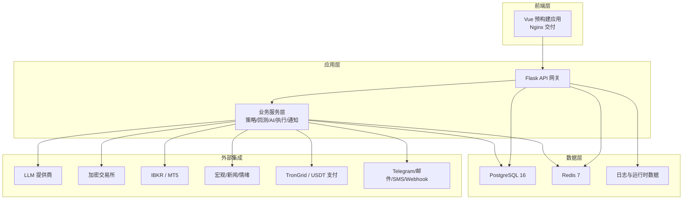
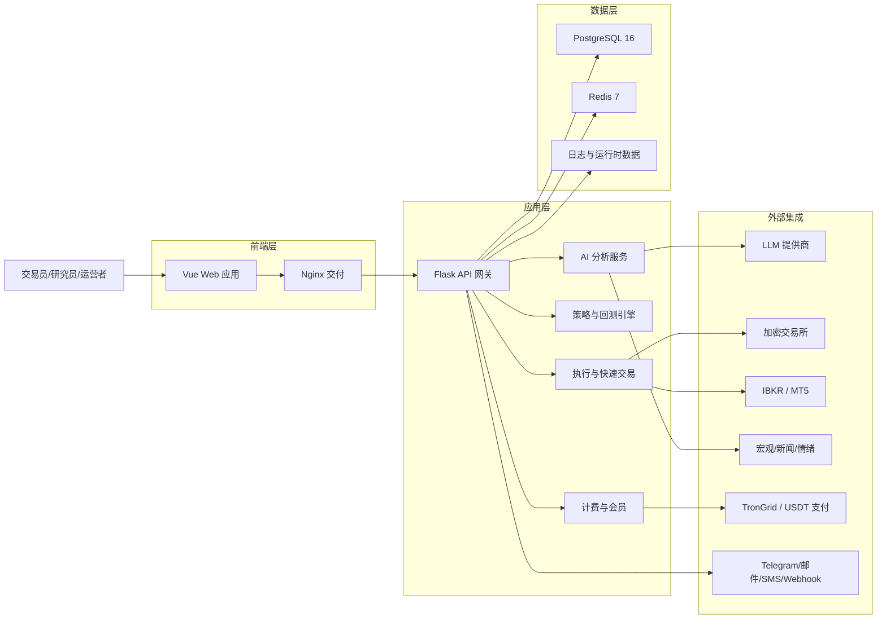
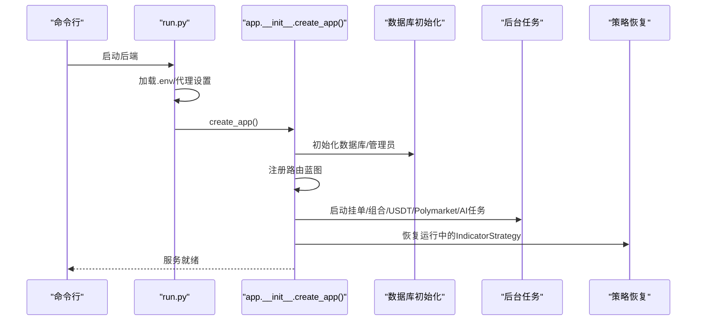
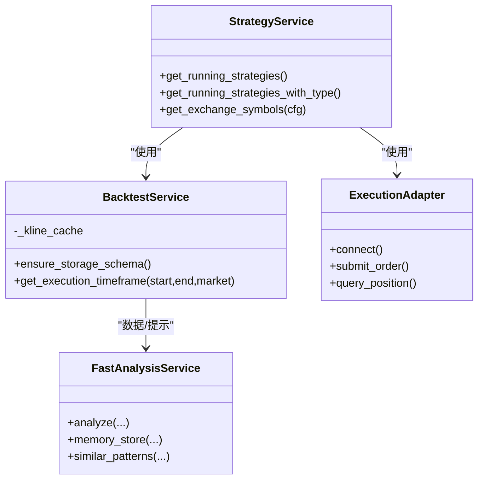
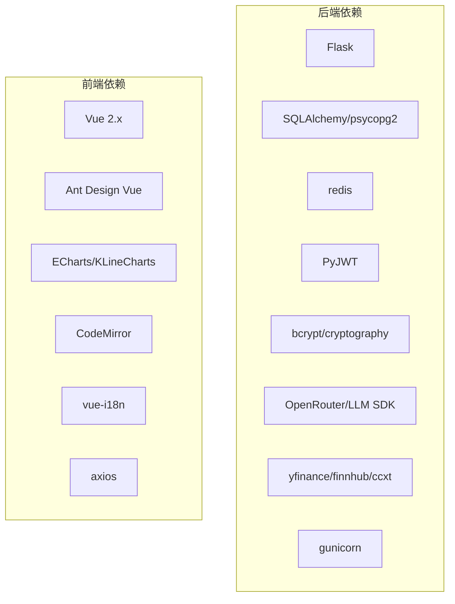

# 项目概述

<cite>
**本文引用的文件**
- [README.md](file://README.md)
- [backend_api_python/README.md](file://backend_api_python/README.md)
- [frontend/README.md](file://frontend/README.md)
- [backend_api_python/run.py](file://backend_api_python/run.py)
- [backend_api_python/app/__init__.py](file://backend_api_python/app/__init__.py)
- [backend_api_python/app/config/settings.py](file://backend_api_python/app/config/settings.py)
- [backend_api_python/app/routes/__init__.py](file://backend_api_python/app/routes/__init__.py)
- [backend_api_python/app/services/__init__.py](file://backend_api_python/app/services/__init__.py)
- [backend_api_python/requirements.txt](file://backend_api_python/requirements.txt)
- [docs/STRATEGY_DEV_GUIDE.md](file://docs/STRATEGY_DEV_GUIDE.md)
- [docs/CLOUD_DEPLOYMENT_EN.md](file://docs/CLOUD_DEPLOYMENT_EN.md)
- [backend_api_python/app/services/strategy.py](file://backend_api_python/app/services/strategy.py)
- [backend_api_python/app/services/backtest.py](file://backend_api_python/app/services/backtest.py)
- [backend_api_python/app/services/fast_analysis.py](file://backend_api_python/app/services/fast_analysis.py)
- [backend_api_python/app/data_providers/crypto.py](file://backend_api_python/app/data_providers/crypto.py)
- [frontend/package.json](file://frontend/package.json)
</cite>

## 目录
1. [引言](#引言)
2. [项目结构](#项目结构)
3. [核心组件](#核心组件)
4. [架构总览](#架构总览)
5. [详细组件分析](#详细组件分析)
6. [依赖分析](#依赖分析)
7. [性能考虑](#性能考虑)
8. [故障排查指南](#故障排查指南)
9. [结论](#结论)
10. [附录](#附录)

## 引言
QuantDinger 是一个“自托管、本地优先”的量化与算法交易平台，面向希望在同一套系统中完成“AI研究、图表与信号、策略开发、回测、快速交易与实盘执行”的团队与运营者。其核心价值在于：
- 一套栈替代五套工具：研究、策略、回测、执行、告警与运营
- 将AI融入工作流而非附加功能
- 在保持Python灵活性的同时提供产品化的用户体验
- 私有化部署，兼顾隐私与可扩展的商业化能力

项目提供：
- AI驱动的市场分析与决策支持
- 基于Python的指标与策略开发（含自然语言到代码的生成）
- 回测引擎与策略快照持久化
- 实盘执行与快速交易通道
- 多市场覆盖（加密、美股、外汇、预测市场）
- 多用户、计费与通知体系

**章节来源**
- [README.md: 34-103:34-103](file://README.md#L34-L103)
- [README.md: 132-175:132-175](file://README.md#L132-L175)

## 项目结构
仓库采用前后端分离与容器化部署的组织方式：
- backend_api_python：Flask后端，包含路由、服务层、数据源与配置
- frontend：预构建的Vue前端，通过Nginx交付
- docs：产品文档、部署指南与策略开发指南
- docker-compose：一键编排后端、前端、数据库与缓存

**图表来源**
- [README.md: 267-321:267-321](file://README.md#L267-L321)
- [backend_api_python/README.md: 17-33:17-33](file://backend_api_python/README.md#L17-L33)

**章节来源**
- [README.md: 466-484:466-484](file://README.md#L466-L484)
- [backend_api_python/README.md: 15-33:15-33](file://backend_api_python/README.md#L15-L33)

## 核心组件
- 后端入口与启动流程：负责加载环境变量、安全检查、应用工厂创建与后台任务启动
- 应用工厂与蓝图注册：集中管理路由与服务初始化
- 配置中心：基于环境变量的集中式配置
- 服务层：策略、回测、快速分析、执行适配器、AI校准与反思等
- 数据源与数据提供器：统一的多市场数据采集与回测缓存
- 前端交付：Vue应用与静态资源，通过Nginx对外提供

**章节来源**
- [backend_api_python/run.py: 104-134:104-134](file://backend_api_python/run.py#L104-L134)
- [backend_api_python/app/__init__.py: 213-288:213-288](file://backend_api_python/app/__init__.py#L213-L288)
- [backend_api_python/app/config/settings.py: 6-99:6-99](file://backend_api_python/app/config/settings.py#L6-L99)
- [backend_api_python/app/routes/__init__.py: 7-55:7-55](file://backend_api_python/app/routes/__init__.py#L7-L55)
- [backend_api_python/app/services/__init__.py: 1-26:1-26](file://backend_api_python/app/services/__init__.py#L1-L26)

## 架构总览
系统采用分层架构：
- 前端层：Vue应用 + Nginx
- 应用层：Flask API + 业务服务
- 数据层：PostgreSQL + Redis
- 执行层：统一的执行适配器（加密、IBKR、MT5）
- AI层：LLM集成、记忆与校准
- 商业化层：会员、积分、支付与通知

**图表来源**
- [README.md: 267-321:267-321](file://README.md#L267-L321)

## 详细组件分析

### 后端启动与安全检查
- 入口脚本负责：
  - 设置UTF-8输出以避免Windows控制台编码问题
  - 优先加载项目根.env，其次加载上层根目录.env
  - 应用代理环境变量，屏蔽国内金融数据源
  - 创建Flask应用实例
  - 运行前进行SECRET_KEY安全检查，生产模式下禁止使用默认密钥
- 应用工厂负责：
  - 初始化日志、数据库与管理员账户
  - 注册所有蓝图
  - 启动后台任务（挂单处理、组合监控、USDT订单、Polymarket、AI校准与反思）
  - 自动恢复运行中的策略（仅限IndicatorStrategy）

**图表来源**
- [backend_api_python/run.py: 104-134:104-134](file://backend_api_python/run.py#L104-L134)
- [backend_api_python/app/__init__.py: 213-288:213-288](file://backend_api_python/app/__init__.py#L213-L288)

**章节来源**
- [backend_api_python/run.py: 17-91:17-91](file://backend_api_python/run.py#L17-L91)
- [backend_api_python/app/__init__.py: 111-211:111-211](file://backend_api_python/app/__init__.py#L111-L211)

### 配置与环境管理
- 配置类通过元类读取环境变量，包括：
  - 服务参数（主机、端口、调试模式）
  - 认证与安全（密钥、管理员账号）
  - 日志级别与文件
  - 功能开关（缓存、请求日志）
  - 速率限制与附加配置
- 启动时会根据环境变量动态调整行为，确保最小化手动干预

**章节来源**
- [backend_api_python/app/config/settings.py: 6-99:6-99](file://backend_api_python/app/config/settings.py#L6-L99)

### 路由与蓝图注册
- 蓝图按功能域划分，统一在应用工厂中注册，便于维护与扩展
- 关键蓝图包括：认证、用户、指标、回测、市场、AI、策略、仪表盘、设置、组合、IBKR、MT5、全局市场、社区、快速交易、Polymarket、实验、LLM等

**章节来源**
- [backend_api_python/app/routes/__init__.py: 7-55:7-55](file://backend_api_python/app/routes/__init__.py#L7-L55)

### 服务层与核心能力
- 策略服务：提供运行中策略查询、恢复、交易所符号解析等
- 回测服务：多时间框架、缓存优化、交易与净值点持久化
- 快速分析服务：统一数据采集、单次LLM调用、记忆与检索、多维新闻与宏观因子
- 执行适配器：覆盖主流加密交易所与传统市场的执行通道
- AI校准与反思：自动阈值校准、周期性反思与稳定性提升

**图表来源**
- [backend_api_python/app/services/strategy.py: 24-57:24-57](file://backend_api_python/app/services/strategy.py#L24-L57)
- [backend_api_python/app/services/backtest.py: 88-142:88-142](file://backend_api_python/app/services/backtest.py#L88-L142)
- [backend_api_python/app/services/fast_analysis.py: 186-200:186-200](file://backend_api_python/app/services/fast_analysis.py#L186-L200)

**章节来源**
- [backend_api_python/app/services/__init__.py: 1-26:1-26](file://backend_api_python/app/services/__init__.py#L1-L26)
- [backend_api_python/app/services/strategy.py: 59-200:59-200](file://backend_api_python/app/services/strategy.py#L59-L200)
- [backend_api_python/app/services/backtest.py: 64-200:64-200](file://backend_api_python/app/services/backtest.py#L64-L200)
- [backend_api_python/app/services/fast_analysis.py: 186-200:186-200](file://backend_api_python/app/services/fast_analysis.py#L186-L200)

### 数据采集与回测缓存
- 回测服务内置K线缓存，按时间框架设定TTL，减少重复外部调用
- 支持多时间框架回测与执行精度选择，针对不同市场类型（如加密）提供高精度回测窗口

**章节来源**
- [backend_api_python/app/services/backtest.py: 25-62:25-62](file://backend_api_python/app/services/backtest.py#L25-L62)

### 快速分析与AI工作流
- 统一数据采集器：与K线模块、自选列表一致的数据源
- 单次LLM调用：强约束prompt，输出结构化分析
- 记忆与检索：分析历史存储与相似模式检索
- 多维新闻与宏观因子：美元指数、VIX、利率等

**章节来源**
- [backend_api_python/app/services/fast_analysis.py: 1-100:1-100](file://backend_api_python/app/services/fast_analysis.py#L1-L100)

### 交易执行与多市场覆盖
- 加密市场：覆盖主流交易所的现货与衍生品
- 传统市场：IBKR（美股）、MT5（外汇）
- 执行适配器：统一接口对接不同交易所与终端

**章节来源**
- [README.md: 412-440:412-440](file://README.md#L412-L440)
- [backend_api_python/app/services/strategy.py: 59-200:59-200](file://backend_api_python/app/services/strategy.py#L59-L200)

### 前端技术栈与交付
- Vue 2 + Ant Design Vue + ECharts/KLineCharts
- 国际化支持10种语言
- 生产构建与静态文件交付

**章节来源**
- [frontend/README.md: 183-205:183-205](file://frontend/README.md#L183-L205)
- [frontend/package.json: 15-48:15-48](file://frontend/package.json#L15-L48)

## 依赖分析
- 后端依赖：Flask生态、数据库与缓存、LLM SDK、加密货币与金融数据源SDK、WSGI服务器、加密与认证库等
- 前端依赖：Vue全家桶、图表库、编辑器、国际化与网络库等

**图表来源**
- [backend_api_python/requirements.txt: 1-40:1-40](file://backend_api_python/requirements.txt#L1-L40)
- [frontend/package.json: 15-48:15-48](file://frontend/package.json#L15-L48)

**章节来源**
- [backend_api_python/requirements.txt: 1-40:1-40](file://backend_api_python/requirements.txt#L1-L40)
- [frontend/package.json: 15-48:15-48](file://frontend/package.json#L15-L48)

## 性能考虑
- 回测缓存：按时间框架设定TTL，降低外部API压力
- 多时间框架策略：根据回测区间自动选择执行精度，兼顾性能与准确性
- 后台任务：按需启用（挂单处理、组合监控、USDT订单、Polymarket、AI校准与反思），避免不必要的资源占用
- 安全检查：生产模式强制更换默认密钥，防止令牌伪造风险

**章节来源**
- [backend_api_python/app/services/backtest.py: 25-82:25-82](file://backend_api_python/app/services/backtest.py#L25-L82)
- [backend_api_python/run.py: 109-120:109-120](file://backend_api_python/run.py#L109-L120)

## 故障排查指南
- 数据库连接失败：检查DATABASE_URL格式与PostgreSQL服务状态
- 出站请求失败：配置PROXY_URL；国内金融数据源已自动绕过代理
- 禁用自动恢复：设置DISABLE_RESTORE_RUNNING_STRATEGIES=true
- 禁用挂单处理：设置ENABLE_PENDING_ORDER_WORKER=false
- 后端健康检查：访问http://localhost:5000/api/health
- 常见Docker命令：查看进程、查看日志、重启、停止与启动

**章节来源**
- [backend_api_python/README.md: 231-237:231-237](file://backend_api_python/README.md#L231-L237)
- [README.md: 361-370:361-370](file://README.md#L361-L370)

## 结论
QuantDinger 通过“自托管 + 工作流内嵌AI + Python原生策略 + 多市场执行”的组合，为量化研究与实盘运营提供了端到端的一体化方案。其模块化架构、清晰的职责边界与可扩展的执行适配器，使其既能满足个人研究，也能支撑团队化与商业化运营。

## 附录

### 快速开始
- 安装Docker，复制并生成.env，启动容器
- 默认登录：quantumquant / 123456
- 健康检查：http://localhost:5000/api/health
- 前端地址：http://localhost:8888

**章节来源**
- [README.md: 323-370:323-370](file://README.md#L323-L370)

### 策略开发模式
- IndicatorStrategy：基于DataFrame的信号生成与可视化回测
- ScriptStrategy：事件驱动的运行时逻辑与显式订单控制
- 开发指南与示例位于docs目录

**章节来源**
- [README.md: 441-465:441-465](file://README.md#L441-L465)
- [docs/STRATEGY_DEV_GUIDE.md: 1-200:1-200](file://docs/STRATEGY_DEV_GUIDE.md#L1-L200)

### 云部署与反向代理
- 推荐单域名 + 主机Nginx反代
- 前端/后端/数据库绑定至127.0.0.1，仅对外暴露80/443
- Let’s Encrypt启用HTTPS

**章节来源**
- [docs/CLOUD_DEPLOYMENT_EN.md: 1-200:1-200](file://docs/CLOUD_DEPLOYMENT_EN.md#L1-L200)

### 数据源与回测数据流
- 加密市场：多源回退（CCXT/yfinance/CoinGecko）
- 回测缓存：按时间框架TTL，避免重复拉取
- 多时间框架：根据回测区间自动选择执行精度

**章节来源**
- [backend_api_python/app/data_providers/crypto.py: 118-170:118-170](file://backend_api_python/app/data_providers/crypto.py#L118-L170)
- [backend_api_python/app/services/backtest.py: 25-82:25-82](file://backend_api_python/app/services/backtest.py#L25-L82)