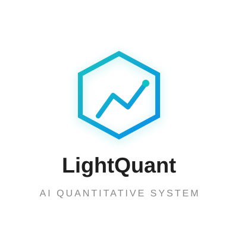
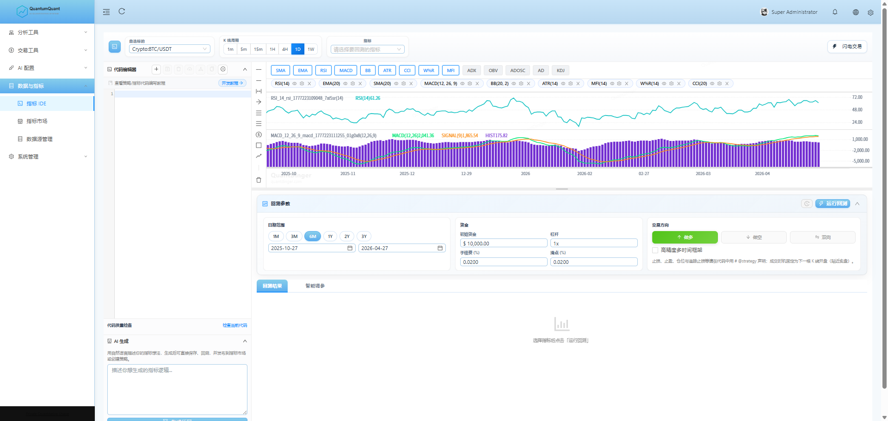
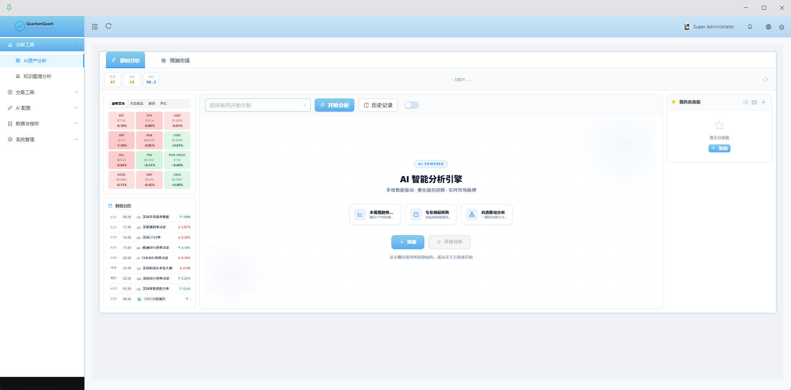
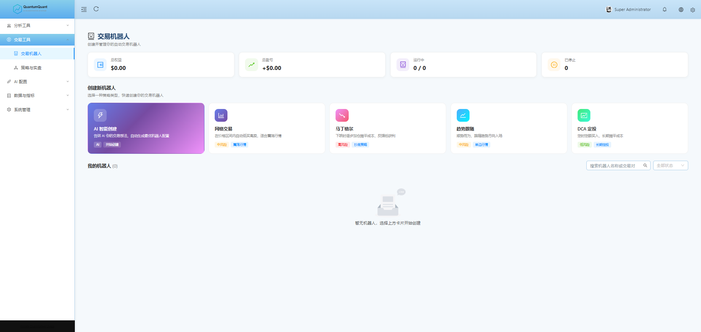
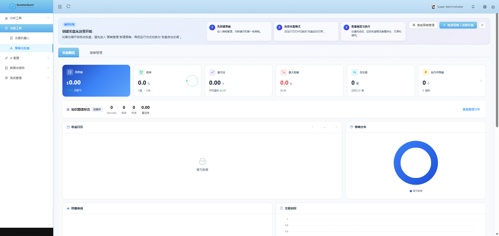
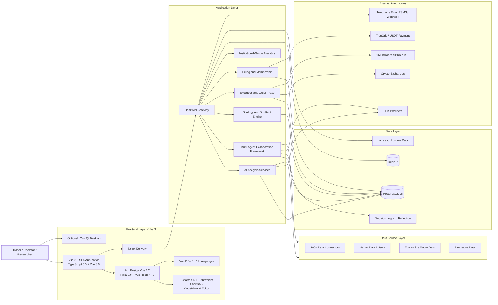

<div align="center">
  <a href="https://github.com/brokermr810/QuantDinger">
    
  </a>

  <h1>Fin-AI</h1>
  <h3>Your Private AI Quant Operating System</h3>
  <p><strong>Research markets, generate Python strategies, backtest ideas, and run live trading workflows on infrastructure you control — powered by multi-agent intelligence and 100+ data sources.</strong></p>
  <p><em>Self-hosted AI trading platform integrating quant research, multi-agent analysis, institutional-grade data, backtesting, execution, and operator-ready growth.</em></p>
  <p><em>Transformed from QuantDinger, FinceptTerminal, and TradingAgents.</em></p>

  <p>
    <a href="README.md"><strong>English</strong></a> &nbsp;·&nbsp;
    <a href="docs/README_CN.md"><strong>简体中文</strong></a> &nbsp;·&nbsp;
  </p>

  <p>
    <a href="LICENSE"></a>
    
    
    
    
    
    
    
  </p>
</div>

---

> Fin-AI is a **self-hosted, local-first quantitative trading and algorithmic trading platform** integrating **AI research, multi-agent analysis, Python strategy generation, institutional-grade data connectivity, backtesting, and live execution**.
>
> **Project Transformation**: Fin-AI is transformed and integrated from three outstanding open-source projects:
> - [QuantDinger](https://github.com/brokermr810/QuantDinger) — AI market analysis, Python strategy development, backtesting, and live execution
> - [FinceptTerminal](https://github.com/Fincept-Corporation/FinceptTerminal) — 100+ financial data connectors, QuantLib institutional-grade analytics, 16+ broker integrations
> - [TradingAgents](https://github.com/TauricResearch/TradingAgents) — Multi-agent LLM trading framework with LangGraph orchestration and specialized role collaboration

## Frontend Technology Stack

Finai base on QuantDinger, features a modern, enterprise-grade frontend built with cutting-edge technologies:

- **Framework**: Vue 3.5 + TypeScript 6.0 + Vite 8.0
- **UI Library**: Ant Design Vue 4.2 + @ant-design/icons-vue
- **State Management**: Pinia 3.0
- **Routing**: Vue Router 4.6
- **Internationalization**: Vue I18n 9 (11 languages: EN, CN, TW, JA, KO, FR, DE, AR, TH, VI)
- **Charts**: ECharts 5.6 + vue-echarts + Lightweight Charts 5.2 (K-line charts)
- **Code Editor**: CodeMirror 6 (Python syntax highlighting)
- **HTTP Client**: Axios 1.15
- **Utilities**: DayJS, Markdown-it, Marked, Highlight.js
- **Styling**: Less 4.6
- **Build**: vue-tsc + Vite

The frontend provides 20+ functional modules including dashboard, indicator IDE, trading bots, AI analysis, data source management, LLM configuration, portfolio management, and more.

## Try in 2 Minutes

**Fastest way to try QuantDinger locally:**

```bash
git clone https://github.com/brokermr810/QuantDinger.git && cd QuantDinger && cp backend_api_python/env.example backend_api_python/.env && ./scripts/generate-secret-key.sh && docker-compose up -d --build
```

Then open:

- `http://localhost:8888`
- login with `quantumquant` / `123456`
- read `backend_api_python/.env` before production use

## What Is Fin-AI?

Fin-AI is a **self-hosted AI trading platform** and **quant research workspace** that integrates three powerful open-source projects into one unified system:

- **[QuantDinger Core](https://github.com/brokermr810/QuantDinger)**: AI market analysis, Python strategy development, backtesting, and live execution
- **[FinceptTerminal Integration](https://github.com/Fincept-Corporation/FinceptTerminal)**: 100+ financial data connectors, institutional-grade analytics (QuantLib, DCF, risk metrics), 16+ broker integrations
- **[TradingAgents Framework](https://github.com/TauricResearch/TradingAgents)**: Multi-agent LLM trading framework with specialized roles (analysts, researchers, traders, risk managers)

For teams and operators who want one system for:

- AI-powered market research with multi-agent collaboration
- Python indicator and strategy development
- Institutional-grade financial analytics and valuation
- Backtesting with decision persistence and reflection
- Live trading execution across 16+ brokers and exchanges
- Portfolio monitoring, alerts, and operations
- Multi-user management, billing, and commercialization

If you are searching for an **open source quant platform**, **AI trading research stack**, **self-hosted backtesting system**, or **natural-language-to-Python strategy workflow**, this is what Fin-AI is built for.

## Why Fin-AI? AI-Powered Quantitative Trading with Multi-Agent Intelligence

- **Self-hosted by design**: your credentials, strategy code, market workflows, and operational data stay under your control.
- **Research to execution in one product**: AI analysis, multi-agent collaboration, charting, strategy logic, backtests, quick trade, and live operations are connected.
- **Python-native and AI-assisted**: write indicators and strategies directly in Python, or use multi-agent AI to accelerate drafting and iteration.
- **100+ data connectors**: from free sources (Yahoo Finance, FRED, World Bank) to institutional-grade data (Polygon, DBnomics, government APIs).
- **Institutional-grade analytics**: QuantLib suite (18 modules), DCF valuation, portfolio optimization, risk metrics (VaR, Sharpe), derivatives pricing.
- **Multi-agent intelligence**: specialized AI agents (fundamentals, sentiment, news, technical analysts) collaborate through structured debates to inform trading decisions.
- **16+ broker integrations**: crypto (Binance, OKX, Kraken), equities (IBKR, Alpaca), forex (MT5), and Indian brokers (Zerodha, Angel One).
- **Built for operators, not just demos**: Docker Compose, PostgreSQL, Redis, Nginx, health checks, worker toggles, and environment-based configuration.
- **Commercialization ready**: memberships, credits, admin management, and USDT payment flows are already part of the stack.

## The Core Promise

Fin-AI gives you something most trading tools do not:

- **one stack instead of five** for research, strategy code, backtests, execution, alerts, and operations
- **AI that sits inside the workflow**, not beside it
- **Python flexibility without losing product UX**
- **private deployment without giving up growth features**
- **professional-grade data coverage** from free to institutional sources
- **multi-agent simulation** of professional trading teams
- **extensible agent ecosystem** for continuous enhancement

## Fin-AI vs Patchwork Setups

| Typical Setup | Fin-AI |
|---------------|-------------|
| AI chat tool disconnected from real strategy workflows | AI analysis, AI code generation, backtest feedback, and execution workflows live in one product |
| Separate charting app, Python scripts, bot runner, and notification stack | One deployable platform for charting, strategy logic, runtime services, and alerts |
| Hosted SaaS with limited control over credentials and alpha | Self-hosted architecture with your own infra, keys, and operational data |
| Research tools with no operator layer | Multi-user roles, billing, credits, admin controls, and deployment-ready configuration |
| Single data source or expensive API subscriptions | 100+ data connectors with free and premium options, intelligent routing and caching |
| Solo research analysis with limited perspectives | Multi-agent collaboration simulating professional trading firm with specialized roles |
| Analysis results lost after each session | Persistent decision logs, automatic reflection, and experience accumulation |
| Desktop terminal or web platform, not both | Web-first platform with optional C++ Qt desktop for institutional-grade deep analysis |

## Who It Is For

- **Traders and quants** who want AI-assisted market research with multi-agent collaboration without giving up control of infrastructure and data.
- **Python strategy developers** who want charting, backtests, institutional-grade analytics, and live execution in one environment.
- **Small teams and studios** building internal trading tools or private research platforms with professional data connectivity.
- **Operators and founders** who need a deployable product with user management, billing, admin controls, and 100+ data sources.
- **Data-driven researchers** who need multi-source data integration and institutional-grade analysis tools (DCF, risk metrics, derivatives).
- **Multi-agent workflow explorers** who want to leverage AI agent collaboration to enhance research quality and decision-making.
- **Traditional financial analysts** transitioning from desktop terminals to web-based collaborative platforms.

## Use Cases

- **AI-assisted market research** for crypto, stocks, forex, prediction markets, and cross-market workflows with multi-agent collaboration
- **Python-native strategy development** for quantitative trading and algorithmic trading teams, with parameterized indicators and cross-sectional portfolios
- **Institutional-grade financial analysis** including DCF valuation, portfolio optimization, risk metrics (VaR, Sharpe), and derivatives pricing
- **Automated trading bots** — Grid, Martingale, Trend, and DCA bots with real-time monitoring
- **Backtesting and iteration** for signal strategies, saved strategies, trading bots, and execution assumptions with decision persistence and reflection
- **Private trading infrastructure** for teams that want self-hosted deployment, local LLMs, multi-agent workflows, and privacy-first operations
- **Commercial trading products** that need users, billing, USDT payments, credits, admin controls, and 100+ data connectors
- **Macro and geopolitical analysis** with maritime tracking, satellite data, and global intelligence
- **Algorithmic trading and HFT research** with QuantLib quantitative analysis suite

## Visual Tour

<table align="center" width="100%">
  <tr>
    <td width="50%" align="center"><br/><sub>Indicator IDE, charting, backtest, and quick trade</sub></td>
    <td width="50%" align="center"><br/><sub>AI asset analysis and opportunity radar</sub></td>
  </tr>
  <tr>
    <td align="center"><br/><sub>Trading bot workspace and automation templates</sub></td>
    <td align="center"><br/><sub>Strategy live operations, performance, and monitoring</sub></td>
  </tr>
</table>

## What You Can Do With Fin-AI

### AI Research and Multi-Agent Decision Support

- Run fast AI-driven market analysis across price action, kline structure, macro/news context, and selected external inputs.
- Store analysis history and memory for repeatable review and future calibration.
- Configure multiple LLM providers such as OpenRouter, OpenAI, Gemini, DeepSeek, and more.
- Optionally enable ensemble and calibration-style flows for more robust AI outputs.
- **Deploy multi-agent collaboration** with specialized roles:
  - **Fundamentals Analyst**: evaluates company financials, intrinsic values, and red flags
  - **Sentiment Analyst**: analyzes social media and public sentiment with scoring algorithms
  - **News Analyst**: monitors global news and macroeconomic indicators
  - **Technical Analyst**: utilizes MACD, RSI, and other technical indicators
  - **Research Team**: bullish and bearish researchers engage in structured debates
  - **Trader Agent**: composes reports to make informed trading decisions
  - **Risk Management**: continuously evaluates portfolio risk and adjusts strategies
  - **Portfolio Manager**: approves/rejects transaction proposals
- **Access 37+ professional AI agents** including Trader/Investor frameworks (Buffett, Graham, Lynch, Munger, Klarman, Marks…), Economic, and Geopolitics frameworks.
- **Local LLM support** with Ollama for fully private AI workflows.

### 100+ Data Sources and Market Coverage

- **Economic Data**: DBnomics, FRED, IMF, World Bank, BLS, BEA
- **Market Data**: Polygon, Yahoo Finance, AkShare, Tiingo, Finnhub, Twelve Data
- **Crypto**: Kraken, Binance, CoinGecko, DeFiLlama
- **Alternative Data**: Adanos market sentiment, Reddit, X, Polymarket
- **China Markets**: A-shares (SSE, SZSE), HK stocks (HKEX) via AkShare, Tushare, BaoStock
- **Global Intelligence**: maritime tracking, geopolitical analysis, satellite data
- **Intelligent routing and caching**: priority-based provider routing, multi-level caching (memory → Redis → PostgreSQL), rate limiting, and health monitoring

### Indicator and Strategy Development

- Build `IndicatorStrategy` workflows for dataframe-based signals, chart overlays, and signal backtests.
- Build `ScriptStrategy` workflows for stateful runtime logic, explicit order control, and live execution alignment.
- Generate indicator or strategy code from natural language and refine it in Python.
- Visualize indicators, buy/sell signals, and strategy output directly on professional chart interfaces.

### Institutional-Grade Quantitative Analytics

- **QuantLib Suite**: 18 quantitative analysis modules for pricing, risk, stochastic processes, volatility, and fixed income
- **DCF Valuation**: discounted cash flow models for equity research and intrinsic value calculation
- **Portfolio Optimization**: modern portfolio theory, efficient frontier, and risk-return optimization
- **Risk Metrics**: Value at Risk (VaR), Sharpe ratio, maximum drawdown, and comprehensive risk analytics
- **Derivatives Pricing**: options, futures, and complex derivatives pricing models
- **Factor Discovery**: ML-based factor analysis and alpha generation

### Backtesting and Iteration

- Run historical backtests with stored trades, metrics, and equity curves.
- Backtest both indicator-driven logic and saved strategy records.
- Persist strategy snapshots and review historical runs for reproducibility.
- Use AI-assisted post-backtest analysis to improve parameters and execution assumptions.
- **Decision persistence**: TradingAgents framework persists decision logs with automatic reflection
- **Checkpoint resume**: LangGraph checkpointing allows crashed runs to resume from last successful step
- **Cross-ticker lessons**: recent decisions and lessons carry forward to improve future analysis

### Live Trading and Operations

- Connect crypto exchanges through a unified execution layer.
- Use quick-trade flows to go from analysis to action faster.
- Monitor open positions, review trade history, and close positions from the platform.
- Run automated or semi-automated strategy workflows with runtime services and workers.
- **16+ broker integrations**: Zerodha, Angel One, Upstox, Fyers, IBKR, Alpaca, Tradier, Saxo, Kraken, HyperLiquid, and more
- **Paper trading engine**: test strategies in simulated environment before going live

### Multi-Market Coverage

- Crypto spot and derivatives
- US stocks through IBKR, Alpaca, Yahoo Finance, Polygon, Finnhub
- Forex through MT5, OANDA
- China A-shares and HK stocks through AkShare, Tushare, BaoStock
- Fixed income and bond market analysis
- Commodities and futures markets
- Prediction market research through Polymarket analysis workflows

### Global Intelligence and Alternative Data

- **Maritime Tracking**: ship tracking and maritime intelligence
- **Geopolitical Analysis**: global event monitoring and impact assessment
- **Relationship Mapping**: entity relationship graphs and network analysis
- **Satellite Data**: alternative data from satellite imagery
- **Market Sentiment**: Adanos cross-source retail sentiment across Reddit, X, finance news

### Multi-User, Alerts, and Billing

- PostgreSQL-backed multi-user system with role-based access patterns.
- OAuth support for Google and GitHub.
- Notification channels including Telegram, Email, SMS, Discord, and Webhooks.
- Membership plans (Monthly / Yearly / Lifetime), credits, USDT TRC20 on-chain payments, and admin-side billing controls.
- VIP free indicators for members.

### Trading Bots & Automation

- **Grid Bot** — configurable price ranges, arithmetic / geometric spacing, dual-side budget tracking for long/short exposure.
- **Martingale Bot** — layered position building with automatic cost averaging and market-order execution.
- **Trend Bot** — directional position sizing based on real-time account equity with automatic balance refresh.
- **DCA Bot** — time-based periodic buying, decoupled from K-line frequency, with external-close detection and auto-reset.
- Real-time runtime metrics (realized PnL, unrealized PnL, total equity) on bot list and detail pages.

### Quick Trade (Lightning Execution)

- Side-sliding Quick Trade panel for instant order placement without leaving the analysis page.
- Multi-exchange support (Binance, OKX, Bitget, Bybit, etc.) with real-time balance and position display.
- Market / Limit orders, 1x–125x leverage slider, TP/SL by absolute price.
- One-click position close and recent trade history with status tags.
- Integrated with AI Trading Radar — "Trade Now" pre-fills symbol, direction, and price.

### Cross-Sectional & Portfolio Strategies

- Multi-symbol portfolio management with simultaneous position handling.
- Configurable portfolio size, long/short ratio, and rebalance frequency (Daily / Weekly / Monthly).
- Parallel execution across symbols for efficient portfolio operations.
- Cross-sectional indicator ranking and signal generation.

### Prediction Market Research

- Polymarket integration for prediction market analysis and research workflows.
- AI-driven divergence analysis comparing AI predictions with market consensus.
- Related asset trading recommendations linked to prediction market events.
- Opportunity scoring and confidence calibration for prediction markets.

## AI Capabilities

QuantDinger is not just "LLM chat added to a trading app". The current AI layer integrates multi-agent collaboration, institutional analytics, and the actual research and strategy workflow.

### Fast Analysis

- Structured AI market analysis for quick decision support
- Lower-latency workflow than older multi-hop orchestration
- Useful for daily market review, trade planning, and opportunity screening
- Supports multiple LLM providers: OpenRouter, OpenAI, Gemini, DeepSeek, Anthropic, and more
- **OpenAI-compatible API support** — connect to any OpenAI-compatible endpoint
- **Ollama local model support** — run local LLMs for fully private analysis

### Multi-Agent Deep Analysis (TradingAgents Framework)

- **Analyst Team**:
  - Fundamentals Analyst: company financials, performance metrics, intrinsic values
  - Sentiment Analyst: social media, public sentiment, sentiment scoring
  - News Analyst: global news, macroeconomic indicators, event impact
  - Technical Analyst: MACD, RSI, technical patterns, price forecasting
- **Researcher Team**: bullish and bearish researchers engage in structured debates
- **Trader Agent**: composes analyst and researcher reports for informed decisions
- **Risk Management Team**: evaluates portfolio risk, market volatility, liquidity
- **Portfolio Manager**: approves/rejects transaction proposals, sends to simulated exchange
- **LangGraph orchestration**: flexible and modular workflow management
- **Multi-provider LLM support**: OpenAI, Google, Anthropic, xAI, DeepSeek, Qwen, GLM, OpenRouter, Ollama, Azure
- **Structured-output agents**: Research Manager, Trader, Portfolio Manager with typed outputs

### Professional Agent Framework (FinceptTerminal)

- **37+ AI Agents** across Trader/Investor frameworks (Buffett, Graham, Lynch, Munger, Klarman, Marks…)
- **Economic Analysis Agents**: macroeconomic indicators, policy impact assessment
- **Geopolitics Agents**: global events, political risk analysis
- **Local LLM support**: run agents on private infrastructure with Ollama
- **Multi-provider support**: OpenAI, Anthropic, Gemini, Groq, DeepSeek, MiniMax, OpenRouter, Ollama

### AI Strategy and Indicator Generation

- Natural language to Python indicator code
- Natural language to strategy code and config scaffolding
- Better fit for traders who know the idea they want, but want to accelerate implementation

### AI Trading Opportunities Radar

- Auto-scans Crypto, US Stocks, and Forex markets every hour
- Rolling carousel with BUY / SELL signals, percentage change, and reasoning
- Integrated with Quick Trade — one-click execution from radar cards
- Fully internationalized content

### Analysis Memory and Review

- Historical analysis storage with per-user isolation
- Better repeatability and comparison over time
- A foundation for future calibration and reflection loops
- User timezone support (IANA) for localized time display
- **Persistent decision log**: TradingAgents persists decisions to `~/.tradingagents/memory/trading_memory.md`
- **Automatic reflection**: generates one-paragraph reflection on realized return and alpha vs SPY
- **Cross-ticker lessons**: recent same-ticker decisions plus cross-ticker lessons injected into prompts

### Ensemble, Calibration, and Reflection

- Optional multi-model ensemble configuration
- Confidence calibration and reflection-style worker support
- Better operational path for teams that want more stable AI-assisted workflows

### AI-Assisted Backtest Feedback

- Backtest outputs can feed into AI-generated suggestions
- Useful for parameter tuning, risk adjustments, and faster iteration
- **Checkpoint resume**: LangGraph saves state after each node, crashed runs resume from last successful step
- **Per-ticker SQLite databases**: checkpoints at `~/.tradingagents/cache/checkpoints/<TICKER>.db`

### Polymarket and Cross-Market Research

- Analyze prediction markets as a research workflow
- Compare AI view versus market-implied probabilities
- Surface divergence and opportunity scoring
- Related asset trading recommendations based on prediction market events

## Why It Is Different

Most trading stacks give you one or two of these pieces. Fin-AI aims to give you the full operating system:

1. **Self-hosted infrastructure**
2. **Multi-agent AI research workflows**
3. **100+ data source coverage**
4. **Python strategy development**
5. **Institutional-grade analytics tools**
6. **Backtesting with reflection**
7. **Live execution (16+ brokers)**
8. **Portfolio and notification operations**
9. **Commercialization primitives**

That combination is the core difference.

## Why It Converts Better Than a Typical Trading Tool

- **For traders**: it shortens the path from idea to execution — from AI analysis to Quick Trade, from indicator to live bot, all in one interface, enhanced by multi-agent collaboration and 100+ data sources.
- **For quants**: it keeps Python and strategy control front and center, now with parameter passing, cross-indicator calling, cross-sectional portfolios, full backtest history, and institutional-grade QuantLib analytics.
- **For operators**: it adds the parts most open-source trading projects skip, including multi-user RBAC, membership billing, USDT on-chain payments, deployable Docker Compose configuration, and professional data connectivity.
- **For AI-first workflows**: it turns analysis into something actionable, reviewable, and eventually automatable — with local LLM support via Ollama for fully private AI workflows, multi-agent collaboration, and persistent decision logs with automatic reflection.
- **For researchers**: it provides institutional-grade tools, global data coverage, multi-perspective analysis through specialized agents, and deep analytics capabilities previously only available on expensive terminals.

- a modern Vue 3 + TypeScript frontend served by Nginx
- a Flask API backend with Python services
- TradingAgents multi-agent framework with LangGraph orchestration
- FinceptTerminal 100+ data connectors and Python analytics scripts
- PostgreSQL for state, users, strategies, and history
- Redis for worker support and runtime coordination
- exchange, broker, AI, payment, and notification integrations through configurable adapters
- optional C++ Qt desktop application for institutional-grade deep analysis

### Architecture Summary

| Layer | Technology |
|-------|-----------|
| Frontend | Vue 3.5 + TypeScript 6.0 + Vite 8.0, Ant Design Vue 4.2, Pinia 3.0, Vue Router 4.6, Vue I18n 9 (11 languages), ECharts 5.6, Lightweight Charts 5.2, CodeMirror 6 |
| Backend | Flask API, Python services, strategy runtime, ORM-refactored data layer |
| Multi-Agent Framework | TradingAgents LangGraph orchestration, LangChain toolchain |
| Data Source Layer | FinceptTerminal 100+ connectors, Python Analytics scripts, intelligent routing |
| Storage | PostgreSQL 16 |
| Cache / worker support | Redis 7 |
| Trading Layer | Exchange adapters, 16+ brokers, IBKR, MT5 |
| AI Layer | Multi-LLM provider integration, 37+ professional agents, memory, calibration, multi-agent collaboration |
| Analytics Tools | QuantLib 18 modules, DCF, risk metrics, derivatives pricing |
| Billing | Membership, credits, USDT TRC20 payment flow |
| Deployment | Docker Compose with health checks (primary) + C++ Qt desktop (optional) |
| Optional Desktop | FinceptTerminal C++20 Qt6 for institutional-grade deep analysis |

### Execution Model

- Market data is pulled through a pluggable data layer with 100+ connectors.
- Intelligent routing: priority-based provider selection, multi-level caching (memory → Redis → PostgreSQL), rate limiting per provider, and health monitoring every 5 minutes.
- Backtests run on the server-side strategy engine, including strategy snapshot handling and dedicated strategy backtest persistence.
- Multi-agent analysis: TradingAgents framework deploys specialized agents (analysts, researchers, traders, risk managers) through LangGraph orchestration.
- Decision persistence: completed decisions logged to `~/.tradingagents/memory/trading_memory.md` with automatic reflection on realized returns.
- Checkpoint resume: LangGraph checkpointing allows crashed or interrupted runs to resume from last successful step.
- Live strategies and trading bots (Grid, Martingale, Trend, DCA) run through runtime services that generate order intent.
- Pending orders are then dispatched through exchange-specific execution adapters.
- Quick Trade provides direct discretionary execution from analysis pages.
- Crypto live execution is intentionally separated from market-data collection concerns.

### System Diagram



## Strategy Development Modes

QuantDinger supports multiple strategy authoring models:

### IndicatorStrategy

- dataframe-based Python scripts
- `buy` / `sell` signal generation
- chart rendering and signal-style backtests
- best for research, indicator logic, and visual strategy prototyping
- **External parameter passing** — declare parameters with `# @param` syntax (int, float, bool, str)
- **Cross-indicator calling** — call other indicators with `call_indicator(id_or_name, df)`

### ScriptStrategy

- event-driven `on_init(ctx)` / `on_bar(ctx, bar)` scripts
- explicit runtime control with `ctx.buy()`, `ctx.sell()`, `ctx.close_position()`
- best for stateful strategies, execution-oriented logic, and live alignment

### Cross-Sectional Strategy

- multi-symbol portfolio management with simultaneous position handling
- configurable portfolio size, long/short ratio, and rebalance frequency
- indicators receive a `data` dictionary (symbol → DataFrame) for cross-symbol analysis
- parallel execution across symbols for efficient portfolio operations

### Multi-Agent Strategy

- TradingAgents agents collaborate to generate strategy recommendations
- Fundamental, sentiment, news, and technical analysts provide multi-perspective insights
- Bullish and bearish researchers debate to surface risks and opportunities
- Trader agent composes comprehensive trading decisions
- Risk management team evaluates and adjusts strategies

### Quantitative Analysis Strategy

- QuantLib integration for institutional-grade quantitative analysis
- DCF valuation models for intrinsic value calculation
- Portfolio optimization using modern portfolio theory
- Risk metrics computation (VaR, Sharpe, maximum drawdown)
- Derivatives pricing for options and futures strategies

For the full developer workflow, see:

- [Strategy Development Guide](docs/STRATEGY_DEV_GUIDE.md)
- [Cross-Sectional Strategy Guide](docs/CROSS_SECTIONAL_STRATEGY_GUIDE_EN.md)
- [Strategy Examples](docs/examples/)

The example scripts live in `docs/examples/` and are kept aligned with the current strategy development guides.

## Repository Layout

```text
QuantDinger/
├── backend_api_python/      # Open backend source code
│   ├── app/routes/          # REST endpoints
│   ├── app/services/        # AI, trading, billing, backtest, integrations
│   ├── app/agents/          # TradingAgents multi-agent framework integration
│   ├── app/analytics/       # FinceptTerminal QuantLib analytics modules
│   ├── migrations/init.sql  # Database initialization
│   ├── env.example          # Main environment template
│   └── Dockerfile
├── frontend-v3/             # Vue 3 + TypeScript frontend source
│   ├── src/
│   │   ├── api/             # API layer (20+ modules)
│   │   │   ├── ai-trading.ts      # AI trading APIs
│   │   │   ├── data-source.ts     # Data source management APIs
│   │   │   ├── strategy.ts        # Strategy management APIs
│   │   │   ├── llm.ts             # LLM configuration APIs
│   │   │   └── ...
│   │   ├── views/           # Page views (20+ functional modules)
│   │   │   ├── dashboard/         # Dashboard
│   │   │   ├── indicator-ide/     # Indicator IDE
│   │   │   ├── trading-bot/       # Trading Bots
│   │   │   ├── ai-analysis/       # AI Analysis
│   │   │   ├── data-source/       # Data Source Management
│   │   │   ├── llm/               # LLM Management
│   │   │   ├── portfolio/         # Portfolio Management
│   │   │   └── ...
│   │   ├── components/      # Reusable components
│   │   │   ├── KlineChart/        # K-line chart component
│   │   │   ├── CodeEditor/        # Code editor component
│   │   │   └── GraphVisualization/# Knowledge graph visualization
│   │   ├── stores/          # Pinia state management
│   │   ├── router/          # Vue Router configuration
│   │   ├── locales/         # Internationalization (11 languages)
│   │   └── composables/     # Vue composables
│   ├── package.json         # Dependencies
│   ├── vite.config.ts       # Vite build configuration
│   └── tsconfig.json        # TypeScript configuration
├── frontend/                # Prebuilt frontend delivery package (production)
│   ├── dist/                # Build artifacts
│   ├── Dockerfile
│   └── nginx.conf
├── data_connectors/         # FinceptTerminal 100+ data connectors
├── agents/                  # TradingAgents multi-agent workflows
│   ├── analysts/            # Analyst team
│   ├── researchers/         # Researcher team
│   └── managers/            # Trader and portfolio managers
├── docs/                    # Product, strategy, and deployment documentation
├── desktop/                 # Optional: C++ Qt desktop (FinceptTerminal)
├── docker-compose.yml
├── LICENSE
└── TRADEMARKS.md
```

## Configuration Areas

Use `backend_api_python/env.example` as the primary template. Key areas include:

| Area | Examples |
|------|----------|
| Authentication | `SECRET_KEY`, `ADMIN_USER`, `ADMIN_PASSWORD` |
| Database | `DATABASE_URL` |
| LLM / AI | `LLM_PROVIDER`, `OPENROUTER_API_KEY`, `OPENAI_API_KEY` |
| Multi-Agent | `ENABLE_MULTI_AGENT_ANALYSIS`, `MAX_DEBATE_ROUNDS`, `AGENT_LLM_PROVIDER` |
| Data Sources | `DATA_CONNECTORS_ENABLED`, `POLYGON_API_KEY`, `FRED_API_KEY`, `AKSHARE_ENABLED` |
| Quantitative Analytics | `QUANTLIB_ENABLED`, `ENABLE_DCF_VALUATION`, `ENABLE_RISK_METRICS` |
| OAuth | `GOOGLE_CLIENT_ID`, `GITHUB_CLIENT_ID` |
| Security | `TURNSTILE_SITE_KEY`, `ENABLE_REGISTRATION` |
| Billing | `BILLING_ENABLED`, `BILLING_COST_AI_ANALYSIS` |
| Membership | `MEMBERSHIP_MONTHLY_PRICE_USD`, `MEMBERSHIP_MONTHLY_CREDITS` |
| USDT Payment | `USDT_PAY_ENABLED`, `USDT_TRC20_XPUB`, `TRONGRID_API_KEY` |
| Optional data APIs | `TWELVE_DATA_API_KEY`, `FINNHUB_API_KEY`, `TIINGO_API_KEY`, `ADANOS_API_KEY` |
| Local LLM | `OLLAMA_BASE_URL`, `OLLAMA_MODEL` |
| Proxy | `PROXY_URL` |
| Workers | `ENABLE_PENDING_ORDER_WORKER`, `ENABLE_PORTFOLIO_MONITOR`, `ENABLE_REFLECTION_WORKER` |
| AI tuning | `ENABLE_AI_ENSEMBLE`, `ENABLE_CONFIDENCE_CALIBRATION`, `AI_ENSEMBLE_MODELS` |

## Documentation

### Core Guides

| Document | Description |
|----------|-------------|
| [Changelog](docs/CHANGELOG.md) | Version history and migration notes |
| [Chinese Overview](docs/README_CN.md) | Chinese product overview |
| [Multi-User Setup](docs/multi-user-setup.md) | PostgreSQL multi-user deployment |
| [Cloud Deployment](docs/CLOUD_DEPLOYMENT_EN.md) | Domain, HTTPS, reverse proxy, and cloud rollout |

### Strategy Development

| Guide | EN | CN | TW | JA | KO |
|-------|----|----|----|----|----|
| Strategy Development | [EN](docs/STRATEGY_DEV_GUIDE.md) | [CN](docs/STRATEGY_DEV_GUIDE_CN.md) | [TW](docs/STRATEGY_DEV_GUIDE_TW.md) | [JA](docs/STRATEGY_DEV_GUIDE_JA.md) | [KO](docs/STRATEGY_DEV_GUIDE_KO.md) |
| Cross-Sectional Strategy | [EN](docs/CROSS_SECTIONAL_STRATEGY_GUIDE_EN.md) | [CN](docs/CROSS_SECTIONAL_STRATEGY_GUIDE_CN.md) | - | - | - |
| Examples | [examples](docs/examples/) | - | - | - | - |

### Integrations

| Topic | English | Chinese |
|-------|---------|---------|
| IBKR | [Guide](docs/IBKR_TRADING_GUIDE_EN.md) | - |
| MT5 | [Guide](docs/MT5_TRADING_GUIDE_EN.md) | [Guide](docs/MT5_TRADING_GUIDE_CN.md) |
| OAuth | [Guide](docs/OAUTH_CONFIG_EN.md) | [Guide](docs/OAUTH_CONFIG_CN.md) |

### Notifications

| Channel | English | Chinese |
|---------|---------|---------|
| Telegram | [Setup](docs/NOTIFICATION_TELEGRAM_CONFIG_EN.md) | [Config](docs/NOTIFICATION_TELEGRAM_CONFIG_CH.md) |
| Email | [Setup](docs/NOTIFICATION_EMAIL_CONFIG_EN.md) | [Config](docs/NOTIFICATION_EMAIL_CONFIG_CH.md) |
| SMS | [Setup](docs/NOTIFICATION_SMS_CONFIG_EN.md) | [Config](docs/NOTIFICATION_SMS_CONFIG_CH.md) |

### New Guides

| Topic | Description |
|-------|-------------|
| Multi-Agent Analysis Guide | How to configure and use TradingAgents multi-agent framework |
| Data Source Configuration Guide | How to configure 100+ data connectors and intelligent routing |
| QuantLib Analytics Guide | How to use institutional-grade quantitative analysis tools |
| Desktop Application Guide | How to use optional C++ Qt desktop for deep analysis |

## Supported Markets, Brokers, and Exchanges

### Crypto Exchanges

| Venue | Coverage |
|-------|----------|
| Binance | Spot, Futures, Margin |
| OKX | Spot, Perpetual, Options |
| Bitget | Spot, Futures, Copy Trading |
| Bybit | Spot, Linear Futures |
| Coinbase | Spot |
| Kraken | Spot, Futures |
| KuCoin | Spot, Futures |
| Gate.io | Spot, Futures |
| Deepcoin | Derivatives integration |
| HTX | Spot, USDT-margined perpetuals |

### Traditional Markets

| Market | Broker / Source | Execution |
|--------|------------------|-----------|
| US Stocks | IBKR, Yahoo Finance, Finnhub, Polygon, Alpaca | Via IBKR, Alpaca |
| Forex | MT5, OANDA | Via MT5 |
| Futures | Exchange and data integrations | Data and workflow support |
| China A-Shares | SSE, SZSE via AkShare, Tushare, BaoStock | Data and watchlist support |
| HK Stocks | HKEX via AkShare, Tushare | Data and watchlist support |
| Fixed Income | Bond market data and analysis | Analytics support |
| Commodities | Commodity market data | Data and workflow support |

### Broker Integrations (FinceptTerminal)

| Region | Brokers |
|--------|---------|
| India | Zerodha, Angel One, Upstox, Fyers, Dhan, Groww, Kotak, IIFL, 5paisa, AliceBlue, Shoonya, Motilal |
| Global | IBKR, Alpaca, Tradier, Saxo Bank |
| Crypto | Kraken, HyperLiquid |

### Prediction Markets

Polymarket is currently supported as a **research and analysis workflow**, not as direct in-platform live execution. It is useful for market lookup, divergence analysis, opportunity scoring, and AI-assisted review.

## FAQ

### Is Fin-AI really self-hosted?

Yes. The default deployment model is your own Docker Compose stack with your own database, Redis instance, credentials, and environment configuration.

### Is Fin-AI only for crypto trading?

No. Crypto is a major focus, but the platform also includes IBKR and Alpaca workflows for US stocks, MT5 workflows for forex, China A-shares and HK stocks support, prediction market research, and comprehensive multi-market coverage through 100+ data connectors.

### Can I write strategies directly in Python?

Yes. Fin-AI supports both dataframe-style `IndicatorStrategy` development and event-driven `ScriptStrategy` development. You can also use AI to generate a starting point and then edit it yourself. Multi-agent AI collaboration can provide strategy recommendations based on comprehensive market analysis.

### Is this a research tool or a live trading platform?

It is both. Fin-AI is built to connect AI research, multi-agent analysis, charting, strategy development, institutional-grade analytics, backtesting with reflection, quick trade flows, and live execution operations in one system.

### How does multi-agent analysis work?

Fin-AI integrates the TradingAgents framework, which deploys specialized LLM-powered agents: fundamentals analyst, sentiment analyst, news analyst, technical analyst, bullish and bearish researchers, trader, risk management team, and portfolio manager. These agents collaborate through structured debates to evaluate market conditions and inform trading decisions. Decisions are persisted with automatic reflection for continuous improvement.

### How do I configure the 100+ data connectors?

Data connectors are configured through environment variables and the data source management UI. The system supports intelligent routing with priority-based provider selection, multi-level caching (memory → Redis → PostgreSQL), per-provider rate limiting, and health monitoring every 5 minutes. See the Data Source Configuration Guide for details.

### What is the difference between the web and desktop versions?

The web version (Vue 3 + TypeScript) is the primary platform for daily operations, strategy development, AI analysis, and trading. The optional C++ Qt desktop application (FinceptTerminal) provides institutional-grade deep analysis with Bloomberg-terminal-class performance, native C++20 execution, and advanced QuantLib analytics. Both can be used together for comprehensive research and trading workflows.

### How does decision persistence and reflection work?

TradingAgents persists completed decisions to `~/.tradingagents/memory/trading_memory.md`. On the next run for the same ticker, it fetches the realised return (raw and alpha vs SPY), generates a one-paragraph reflection, and injects the most recent same-ticker decisions plus recent cross-ticker lessons into the Portfolio Manager prompt. This ensures each analysis carries forward what worked and what didn't.

### Can I use Fin-AI commercially?

The backend is licensed under Apache 2.0. The frontend source has a separate source-available license. Commercial use is supported, but you should review the licensing terms in this repository and contact the project for frontend/commercial authorization if needed.

## Open Source Repositories

| Repository | Purpose |
|------------|---------|
| [QuantDinger](https://github.com/brokermr810/QuantDinger) | Main repository: backend, deployment stack, docs, prebuilt frontend delivery |
| [QuantDinger Frontend](https://github.com/brokermr810/QuantDinger-Vue) | Vue frontend source repository for UI development and customization |
| [FinceptTerminal](https://github.com/Fincept-Corporation/FinceptTerminal) | Financial data terminal with 100+ connectors and institutional-grade analytics |
| [TradingAgents](https://github.com/TauricResearch/TradingAgents) | Multi-agent LLM trading framework with specialized roles |

## Exchange Partner Links

The following links are available in-app under **Profile -> Open account** and may qualify users for trading-fee rebates depending on venue policies.

| Exchange | Signup Link |
|----------|-------------|
| Binance | [Register](https://www.bsmkweb.cc/register?ref=QUANTUMQUANT) |
| Bitget | [Register](https://partner.hdmune.cn/bg/7r4xz8kd) |
| Bybit | [Register](https://partner.bybit.com/b/DINGER) |
| OKX | [Register](https://www.xqmnobxky.com/join/QUANTUMQUANT) |
| Gate.io | [Register](https://www.gateport.company/share/DINGER) |
| HTX | [Register](https://www.htx.com/invite/zh-cn/1f?invite_code=dinger) |

## License and Commercial Terms

- Backend source code is licensed under **Apache License 2.0**. See `LICENSE`.
- This repository distributes the frontend UI here as **prebuilt files** for integrated deployment.
- The frontend source code is available separately at [QuantDinger Frontend](https://github.com/brokermr810/QuantDinger-Vue) under the **QuantDinger Frontend Source-Available License v1.0**.
- Under that frontend license, non-commercial use and eligible qualified non-profit use are permitted free of charge, while commercial use requires a separate commercial license from the copyright holder.
- Trademark, branding, attribution, and watermark usage are governed separately and may not be removed or altered without permission. See `TRADEMARKS.md`.

For commercial licensing, frontend source access, branding authorization, or deployment support:

- Website: [quantumquant.com](https://quantumquant.com)
- Telegram: [t.me/worldinbroker](https://t.me/worldinbroker)
- Email: [support@quantumquant.com](mailto:support@quantumquant.com)

## Legal Notice and Compliance

- Fin-AI is provided for lawful research, education, system development, and compliant trading or operational use only.
- No individual or organization may use this software, any derivative work, or any related service for unlawful, fraudulent, abusive, deceptive, market-manipulative, sanctions-violating, money-laundering, or other prohibited activity.
- Any commercial use, deployment, operation, resale, or service offering based on Fin-AI must comply with all applicable laws, regulations, licensing requirements, sanctions rules, tax rules, data-protection rules, consumer-protection rules, and market or exchange rules in the jurisdictions where it is used.
- Users are solely responsible for determining whether their use of the software is lawful in their country or region, and for obtaining any approvals, registrations, disclosures, or professional advice required by applicable law.
- Fin-AI, its copyright holders, contributors, licensors, maintainers, and affiliated open-source participants do not provide legal, tax, investment, compliance, or regulatory advice.
- To the maximum extent permitted by applicable law, Fin-AI and all related contributors and rights holders disclaim responsibility and liability for any unlawful use, regulatory breach, trading loss, service interruption, enforcement action, or other consequence arising from the use or misuse of the software.

## Start Here

- **Want to see the product first?** Open the [Live Demo](https://ai.quantumquant.com) or watch the [Video Demo](https://www.youtube.com/watch?v=tNAZ9uMiUUw).
- **Want to self-host quickly?** Go straight to [Quick Start](#quick-start) and launch with Docker Compose.
- **Want to build strategies?** Read the [Strategy Development Guide](docs/STRATEGY_DEV_GUIDE.md). Example scripts live in [`docs/examples/`](docs/examples/) and are kept aligned with the guide.
- **Want cloud or production deployment?** Use the [Cloud Deployment Guide](docs/CLOUD_DEPLOYMENT_EN.md).
- **Want to license or customize it for a business?** Contact the team through [quantumquant.com](https://quantumquant.com).

## Community and Support

<p>
  <a href="https://t.me/quantumquant"></a>
  <a href="https://discord.com/invite/tyx5B6TChr"></a>
  <a href="https://youtube.com/@quantumquant"></a>
</p>

- [Contributing Guide](CONTRIBUTING.md)
- [Report Bugs / Request Features](https://github.com/brokermr810/QuantDinger/issues)
- Email: [support@quantumquant.com](mailto:support@quantumquant.com)

## Support the Project

Crypto donations:

```text
0x96fa4962181bea077f8c7240efe46afbe73641a7
```

## Star History

[](https://star-history.com/#brokermr810/QuantDinger&Date)

## Acknowledgements

QuantDinger stands on top of strong open-source ecosystems. Special thanks to projects such as:

- [Flask](https://flask.palletsprojects.com/)
- [Pandas](https://pandas.pydata.org/)
- [CCXT](https://github.com/ccxt/ccxt)
- [yfinance](https://github.com/ranaroussi/yfinance)
- [Vue.js](https://vuejs.org/)
- [Ant Design Vue](https://antdv.com/)
- [KLineCharts](https://github.com/klinecharts/KLineChart)
- [ECharts](https://echarts.apache.org/)
- [Capacitor](https://capacitorjs.com/)
- [bip-utils](https://github.com/ebellocchia/bip_utils)
- [FinceptTerminal](https://github.com/Fincept-Corporation/FinceptTerminal) — financial data terminal with 100+ connectors and institutional-grade analytics
- [TradingAgents](https://github.com/TauricResearch/TradingAgents) — multi-agent LLM trading framework
- [LangGraph](https://github.com/langchain-ai/langgraph) — orchestration framework for multi-agent workflows
- [QuantLib](https://www.quantlib.org/) — quantitative finance library for derivatives pricing and risk management

<p align="center"><sub>If Fin-AI is useful to you, a GitHub star helps the project a lot.</sub></p>
