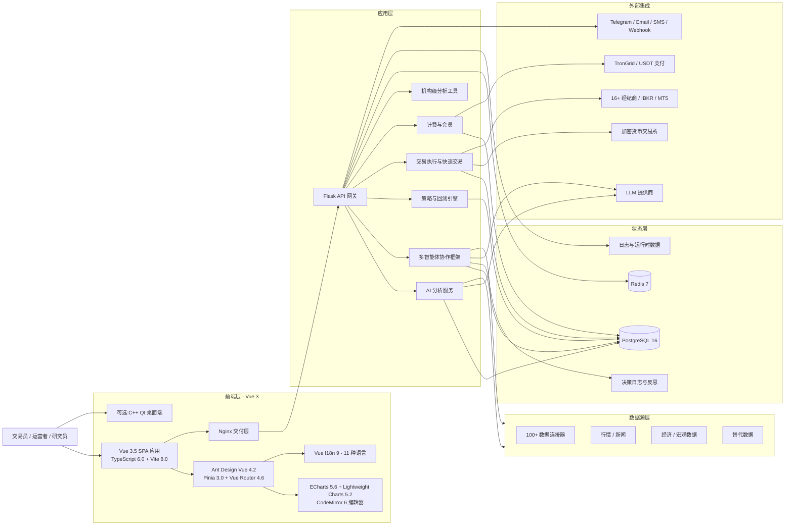

<div align="center">
  <a href="https://github.com/brokermr810/QuantDinger">
    
  </a>

  <h1>Fin-AI</h1>
  <h3>你的私有化 AI 量化操作系统</h3>
  <p><strong>把市场研究、Python 策略生成、回测验证和实盘执行,全部放进一套由你自己掌控的基础设施 — 多智能体驱动,百源数据赋能。</strong></p>
  <p><em>可自托管、AI 原生、融合量化研究、多智能体分析、机构级数据、回测执行和运营增长的完整工作台。</em></p>
  <p><em>改造自 QuantDinger、FinceptTerminal 和 TradingAgents。</em></p>

  <p>
    <a href="README.md"><strong>English</strong></a> &nbsp;·&nbsp;
    <a href="README_CN.md"><strong>简体中文</strong></a> &nbsp;·&nbsp;
  </p>

  <p>
    <a href="../LICENSE"></a>
    
    
    
    
    
    
    
  </p>
</div>

---

> Fin-AI 是一个**可自托管、以本地优先为设计原则的量化交易与算法交易平台**,整合了 **AI 研究、多智能体分析、Python 策略生成、机构级数据连接、回测验证和实盘执行**。
>
> **项目改造声明**: Fin-AI 改造并整合自三个优秀的开源项目:
> - [QuantDinger](https://github.com/brokermr810/QuantDinger) — AI 市场分析、Python 策略开发、回测验证和实盘执行
> - [FinceptTerminal](https://github.com/Fincept-Corporation/FinceptTerminal) — 100+ 金融数据连接器、QuantLib 机构级分析、16+ 经纪商集成
> - [TradingAgents](https://github.com/TauricResearch/TradingAgents) — 多智能体 LLM 交易框架,LangGraph 编排与专业角色协作

## 前端技术栈

Fin-AI 基于QuantDinger 改造升级， 采用现代化的企业级前端技术栈构建:

- **框架**: Vue 3.5 + TypeScript 6.0 + Vite 8.0
- **UI 库**: Ant Design Vue 4.2 + @ant-design/icons-vue
- **状态管理**: Pinia 3.0
- **路由**: Vue Router 4.6
- **国际化**: Vue I18n 9 (支持 11 种语言: 中英文、日韩、法德、阿拉伯、泰语、越南语)
- **图表**: ECharts 5.6 + vue-echarts + Lightweight Charts 5.2 (K 线图)
- **代码编辑器**: CodeMirror 6 (Python 语法高亮)
- **HTTP 客户端**: Axios 1.15
- **工具库**: DayJS、Markdown-it、Marked、Highlight.js
- **样式**: Less 4.6
- **构建**: vue-tsc + Vite

前端提供 20+ 功能模块,包括仪表盘、指标 IDE、交易机器人、AI 分析、数据源管理、LLM 配置、投资组合管理等。

## 两分钟试用

**最快的本地体验方式:**

```bash
git clone https://github.com/brokermr810/QuantDinger.git && cd QuantDinger && cp backend_api_python/env.example backend_api_python/.env && ./scripts/generate-secret-key.sh && docker-compose up -d --build
```

启动后:

- 打开 `http://localhost:8888`
- 默认登录:`quantumquant` / `123456`
- 正式环境部署前请先检查 `backend_api_python/.env`

## Fin-AI 是什么?

Fin-AI 是一个**可自托管的 AI 交易平台**和**量化研究工作台**,整合了三个强大的开源项目到一个统一系统中:

- **[QuantDinger 核心](https://github.com/brokermr810/QuantDinger)**: AI 市场分析、Python 策略开发、回测验证和实盘执行
- **[FinceptTerminal 集成](https://github.com/Fincept-Corporation/FinceptTerminal)**: 100+ 金融数据连接器、机构级分析工具(QuantLib、DCF 估值、风险指标)、16+ 经纪商集成
- **[TradingAgents 框架](https://github.com/TauricResearch/TradingAgents)**: 多智能体 LLM 交易框架,专业角色分工(分析师/研究员/交易员/风控经理)

适合希望用一套系统完成以下工作的人:

- 多智能体协作的 AI 市场研究
- Python 指标与策略开发
- 机构级金融分析和估值
- 带决策持久化和反思的回测验证
- 跨 16+ 经纪商和交易所的实盘交易执行
- 组合监控、通知和运营
- 多用户管理、计费和商业化

如果你正在寻找的是**开源量化平台**、**AI 交易研究系统**、**可自托管回测系统**,或者**自然语言生成 Python 策略工作流**,Fin-AI 就是按这个方向设计的。

## 为什么选择 Fin-AI? 多智能体 AI 驱动的量化交易

- **默认可自托管**:密钥、策略代码、交易流程和业务数据都掌握在你自己手里。
- **研究到执行一体化**:AI 分析、多智能体协作、图表、策略、回测、快速交易和实盘运营在同一条产品链路里。
- **Python 原生 + AI 辅助**:既能直接写 Python,也能让多智能体 AI 加速策略草拟和迭代。
- **100+ 数据连接器**:从免费数据源(Yahoo Finance、FRED、世界银行)到机构级数据(Polygon、DBnomics、政府 API)。
- **机构级分析工具**:QuantLib 套件(18 个模块)、DCF 估值、投资组合优化、风险指标(VaR、Sharpe)、衍生品定价。
- **多智能体智能**:专业 AI 智能体(基本面分析师、情绪分析师、新闻分析师、技术分析师)通过结构化辩论协作,为交易决策提供信息。
- **16+ 经纪商集成**:加密货币(Binance、OKX、Kraken)、股票(IBKR、Alpaca)、外汇(MT5)、印度经纪商(Zerodha、Angel One)。
- **面向运营落地,而不是只做演示**:Docker Compose、PostgreSQL、Redis、Nginx、健康检查、工作进程开关和环境变量配置都已经成型。
- **天然支持商业化**:会员、积分、后台管理和 USDT 支付能力都在同一套系统内。

## 核心承诺

Fin-AI 真正想提供的,不只是一个"量化工具",而是:

- **一套系统替代五六个零散工具**
- **AI 直接嵌入研究和交易流程,而不是挂在旁边**
- **既保留 Python 灵活性,也保留产品化体验**
- **既支持私有化部署,也支持后续运营和增长**
- **专业级数据源覆盖**从免费到机构级
- **多智能体模拟**专业交易团队
- **可扩展的智能体生态系统**持续增强

## Fin-AI 和拼装式方案有什么区别

| 常见拼装方式 | Fin-AI |
|--------------|-------------|
| AI 聊天工具和真实策略流程割裂 | AI 分析、AI 生成代码、回测反馈、执行流程在同一产品里闭环 |
| 图表、脚本、机器人、通知系统各自分散 | 一套可部署平台统一承载图表、策略、运行时、通知和运营 |
| SaaS 工具方便但对密钥、alpha 和数据控制有限 | 可自托管架构,基础设施、密钥和业务数据都在你自己手里 |
| 只有研究工具,没有运营层 | 内置多用户、权限、积分、计费、后台管理和部署能力 |
| 单一数据源或昂贵的 API 订阅 | 100+ 数据连接器,免费和付费灵活组合,智能路由和缓存 |
| 单人研究分析,视角有限 | 多智能体协作,模拟专业交易团队分工 |
| 分析结果无法持久化和反思 | 决策日志持久化,自动反思与经验积累 |
| 桌面终端与 Web 平台割裂 | Web 平台为主,可选桌面端深度分析 |

## 适合谁用

- **交易员和量化研究者**:希望使用多智能体 AI 做市场研究,但又不想放弃对数据和基础设施的控制权。
- **Python 策略开发者**:希望在同一个环境里完成图表、策略开发、机构级分析、回测与实盘。
- **小团队和工作室**:需要搭建私有研究平台或内部交易工具,具备专业数据连接能力。
- **运营方和创业团队**:需要一个可部署、带用户体系和计费能力的量化产品底座,覆盖 100+ 数据源。
- **数据驱动研究者**:需要多源数据整合和机构级分析工具(DCF、风险指标、衍生品)。
- **多智能体工作流探索者**:希望利用 AI 智能体协作提升研究质量和决策水平。
- **传统金融分析师**:需要从桌面终端平滑过渡到 Web 化协作平台。

## 典型使用场景

- **AI 辅助市场研究**:覆盖加密货币、美股、外汇、跨市场和预测市场研究流程,多智能体协作分析
- **Python 原生策略开发**:适合量化交易与算法交易团队,参数化指标和截面组合
- **机构级金融分析**:包括 DCF 估值、投资组合优化、风险指标(VaR、Sharpe)、衍生品定价
- **交易机器人与自动化**:网格、马丁、趋势、定投机器人,实时监控
- **回测与参数迭代**:适合信号策略、已保存策略、交易机器人和执行假设验证,带决策持久化和反思
- **私有化交易基础设施**:适合重视可自托管、本地 LLM、多智能体工作流和隐私优先的团队
- **商业化量化产品**:适合需要用户、计费、积分、后台控制和 100+ 数据连接器的运营方
- **宏观与地缘政治分析**:海事追踪、卫星数据、全球情报
- **算法交易与高频策略研究**:QuantLib 定量分析套件

## 视觉导览

<table align="center" width="100%">
  <tr>
    <td width="50%" align="center"><br/><sub>指标 IDE、图表研究、回测与快速交易</sub></td>
    <td width="50%" align="center"><br/><sub>AI 资产分析与机会雷达</sub></td>
  </tr>
  <tr>
    <td align="center"><br/><sub>交易机器人工作台与自动化模板</sub></td>
    <td align="center"><br/><sub>策略实盘运营、绩效与监控</sub></td>
  </tr>
</table>

## 用 Fin-AI 可以做什么

### AI 研究与多智能体决策支持

- 用 AI 快速分析价格行为、K 线结构、宏观/新闻背景和其他外部输入。
- 存储分析历史和记忆,方便复盘、对比和后续校准。
- 通过环境变量接入 OpenRouter、OpenAI、Gemini、DeepSeek 等多种 LLM。
- 可选启用多模型协同、结果校准等机制,提高 AI 输出稳定性。
- **部署多智能体协作**,专业角色分工:
  - **基本面分析师**:评估公司财务、内在价值、风险信号
  - **情绪分析师**:分析社交媒体和公众情绪,情绪打分算法
  - **新闻分析师**:监控全球新闻和宏观经济指标
  - **技术分析师**:利用 MACD、RSI 等技术指标
  - **研究团队**:多空研究员结构化辩论
  - **交易员智能体**:综合报告生成交易决策
  - **风控团队**:持续评估组合风险,调整策略
  - **投资组合经理**:审批/拒绝交易提案
- **访问 37+ 专业 AI 智能体**,包括 Trader/Investor 框架(巴菲特、格雷厄姆、林奇、芒格、卡拉曼、马克斯…)、经济和地缘政治框架。
- **本地 LLM 支持**:通过 Ollama 运行本地模型,实现完全私密的 AI 分析。

### 100+ 数据源与市场覆盖

- **经济数据**:DBnomics、FRED、IMF、世界银行、BLS、BEA
- **市场数据**:Polygon、Yahoo Finance、AkShare、Tiingo、Finnhub、Twelve Data
- **加密货币**:Kraken、Binance、CoinGecko、DeFiLlama
- **替代数据**:Adanos 市场情绪、Reddit、X、Polymarket
- **中国市场**:A 股(上交所、深交所)、港股(港交所)通过 AkShare、Tushare、BaoStock
- **全球情报**:海事追踪、地缘政治分析、卫星数据
- **智能路由和缓存**:基于优先级的提供商路由、多级缓存(内存 → Redis → PostgreSQL)、速率限制和健康监控

### 指标与策略开发

- 使用 `IndicatorStrategy` 开发基于数据表的信号、叠加指标和图表回测。
- 使用 `ScriptStrategy` 开发有状态、可显式控制下单动作的运行时策略。
- 用自然语言生成指标代码或策略代码,再继续用 Python 深度修改。
- 在专业 K 线界面里直接查看指标、买卖点和策略输出。

### 机构级定量分析工具

- **QuantLib 套件**:18 个定量分析模块 — 定价、风险、随机过程、波动率、固定收益
- **DCF 估值**:贴现现金流模型,用于股票研究和内在价值计算
- **投资组合优化**:现代投资组合理论、有效前沿、风险收益优化
- **风险指标**:风险价值(VaR)、夏普比率、最大回撤、综合风险指标
- **衍生品定价**:期权、期货和复杂衍生品定价模型
- **因子发现**:基于机器学习的因子分析和 alpha 生成

### 回测与策略迭代

- 运行历史回测,查看交易明细、指标结果和资金曲线。
- 同时支持指标驱动型回测和已保存策略驱动型回测。
- 持久化策略快照和历史运行结果,方便复现与审计。
- 结合 AI 做回测后的参数建议、风控调整和策略迭代。
- **决策持久化**:TradingAgents 框架持久化决策日志,自动反思
- **Checkpoint 断点续跑**:LangGraph checkpointing 允许崩溃或中断的运行从最后成功步骤恢复
- **跨品种经验教训**:最近的同品种决策和跨品种经验注入提示词,持续改进

### 实盘与运营

- 通过统一执行层连接多家加密货币交易所。
- 使用快速交易链路,从分析结果直接进入交易动作。
- 查看持仓、交易历史,并在平台内执行平仓。
- 用运行时服务和后台工作进程支撑半自动或自动化策略运营。
- **16+ 经纪商集成**:Zerodha、Angel One、Upstox、Fyers、IBKR、Alpaca、Tradier、Saxo、Kraken、HyperLiquid 等
- **纸质交易引擎**:在模拟环境中测试策略,再实盘执行

### 多市场覆盖

- 加密货币现货与衍生品
- 通过 IBKR、Alpaca 接入美股
- 通过 MT5 接入外汇
- 通过 AkShare、Tushare、BaoStock 接入 A 股和港股
- 固定收益与债券市场分析
- 大宗商品与期货市场
- 通过 Polymarket 工作流做预测市场研究

### 全球情报与替代数据

- **海事追踪**:船舶追踪和海事情报
- **地缘政治分析**:全球事件监控和影响评估
- **关系图谱**:实体关系图和网络分析
- **卫星数据**:卫星影像替代数据
- **市场情绪**:Adanos 跨源零售情绪,覆盖 Reddit、X、财经新闻

### 多用户、通知与计费

- 基于 PostgreSQL 的多用户体系和角色权限模型。
- 支持 Google、GitHub OAuth 登录。
- 支持 Telegram、Email、SMS、Discord、Webhook 等通知方式。
- 支持会员计划(月付 / 年付 / 终身)、积分、USDT TRC20 链上支付和后台计费管理。
- VIP 会员可免费使用标注为 VIP 免费的社区指标。

### 交易机器人与自动化

- **网格机器人** — 可配置价格区间、等差/等比网格,支持多头/空头双路独立预算控制。
- **马丁机器人** — 分层加仓、自动成本均摊,强制市价单执行避免漏触发。
- **趋势机器人** — 基于实时账户净值动态调整仓位,自动刷新余额与权益。
- **定投机器人** — 按真实时间间隔定期买入,与 K 线周期解耦,支持外部平仓检测与自动重置。
- 机器人列表与详情页实时展示已实现盈亏、未实现盈亏和总权益。

### 闪电交易

- 右侧滑出的闪电交易面板,无需离开分析页面即可一键下单。
- 支持多交易所(Binance、OKX、Bitget、Bybit 等),实时展示余额与持仓。
- 市价 / 限价单、1x–125x 杠杆滑杆、按绝对价格设置止盈止损。
- 一键平仓与最近交易历史状态标签。
- 与 AI 交易机会雷达联动 — 雷达卡片上的「立即交易」可自动填充品种、方向和价格。

### 截面策略与组合管理

- 多品种组合管理,同时处理多个标的的持仓。
- 可配置组合规模、多空比例和再平衡频率(每日 / 每周 / 每月)。
- 指标接收 `data` 字典(品种 → DataFrame)进行跨品种分析。
- 跨品种并行执行,提高组合运营效率。

### 预测市场研究

- 接入 Polymarket 预测市场,用于研究型分析工作流。
- AI 驱动的分歧分析,对比 AI 预测与市场共识概率。
- 基于预测市场事件生成相关资产交易建议。
- 预测市场机会评分与置信度校准。

## AI 能力

QuantDinger 不是简单地"在交易软件里加了个 LLM 聊天框",而是把多智能体协作、机构级分析和真正的研究、策略和迭代流程深度整合。

### 快速分析

- 结构化的 AI 市场分析流程
- 比旧式多跳编排更轻、更快
- 适合日常复盘、交易计划和机会筛选
- 支持多 LLM 提供商:OpenRouter、OpenAI、Gemini、DeepSeek、Anthropic 等
- **OpenAI 兼容 API 支持** — 可接入任何 OpenAI 兼容端点
- **Ollama 本地模型支持** — 运行本地 LLM,实现完全私密的 AI 分析

### 多智能体深度分析(TradingAgents 框架)

- **分析师团队**:
  - 基本面分析师:公司财务、绩效指标、内在价值
  - 情绪分析师:社交媒体、公众情绪、情绪打分
  - 新闻分析师:全球新闻、宏观经济指标、事件影响
  - 技术分析师:MACD、RSI、技术模式、价格预测
- **研究团队**:多空研究员结构化辩论
- **交易员智能体**:综合分析师和研究员报告,做出明智决策
- **风控团队**:评估组合风险、市场波动、流动性
- **投资组合经理**:审批/拒绝交易提案,发送到模拟交易所执行
- **LangGraph 编排**:灵活模块化的工作流管理
- **多提供商 LLM 支持**:OpenAI、Google、Anthropic、xAI、DeepSeek、Qwen、GLM、OpenRouter、Ollama、Azure
- **结构化输出智能体**:研究经理、交易员、投资组合经理,带类型化输出

### 专业智能体框架(FinceptTerminal)

- **37+ AI 智能体**,涵盖 Trader/Investor 框架(巴菲特、格雷厄姆、林奇、芒格、卡拉曼、马克斯…)
- **经济分析智能体**:宏观经济指标、政策影响评估
- **地缘政治智能体**:全球事件、政治风险分析
- **本地 LLM 支持**:通过 Ollama 在私有基础设施上运行智能体
- **多提供商支持**:OpenAI、Anthropic、Gemini、Groq、DeepSeek、MiniMax、OpenRouter、Ollama

### AI 指标与策略生成

- 自然语言生成 Python 指标代码
- 自然语言生成策略代码和配置骨架
- 更适合"我知道想做什么,但不想从零搭代码"的交易者

### AI 交易机会雷达

- 每小时自动扫描加密货币、美股和外汇市场
- 滚动轮播展示 BUY / SELL 信号、涨跌幅和推理说明
- 与闪电交易联动 — 雷达卡片一键下单
- 内容完全国际化

### 分析记忆与历史回顾

- 保存历史分析结果,按用户隔离
- 提高复盘一致性和可比性
- 为后续校准与反思链路打基础
- 支持用户时区(IANA),本地化时间展示
- **决策日志持久化**:TradingAgents 将决策持久化到 `~/.tradingagents/memory/trading_memory.md`
- **自动反思**:生成已实现回报和相对 SPY 的 alpha 的一段落反思
- **跨品种经验教训**:最近的同品种决策和跨品种经验注入提示词

### 多模型协同、校准与反思

- 可选多模型协同配置
- 支持置信度校准与反思式工作进程
- 更适合追求稳定输出和长期运营的团队

### AI 辅助回测反馈

- 回测结果可以喂给 AI 生成建议
- 适用于参数调优、风险调整和更快迭代
- **Checkpoint 断点续跑**:LangGraph 在每个节点后保存状态,崩溃的运行从最后成功步骤恢复
- **每品种 SQLite 数据库**:checkpoint 存储在 `~/.tradingagents/cache/checkpoints/<TICKER>.db`

### Polymarket 与跨市场研究

- 把预测市场作为研究型工作流接入
- 对比 AI 观点与市场隐含概率
- 输出分歧分析和机会评分
- 基于预测市场事件生成相关资产交易建议

## 它和普通交易工具有什么不同

很多交易系统只能解决其中一两段链路,但 Fin-AI 试图给你一整套"量化操作系统":

1. **可自托管基础设施**
2. **多智能体 AI 研究工作流**
3. **100+ 数据源覆盖**
4. **Python 策略开发**
5. **机构级分析工具**
6. **带反思的回测**
7. **实盘执行(16+ 经纪商)**
8. **组合与通知运营**
9. **商业化底层能力**

这套组合,本身就是它最核心的差异化。

## 为什么它比普通交易工具更容易打动用户

- **对交易员**:它缩短了从交易想法到交易动作的距离 — 从 AI 分析到闪电交易,从指标到实盘机器人,全部在一个界面中,并通过多智能体协作和 100+ 数据源增强。
- **对量化开发者**:它把 Python 和策略控制权放在核心位置,现在支持参数传递、跨指标调用、截面组合、完整回测历史,以及机构级 QuantLib 分析。
- **对运营方**:它补上了很多开源交易项目缺失的用户、计费、角色和部署能力,以及专业数据连接。
- **对 AI 工作流**:它让分析结果变得可执行、可复盘、可逐步自动化 — 通过 Ollama 本地 LLM 支持实现完全私密的 AI 工作流、多智能体协作,以及带自动反思的持久化决策日志。
- **对研究员**:它提供机构级工具、全球数据覆盖、通过专业智能体实现多视角分析,以及以前只在昂贵终端上可用的深度分析能力。

## 它是怎么工作的

从系统层面看,Fin-AI 是一套可自托管应用栈:

- 现代化的 Vue 3 + TypeScript 前端,由 Nginx 托管
- Flask API 后端,承载 Python 服务层
- TradingAgents 多智能体框架,LangGraph 编排
- FinceptTerminal 100+ 数据连接器和 Python 分析脚本
- PostgreSQL 存储用户、策略、历史和业务状态
- Redis 提供后台工作进程支撑和运行时协调
- 外部通过交易所、经纪商、AI、支付、通知等适配器接入
- 可选的 C++ Qt 桌面应用程序,用于机构级深度分析

### 架构摘要

| 层级 | 技术 |
|------|------|
| 前端 | Vue 3.5 + TypeScript 6.0 + Vite 8.0, Ant Design Vue 4.2, Pinia 3.0, Vue Router 4.6, Vue I18n 9 (11 种语言), ECharts 5.6, Lightweight Charts 5.2, CodeMirror 6 |
| 后端 | Flask API、Python 服务层、策略运行时、ORM 数据层 |
| 多智能体框架 | TradingAgents LangGraph 编排、LangChain 工具链 |
| 数据源层 | FinceptTerminal 100+ 连接器、Python Analytics 脚本、智能路由 |
| 存储 | PostgreSQL 16 |
| 缓存 / 后台工作进程支撑 | Redis 7 |
| 交易层 | 多交易所适配、16+ 经纪商、IBKR、MT5 |
| AI 层 | 多 LLM 提供商集成、37+ 专业智能体、记忆、校准、多智能体协作 |
| 分析工具 | QuantLib 18 模块、DCF、风险指标、衍生品定价 |
| 计费层 | 会员、积分、USDT TRC20 支付 |
| 部署 | Docker Compose(主) + C++ Qt 桌面端(可选) |
| 可选桌面端 | FinceptTerminal C++20 Qt6(机构级深度分析) |

### 执行模型

- 行情通过可插拔数据层拉取,覆盖 100+ 连接器。
- 智能路由:基于优先级的提供商选择、多级缓存(内存 → Redis → PostgreSQL)、每个提供商独立限流、每 5 分钟健康检查。
- 回测在服务端策略引擎中执行,并支持策略快照。
- 多智能体分析:TradingAgents 框架通过 LangGraph 编排部署专业智能体(分析师、研究员、交易员、风控经理)。
- 决策持久化:完成的决策记录到 `~/.tradingagents/memory/trading_memory.md`,自动反思已实现回报。
- Checkpoint 断点续跑:LangGraph checkpointing 允许崩溃或中断的运行从最后成功步骤恢复。
- 实盘策略由运行时服务生成下单意图。
- 待执行订单再交给交易所专用执行适配器处理。
- 加密货币实盘执行与行情采集是刻意分层的。

### 系统架构图



## 策略开发模式

QuantDinger 当前支持多种主要策略开发模式:

### IndicatorStrategy(指标策略)

- 基于数据表的 Python 脚本
- 通过 `buy` / `sell` 生成信号
- 适合图表渲染、信号型回测和指标研究
- 更适合原型验证和可视化策略开发
- **外部参数传递** — 使用 `# @param` 语法声明参数(int、float、bool、str)
- **跨指标调用** — 使用 `call_indicator(id_or_name, df)` 调用其他指标

### ScriptStrategy(脚本策略)

- 基于 `on_init(ctx)` / `on_bar(ctx, bar)` 的事件驱动脚本
- 通过 `ctx.buy()`、`ctx.sell()`、`ctx.close_position()` 显式表达交易动作
- 更适合有状态策略、执行导向逻辑和实盘对齐

### 截面策略

- 多品种组合管理,同时处理多个标的的持仓
- 可配置组合规模、多空比例和再平衡频率
- 指标接收 `data` 字典(品种 → DataFrame)进行跨品种分析
- 跨品种并行执行,提高组合运营效率

### 多智能体策略

- TradingAgents 智能体协作生成策略建议
- 基本面、情绪、新闻、技术分析师提供多视角洞察
- 多空研究员辩论揭示风险和机会
- 交易员智能体综合交易决策
- 风控团队评估和调整策略

### 定量分析策略

- QuantLib 集成,机构级定量分析
- DCF 估值模型计算内在价值
- 使用现代投资组合理论进行投资组合优化
- 风险指标计算(VaR、夏普比率、最大回撤)
- 期权和期货策略的衍生品定价

完整开发说明见:

- [策略开发指南](STRATEGY_DEV_GUIDE_CN.md)
- [跨品种策略指南](CROSS_SECTIONAL_STRATEGY_GUIDE_CN.md)
- [示例代码](examples/)

示例代码位于 `examples/`,并已与当前策略开发指南保持同步。

## 仓库结构

```text
QuantDinger/
├── backend_api_python/      # 开源后端源码
│   ├── app/routes/          # REST 接口
│   ├── app/services/        # AI、交易、计费、回测、集成能力
│   ├── app/agents/          # TradingAgents 多智能体框架集成
│   ├── app/analytics/       # FinceptTerminal QuantLib 分析模块
│   ├── migrations/init.sql  # 数据库初始化
│   ├── env.example          # 主配置模板
│   └── Dockerfile
├── frontend-v3/             # Vue 3 + TypeScript 前端源码
│   ├── src/
│   │   ├── api/             # API 接口层(20+ 模块)
│   │   │   ├── ai-trading.ts      # AI 交易接口
│   │   │   ├── data-source.ts     # 数据源管理接口
│   │   │   ├── strategy.ts        # 策略管理接口
│   │   │   ├── llm.ts             # LLM 配置接口
│   │   │   └── ...
│   │   ├── views/           # 页面视图(20+ 功能模块)
│   │   │   ├── dashboard/         # 仪表盘
│   │   │   ├── indicator-ide/     # 指标 IDE
│   │   │   ├── trading-bot/       # 交易机器人
│   │   │   ├── ai-analysis/       # AI 分析
│   │   │   ├── data-source/       # 数据源管理
│   │   │   ├── llm/               # LLM 管理
│   │   │   ├── portfolio/         # 投资组合
│   │   │   └── ...
│   │   ├── components/      # 可复用组件
│   │   │   ├── KlineChart/        # K 线图组件
│   │   │   ├── CodeEditor/        # 代码编辑器
│   │   │   └── GraphVisualization/# 知识图谱可视化
│   │   ├── stores/          # Pinia 状态管理
│   │   ├── router/          # Vue Router 路由配置
│   │   ├── locales/         # 国际化(11 种语言)
│   │   └── composables/     # Vue 组合式函数
│   ├── package.json         # 依赖配置
│   ├── vite.config.ts       # Vite 构建配置
│   └── tsconfig.json        # TypeScript 配置
├── frontend/                # 预构建前端交付包(生产部署)
│   ├── dist/                # 构建产物
│   ├── Dockerfile
│   └── nginx.conf
├── data_connectors/         # FinceptTerminal 100+ 数据连接器
├── agents/                  # TradingAgents 多智能体工作流
│   ├── analysts/            # 分析师团队
│   ├── researchers/         # 研究团队
│   └── managers/            # 交易员与组合经理
├── docs/                    # 产品、策略与部署文档
├── desktop/                 # 可选:C++ Qt 桌面端(FinceptTerminal)
├── docker-compose.yml
├── LICENSE
└── TRADEMARKS.md
```

## 主要配置域

以 `../backend_api_python/env.example` 作为主模板,常见配置包括:

| 配置域 | 示例 |
|--------|------|
| 认证 | `SECRET_KEY`、`ADMIN_USER`、`ADMIN_PASSWORD` |
| 数据库 | `DATABASE_URL` |
| LLM / AI | `LLM_PROVIDER`、`OPENROUTER_API_KEY`、`OPENAI_API_KEY` |
| 多智能体 | `ENABLE_MULTI_AGENT_ANALYSIS`、`MAX_DEBATE_ROUNDS`、`AGENT_LLM_PROVIDER` |
| 数据源 | `DATA_CONNECTORS_ENABLED`、`POLYGON_API_KEY`、`FRED_API_KEY`、`AKSHARE_ENABLED` |
| 定量分析 | `QUANTLIB_ENABLED`、`ENABLE_DCF_VALUATION`、`ENABLE_RISK_METRICS` |
| OAuth | `GOOGLE_CLIENT_ID`、`GITHUB_CLIENT_ID` |
| 安全 | `TURNSTILE_SITE_KEY`、`ENABLE_REGISTRATION` |
| 计费 | `BILLING_ENABLED`、`BILLING_COST_AI_ANALYSIS` |
| 会员 | `MEMBERSHIP_MONTHLY_PRICE_USD`、`MEMBERSHIP_MONTHLY_CREDITS` |
| USDT 支付 | `USDT_PAY_ENABLED`、`USDT_TRC20_XPUB`、`TRONGRID_API_KEY` |
| 代理 | `PROXY_URL` |
| 后台工作进程 | `ENABLE_PENDING_ORDER_WORKER`、`ENABLE_PORTFOLIO_MONITOR`、`ENABLE_REFLECTION_WORKER` |
| AI 调优 | `ENABLE_AI_ENSEMBLE`、`ENABLE_CONFIDENCE_CALIBRATION`、`AI_ENSEMBLE_MODELS` |

## 文档导航

### 核心文档

| 文档 | 说明 |
|------|------|
| [更新日志](CHANGELOG.md) | 版本历史与迁移说明 |
| [多用户部署](multi-user-setup.md) | PostgreSQL 多用户部署说明 |
| [云服务器部署](CLOUD_DEPLOYMENT_CN.md) | 域名、HTTPS、反向代理与云上部署 |

### 策略开发

| 指南 | EN | CN | TW | JA | KO |
|------|----|----|----|----|----|
| 策略开发 | [EN](STRATEGY_DEV_GUIDE.md) | [CN](STRATEGY_DEV_GUIDE_CN.md) | [TW](STRATEGY_DEV_GUIDE_TW.md) | [JA](STRATEGY_DEV_GUIDE_JA.md) | [KO](STRATEGY_DEV_GUIDE_KO.md) |
| 跨品种策略 | [EN](CROSS_SECTIONAL_STRATEGY_GUIDE_EN.md) | [CN](CROSS_SECTIONAL_STRATEGY_GUIDE_CN.md) | - | - | - |
| 示例代码 | [examples](examples/) | - | - | - | - |

### 集成说明

| 主题 | English | 中文 |
|------|---------|------|
| IBKR | [Guide](IBKR_TRADING_GUIDE_EN.md) | - |
| MT5 | [Guide](MT5_TRADING_GUIDE_EN.md) | [指南](MT5_TRADING_GUIDE_CN.md) |
| OAuth | [Guide](OAUTH_CONFIG_EN.md) | [指南](OAUTH_CONFIG_CN.md) |

### 通知配置

| 渠道 | English | 中文 |
|------|---------|------|
| Telegram | [Setup](NOTIFICATION_TELEGRAM_CONFIG_EN.md) | [配置](NOTIFICATION_TELEGRAM_CONFIG_CH.md) |
| Email | [Setup](NOTIFICATION_EMAIL_CONFIG_EN.md) | [配置](NOTIFICATION_EMAIL_CONFIG_CH.md) |
| SMS | [Setup](NOTIFICATION_SMS_CONFIG_EN.md) | [配置](NOTIFICATION_SMS_CONFIG_CH.md) |

### 新增文档

| 主题 | 说明 |
|------|------|
| 多智能体分析指南 | 如何配置和使用 TradingAgents 多智能体框架 |
| 数据源配置指南 | 如何配置 100+ 数据连接器和智能路由 |
| QuantLib 分析指南 | 如何使用机构级定量分析工具 |
| 桌面应用指南 | 如何使用可选的 C++ Qt 桌面端进行深度分析 |

## 支持的市场、经纪商与交易所

### 加密货币交易所

| 平台 | 覆盖范围 |
|------|----------|
| Binance | 现货、期货、杠杆 |
| OKX | 现货、永续、期权 |
| Bitget | 现货、期货、跟单 |
| Bybit | 现货、线性期货 |
| Coinbase | 现货 |
| Kraken | 现货、期货 |
| KuCoin | 现货、期货 |
| Gate.io | 现货、期货 |
| Deepcoin | 衍生品接入 |
| HTX | 现货、USDT 本位永续 |

### 传统市场

| 市场 | 经纪商 / 数据源 | 执行方式 |
|------|------------------|----------|
| 美股 | IBKR、Alpaca、Yahoo Finance、Finnhub、Polygon | 通过 IBKR、Alpaca |
| 外汇 | MT5、OANDA | 通过 MT5 |
| 期货 | 交易所与数据接入 | 数据与工作流支持 |
| A 股 | 上交所、深交所,通过 AkShare、Tushare、BaoStock | 数据和自选股支持 |
| 港股 | 港交所,通过 AkShare、Tushare | 数据和自选股支持 |
| 固定收益 | 债券数据与分析 | 分析支持 |
| 大宗商品 | 商品市场数据 | 数据与工作流支持 |

### 经纪商集成(FinceptTerminal)

| 地区 | 经纪商 |
|------|--------|
| 印度 | Zerodha、Angel One、Upstox、Fyers、Dhan、Groww、Kotak、IIFL、5paisa、AliceBlue、Shoonya、Motilal |
| 全球 | IBKR、Alpaca、Tradier、Saxo Bank |
| 加密货币 | Kraken、HyperLiquid |

### 预测市场

Polymarket 当前定位为**研究与分析工作流**,不是平台内的直接实盘执行模块。它适合做市场检索、分歧分析、机会评分和 AI 辅助研究。

## 常见问题

### Fin-AI 真的是可自托管的吗?

是的。默认部署方式就是你自己的 Docker Compose 栈,数据库、Redis、环境变量、API 凭证和业务数据都由你自己控制。

### Fin-AI 只适合做加密货币吗?

不是。加密货币是核心场景之一,但平台也支持 IBKR 和 Alpaca 的美股链路、MT5 的外汇链路、A 股和港股支持,以及通过 100+ 数据连接器实现的全面多市场覆盖。

### 我可以直接写 Python 策略吗?

可以。Fin-AI 同时支持基于数据表的 `IndicatorStrategy` 和事件驱动的 `ScriptStrategy`。你也可以先让 AI 生成初稿,再自己继续修改。多智能体 AI 协作可以基于全面的市场分析提供策略建议。

### 它到底是研究工具还是实盘交易平台?

两者都是。Fin-AI 想打通的是 AI 研究、多智能体分析、图表、策略开发、机构级分析、带反思的回测、快速交易和实盘运营,而不是只做其中某一段。

### 多智能体分析如何工作?

Fin-AI 集成了 TradingAgents 框架,部署专业的 LLM 驱动智能体:基本面分析师、情绪分析师、新闻分析师、技术分析师、多空研究员、交易员、风控团队和投资组合经理。这些智能体通过结构化辩论协作,评估市场状况并为交易决策提供信息。决策会被持久化并自动反思,持续改进。

### 如何配置 100+ 数据连接器?

数据连接器通过环境变量和数据源管理 UI 配置。系统支持智能路由,基于优先级的提供商选择、多级缓存(内存 → Redis → PostgreSQL)、每个提供商独立限流,以及每 5 分钟健康检查。详见数据源配置指南。

### Web 端和桌面端有什么区别?

Web 版本(Vue 3 + TypeScript)是日常运营、策略开发、AI 分析和交易的主要平台。可选的 C++ Qt 桌面应用程序(FinceptTerminal)提供机构级深度分析,具有 Bloomberg 终端级别的性能、原生 C++20 执行和高级 QuantLib 分析。两者可以结合使用,实现全面的研究和交易工作流。

### 决策持久化和反思如何工作?

TradingAgents 将完成的决策持久化到 `~/.tradingagents/memory/trading_memory.md`。在下一次运行同一品种时,它会获取已实现回报(原始和相对 SPY 的 alpha),生成一段落反思,并将最近的同品种决策和跨品种经验注入投资组合经理提示词。这确保每次分析都能继承过去的经验教训。

### 可以商用吗?

后端采用 Apache 2.0,前端源码采用单独的 source-available 授权。可以支持商业化,但你需要仔细阅读仓库内的授权说明;如果涉及前端源码、品牌或商业授权,建议直接联系项目方。

## 开源仓库入口

| 仓库 | 作用 |
|------|------|
| [QuantDinger](https://github.com/brokermr810/QuantDinger) | 主仓库:后端、部署栈、文档、预构建前端交付 |
| [QuantDinger Frontend](https://github.com/brokermr810/QuantDinger-Vue) | Vue 前端源码仓库,适合 UI 开发与定制 |
| [FinceptTerminal](https://github.com/Fincept-Corporation/FinceptTerminal) | 金融数据终端,100+ 连接器和机构级分析工具 |
| [TradingAgents](https://github.com/TauricResearch/TradingAgents) | 多智能体 LLM 交易框架,专业角色分工 |

## 交易所合作注册链接

这些链接也可以在应用内通过 **个人中心 -> 开户** 查看。是否享受手续费返佣,以各交易所规则为准。

| 交易所 | 注册链接 |
|--------|----------|
| Binance | [注册开户](https://www.bsmkweb.cc/register?ref=QUANTUMQUANT) |
| Bitget | [注册开户](https://partner.hdmune.cn/bg/7r4xz8kd) |
| Bybit | [注册开户](https://partner.bybit.com/b/DINGER) |
| OKX | [注册开户](https://www.xqmnobxky.com/join/QUANTUMQUANT) |
| Gate.io | [注册开户](https://www.gateport.company/share/DINGER) |
| HTX | [注册开户](https://www.htx.com/invite/zh-cn/1f?invite_code=dinger) |

## 许可与商业说明

- 后端源代码采用 **Apache License 2.0**,见 [`../LICENSE`](../LICENSE)。
- 当前仓库中的前端以**预构建文件**形式分发,用于一体化部署。
- 前端源码单独公开在 [QuantDinger Frontend](https://github.com/brokermr810/QuantDinger-Vue),并适用 **QuantDinger Frontend Source-Available License v1.0**。
- 根据该前端许可证,非商业用途和符合条件的非营利用途可免费使用;商业用途需另行获得授权。
- 商标、品牌、署名和水印相关规则单独管理,未经许可不得移除或修改,详见 [`../TRADEMARKS.md`](../TRADEMARKS.md)。

如需商业授权、前端源码、品牌授权或部署支持,可联系:

- Website: [quantumquant.com](https://quantumquant.com)
- Telegram: [t.me/worldinbroker](https://t.me/worldinbroker)
- Email: [support@quantumquant.com](mailto:support@quantumquant.com)

## 法律声明与合规提示

- Fin-AI 仅可用于合法的研究、教育、系统开发,以及符合法律法规要求的交易或运营场景。
- 任何个人或组织不得将本软件、其衍生版本或相关服务用于任何违法、欺诈、滥用、误导、市场操纵、违反制裁、洗钱或其他被禁止的用途。
- 任何基于 Fin-AI 的商业使用、部署、运营、转售或服务化提供,都必须遵守所在国家或地区的适用法律法规,以及必要的许可、制裁、税务、数据保护、消费者保护、金融监管、市场规则和交易所规则。
- 用户应自行判断其使用行为是否合法,并自行承担审批、备案、披露、牌照或专业法律/税务/合规意见等责任。
- Fin-AI 及其版权方、贡献者、许可方、维护者和相关开源参与方,不提供任何法律、税务、投资、合规或监管意见。
- 在适用法律允许的最大范围内,Fin-AI 及相关权利方和贡献者,对任何因使用或误用本软件导致的违法使用、监管违规、交易损失、服务中断、执法措施或其他后果,不承担责任。

## 从这里开始

- **想先看产品效果?** 先打开[在线演示](https://ai.quantumquant.com)或观看[视频演示](https://www.youtube.com/watch?v=tNAZ9uMiUUw)。
- **想尽快自己部署?** 直接看[快速开始](#快速开始),用 Docker Compose 拉起来。
- **想开始写策略?** 先看[策略开发指南](STRATEGY_DEV_GUIDE_CN.md)。示例代码位于 [`examples/`](examples/),并已与开发指南保持同步。
- **想上云或生产部署?** 看[云服务器部署文档](CLOUD_DEPLOYMENT_CN.md)。
- **想做商业授权或定制化?** 直接通过 [quantumquant.com](https://quantumquant.com) 联系项目方。

## 社区与支持

<p>
  <a href="https://t.me/quantumquant"></a>
  <a href="https://discord.com/invite/tyx5B6TChr"></a>
  <a href="https://youtube.com/@quantumquant"></a>
</p>

- [贡献指南](../CONTRIBUTING.md)
- [问题反馈 / 功能建议](https://github.com/brokermr810/QuantDinger/issues)
- Email: [support@quantumquant.com](mailto:support@quantumquant.com)

## 支持项目

```text
0x96fa4962181bea077f8c7240efe46afbe73641a7
```

## Star 趋势

[](https://star-history.com/#brokermr810/QuantDinger&Date)

## 致谢

Fin-AI 建立在优秀的开源生态之上,特别感谢以下项目:

- [Flask](https://flask.palletsprojects.com/)
- [Pandas](https://pandas.pydata.org/)
- [CCXT](https://github.com/ccxt/ccxt)
- [yfinance](https://github.com/ranaroussi/yfinance)
- [Vue.js](https://vuejs.org/)
- [Ant Design Vue](https://antdv.com/)
- [KLineCharts](https://github.com/klinecharts/KLineChart)
- [ECharts](https://echarts.apache.org/)
- [Capacitor](https://capacitorjs.com/)
- [bip-utils](https://github.com/ebellocchia/bip_utils)
- [FinceptTerminal](https://github.com/Fincept-Corporation/FinceptTerminal) — 金融数据终端,100+ 连接器和机构级分析工具
- [TradingAgents](https://github.com/TauricResearch/TradingAgents) — 多智能体 LLM 交易框架
- [LangGraph](https://github.com/langchain-ai/langgraph) — 多智能体工作流编排框架
- [QuantLib](https://www.quantlib.org/) — 衍生品定价和风险管理定量分析库

## 本项目源自开源项目

Fin-AI 改造并整合自以下优秀开源项目:

- **[QuantDinger](https://github.com/brokermr810/QuantDinger)** — AI 市场分析、Python 策略开发、回测验证和实盘执行
- **[FinceptTerminal](https://github.com/Fincept-Corporation/FinceptTerminal)** — 100+ 金融数据连接器、QuantLib 机构级分析、16+ 经纪商集成
- **[TradingAgents](https://github.com/TauricResearch/TradingAgents)** — 多智能体 LLM 交易框架,LangGraph 编排与专业角色协作

感谢这些项目的开源贡献,Fin-AI 在此基础上进行了深度整合和增强。

<p align="center"><sub>如果 Fin-AI 对你有帮助,欢迎点一个 GitHub Star。</sub></p>
