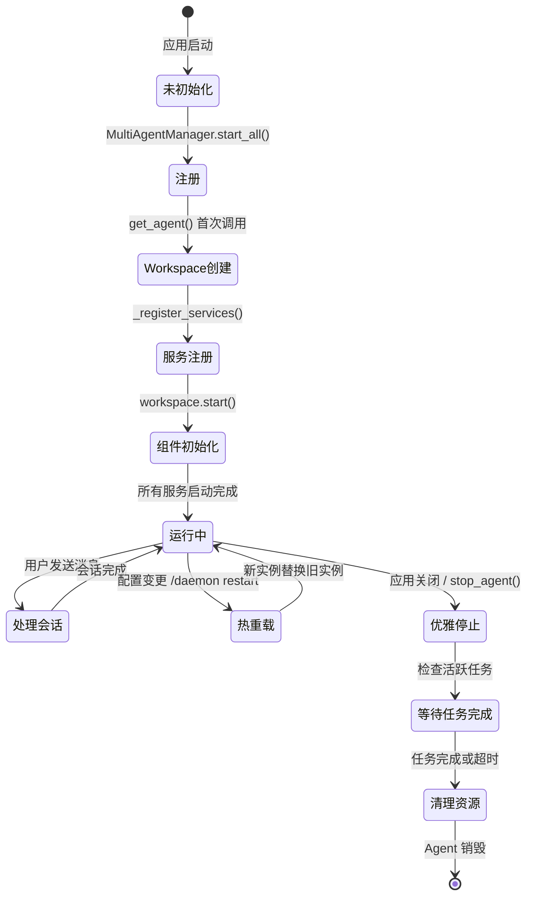
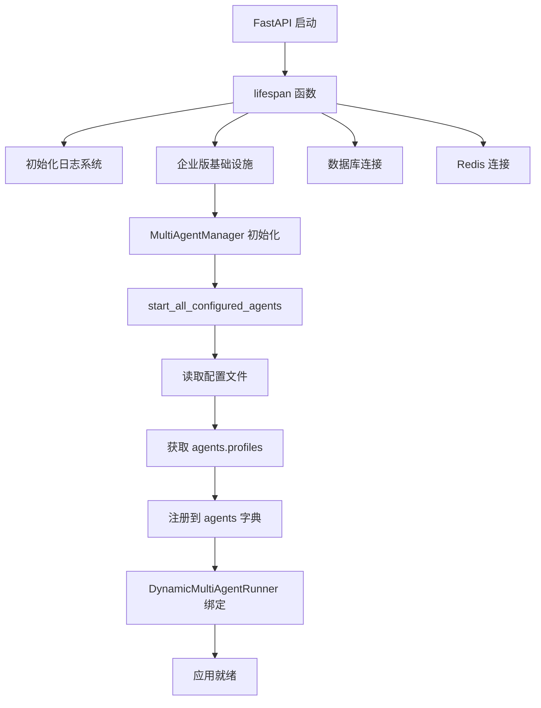
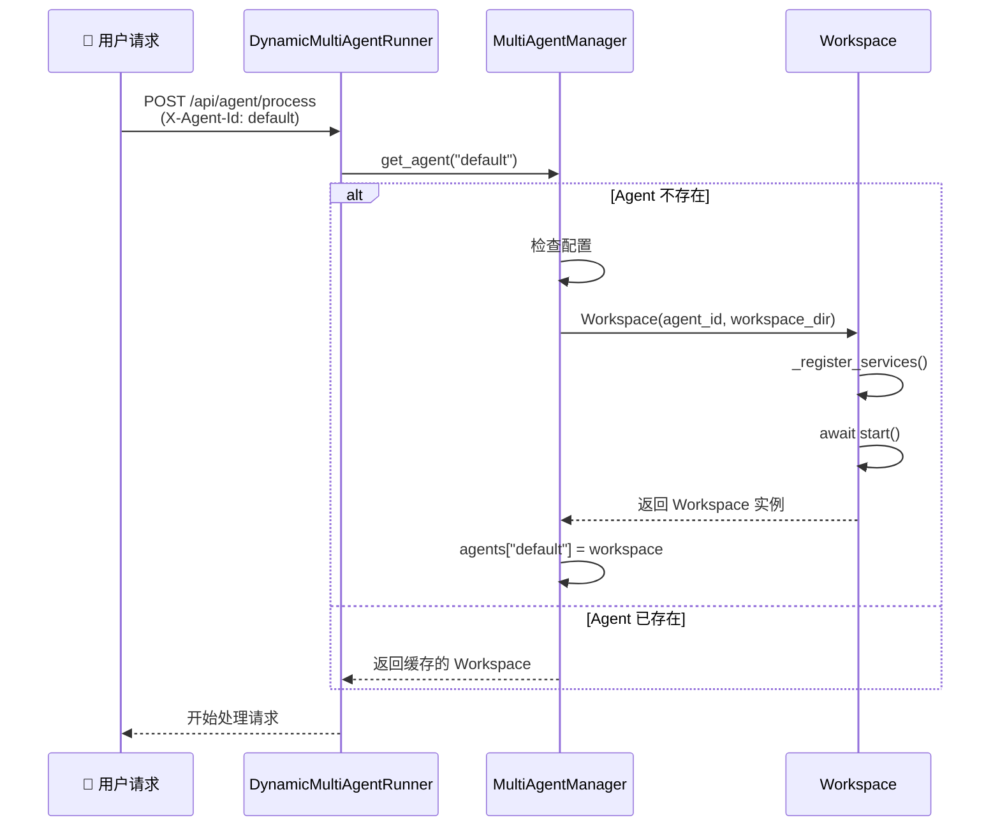
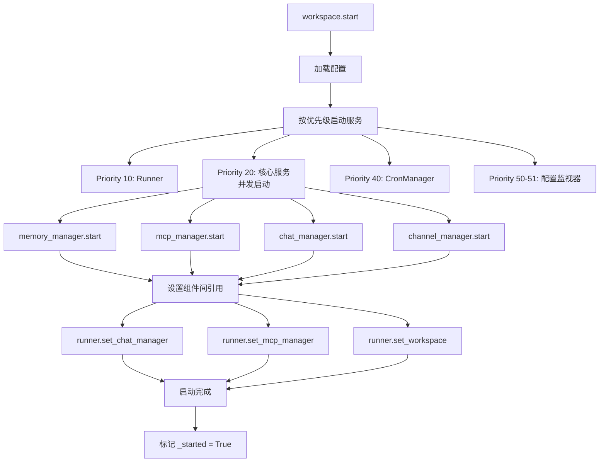
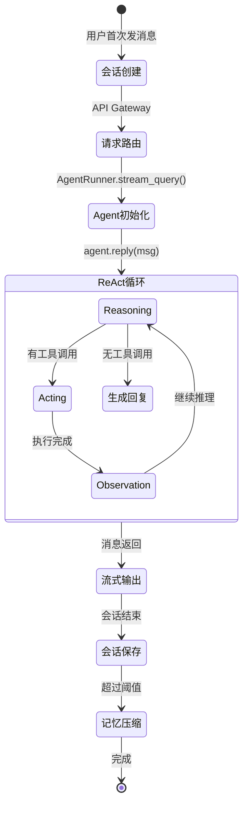
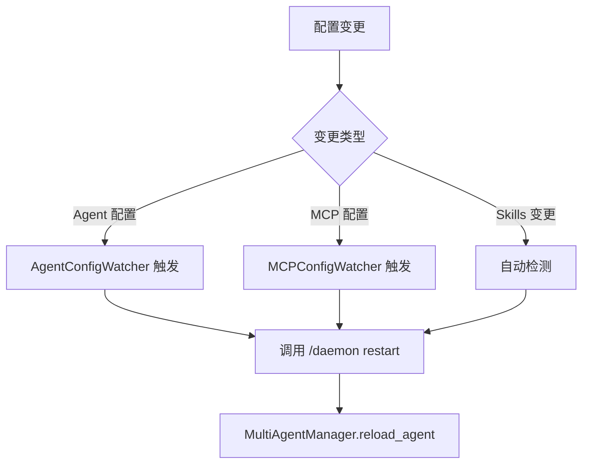

# CoPaw Agent 生命周期与会话流程详解

**文档版本**: 1.0  
**生成时间**: 2026-04-16  
**适用范围**: CoPaw Enterprise v3

---

## 📋 目录

1. [Agent 生命周期总览](#1-agent-生命周期总览)
2. [Phase 1: 应用启动与 Agent 注册](#2-phase-1-应用启动与-agent-注册)
3. [Phase 2: Workspace 初始化](#3-phase-2-workspace-初始化)
4. [Phase 3: 服务组件启动](#4-phase-3-服务组件启动)
5. [Phase 4: 单次会话完整流程](#5-phase-4-单次会话完整流程)
6. [Phase 5: 会话结束与状态保存](#6-phase-5-会话结束与状态保存)
7. [Phase 6: Agent 热重载](#7-phase-6-agent-热重载)
8. [Phase 7: Agent 停止与清理](#8-phase-7-agent-停止与清理)
9. [完整时序图](#9-完整时序图)
10. [关键代码位置](#10-关键代码位置)

---

## 1. Agent 生命周期总览

### 1.1 生命周期状态机



### 1.2 生命周期关键阶段

| 阶段 | 触发条件 | 持续时间 | 说明 |
|------|---------|---------|------|
| **注册** | 应用启动 | 瞬间 | 读取配置文件，注册 Agent 列表 |
| **创建** | 首次请求 | 1-3 秒 | 创建 Workspace 实例 |
| **初始化** | Workspace 创建后 | 2-5 秒 | 启动所有服务组件 |
| **运行** | 初始化完成 | 持续 | 处理用户会话 |
| **热重载** | 配置变更 | 3-8 秒 | 零停机替换实例 |
| **停止** | 应用关闭 | 5-60 秒 | 等待任务完成，清理资源 |

---

## 2. Phase 1: 应用启动与 Agent 注册

### 2.1 FastAPI 应用启动流程

**核心文件**: `src/copaw/app/_app.py`



### 2.2 详细启动代码

```python
# src/copaw/app/_app.py - lifespan()

@asynccontextmanager
async def lifespan(app: FastAPI):
    """应用生命周期管理"""
    
    # === 启动开始 ===
    startup_start_time = time.time()
    
    # 1. 初始化日志
    add_copaw_file_handler(WORKING_DIR / "copaw.log")
    
    # 2. 企业版基础设施（如果启用）
    if _enterprise_enabled:
        await _db_manager.initialize()      # PostgreSQL
        await _redis_manager.initialize()   # Redis
        await initialize_enterprise_services(app, db_session_factory)
    
    # 3. 多 Agent 迁移和初始化
    migrate_legacy_workspace_to_default_agent()
    ensure_default_agent_exists()
    migrate_legacy_skills_to_skill_pool()
    ensure_qa_agent_exists()
    
    # 4. MultiAgentManager 初始化
    multi_agent_manager = MultiAgentManager()
    await multi_agent_manager.start_all_configured_agents()
    
    # 5. 绑定到 DynamicMultiAgentRunner
    runner.set_multi_agent_manager(multi_agent_manager)
    
    # 6. 暴露到 app.state
    app.state.multi_agent_manager = multi_agent_manager
    app.state.get_agent_by_id = _get_agent_by_id
    
    yield  # === 应用运行中 ===
    
    # === 关闭清理 ===
    await multi_agent_manager.stop_all()
```

### 2.3 配置加载示例

```python
# config.json
{
  "agents": {
    "active_agent": "default",
    "profiles": {
      "default": {
        "id": "default",
        "name": "CoPaw Assistant",
        "workspace_dir": "./working/workspaces/default"
      },
      "qa_agent": {
        "id": "qa_agent",
        "name": "QA Agent",
        "workspace_dir": "./working/workspaces/qa_agent"
      }
    }
  }
}
```

---

## 3. Phase 2: Workspace 初始化

### 3.1 懒加载机制

**核心文件**: `src/copaw/app/multi_agent_manager.py`

Workspace 采用**懒加载**策略：只有在首次请求时才会创建。



### 3.2 Workspace 构造函数

```python
# src/copaw/app/workspace/workspace.py

class Workspace:
    def __init__(self, agent_id: str, workspace_dir: str):
        # 1. 基本信息
        self.agent_id = agent_id
        self.workspace_dir = Path(workspace_dir).expanduser()
        self.workspace_dir.mkdir(parents=True, exist_ok=True)
        
        # 2. 服务管理器
        self._service_manager = ServiceManager(self)
        
        # 3. 任务追踪器
        self._task_tracker = TaskTracker()
        
        # 4. 注册所有服务
        self._register_services()
```

### 3.3 服务注册清单

```python
def _register_services(self):
    """注册所有 Workspace 服务"""
    
    sm = self._service_manager
    
    # Priority 10: Runner（核心请求处理器）
    sm.register(ServiceDescriptor(
        name="runner",
        service_class=AgentRunner,
        init_args={"agent_id": ..., "workspace_dir": ...},
        priority=10,
    ))
    
    # Priority 20: 核心服务（并发初始化）
    sm.register(ServiceDescriptor(
        name="memory_manager",
        service_class=ReMeLightMemoryManager,
        start_method="start",
        priority=20,
        concurrent_init=True,
    ))
    
    sm.register(ServiceDescriptor(
        name="mcp_manager",
        service_class=MCPClientManager,
        priority=20,
        concurrent_init=True,
    ))
    
    sm.register(ServiceDescriptor(
        name="chat_manager",
        service_class=ChatManager,
        priority=20,
        concurrent_init=True,
    ))
    
    sm.register(ServiceDescriptor(
        name="channel_manager",
        service_class=ChannelManager,
        priority=20,
        concurrent_init=True,
    ))
    
    # Priority 40: CronManager（定时任务）
    sm.register(ServiceDescriptor(
        name="cron_manager",
        service_class=CronManager,
        start_method="start",
        priority=40,
    ))
    
    # Priority 50-51: 配置监视器（热重载支持）
    sm.register(ServiceDescriptor(
        name="agent_config_watcher",
        service_class=AgentConfigWatcher,
        priority=50,
    ))
    
    sm.register(ServiceDescriptor(
        name="mcp_config_watcher",
        service_class=MCPConfigWatcher,
        priority=51,
    ))
```

---

## 4. Phase 3: 服务组件启动

### 4.1 Workspace.start() 流程



### 4.2 启动代码详解

```python
# src/copaw/app/workspace/workspace.py

async def start(self):
    """启动 Workspace 所有服务"""
    
    if self._started:
        logger.warning(f"Workspace already started: {self.agent_id}")
        return
    
    # 1. 加载配置
    self._config = load_agent_config(self.agent_id)
    
    # 2. 启动所有服务（按优先级排序）
    await self._service_manager.start_all()
    
    # 3. 设置组件间引用
    if self.runner:
        if self.chat_manager:
            self.runner.set_chat_manager(self.chat_manager)
        if self.mcp_manager:
            self.runner.set_mcp_manager(self.mcp_manager)
        self.runner.set_workspace(self)
    
    # 4. 启动任务追踪器
    await self._task_tracker.start()
    
    # 5. 标记为已启动
    self._started = True
    
    logger.info(f"✓ Workspace started: {self.agent_id}")
```

---

## 5. Phase 4: 单次会话完整流程

### 5.1 会话生命周期



### 5.2 完整请求处理流程

**核心文件**: `src/copaw/app/runner/runner.py`

```python
# AgentRunner.stream_query() - 单次会话完整流程

async def stream_query(self, request, msgs, **kwargs):
    """处理单次 Agent 会话"""
    
    # ════════════════════════════════════════════
    # Step 1: 前置检查
    # ════════════════════════════════════════════
    
    # 1.1 检查是否有待审批的工具调用
    approval_response, approval_consumed, approved_tool_call = \
        await self._resolve_pending_approval(session_id, query)
    
    if approval_response is not None:
        yield approval_response, True
        await self._cleanup_denied_session_memory(...)
        return
    
    # 1.2 检查是否是内置命令（/new, /compact 等）
    if query and _is_command(query):
        async for msg, last in run_command_path(request, msgs, self):
            yield msg, last
        return
    
    # ════════════════════════════════════════════
    # Step 2: 准备执行环境
    # ════════════════════════════════════════════
    
    # 2.1 设置 Agent 上下文
    set_current_agent_id(self.agent_id)
    
    # 2.2 提取请求参数
    session_id = request.session_id
    user_id = request.user_id
    channel = getattr(request, "channel", DEFAULT_CHANNEL)
    
    # 2.3 构建环境上下文
    env_context = build_env_context(
        session_id=session_id,
        user_id=user_id,
        channel=channel,
        working_dir=str(self.workspace_dir),
    )
    
    # 2.4 获取 MCP 客户端（支持热重载）
    mcp_clients = []
    if self._mcp_manager is not None:
        mcp_clients = await self._mcp_manager.get_clients()
    
    # 2.5 加载 Agent 配置
    agent_config = load_agent_config(self.agent_id)
    
    # ════════════════════════════════════════════
    # Step 3: 创建 Agent 实例
    # ════════════════════════════════════════════
    
    agent = CoPawAgent(
        agent_config=agent_config,
        env_context=env_context,
        mcp_clients=mcp_clients,
        memory_manager=self.memory_manager,
        request_context={
            "session_id": session_id,
            "user_id": user_id,
            "channel": channel,
            "agent_id": self.agent_id,
        },
        workspace_dir=self.workspace_dir,
        task_tracker=self._task_tracker,
    )
    
    # 3.1 注册 MCP 客户端
    await agent.register_mcp_clients()
    
    # 3.2 禁用控制台输出（使用流式输出）
    agent.set_console_output_enabled(enabled=False)
    
    # ════════════════════════════════════════════
    # Step 4: 会话管理
    # ════════════════════════════════════════════
    
    # 4.1 获取或创建聊天会话
    chat = await self._chat_manager.get_or_create_chat(
        session_id, user_id, channel, name=name,
    )
    
    # 4.2 检查是否是 Skill 查询（/skill_name 无输入）
    skill_response = self._maybe_inject_skill(query, msgs, agent.toolkit.skills)
    if skill_response is not None:
        yield skill_response, True
        return
    
    # ════════════════════════════════════════════
    # Step 5: 加载会话状态
    # ════════════════════════════════════════════
    
    try:
        await self.session.load_session_state(
            session_id=session_id,
            user_id=user_id,
            agent=agent,
        )
    except KeyError as e:
        logger.warning("load_session_state skipped: %s", e)
    
    session_state_loaded = True
    
    # 5.1 重建系统提示词（反映最新配置）
    agent.rebuild_sys_prompt()
    
    # ════════════════════════════════════════════
    # Step 6: 执行 ReAct 循环（流式输出）
    # ════════════════════════════════════════════
    
    async for msg, last in stream_printing_messages(
        agents=[agent],
        coroutine_task=agent(msgs),  # 调用 agent.reply()
    ):
        yield msg, last  # 流式返回给客户端
    
    # ════════════════════════════════════════════
    # Step 7: 异常处理
    # ════════════════════════════════════════════
    
    # (在 finally 块中执行)
```

### 5.3 ReAct 循环详细流程

**核心文件**: `src/copaw/agents/react_agent.py`

```python
# CoPawAgent 继承自 ReActAgent

class CoPawAgent(ToolGuardMixin, ReActAgent):
    """
    MRO: CoPawAgent → ToolGuardMixin → ReActAgent
    """
```

#### Step 6.1: Reasoning（推理）

```python
async def _reasoning(self):
    """LLM 推理阶段"""
    
    # 1. 获取完整对话历史
    messages = self.memory.get_memory()
    
    # 2. 调用 LLM
    response = await self.model(messages)
    
    # 3. 解析响应
    # - 提取 Thought（思考过程）
    # - 检测是否有工具调用
    # - 提取工具名称和参数
    
    return parsed_thought
```

**LLM 收到的 Prompt 示例**:

```
System: 你是一个强大的 AI 助手。
你可以使用以下工具：
- execute_shell_command: 执行 shell 命令
- read_file: 读取文件
- write_file: 写入文件
...

User: 帮我分析项目结构

Assistant (LLM):
Thought: 我需要先查看项目目录结构
Action: execute_shell_command
Action Input: {"command": "ls -la"}
```

#### Step 6.2: Acting（执行）

```python
async def _acting(self, tool_calls):
    """工具执行阶段（带安全守卫）"""
    
    # ToolGuardMixin._acting() 会拦截
    
    for tool_call in tool_calls:
        # 1. 安全检查
        decision = await self._check_tool_guard(tool_call)
        
        if decision == ApprovalDecision.DENY:
            return {"error": "Tool call denied"}
        
        elif decision == ApprovalDecision.REQUIRES_APPROVAL:
            # 等待用户审批
            await self._request_user_approval(tool_call)
            user_response = await self._wait_for_approval()
            
            if user_response != "approve":
                return {"error": "User denied"}
        
        # 2. 执行工具
        tool_func = self.toolkit.get_tool(tool_call.name)
        result = await tool_func(**tool_call.arguments)
        
        # 3. 记录结果
        results.append({
            "tool": tool_call.name,
            "input": tool_call.arguments,
            "output": result,
        })
    
    return results
```

#### Step 6.3: Observation（观察）

```python
# 工具执行结果添加回记忆
self.memory.add_message(Msg(
    name="system",
    content=f"Tool {tool_name} returned: {result}",
    role="system",
))

# 继续下一轮 Reasoning
```

### 5.4 流式输出机制

```python
# stream_printing_messages 实现

async def stream_printing_messages(agents, coroutine_task):
    """流式输出 Agent 消息"""
    
    # 启动后台任务执行 agent.reply()
    task = asyncio.create_task(coroutine_task)
    
    while not task.done():
        # 从 agent 的打印队列获取消息
        for agent in agents:
            while agent.print_queue:
                msg = agent.print_queue.pop(0)
                
                # 判断是否是最后一条消息
                is_last = (
                    task.done() and 
                    not agent.print_queue
                )
                
                yield msg, is_last
        
        await asyncio.sleep(0.05)  # 50ms 轮询间隔
    
    # 任务完成，获取最终结果
    final_msg = await task
    yield final_msg, True
```

### 5.5 消息类型与输出顺序

```
用户: "帮我分析项目结构"

┌─ Agent 输出流 ──────────────────────────────┐
│                                              │
│ [thinking]                                   │
│ 💭 我需要先查看项目目录结构...               │
│                                              │
│ [tool_call]                                  │
│ 🛠️ execute_shell_command: ls -la             │
│                                              │
│ [tool_result]                                │
│ 📋 工具返回: drwxr-xr-x  src/ ...            │
│                                              │
│ [thinking]                                   │
│ 💭 让我继续查看源代码目录...                 │
│                                              │
│ [tool_call]                                  │
│ 🛠️ execute_shell_command: ls -la src/        │
│                                              │
│ [tool_result]                                │
│ 📋 工具返回: -rw-r--r--  main.py ...         │
│                                              │
│ [final]                                      │
│ ✅ 项目结构分析完成：                         │
│    - src/: 源代码目录                         │
│    - tests/: 测试目录                         │
│    - docs/: 文档目录                          │
│                                              │
│ [done] ← 流结束标记                           │
└──────────────────────────────────────────────┘
```

---

## 6. Phase 5: 会话结束与状态保存

### 6.1 Finally 块清理逻辑

```python
# AgentRunner.stream_query() - finally 块

finally:
    # 1. 保存会话状态
    if agent is not None and session_state_loaded:
        await self.session.save_session_state(
            session_id=session_id,
            user_id=user_id,
            agent=agent,
        )
    
    # 2. 更新聊天会话时间戳
    if self._chat_manager is not None and chat is not None:
        await self._chat_manager.touch_chat(chat.id)
```

### 6.2 会话状态保存内容

```python
# save_session_state() 保存的内容

{
    "session_id": "session_123",
    "user_id": "user_456",
    "agent_id": "default",
    "timestamp": "2026-04-16T10:30:00Z",
    
    # 对话历史
    "memory": [
        {"role": "user", "content": "帮我分析项目结构"},
        {"role": "assistant", "content": "好的，让我看看..."},
        ...
    ],
    
    # 环境变量
    "env_vars": {
        "COPAW_SESSION_ID": "session_123",
        "COPAW_USER_ID": "user_456",
        ...
    },
    
    # 工作目录状态
    "workspace_state": {
        "current_dir": "/path/to/workspace",
        ...
    }
}
```

### 6.3 记忆压缩机制

```python
# MemoryCompactionHook

class MemoryCompactionHook:
    """记忆压缩钩子"""
    
    async def on_post_reply(self, agent):
        """在 Agent 回复后检查是否需要压缩"""
        
        memory_count = len(agent.memory.get_memory())
        threshold = agent._agent_config.running.memory_compact_threshold
        
        if memory_count > threshold:
            logger.info(
                f"Memory count {memory_count} exceeds threshold {threshold}. "
                f"Triggering compaction..."
            )
            
            # 1. 保存关键信息
            # 2. 摘要长对话
            # 3. 保留工具结果
            # 4. 更新 Memory
            await agent.memory.compact()
```

---

## 7. Phase 6: Agent 热重载

### 7.1 热重载触发条件



### 7.2 零停机重载流程

**核心文件**: `src/copaw/app/multi_agent_manager.py`

```python
async def reload_agent(self, agent_id: str):
    """热重载 Agent（零停机）"""
    
    async with self._lock:
        # 1. 获取旧实例
        old_instance = self.agents.get(agent_id)
        if not old_instance:
            raise ValueError(f"Agent not found: {agent_id}")
        
        # 2. 创建新实例
        config = load_config()
        agent_ref = config.agents.profiles[agent_id]
        
        new_instance = Workspace(
            agent_id=agent_id,
            workspace_dir=agent_ref.workspace_dir,
        )
        
        # 3. 复用可热重载的组件
        await new_instance.set_reusable_components({
            'memory_manager': old_instance.memory_manager,
            'chat_manager': old_instance.chat_manager,
        })
        
        # 4. 启动新实例
        await new_instance.start()
        new_instance.set_manager(self)
        
        # 5. 原子切换：立即指向新实例
        self.agents[agent_id] = new_instance
        
        # 6. 优雅停止旧实例
        await self._graceful_stop_old_instance(old_instance, agent_id)
        
        logger.info(f"✓ Agent reloaded: {agent_id}")
```

### 7.3 旧实例优雅停止

```python
async def _graceful_stop_old_instance(self, old_instance, agent_id):
    """优雅停止旧实例"""
    
    # 1. 检查是否有活跃任务
    has_active = await old_instance.task_tracker.has_active_tasks()
    
    if has_active:
        # 2a. 有活跃任务：后台延迟清理
        active_tasks = await old_instance.task_tracker.list_active_tasks()
        logger.info(f"Has {len(active_tasks)} active tasks")
        
        async def delayed_cleanup():
            # 等待任务完成（最多 60 秒）
            completed = await old_instance.task_tracker.wait_all_done(
                timeout=60.0
            )
            
            # 停止旧实例
            await old_instance.stop(final=False)
        
        # 创建后台清理任务
        cleanup_task = asyncio.create_task(delayed_cleanup())
        self._cleanup_tasks.add(cleanup_task)
        
    else:
        # 2b. 无活跃任务：立即停止
        await old_instance.stop(final=False)
```

---

## 8. Phase 7: Agent 停止与清理

### 8.1 应用关闭流程

```python
# lifespan() - 关闭阶段

async def lifespan(app: FastAPI):
    # ... 启动逻辑 ...
    
    yield  # 应用运行中
    
    # === 关闭清理 ===
    
    # 1. 停止所有 Agent
    await multi_agent_manager.stop_all()
    
    # 2. 关闭数据库连接
    await app.state.db.close()
    
    # 3. 关闭 Redis 连接
    await app.state.redis.close()
    
    # 4. 清理后台任务
    for task in cleanup_tasks:
        task.cancel()
```

### 8.2 Workspace.stop() 流程

```python
async def stop(self, final: bool = True):
    """停止 Workspace"""
    
    if not self._started:
        return
    
    logger.info(f"Stopping workspace: {self.agent_id}")
    
    # 1. 停止配置监视器
    await self._service_manager.stop_services(priority=50)
    
    # 2. 停止 CronManager
    await self._service_manager.stop_services(priority=40)
    
    # 3. 停止核心服务
    await self._service_manager.stop_services(priority=20)
    
    # 4. 停止 Runner
    await self._service_manager.stop_services(priority=10)
    
    # 5. 停止任务追踪器
    await self._task_tracker.stop()
    
    # 6. 标记为未启动
    self._started = False
    
    if final:
        logger.info(f"✓ Workspace stopped: {self.agent_id}")
    else:
        logger.info(f"✓ Workspace stopped (reload): {self.agent_id}")
```

### 8.3 服务停止顺序

```
停止顺序（逆序）:

51. MCP Config Watcher      → 停止文件监视
50. Agent Config Watcher    → 停止文件监视
40. CronManager             → 停止定时任务调度
30. Channel Manager         → 关闭通信通道
20. Chat Manager            → 保存聊天状态
20. MCP Manager             → 关闭 MCP 连接
20. Memory Manager          → 保存记忆状态
10. Runner                  → 停止请求处理
 0. Task Tracker            → 等待任务完成
```

---

## 9. 完整时序图

### 9.1 从应用到会话的完整流程

```mermaid
sequenceDiagram
    participant OS as 操作系统
    participant FastAPI as FastAPI 应用
    participant Life as lifespan()
    participant MAM as MultiAgentManager
    participant WS as Workspace
    participant SM as ServiceManager
    participant Runner as AgentRunner
    participant Agent as CoPawAgent
    participant LLM as LLM API
    participant User as 👤 用户
    
    Note over OS,LLM: === Phase 1: 应用启动 ===
    OS->>FastAPI: 启动应用
    FastAPI->>Life: 调用 lifespan()
    Life->>Life: 初始化日志
    Life->>Life: 连接数据库
    Life->>Life: 连接 Redis
    Life->>MAM: MultiAgentManager()
    Life->>MAM: start_all_configured_agents()
    MAM->>MAM: 读取配置，注册 Agent 列表
    MAM-->>Life: 完成
    Life-->>FastAPI: yield（应用就绪）
    
    Note over OS,LLM: === Phase 2: Workspace 初始化（首次请求）===
    User->>FastAPI: POST /api/agent/process
    FastAPI->>Runner: DynamicMultiAgentRunner.stream_query()
    Runner->>MAM: get_agent("default")
    
    alt Agent 不存在
        MAM->>WS: Workspace(agent_id, workspace_dir)
        WS->>SM: _register_services()
        SM->>SM: 注册 8 个服务
        WS->>WS: await start()
        WS->>SM: start_all()
        SM->>SM: 按优先级启动服务
        SM-->>WS: 完成
        WS-->>MAM: 返回 Workspace 实例
        MAM->>MAM: agents["default"] = workspace
    end
    
    MAM-->>Runner: 返回 Workspace
    Runner->>Runner: workspace.runner
    
    Note over OS,LLM: === Phase 3: 单次会话处理 ===
    Runner->>Runner: stream_query(request, msgs)
    Runner->>Runner: load_agent_config()
    Runner->>Runner: build_env_context()
    Runner->>Runner: get_mcp_clients()
    Runner->>Agent: CoPawAgent(config, ...)
    Agent->>Agent: 创建 Toolkit
    Agent->>Agent: 注册工具
    Agent->>Agent: 构建 Prompt
    Agent->>Agent: 初始化 ReActAgent
    
    Runner->>Agent: register_mcp_clients()
    Runner->>Agent: set_console_output_enabled(False)
    
    Runner->>Runner: get_or_create_chat()
    Runner->>Runner: load_session_state()
    Runner->>Agent: rebuild_sys_prompt()
    
    Note over Agent,LLM: ReAct 循环
    loop max_iters (50次)
        Agent->>LLM: 调用模型推理
        LLM-->>Agent: 返回思考结果
        
        alt 有工具调用
            Agent->>Agent: ToolGuard 检查
            Agent->>Agent: 执行工具
            Agent->>Agent: 记录结果到 Memory
        else 直接回复
            Agent->>Agent: 生成最终回复
            break
        end
    end
    
    Note over OS,LLM: === Phase 4: 流式输出 ===
    Runner->>User: thinking 消息
    Runner->>User: tool_call 消息
    Runner->>User: tool_result 消息
    Runner->>User: final 消息
    Runner->>User: done 标记
    
    Note over OS,LLM: === Phase 5: 会话保存 ===
    Runner->>Runner: save_session_state()
    Runner->>Runner: touch_chat()
    
    alt 记忆超过阈值
        Runner->>Agent: 触发记忆压缩
        Agent->>Agent: compact memory
    end
    
    Note over OS,LLM: === Phase 6: 应用关闭 ===
    OS->>FastAPI: SIGTERM 信号
    FastAPI->>Life: 退出 yield，执行清理
    Life->>MAM: stop_all()
    MAM->>WS: stop_agent(agent_id)
    WS->>SM: stop_services()
    SM->>SM: 逆序停止服务
    WS->>WS: _task_tracker.stop()
    Life->>Life: 关闭数据库
    Life->>Life: 关闭 Redis
    Life-->>FastAPI: 完成
    FastAPI->>OS: 退出
```

---

## 10. 关键代码位置

### 10.1 核心文件映射

| 组件 | 文件路径 | 职责 |
|------|---------|------|
| **应用启动** | `app/_app.py` | FastAPI 应用和 lifespan |
| **Agent 管理器** | `app/multi_agent_manager.py` | 多 Agent 生命周期管理 |
| **Workspace** | `app/workspace/workspace.py` | 单个 Agent 工作空间 |
| **服务管理器** | `app/workspace/service_manager.py` | 服务注册和启动 |
| **AgentRunner** | `app/runner/runner.py` | 请求处理和会话管理 |
| **CoPawAgent** | `agents/react_agent.py` | Agent 核心实现 |
| **ReActAgent** | `agentscope/agent/react.py` | ReAct 模式基类 |
| **ToolGuard** | `agents/tool_guard_mixin.py` | 工具安全守卫 |
| **记忆管理** | `agents/memory/` | Memory 管理和压缩 |
| **技能管理** | `agents/skills_manager.py` | Skills 加载 |
| **MCP 管理** | `app/mcp.py` | MCP 客户端管理 |
| **聊天管理** | `app/channels/chat_manager.py` | 聊天会话管理 |
| **通道管理** | `app/channels/` | 通信通道 |
| **定时任务** | `app/crons/` | Cron 任务调度 |

### 10.2 关键函数索引

| 函数 | 文件 | 行号 | 说明 |
|------|------|------|------|
| `lifespan()` | `app/_app.py` | 163 | 应用生命周期管理 |
| `MultiAgentManager.__init__()` | `app/multi_agent_manager.py` | 31 | 管理器初始化 |
| `MultiAgentManager.get_agent()` | `app/multi_agent_manager.py` | 38 | 懒加载 Agent |
| `MultiAgentManager.reload_agent()` | `app/multi_agent_manager.py` | - | 热重载 Agent |
| `Workspace.__init__()` | `app/workspace/workspace.py` | 63 | Workspace 初始化 |
| `Workspace.start()` | `app/workspace/workspace.py` | - | 启动服务 |
| `Workspace.stop()` | `app/workspace/workspace.py` | - | 停止服务 |
| `AgentRunner.stream_query()` | `app/runner/runner.py` | 349 | 会话处理 |
| `CoPawAgent.__init__()` | `agents/react_agent.py` | 89 | Agent 初始化 |
| `CoPawAgent._reasoning()` | `agents/react_agent.py` | - | 推理阶段 |
| `CoPawAgent._acting()` | `agents/tool_guard_mixin.py` | - | 执行阶段 |

### 10.3 配置文件

| 配置项 | 文件 | 说明 |
|--------|------|------|
| Agent 列表 | `config.json` → `agents.profiles` | 定义所有 Agent |
| Agent 配置 | `working/workspaces/{id}/agent.json` | 单个 Agent 配置 |
| MCP 配置 | `working/workspaces/{id}/mcp.json` | MCP 服务器配置 |
| Skills | `working/workspaces/{id}/skills/` | 技能目录 |
| Prompts | `working/workspaces/{id}/` | AGENTS.md, SOUL.md 等 |

---

## 附录 A: 关键设计模式

### A.1 懒加载模式

```
优势：
- 减少启动时间
- 按需加载资源
- 支持动态 Agent

实现：
MultiAgentManager.get_agent() → 检查缓存 → 不存在则创建
```

### A.2 服务管理模式

```
优势：
- 统一生命周期管理
- 依赖注入
- 优先级控制

实现：
ServiceManager 注册 → 按优先级排序 → 并发/串行启动
```

### A.3 热重载模式

```
优势：
- 零停机更新
- 保持会话状态
- 后台清理旧实例

实现：
创建新实例 → 复用组件 → 原子切换 → 优雅停止旧实例
```

---

## 附录 B: 性能指标

| 指标 | 典型值 | 说明 |
|------|--------|------|
| **应用启动** | 3-8 秒 | 包含数据库连接 |
| **Workspace 创建** | 1-3 秒 | 首次请求时 |
| **服务初始化** | 2-5 秒 | 所有组件启动 |
| **单次会话** | 2-30 秒 | 取决于工具调用次数 |
| **热重载** | 3-8 秒 | 零停机替换 |
| **优雅停止** | 5-60 秒 | 等待任务完成 |

---

**文档维护**: 随代码更新同步维护  
**联系方式**: CoPaw 开发团队
