# CoPaw Agent Pipeline 流程图

**文档版本**: 1.0  
**生成时间**: 2026-04-16  
**适用范围**: CoPaw Enterprise v3

---

## 📊 1. 总体架构概览

### 1.1 系统架构图

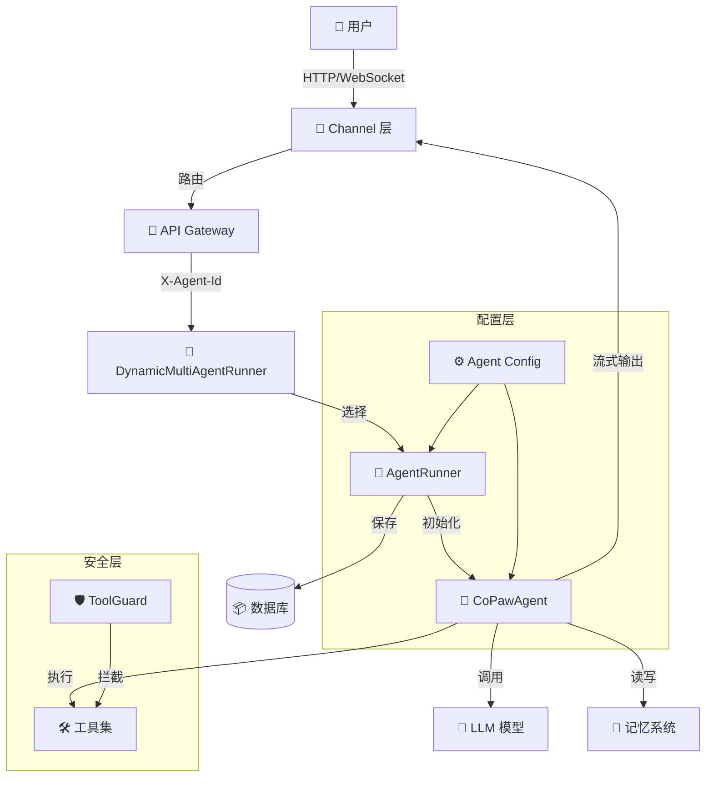
```mermaid
graph TB
    User[👤 用户] -->|HTTP/WebSocket| Channel[📡 Channel 层]
    Channel -->|路由| Gateway[🚪 API Gateway]
    Gateway -->|X-Agent-Id| Router[🔀 DynamicMultiAgentRunner]
    Router -->|选择| Runner[🏃 AgentRunner]
    Runner -->|初始化| Agent[🤖 CoPawAgent]
    Agent -->|调用| LLM[🧠 LLM 模型]
    Agent -->|执行| Tools[🛠️ 工具集]
    Agent -->|读写| Memory[💾 记忆系统]
    Agent -->|流式输出| Channel
    Runner -->|保存| DB[(📦 数据库)]
    
    subgraph "安全层"
        ToolGuard[🛡️ ToolGuard]
        ToolGuard -->|拦截| Tools
    end
    
    subgraph "配置层"
        Config[⚙️ Agent Config]
        Config --> Runner
        Config --> Agent
    end
```

---

## 🔄 2. 核心 Pipeline 流程

### 2.1 七阶段完整流程

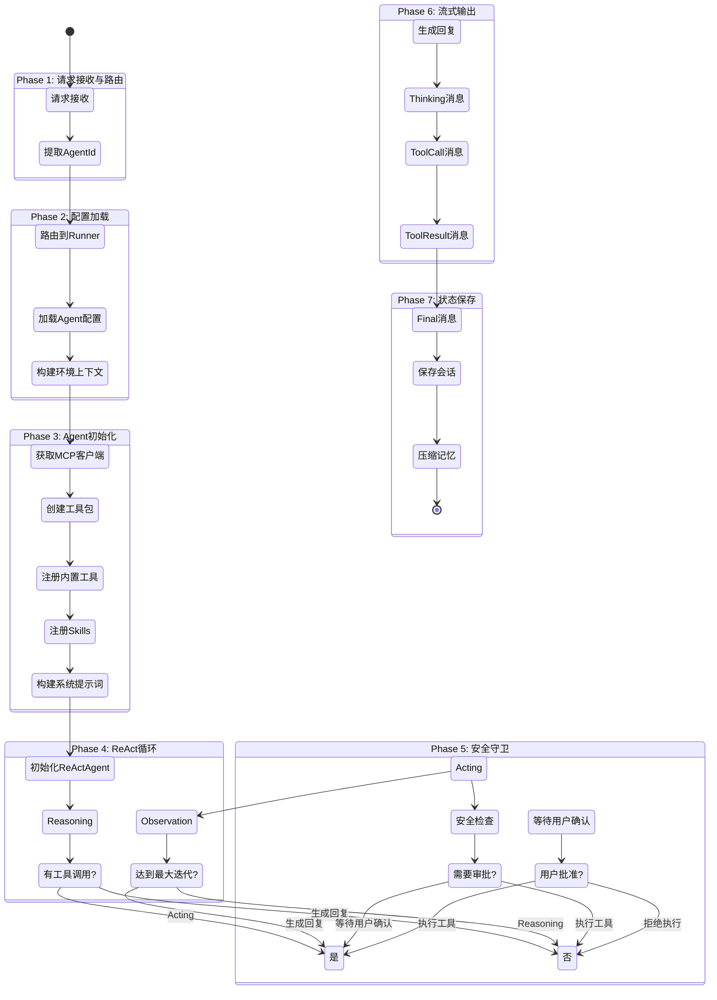
```mermaid
stateDiagram-v2
    [*] --> 请求接收
    
    state "Phase 1: 请求接收与路由" as P1 {
        请求接收 --> 提取AgentId
        提取AgentId --> 路由到Runner
    }
    
    state "Phase 2: 配置加载" as P2 {
        路由到Runner --> 加载Agent配置
        加载Agent配置 --> 构建环境上下文
        构建环境上下文 --> 获取MCP客户端
    }
    
    state "Phase 3: Agent初始化" as P3 {
        获取MCP客户端 --> 创建工具包
        创建工具包 --> 注册内置工具
        注册内置工具 --> 注册Skills
        注册Skills --> 构建系统提示词
        构建系统提示词 --> 初始化ReActAgent
    }
    
    state "Phase 4: ReAct循环" as P4 {
        初始化ReActAgent --> Reasoning
        Reasoning --> 有工具调用?
        有工具调用? --> 是: Acting
        有工具调用? --> 否: 生成回复
        Acting --> Observation
        Observation --> 达到最大迭代?
        达到最大迭代? --> 否: Reasoning
        达到最大迭代? --> 是: 生成回复
    }
    
    state "Phase 5: 安全守卫" as P5 {
        Acting --> 安全检查
        安全检查 --> 需要审批?
        需要审批? --> 是: 等待用户确认
        需要审批? --> 否: 执行工具
        等待用户确认 --> 用户批准?
        用户批准? --> 是: 执行工具
        用户批准? --> 否: 拒绝执行
    }
    
    state "Phase 6: 流式输出" as P6 {
        生成回复 --> Thinking消息
        Thinking消息 --> ToolCall消息
        ToolCall消息 --> ToolResult消息
        ToolResult消息 --> Final消息
    }
    
    state "Phase 7: 状态保存" as P7 {
        Final消息 --> 保存会话
        保存会话 --> 压缩记忆
        压缩记忆 --> [*]
    }
```

---

## 📥 3. 请求接收详细流程

### 3.1 API 路由流程

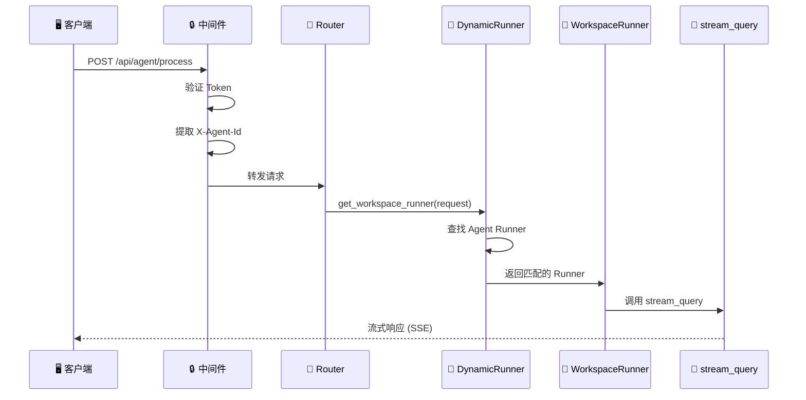
```mermaid
sequenceDiagram
    participant C as 🖥️ 客户端
    participant M as 🔒 中间件
    participant R as 🔀 Router
    participant D as 🏢 DynamicRunner
    participant W as 🏃 WorkspaceRunner
    participant Q as 📨 stream_query
    
    C->>M: POST /api/agent/process
    M->>M: 验证 Token
    M->>M: 提取 X-Agent-Id
    M->>R: 转发请求
    R->>D: get_workspace_runner(request)
    D->>D: 查找 Agent Runner
    D->>W: 返回匹配的 Runner
    W->>Q: 调用 stream_query
    Q-->>C: 流式响应 (SSE)
```

### 3.2 请求处理时序

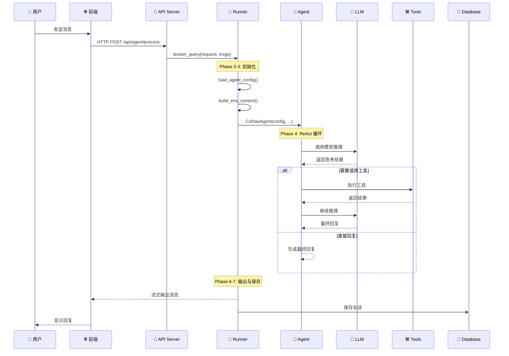
```mermaid
sequenceDiagram
    participant U as 👤 用户
    participant F as 🌐 前端
    participant A as 🚀 API Server
    participant R as 🏃 Runner
    participant G as 🤖 Agent
    participant L as 🧠 LLM
    participant T as 🛠️ Tools
    participant D as 💾 Database
    
    U->>F: 发送消息
    F->>A: HTTP POST /api/agent/process
    A->>R: stream_query(request, msgs)
    
    Note over R: Phase 2-3: 初始化
    R->>R: load_agent_config()
    R->>R: build_env_context()
    R->>G: CoPawAgent(config, ...)
    
    Note over G: Phase 4: ReAct 循环
    G->>L: 调用模型推理
    L-->>G: 返回思考结果
    
    alt 需要调用工具
        G->>T: 执行工具
        T-->>G: 返回结果
        G->>L: 继续推理
        L-->>G: 最终回复
    else 直接回复
        G-->>G: 生成最终回复
    end
    
    Note over R: Phase 6-7: 输出与保存
    R-->>F: 流式输出消息
    R->>D: 保存会话
    F-->>U: 显示回复
```

---

## 🔧 4. Agent 初始化流程

### 4.1 CoPawAgent 构造流程

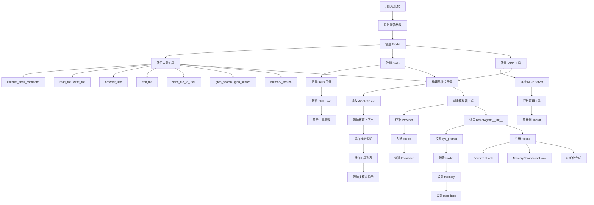
```mermaid
graph TD
    Start[开始初始化] --> A[提取配置参数]
    A --> B[创建 Toolkit]
    
    B --> C1[注册内置工具]
    C1 --> C11[execute_shell_command]
    C1 --> C12[read_file / write_file]
    C1 --> C13[browser_use]
    C1 --> C14[edit_file]
    C1 --> C15[send_file_to_user]
    C1 --> C16[grep_search / glob_search]
    C1 --> C17[memory_search]
    
    B --> C2[注册 Skills]
    C2 --> C21[扫描 skills 目录]
    C21 --> C22[解析 SKILL.md]
    C22 --> C23[注册工具函数]
    
    B --> C3[注册 MCP 工具]
    C3 --> C31[连接 MCP Server]
    C31 --> C32[获取可用工具]
    C32 --> C33[注册到 Toolkit]
    
    C1 --> D[构建系统提示词]
    C2 --> D
    C3 --> D
    
    D --> D1[读取 AGENTS.md]
    D1 --> D2[添加环境上下文]
    D2 --> D3[添加技能说明]
    D3 --> D4[添加工具列表]
    D4 --> D5[添加多模态提示]
    
    D --> E[创建模型客户端]
    E --> E1[获取 Provider]
    E1 --> E2[创建 Model]
    E2 --> E3[创建 Formatter]
    
    E --> F[调用 ReActAgent.__init__]
    F --> F1[设置 sys_prompt]
    F1 --> F2[设置 toolkit]
    F2 --> F3[设置 memory]
    F3 --> F4[设置 max_iters]
    
    F --> G[注册 Hooks]
    G --> G1[BootstrapHook]
    G --> G2[MemoryCompactionHook]
    
    G --> H[初始化完成]
```

### 4.2 工具注册详细流程

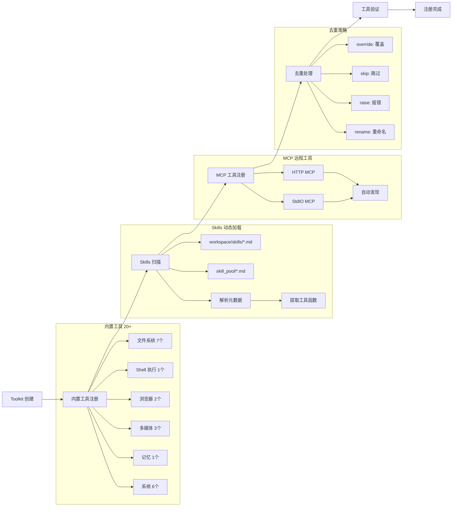
```mermaid
graph LR
    A[Toolkit 创建] --> B[内置工具注册]
    B --> C[Skills 扫描]
    C --> D[MCP 工具注册]
    D --> E[去重处理]
    E --> F[工具验证]
    F --> G[注册完成]
    
    subgraph "内置工具 20+"
        B --> B1[文件系统 7个]
        B --> B2[Shell 执行 1个]
        B --> B3[浏览器 2个]
        B --> B4[多媒体 3个]
        B --> B5[记忆 1个]
        B --> B6[系统 6个]
    end
    
    subgraph "Skills 动态加载"
        C --> C1[workspace/skills/*.md]
        C --> C2[skill_pool/*.md]
        C --> C3[解析元数据]
        C3 --> C4[提取工具函数]
    end
    
    subgraph "MCP 远程工具"
        D --> D1[HTTP MCP]
        D --> D2[StdIO MCP]
        D1 --> D3[自动发现]
        D2 --> D3
    end
    
    subgraph "去重策略"
        E --> E1[override: 覆盖]
        E --> E2[skip: 跳过]
        E --> E3[raise: 报错]
        E --> E4[rename: 重命名]
    end
```

---

## 🧠 5. ReAct 循环详细流程

### 5.1 Reasoning-Acting-Observation 循环

```mermaid
stateDiagram-v2
    [*] --> Start
    
    Start --> Reasoning: 用户消息
    
    state Reasoning {
        [*] --> 构建Prompt
        构建Prompt --> 调用LLM
        调用LLM --> 解析响应
        解析响应 --> 提取Thought
        提取Thought --> 检测工具调用
    }
    
    检测工具调用 --> HasToolCall{有工具?}
    
    HasToolCall -->|是| Acting
    HasToolCall -->|否| FinalResponse
    
    state Acting {
        [*] --> 安全检查
        安全检查 --> 需要审批?
        需要审批? -->|是| 等待用户
        需要审批? -->|否| 执行工具
        等待用户 --> 用户批准?
        用户批准? -->|是| 执行工具
        用户批准? -->|否| 拒绝
        执行工具 --> 收集结果
        收集结果 --> [*]
    }
    
    state Observation {
        [*] --> 记录工具结果
        记录工具结果 --> 添加到Memory
        添加到Memory --> [*]
    }
    
    Acting --> Observation
    Observation --> CheckLimit{达到最大迭代?}
    
    CheckLimit -->|否| Reasoning
    CheckLimit -->|是| FinalResponse
    
    state FinalResponse {
        [*] --> 生成最终回复
        生成最终回复 --> 格式化输出
        格式化输出 --> [*]
    }
    
    FinalResponse --> [*]
```

### 5.2 LLM 交互详细流程

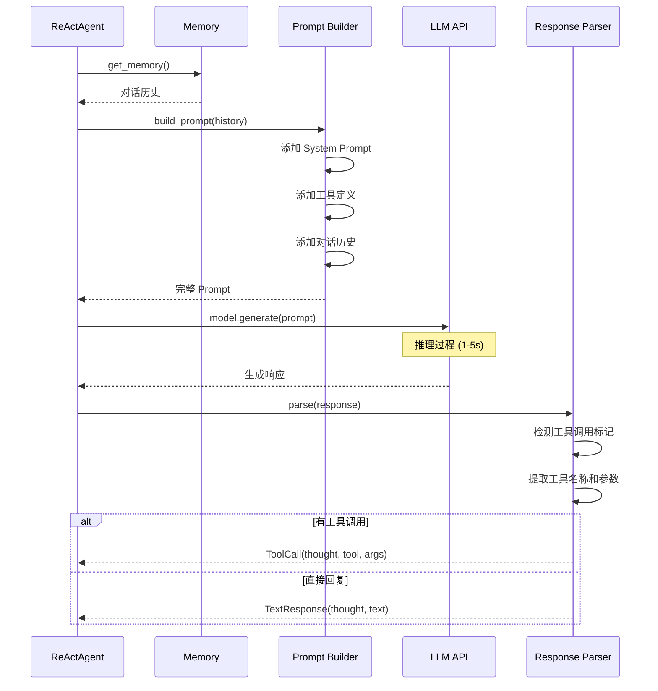
```mermaid
sequenceDiagram
    participant R as ReActAgent
    participant M as Memory
    participant P as Prompt Builder
    participant L as LLM API
    participant Parser as Response Parser
    
    R->>M: get_memory()
    M-->>R: 对话历史
    
    R->>P: build_prompt(history)
    P->>P: 添加 System Prompt
    P->>P: 添加工具定义
    P->>P: 添加对话历史
    P-->>R: 完整 Prompt
    
    R->>L: model.generate(prompt)
    
    Note over L: 推理过程 (1-5s)
    L-->>R: 生成响应
    
    R->>Parser: parse(response)
    Parser->>Parser: 检测工具调用标记
    Parser->>Parser: 提取工具名称和参数
    
    alt 有工具调用
        Parser-->>R: ToolCall(thought, tool, args)
    else 直接回复
        Parser-->>R: TextResponse(thought, text)
    end
```

### 5.3 工具调用示例流程

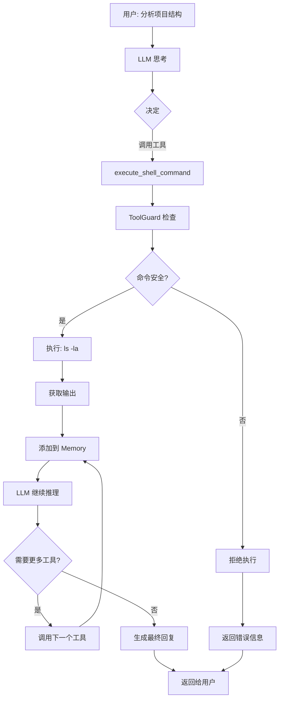
```mermaid
graph TD
    A[用户: 分析项目结构] --> B[LLM 思考]
    B --> C{决定}
    C -->|调用工具| D[execute_shell_command]
    
    D --> E[ToolGuard 检查]
    E --> F{命令安全?}
    F -->|是| G[执行: ls -la]
    F -->|否| H[拒绝执行]
    
    G --> I[获取输出]
    I --> J[添加到 Memory]
    J --> K[LLM 继续推理]
    
    K --> L{需要更多工具?}
    L -->|是| M[调用下一个工具]
    L -->|否| N[生成最终回复]
    
    M --> J
    N --> O[返回给用户]
    
    H --> P[返回错误信息]
    P --> O
```

---

## 🛡️ 6. 安全守卫流程

### 6.1 ToolGuard 检查流程

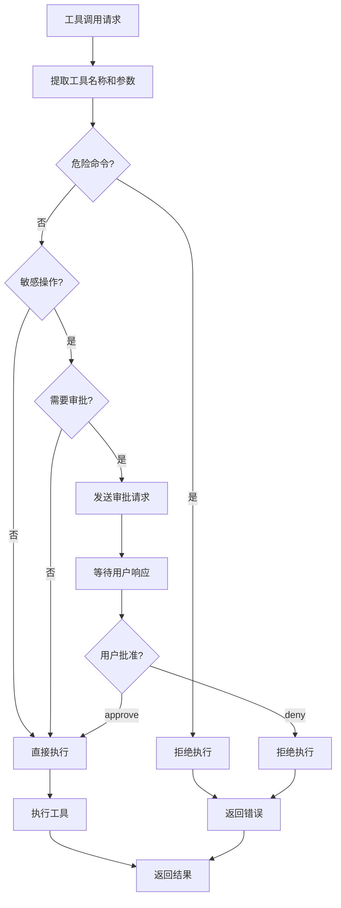
```mermaid
graph TD
    A[工具调用请求] --> B[提取工具名称和参数]
    B --> C{危险命令?}
    
    C -->|是| D[拒绝执行]
    C -->|否| E{敏感操作?}
    
    E -->|是| F{需要审批?}
    E -->|否| G[直接执行]
    
    F -->|是| H[发送审批请求]
    F -->|否| G
    
    H --> I[等待用户响应]
    I --> J{用户批准?}
    
    J -->|approve| G
    J -->|deny| K[拒绝执行]
    
    G --> L[执行工具]
    D --> M[返回错误]
    K --> M
    
    L --> N[返回结果]
    M --> N
```

### 6.2 安全检查规则

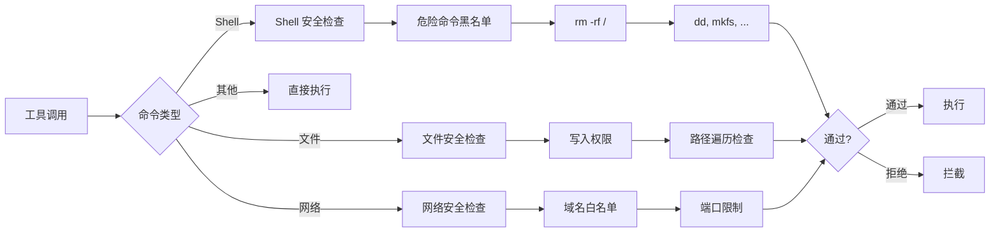
```mermaid
graph LR
    A[工具调用] --> B{命令类型}
    
    B -->|Shell| C[Shell 安全检查]
    B -->|文件| D[文件安全检查]
    B -->|网络| E[网络安全检查]
    B -->|其他| F[直接执行]
    
    C --> C1[危险命令黑名单]
    C1 --> C2[rm -rf /]
    C2 --> C3[dd, mkfs, ...]
    C3 --> G{通过?}
    
    D --> D1[写入权限]
    D1 --> D2[路径遍历检查]
    D2 --> G
    
    E --> E1[域名白名单]
    E1 --> E2[端口限制]
    E2 --> G
    
    G -->|通过| H[执行]
    G -->|拒绝| I[拦截]
```

---

## 📤 7. 流式输出流程

### 7.1 SSE (Server-Sent Events) 输出

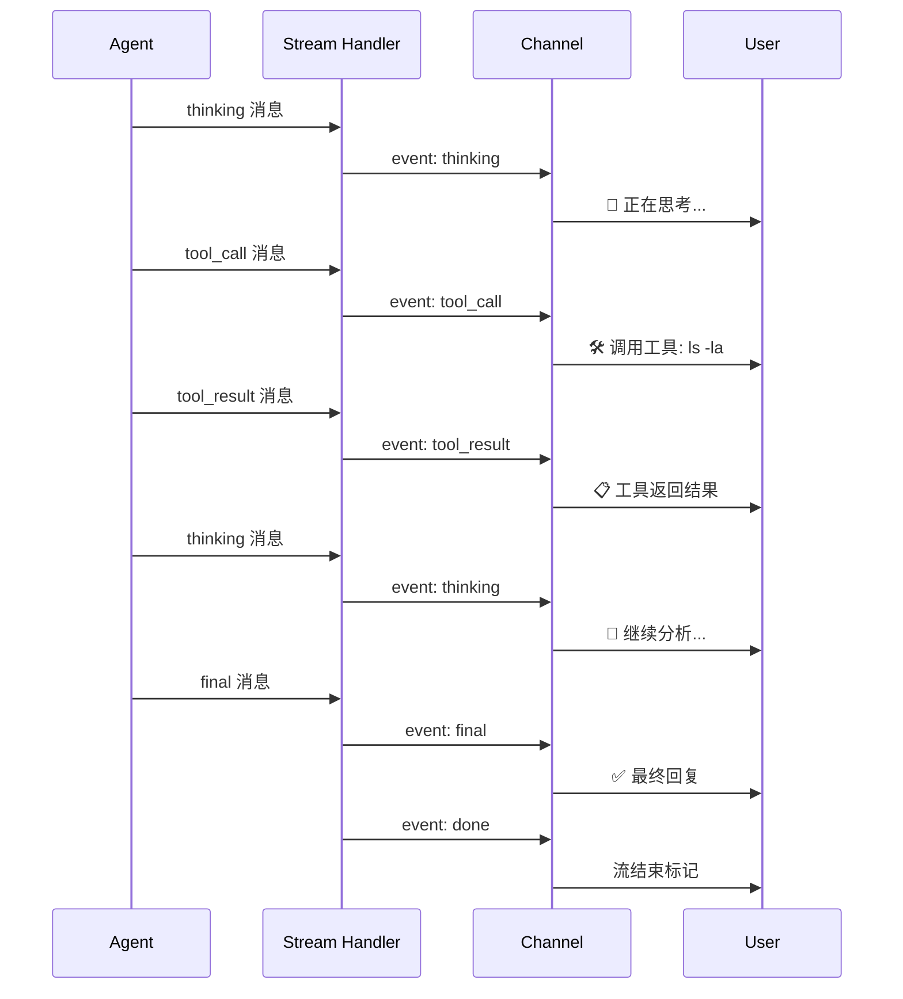
```mermaid
sequenceDiagram
    participant A as Agent
    participant S as Stream Handler
    participant C as Channel
    participant U as User
    
    A->>S: thinking 消息
    S->>C: event: thinking
    C->>U: 💭 正在思考...
    
    A->>S: tool_call 消息
    S->>C: event: tool_call
    C->>U: 🛠️ 调用工具: ls -la
    
    A->>S: tool_result 消息
    S->>C: event: tool_result
    C->>U: 📋 工具返回结果
    
    A->>S: thinking 消息
    S->>C: event: thinking
    C->>U: 💭 继续分析...
    
    A->>S: final 消息
    S->>C: event: final
    C->>U: ✅ 最终回复
    
    S->>C: event: done
    C->>U: 流结束标记
```

### 7.2 消息类型与格式

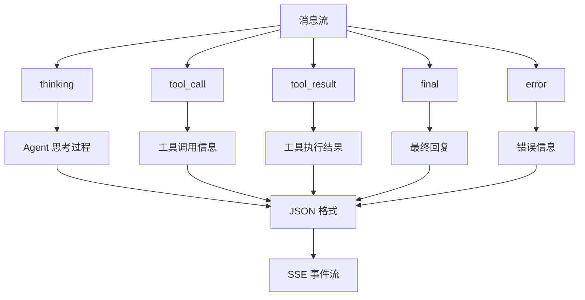
```mermaid
graph TD
    A[消息流] --> B[thinking]
    A --> C[tool_call]
    A --> D[tool_result]
    A --> E[final]
    A --> F[error]
    
    B --> B1[Agent 思考过程]
    C --> C1[工具调用信息]
    D --> D1[工具执行结果]
    E --> E1[最终回复]
    F --> F1[错误信息]
    
    B1 --> G[JSON 格式]
    C1 --> G
    D1 --> G
    E1 --> G
    F1 --> G
    
    G --> H[SSE 事件流]
```

---

## 💾 8. 会话管理流程

### 8.1 会话生命周期

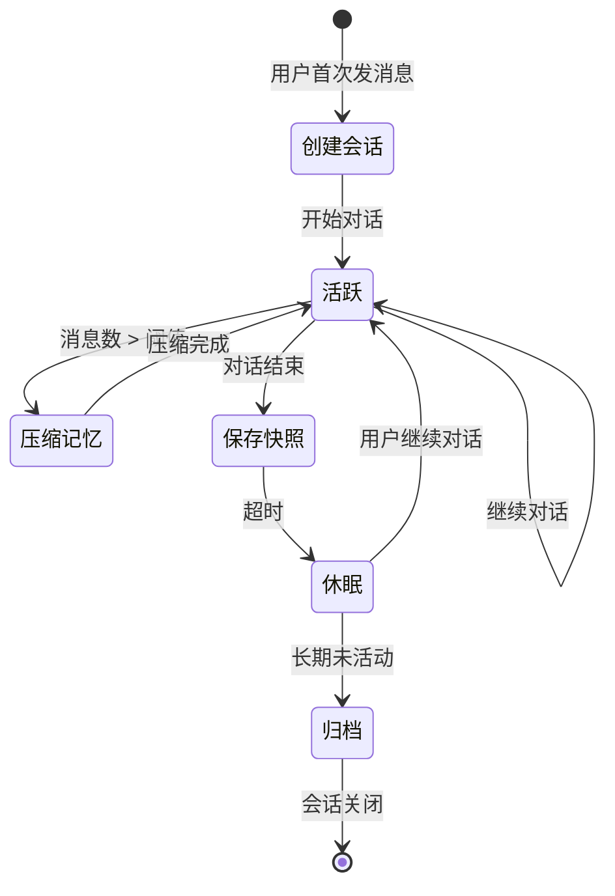
```mermaid
stateDiagram-v2
    [*] --> 创建会话: 用户首次发消息
    
    创建会话 --> 活跃: 开始对话
    活跃 --> 活跃: 继续对话
    
    活跃 --> 压缩记忆: 消息数 > 阈值
    
    压缩记忆 --> 活跃: 压缩完成
    
    活跃 --> 保存快照: 对话结束
    
    保存快照 --> 休眠: 超时
    
    休眠 --> 活跃: 用户继续对话
    休眠 --> 归档: 长期未活动
    
    归档 --> [*]: 会话关闭
```

### 8.2 记忆压缩流程

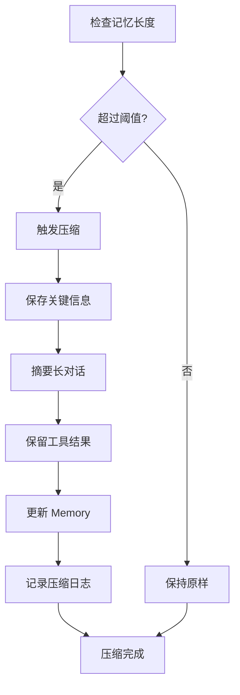
```mermaid
graph TD
    A[检查记忆长度] --> B{超过阈值?}
    
    B -->|否| C[保持原样]
    B -->|是| D[触发压缩]
    
    D --> E[保存关键信息]
    E --> F[摘要长对话]
    F --> G[保留工具结果]
    G --> H[更新 Memory]
    
    H --> I[记录压缩日志]
    I --> J[压缩完成]
    
    C --> J
```

---

## 🔄 9. 多 Agent 协作流程

### 9.1 Agent 间通信

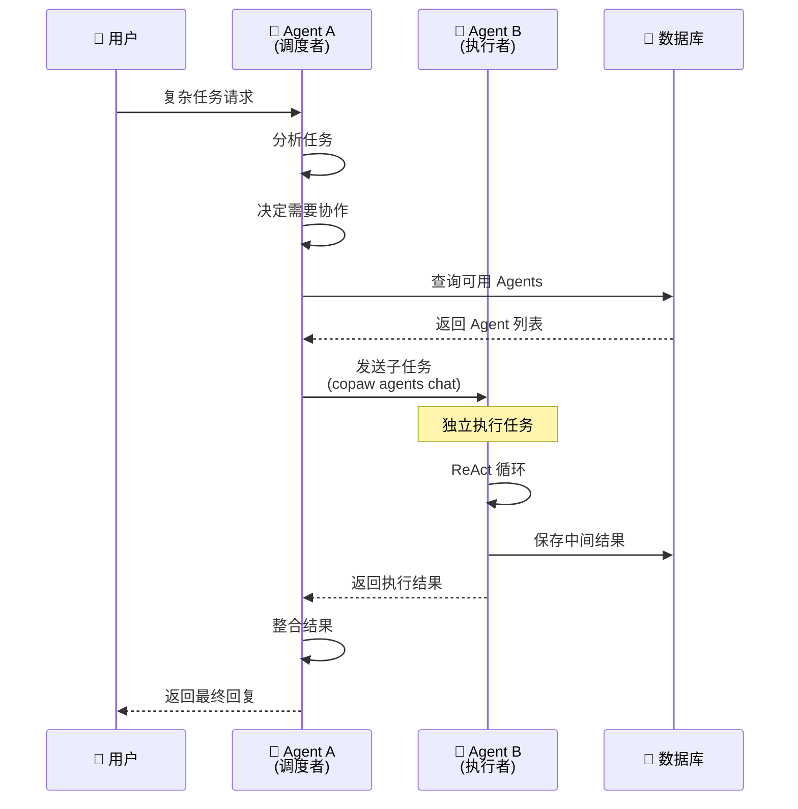
```mermaid
sequenceDiagram
    participant U as 👤 用户
    participant A1 as 🤖 Agent A<br/>(调度者)
    participant A2 as 🤖 Agent B<br/>(执行者)
    participant DB as 💾 数据库
    
    U->>A1: 复杂任务请求
    A1->>A1: 分析任务
    A1->>A1: 决定需要协作
    
    A1->>DB: 查询可用 Agents
    DB-->>A1: 返回 Agent 列表
    
    A1->>A2: 发送子任务<br/>(copaw agents chat)
    
    Note over A2: 独立执行任务
    A2->>A2: ReAct 循环
    A2->>DB: 保存中间结果
    
    A2-->>A1: 返回执行结果
    A1->>A1: 整合结果
    A1-->>U: 返回最终回复
```

### 9.2 后台任务模式

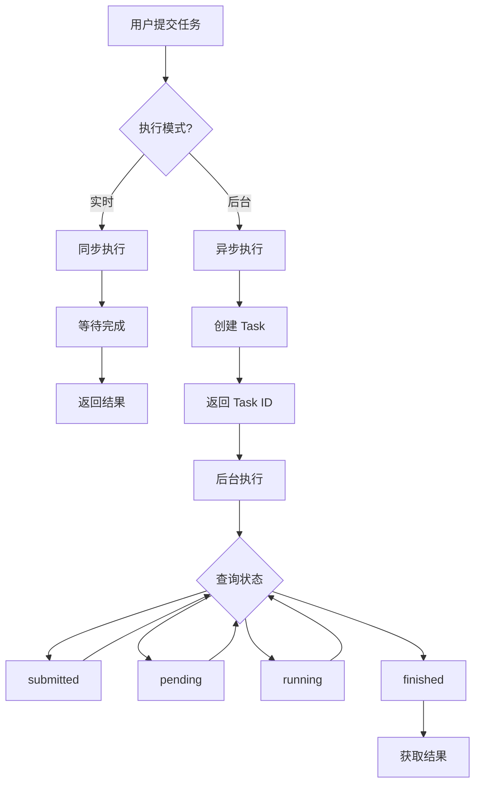
```mermaid
graph TD
    A[用户提交任务] --> B{执行模式?}
    
    B -->|实时| C[同步执行]
    B -->|后台| D[异步执行]
    
    C --> E[等待完成]
    E --> F[返回结果]
    
    D --> G[创建 Task]
    G --> H[返回 Task ID]
    H --> I[后台执行]
    
    I --> J{查询状态}
    J --> K[submitted]
    J --> L[pending]
    J --> M[running]
    J --> N[finished]
    
    N --> O[获取结果]
    
    K --> J
    L --> J
    M --> J
```

---

## 📊 10. 性能监控流程

### 10.1 指标收集

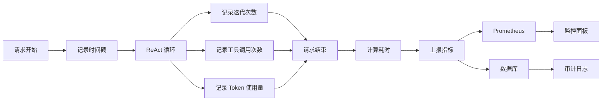
```mermaid
graph LR
    A[请求开始] --> B[记录时间戳]
    B --> C[ReAct 循环]
    C --> D[记录迭代次数]
    C --> E[记录工具调用次数]
    C --> F[记录 Token 使用量]
    
    D --> G[请求结束]
    E --> G
    F --> G
    
    G --> H[计算耗时]
    H --> I[上报指标]
    
    I --> J[Prometheus]
    I --> K[数据库]
    
    J --> L[监控面板]
    K --> M[审计日志]
```

---

## 🎯 11. 错误处理流程

### 11.1 异常处理策略

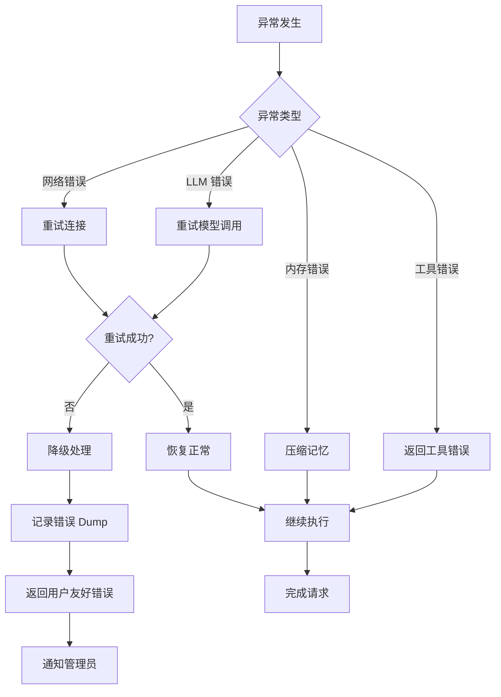
```mermaid
graph TD
    A[异常发生] --> B{异常类型}
    
    B -->|LLM 错误| C[重试模型调用]
    B -->|工具错误| D[返回工具错误]
    B -->|内存错误| E[压缩记忆]
    B -->|网络错误| F[重试连接]
    
    C --> G{重试成功?}
    D --> H[继续执行]
    E --> H
    F --> G
    
    G -->|是| I[恢复正常]
    G -->|否| J[降级处理]
    
    J --> K[记录错误 Dump]
    K --> L[返回用户友好错误]
    L --> M[通知管理员]
    
    I --> H
    H --> N[完成请求]
```

---

## 📝 12. 配置管理流程

### 12.1 配置加载顺序

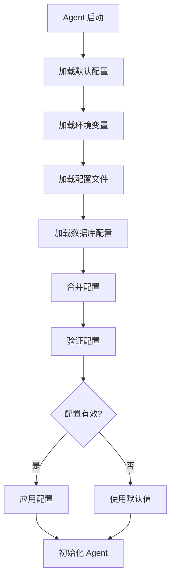
```mermaid
graph TD
    A[Agent 启动] --> B[加载默认配置]
    B --> C[加载环境变量]
    C --> D[加载配置文件]
    D --> E[加载数据库配置]
    E --> F[合并配置]
    F --> G[验证配置]
    G --> H{配置有效?}
    
    H -->|是| I[应用配置]
    H -->|否| J[使用默认值]
    
    I --> K[初始化 Agent]
    J --> K
```

---

## 🔗 13. 完整端到端流程

### 13.1 从用户请求到响应完成

```mermaid
graph TB
    Start[👤 用户发送消息] --> P1[Phase 1: 请求接收]
    
    P1 --> P1_1[API Gateway]
    P1_1 --> P1_2[中间件验证]
    P1_2 --> P1_3[提取 Agent ID]
    P1_3 --> P2[Phase 2: 配置加载]
    
    P2 --> P2_1[load_agent_config]
    P2_1 --> P2_2[build_env_context]
    P2_2 --> P2_3[get_mcp_clients]
    P2_3 --> P3[Phase 3: Agent 初始化]
    
    P3 --> P3_1[创建 Toolkit]
    P3_1 --> P3_2[注册工具]
    P3_2 --> P3_3[构建 Prompt]
    P3_3 --> P3_4[初始化 ReActAgent]
    P3_4 --> P4[Phase 4: ReAct 循环]
    
    P4 --> P4_1{Reasoning}
    P4_1 --> P4_2{有工具调用?}
    P4_2 -->|是| P5[Phase 5: 安全守卫]
    P4_2 -->|否| P6[Phase 6: 流式输出]
    
    P5 --> P5_1[ToolGuard 检查]
    P5_1 --> P5_2{需要审批?}
    P5_2 -->|是| P5_3[等待用户]
    P5_2 -->|否| P5_4[执行工具]
    P5_3 --> P5_4
    P5_4 --> P4_1
    
    P6 --> P6_1[Thinking 消息]
    P6_1 --> P6_2[Tool 消息]
    P6_2 --> P6_3[Final 消息]
    P6_3 --> P7[Phase 7: 状态保存]
    
    P7 --> P7_1[保存会话]
    P7_1 --> P7_2[压缩记忆]
    P7_2 --> End[✅ 响应完成]
```

---

## 📚 附录

### A. 关键文件映射

| 阶段 | 核心文件 | 说明 |
|------|---------|------|
| 请求接收 | `app/_app.py` | FastAPI 应用和路由 |
| 配置加载 | `config/config.py` | Agent 配置加载 |
| Agent 初始化 | `agents/react_agent.py` | CoPawAgent 实现 |
| ReAct 循环 | `agentscope/agent/react.py` | ReActAgent 基类 |
| 安全守卫 | `agents/tool_guard_mixin.py` | ToolGuard 实现 |
| 工具注册 | `agents/tools/` | 内置工具实现 |
| 技能管理 | `agents/skills_manager.py` | Skills 加载 |
| 记忆管理 | `agents/memory/` | Memory 管理 |
| 流式输出 | `app/runner/runner.py` | AgentRunner |
| Channel | `app/channels/` | 输出通道 |

### B. 关键配置参数

| 参数 | 默认值 | 说明 |
|------|--------|------|
| `max_iters` | 50 | 最大 ReAct 迭代次数 |
| `max_input_length` | 8000 | 最大输入长度 |
| `memory_compact_threshold` | 100 | 记忆压缩阈值 |
| `temperature` | 0.7 | LLM 温度参数 |
| `tool_guard_enabled` | true | 启用工具守卫 |
| `approval_timeout` | 300s | 审批超时时间 |

### C. 性能指标

| 指标 | 典型值 | 说明 |
|------|--------|------|
| 首次响应时间 | 1-3s | 从请求到首次输出 |
| 单次迭代耗时 | 0.5-2s | 单次 Reasoning-Acting 循环 |
| 工具调用耗时 | 0.1-5s | 取决于工具类型 |
| 总响应时间 | 2-30s | 完整对话响应 |
| 内存占用 | 50-200MB | 单个 Agent 实例 |
| 并发支持 | 10-50 | 同时处理的会话数 |

---

**文档维护**: 随代码更新同步维护  
**联系方式**: CoPaw 开发团队
