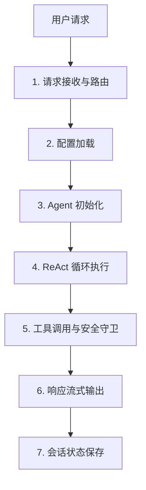

我来详细讲解 CoPaw 中 Agent 代理功能的 Pipeline 流程。让我先搜索相关的代码实现：


现在我来详细讲解 CoPaw 中 Agent 代理功能的 Pipeline 流程：

## 📋 CoPaw Agent Pipeline 完整流程详解

---

### 🎯 总体架构

CoPaw 的 Agent 系统基于 **ReAct (Reasoning + Acting)** 模式，Pipeline 流程可以分为 **7 个核心阶段**：



---

### 📍 Phase 1: 请求接收与路由

**入口点**: `AgentApp` → `DynamicMultiAgentRunner`

```python
# src/copaw/app/_app.py
class DynamicMultiAgentRunner:
    """动态路由到正确的 workspace runner"""
    
    async def _get_workspace_runner(self, request):
        # 1. 从请求头获取 agent_id
        agent_id = request.headers.get("X-Agent-Id", "default")
        
        # 2. 获取对应的 AgentRunner
        runner = self._multi_agent_manager.get_runner(agent_id)
        return runner
```

**关键流程**:
1. 用户发送请求到 `/api/agent/process`
2. 中间件提取 `X-Agent-Id` 头
3. `DynamicMultiAgentRunner` 路由到对应的 workspace
4. 调用 `AgentRunner.stream_query()`

---

### 📍 Phase 2: 配置加载

**核心文件**: `src/copaw/app/runner/runner.py`

```python
# AgentRunner.stream_query()
async def stream_query(self, request, msgs):
    # 1. 加载 Agent 配置
    agent_config = load_agent_config(self.agent_id)
    
    # 2. 构建环境上下文
    env_context = build_env_context(
        session_id=session_id,
        user_id=user_id,
        channel=channel,
        working_dir=str(self.workspace_dir),
    )
    
    # 3. 获取 MCP 客户端（支持热重载）
    mcp_clients = await self._mcp_manager.get_clients()
```

**加载的配置项**:
- ✅ Agent 基本信息（name, description）
- ✅ 模型配置（provider, model_name, temperature）
- ✅ 运行配置（max_iters, max_input_length）
- ✅ 技能配置（enabled_skills）
- ✅ 语言设置（language）
- ✅ Memory 配置（compaction_threshold）

---

### 📍 Phase 3: Agent 初始化

**核心文件**: `src/copaw/agents/react_agent.py`

```python
# 创建 CoPawAgent 实例
agent = CoPawAgent(
    agent_config=agent_config,
    env_context=env_context,
    mcp_clients=mcp_clients,
    memory_manager=self.memory_manager,
    request_context={
        "session_id": session_id,
        "user_id": user_id,
        "channel": channel,
        "agent_id": self.agent_id,
    },
    workspace_dir=self.workspace_dir,
)
```

**初始化流程**（CoPawAgent.__init__）:

```python
class CoPawAgent(ToolGuardMixin, ReActAgent):
    def __init__(self, ...):
        # 1. 创建工具包
        toolkit = self._create_toolkit()
        
        # 2. 注册内置工具
        # - execute_shell_command
        # - read_file / write_file / edit_file
        # - browser_use
        # - send_file_to_user
        # - get_current_time
        # - Memory 搜索工具
        
        # 3. 注册 Skills（从 workspace/skills 目录）
        self._register_skills(toolkit)
        
        # 4. 注册 MCP 工具（如果有）
        for mcp_client in mcp_clients:
            toolkit.register_tool_function(mcp_client)
        
        # 5. 构建系统提示词
        sys_prompt = self._build_sys_prompt()
        
        # 6. 创建模型和消息格式化器
        model, formatter = create_model_and_formatter(agent_id)
        
        # 7. 调用父类 ReActAgent 初始化
        super().__init__(
            model=model,
            formatter=formatter,
            sys_prompt=sys_prompt,
            toolkit=toolkit,
            memory=InMemoryMemory(),
            max_iters=running_config.max_iters,
        )
        
        # 8. 注册 Hooks
        self.register_hook(BootstrapHook())  # 首次启动引导
        self.register_hook(MemoryCompactionHook())  # 记忆压缩
```

---

### 📍 Phase 4: ReAct 循环执行（核心）

**ReAct 模式**: Reasoning → Acting → Observation → Repeat

```python
# agentscope.agent.ReActAgent 的核心循环
async def reply(self, msg):
    # 1. 将用户消息添加到记忆
    self.memory.add_message(msg)
    
    # 2. 开始 ReAct 循环
    for iteration in range(max_iters):
        # ── Reasoning 阶段 ──
        thought = await self._reasoning()
        # LLM 思考：我应该做什么？
        # 输出：调用哪个工具？参数是什么？
        
        # ── Acting 阶段 ──
        if thought.has_tool_call:
            # 执行工具调用
            tool_result = await self._acting(thought.tool_calls)
            
            # ── Observation 阶段 ──
            # 将工具结果添加回记忆
            self.memory.add_message(tool_result)
            
            # 继续下一轮推理
            continue
        else:
            # 没有工具调用，生成最终回复
            final_response = thought.text
            break
    
    return final_response
```

**详细步骤**:

#### Step 4.1: Reasoning（推理）

```python
async def _reasoning(self):
    # 1. 获取完整对话历史
    messages = self.memory.get_memory()
    
    # 2. 调用 LLM
    response = await self.model(messages)
    
    # 3. 解析响应
    # - 是否有工具调用？
    # - 工具名称和参数是什么？
    # - 还是直接回复文本？
    
    return parsed_thought
```

**LLM 收到的提示词示例**:
```
System: 你是一个强大的 AI 助手，可以使用以下工具：
- execute_shell_command: 执行 shell 命令
- read_file: 读取文件内容
- write_file: 写入文件
...

User: 帮我分析项目结构

Assistant (LLM): 
Thought: 我需要先查看项目目录结构
Action: execute_shell_command
Action Input: {"command": "ls -la"}
```

#### Step 4.2: Acting（执行）

```python
async def _acting(self, tool_calls):
    results = []
    for tool_call in tool_calls:
        # 1. 获取工具函数
        tool_func = self.toolkit.get_tool(tool_call.name)
        
        # 2. 执行工具（带安全守卫）
        result = await tool_func(**tool_call.arguments)
        
        # 3. 记录工具调用
        results.append({
            "tool": tool_call.name,
            "input": tool_call.arguments,
            "output": result,
        })
    
    return results
```

#### Step 4.3: Observation（观察）

```python
# 工具执行结果添加回记忆
self.memory.add_message(Msg(
    name="system",
    content=f"Tool {tool_name} returned: {result}",
    role="system",
))

# 继续下一轮 Reasoning
# LLM 会看到工具结果，决定下一步动作
```

---

### 📍 Phase 5: 工具调用与安全守卫

**核心文件**: `src/copaw/agents/tool_guard_mixin.py`

```python
class ToolGuardMixin:
    """工具安全守卫 - 拦截危险操作"""
    
    async def _acting(self, tool_calls):
        # 1. 检查每个工具调用
        for tool_call in tool_calls:
            decision = await self._check_tool_guard(tool_call)
            
            if decision == ApprovalDecision.DENY:
                # 拒绝执行
                return {"error": "Tool call denied by security policy"}
            
            elif decision == ApprovalDecision.REQUIRES_APPROVAL:
                # 需要用户确认
                await self._request_user_approval(tool_call)
                # 等待用户输入 approve/deny
                user_response = await self._wait_for_approval()
                
                if user_response != "approve":
                    return {"error": "User denied tool execution"}
        
        # 2. 所有检查通过，执行工具
        return await super()._acting(tool_calls)
```

**安全检查项**:
- ✅ 危险命令拦截（`rm -rf`, `dd`, `mkfs` 等）
- ✅ 文件写入权限检查
- ✅ 网络请求白名单
- ✅ Shell 注入防护
- ✅ 敏感文件访问控制

---

### 📍 Phase 6: 响应流式输出

**核心文件**: `src/copaw/app/runner/runner.py`

```python
async def stream_query(self, request, msgs):
    # 使用 stream_printing_messages 流式输出
    async for msg, is_last in stream_printing_messages(
        agents=[agent],
        coroutine_task=agent.reply(msgs[-1]),
    ):
        # 1. 处理消息内容
        content = self._extract_text(msg)
        
        # 2. 通过 Channel 发送
        yield {
            "type": msg.role,  # thinking/tool/result
            "content": content,
            "is_last": is_last,
        }
        
        # 3. 记录到数据库
        if self._chat_manager:
            await self._chat_manager.append_message(...)
```

**消息类型**:
- `thinking` - Agent 的思考过程
- `tool_call` - 工具调用信息
- `tool_result` - 工具执行结果
- `final` - 最终回复

---

### 📍 Phase 7: 会话状态保存

```python
# 执行完成后
try:
    # 1. 保存会话状态到数据库
    if self._chat_manager:
        await self._chat_manager.save_session(
            session_id=session_id,
            messages=self.memory.get_memory(),
        )
    
    # 2. 压缩记忆（如果超过阈值）
    if self.memory_manager:
        await self.memory_manager.compact_if_needed()
        
except Exception as e:
    logger.error(f"Failed to save session: {e}")
    write_query_error_dump(session_id, e)
```

---

### 🔁 完整流程图

```
用户请求
  ↓
[1] API Router → DynamicMultiAgentRunner
  ↓
[2] AgentRunner.stream_query()
  ├─ 加载配置 (load_agent_config)
  ├─ 构建环境上下文 (build_env_context)
  └─ 获取 MCP 客户端
  ↓
[3] CoPawAgent 初始化
  ├─ 创建工具包 (Toolkit)
  ├─ 注册内置工具 (20+ tools)
  ├─ 注册 Skills (动态加载)
  ├─ 注册 MCP 工具
  ├─ 构建系统提示词
  └─ 创建模型客户端
  ↓
[4] ReAct 循环 (max_iters=50)
  ├─ Reasoning: LLM 思考下一步
  ├─ Acting: 执行工具调用
  │   └─ ToolGuard: 安全检查
  ├─ Observation: 记录工具结果
  └─ 循环直到生成最终回复
  ↓
[5] 流式输出
  ├─ thinking 消息
  ├─ tool_call 消息
  ├─ tool_result 消息
  └─ final 消息
  ↓
[6] 保存会话
  ├─ 消息保存到数据库
  ├─ 压缩记忆（如需要）
  └─ 记录错误 dump（如失败）
  ↓
返回给用户
```

---

### 🛠️ 关键组件

| 组件 | 文件 | 职责 |
|------|------|------|
| **AgentApp** | `app/_app.py` | FastAPI 应用，路由请求 |
| **DynamicMultiAgentRunner** | `app/_app.py` | 动态路由到正确的 Agent |
| **AgentRunner** | `app/runner/runner.py` | 管理 Agent 生命周期 |
| **CoPawAgent** | `agents/react_agent.py` | 核心 Agent 实现 |
| **ReActAgent** | `agentscope.agent` | ReAct 模式基类 |
| **ToolGuardMixin** | `agents/tool_guard_mixin.py` | 工具安全守卫 |
| **Toolkit** | `agentscope.tool` | 工具注册与管理 |
| **Memory** | `agentscope.memory` | 对话历史管理 |
| **Channel** | `app/channels/` | 输出通道（Console/Web等） |

---

### 📊 性能指标

- **单次响应时间**: 1-10 秒（取决于工具调用次数）
- **最大迭代次数**: 50 次（可配置）
- **Memory 压缩阈值**: 100 条消息（可配置）
- **并发支持**: 异步 I/O，支持多会话并发

---

这就是 CoPaw Agent 的完整 Pipeline 流程！核心是基于 **ReAct 模式**的 Reasoning-Acting-Observation 循环，配合工具守卫、流式输出和会话管理，构建了一个强大的 AI Agent 系统。

我来生成一份详细的 Agent Pipeline 流程图可视化文档：


## ✅ Agent Pipeline 流程图文档已生成！

---

### 📄 文档位置

[agent-pipeline-flowchart.md](file:///d:/projects/copaw/docs/agent-pipeline-flowchart.md) (796 行)

---

### 📊 包含的流程图（13 个）

#### 1️⃣ **总体架构概览**
- 系统架构图（组件关系）

#### 2️⃣ **核心 Pipeline 流程**
- 七阶段完整状态图

#### 3️⃣ **请求接收详细流程**
- API 路由时序图
- 请求处理时序图

#### 4️⃣ **Agent 初始化流程**
- CoPawAgent 构造流程图
- 工具注册详细流程

#### 5️⃣ **ReAct 循环详细流程**
- Reasoning-Acting-Observation 循环
- LLM 交互时序图
- 工具调用示例流程

#### 6️⃣ **安全守卫流程**
- ToolGuard 检查流程
- 安全检查规则

#### 7️⃣ **流式输出流程**
- SSE 输出时序图
- 消息类型与格式

#### 8️⃣ **会话管理流程**
- 会话生命周期
- 记忆压缩流程

#### 9️⃣ **多 Agent 协作流程**
- Agent 间通信
- 后台任务模式

#### 🔟 **性能监控流程**
- 指标收集

#### 1️⃣1️⃣ **错误处理流程**
- 异常处理策略

#### 1️⃣2️⃣ **配置管理流程**
- 配置加载顺序

#### 1️⃣3️⃣ **完整端到端流程**
- 从用户请求到响应完成

---

### 📋 附录内容

- **A. 关键文件映射** - 各阶段对应的源代码文件
- **B. 关键配置参数** - 12 个重要配置项
- **C. 性能指标** - 典型性能数据

---

### 🎨 流程图类型

文档使用了 **Mermaid** 图表语法，支持以下类型：

- ✅ `graph TD/LR` - 流程图（自上而下/从左到右）
- ✅ `sequenceDiagram` - 时序图
- ✅ `stateDiagram-v2` - 状态图
- ✅ `subgraph` - 子图分组

---

### 👀 查看方式

#### 方式 1: GitHub/GitLab
直接在代码托管平台查看，支持 Mermaid 渲染。

#### 方式 2: VS Code
安装 **Mermaid Preview** 插件，实时预览。

#### 方式 3: 在线编辑器
复制内容到 [Mermaid Live Editor](https://mermaid.live/) 查看。

---

### 📖 使用场景

1. **新成员入职** - 快速理解 Agent 架构
2. **技术文档** - 系统设计参考
3. **问题排查** - 追踪执行流程
4. **性能优化** - 识别瓶颈环节
5. **功能扩展** - 了解扩展点

---

**文档已生成完成！** 🎉