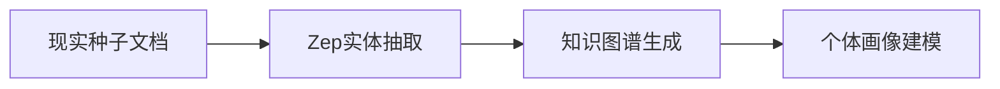
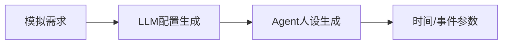
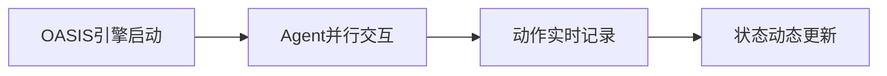
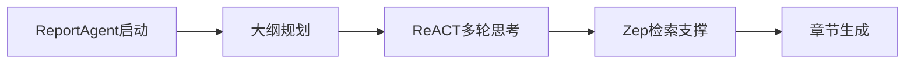
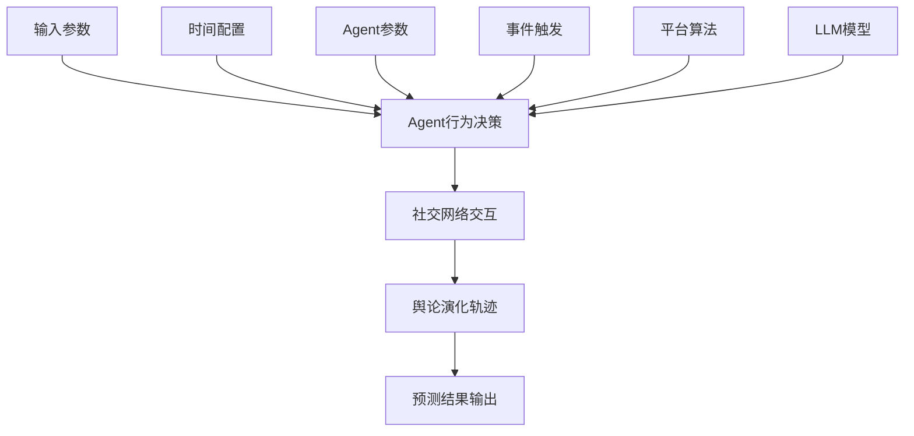
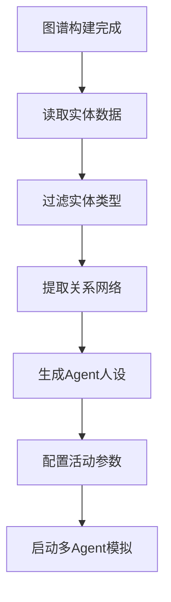
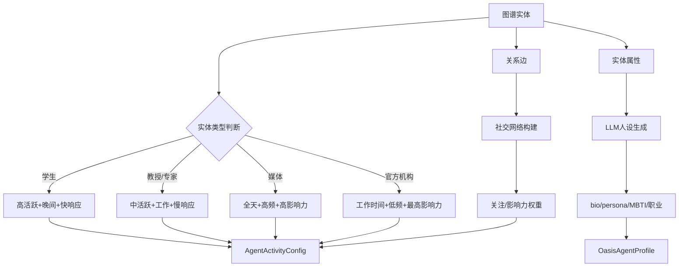

# 整体流程  
MiroFish 的预测实现是一个**五阶段流程**：

## MiroFish实现全流程

根据项目代码分析，MiroFish 的预测通过**五阶段闭环流程**实现：

## 1.📊谱构建（数据输入）


**核心组件**：
- `graph_builder.py`：从文本中提取实体、关系、事件
- `ontology_generator.py`：生成领域本体（人物、组织、概念等）
- `text_processor.py`：处理多格式输入（PDF、TXT、DOCX）

**输出**：结构化知识图谱（Zep Cloud存储）

## 2.⚙境配置（智能编排）


**关键服务**：
- `simulation_config_generator.py`：使用 LLM 自动生成：
  -🕐 **时间配置**：基于中国人作息习惯（晚19-22点最活跃）
  -👥 **Agent配置**：每个实体的活跃度、发言频率、情感倾向
  -📅事件配置**：初始触发事件 +定热点
  - 📱 **平台配置**：Twitter/Reddit推算法参数

**创新点**：全程自动化，无需人工调参

## 3.▶模拟运行（多Agent交互）


**执行流程**：
1. **启动**：`SimulationRunner`启后台子进程
2. **执行**：OASIS/CAMEL-AI多 Agent并行模拟
3. **监控**：
   - 实时解析 `actions.jsonl` 日志
   -每轮更新进度（当前轮次、模拟时间）
   -记每个 Agent 的行为（发帖、评论、点赞）
4. **可选**：`ZepGraphMemoryManager`将活动同步回图谱

**时间加速**：默认每轮60分钟（1小时），72小时模拟只需72轮

## 4.📝报生成（深度分析）


**核心机制**：
- **ReACT模式**：Reasoning + Action + Observation + Thinking
- **工具集**：
  - `ZepToolsService.search()`：检索相关实体信息
  - `ZepToolsService.insight_forge()`：生成洞察
  - `ZepToolsService.panorama()`：全景分析
  - `ZepToolsService.interview()`：采访特定Agent
- **自主决策**：Agent 自主调用工具获取信息，多轮反思优化

**输出**：结构化预测报告（含轨迹分析、变量影响等）

## 5.🤝互动（上帝视角）


**功能**：
- 与任意 Agent 对话，了解其"内心想法"
- 与 ReportAgent 对话，深入探讨预测逻辑
- **上帝视角干预**：动态注入新变量，观察轨迹变化

---

##核心原理

### 1. **基于Agent的微观模拟**
-每个真实个体映射为一个Agent
- Agent行为由LLM驱动，结合人设和上下文
- 通过多轮交互涌现宏观趋势

### 2. **时间驱动的演化机制**
```python
# 时间配置示例
time_config = {
    "total_simulation_hours": 72,    # 模拟3天
    "minutes_per_round": 60,          #每轮1小时
    "peak_hours": [19, 20, 21, 22],   #晚高峰
    "activity_multipliers": {
        "peak": 1.5,    #活跃度1.5倍
        "dead": 0.05    #凌仅5%
    }
}
```

### 3. **社会网络效应建模**
- **回声室效应**：相似观点聚集
- **病毒传播**：热点话题扩散机制
- **影响力权重**：关键人物的放大效应

### 4. **记忆与反馈循环**
- Agent记忆累积（过往行为影响未来决策）
- 图谱动态更新（将模拟结果反哺知识库）
-支持多轮迭代预测

---

##典应用场景

|场 | 输入 |目标 |
|------|------|----------|
| **舆情推演** | 新闻事件、政策文件 |走向、关键节点 |
| **文学预测** | 《红楼梦》前80回 |后40回可能结局 |
| **金融预测** |市动态、公司公告 |趋势、投资者反应 |

这种"**从数据到Agent，从交互到洞察**"的完整闭环，使MiroFish能够对复杂社会现象进行高保真的预测推演。


# 影响因素和参数

## 1.配置参数


##模拟运行时的关键影响因素和参数

根据项目代码，MiroFish模拟运行时的影响因素可从以下维度分类：

## 1.配置参数

###核心时间参数
```python
class TimeSimulationConfig:
    # 模拟总时长（小时）
    total_simulation_hours: int = 72  # 默认3天
    
    #每轮代表时间（分钟）
    minutes_per_round: int = 60       # 1小时/轮
    
    #每小时激活Agent数量范围
    agents_per_hour_min: int = 5
    agents_per_hour_max: int = 20
```

### 作息时间影响因子
```python
#基于中国人作息习惯的时间权重
CHINA_TIMEZONE_CONFIG = {
    "peak_hours": [19, 20, 21, 22],        #晚高峰（1.5倍活跃）
    "work_hours": [9, 10, 11, 12, 13-18],   #工作时段（0.7倍）
    "morning_hours": [6, 7, 8],            # 早间时段（0.4倍）
    "off_peak_hours": [0, 1, 2, 3, 4, 5],  #凌低谷（0.05倍）
}
```

**影响**：不同时段Agent活跃度差异显著，直接影响舆论热度和传播速度

## 2. 👥 Agent个体参数

###Agent的配置
```python
class AgentActivityConfig:
    #基活跃度 (0.0-1.0)
    activity_level: float = 0.5
    
    # 发言频率
    posts_per_hour: float = 1.0      #发帖数
    comments_per_hour: float = 2.0   #每小时评论数
    
    #时间段
    active_hours: List[int] = [8, 9, ..., 22]  # 8点到22点活跃
    
    #响应速度（模拟分钟）
    response_delay_min: int = 5
    response_delay_max: int = 60
    
    #倾向 (-1.0到1.0)
    sentiment_bias: float = 0.0
    
    #态度
    stance: str = "neutral"  # supportive/opposing/neutral/observer
    
    #影力权重
    influence_weight: float = 1.0
```

## 3.📅事件驱动参数

###初始事件配置
```python
class EventConfig:
    #模拟启动时的触发事件
    initial_posts: List[Dict] = []
    
    #定触发事件
    scheduled_events: List[Dict] = []
    
    #热话题关键词
    hot_topics: List[str] = []
    
    #引导方向
    narrative_direction: str = ""
```

## 4.📱平算法参数

###推算法算法权重
```python
class PlatformConfig:
    #推排序权重
    recency_weight: float = 0.4    # 时间新鲜度
    popularity_weight: float = 0.3 #
       relevance_weight: float = 0.3   #相关性
    
    #传播阈值
    viral_threshold: int = 10      # 10次互动触发扩散
    
    #回声室效应强度
    echo_chamber_strength: float = 0.5  # 观点聚集程度
```

## 5.🧠LM驱动参数

### 模型配置
```python
# 使用的LLM参数
llm_model: str = "gpt-4"          #模类型
llm_base_url: str = "https://api.openai.com/v1"  # API地址
temperature: float = 0.7           #创性参数
max_tokens: int = 2000             # 最大输出长度
```

## 6.🔄动态影响因子

###运行时可变参数
1. **Agent记忆状态**：过往行为影响未来决策
2. **社会网络结构**：关注关系、影响力传播路径
3. **热点事件演化**：突发事件改变舆论走向
4. **外部干预变量**：上帝视角注入新信息

## 参数影响关系图



##敏感性分析

**高敏感参数**：
- `activity_level`：直接影响整体活跃度
- `sentiment_bias`：决定舆论倾向
- `influence_weight`：关键人物的放大效应
- `hot_topics`：热点引导舆论走向

**中等敏感参数**：
- `peak_hours`配置：影响传播时机
- `viral_threshold`：控制扩散速度
- `echo_chamber_strength`：影响观点分化程度

**低敏感参数**：
- `minutes_per_round`：主要影响模拟速度
- `agents_per_hour_min/max`：影响并发度但不改变趋势

这些参数通过LLM智能编排，形成一个复杂的**多因子耦合系统**，最终涌现出宏观的社会预测结果。

# 图谱数据


## MiroFish 模拟运行如何利用图谱数据

### 图谱数据利用流程



### 利用机制详解

1. **实体提取**：从图谱中读取节点数据（人物、组织、概念等）
2. **关系网络**：提取实体间的关系边（关注、隶属、观点等）
3. **人设生成**：基于实体属性生成详细的人格画像
4. **参数配置**：根据实体类型设定不同的活动参数
5. **社会网络**：将关系转化为Agent间的关注/影响力网络

---

## 多个图谱数据范例

### 范例1：校园舆情事件（武大模拟）

```json
{
  "graph_id": "graph_wuhan_university_2025",
  "entities": [
    {
      "uuid": "ent_001",
      "name": "张同学",
      "labels": ["Student"],
      "summary": "武汉大学计算机学院大三学生，社交媒体活跃用户",
      "attributes": {
        "age": "21",
        "department": "计算机学院",
        "social_activity": "high"
      },
      "related_edges": [
        {"name": "studies_at", "target": "武汉大学"},
        {"name": "friends_with", "target": "李同学"},
        {"name": "posted_about", "target": "宿舍管理问题"}
      ]
    },
    {
      "uuid": "ent_002",
      "name": "李教授",
      "labels": ["Professor"],
      "summary": "武汉大学社会学系教授，长期关注学生心理健康",
      "attributes": {
        "title": "教授",
        "department": "社会学系",
        "expertise": "心理健康"
      },
      "related_edges": [
        {"name": "works_at", "target": "武汉大学"},
        {"name": "researches_on", "target": "学生心理健康"},
        {"name": "comments_on", "target": "宿舍管理问题"}
      ]
    },
    {
      "uuid": "ent_003",
      "name": "武汉大学官方微博",
      "labels": ["MediaOutlet"],
      "summary": "武汉大学官方信息发布渠道",
      "attributes": {
        "type": "official",
        "followers": "500000"
      },
      "related_edges": [
        {"name": "belongs_to", "target": "武汉大学"},
        {"name": "announces", "target": "宿舍管理政策"}
      ]
    }
  ],
  "simulation_config": {
    "entity_type_mapping": {
      "Student": {
        "activity_level": 0.8,
        "posts_per_hour": 1.5,
        "influence_weight": 1.0,
        "active_hours": [19, 20, 21, 22, 23]
      },
      "Professor": {
        "activity_level": 0.4,
        "posts_per_hour": 0.3,
        "influence_weight": 2.5,
        "active_hours": [8, 9, 10, 11, 14, 15, 16, 19, 20]
      },
      "MediaOutlet": {
        "activity_level": 0.6,
        "posts_per_hour": 0.8,
        "influence_weight": 3.0,
        "active_hours": [7, 8, 9, 10, 11, 12, 13, 14, 15, 16, 17, 18, 19, 20, 21]
      }
    }
  }
}
```

### 范例2：《红楼梦》结局预测

```json
{
  "graph_id": "graph_red_chamber_80chapters",
  "entities": [
    {
      "uuid": "ent_baoyu",
      "name": "贾宝玉",
      "labels": ["PublicFigure", "Noble"],
      "summary": "荣国府继承人，性格多情叛逆，与林黛玉、薛宝钗有情感纠葛",
      "attributes": {
        "family": "荣国府",
        "status": "继承人",
        "personality": "多情、叛逆、重情义",
        "key_relationships": ["林黛玉", "薛宝钗", "王熙凤"]
      },
      "related_edges": [
        {"name": "loves", "target": "林黛玉"},
        {"name": "married_to", "target": "薛宝钗"},
        {"name": "belongs_to", "target": "荣国府"},
        {"name": "conflicts_with", "target": "贾政"}
      ]
    },
    {
      "uuid": "ent_daiyu",
      "name": "林黛玉",
      "labels": ["PublicFigure", "Noble"],
      "summary": "寄居贾府的才女，多愁善感，与宝玉有深厚感情",
      "attributes": {
        "origin": "扬州",
        "status": "寄居",
        "personality": "敏感、才华横溢、体弱多病"
      },
      "related_edges": [
        {"name": "loves", "target": "贾宝玉"},
        {"name": "related_to", "target": "贾母"},
        {"name": "rivals_with", "target": "薛宝钗"}
      ]
    },
    {
      "uuid": "ent_xifeng",
      "name": "王熙凤",
      "labels": ["PublicFigure", "Noble"],
      "summary": "荣国府实际管理者，精明能干但手段狠辣",
      "attributes": {
        "role": "管家",
        "personality": "精明、强势、贪婪"
      },
      "related_edges": [
        {"name": "manages", "target": "荣国府"},
        {"name": "married_to", "target": "贾琏"},
        {"name": "conflicts_with", "target": "尤二姐"}
      ]
    }
  ],
  "simulation_config": {
    "entity_type_mapping": {
      "Noble": {
        "activity_level": 0.6,
        "posts_per_hour": 0.8,
        "comments_per_hour": 1.2,
        "influence_weight": 2.0,
        "active_hours": [9, 10, 11, 14, 15, 16, 19, 20, 21]
      },
      "PublicFigure": {
        "activity_level": 0.7,
        "posts_per_hour": 1.0,
        "influence_weight": 2.5
      }
    },
    "social_dynamics": {
      "family_hierarchy": true,
      "marriage_customs": "ancient_chinese",
      "conflict_patterns": ["inheritance", "love_triangle", "family_politics"]
    }
  }
}
```

### 范例3：金融市场预测

```json
{
  "graph_id": "graph_financial_market_tech",
  "entities": [
    {
      "uuid": "ent_ceo_tech",
      "name": "张三",
      "labels": ["CEO", "PublicFigure"],
      "summary": "某科技公司CEO，经常发表行业观点",
      "attributes": {
        "company": "科技公司",
        "influence": "high",
        "twitter_followers": "2000000"
      },
      "related_edges": [
        {"name": "leads", "target": "科技公司"},
        {"name": "announced", "target": "新产品发布"},
        {"name": "conflict_with", "target": "监管机构"}
      ]
    },
    {
      "uuid": "ent_regulator",
      "name": "证监会",
      "labels": ["GovernmentAgency"],
      "summary": "金融市场监管机构",
      "attributes": {
        "type": "regulatory",
        "authority": "high"
      },
      "related_edges": [
        {"name": "regulates", "target": "科技公司"},
        {"name": "investigating", "target": "财务造假事件"}
      ]
    },
    {
      "uuid": "ent_analyst",
      "name": "李分析师",
      "labels": ["Expert", "Analyst"],
      "summary": "资深金融行业分析师",
      "attributes": {
        "expertise": "科技股",
        "credibility": "high"
      },
      "related_edges": [
        {"name": "analyzes", "target": "科技公司"},
        {"name": "downgraded", "target": "科技公司股票"}
      ]
    }
  ],
  "simulation_config": {
    "entity_type_mapping": {
      "CEO": {
        "activity_level": 0.5,
        "posts_per_hour": 0.4,
        "influence_weight": 3.5,
        "market_impact": "high"
      },
      "GovernmentAgency": {
        "activity_level": 0.3,
        "posts_per_hour": 0.2,
        "influence_weight": 4.0,
        "market_impact": "very_high"
      },
      "Analyst": {
        "activity_level": 0.7,
        "posts_per_hour": 1.2,
        "influence_weight": 2.5,
        "market_impact": "medium"
      }
    },
    "market_dynamics": {
      "volatility_factor": 0.8,
      "news_sensitivity": "high",
      "herd_behavior": true
    }
  }
}
```

### 范例4：政治事件预测

```json
{
  "graph_id": "graph_political_election_2025",
  "entities": [
    {
      "uuid": "ent_candidate_a",
      "name": "候选人A",
      "labels": ["Politician", "PublicFigure"],
      "summary": "现任市长，寻求连任，主打经济政策",
      "attributes": {
        "party": "执政党",
        "position": "市长",
        "approval_rating": "45%",
        "key_policy": "经济发展"
      },
      "related_edges": [
        {"name": "leads", "target": "市政府"},
        {"name": "supported_by", "target": "商界联盟"},
        {"name": "opposed_by", "target": "环保组织"}
      ]
    },
    {
      "uuid": "ent_candidate_b",
      "name": "候选人B",
      "labels": ["Politician", "PublicFigure"],
      "summary": "挑战者，主打社会公平和环保议题",
      "attributes": {
        "party": "反对党",
        "position": "市议员",
        "approval_rating": "38%",
        "key_policy": "社会公平"
      },
      "related_edges": [
        {"name": "challenges", "target": "候选人A"},
        {"name": "supported_by", "target": "环保组织"},
        {"name": "endorsed_by", "target": "工会联盟"}
      ]
    },
    {
      "uuid": "ent_media_news",
      "name": "城市新闻网",
      "labels": ["MediaOutlet"],
      "summary": "本地主要新闻媒体",
      "attributes": {
        "type": "local_news",
        "credibility": "high",
        "reach": "500000"
      },
      "related_edges": [
        {"name": "reports_on", "target": "候选人A"},
        {"name": "reports_on", "target": "候选人B"},
        {"name": "investigates", "target": "市政丑闻"}
      ]
    }
  ],
  "simulation_config": {
    "entity_type_mapping": {
      "Politician": {
        "activity_level": 0.6,
        "posts_per_hour": 0.5,
        "influence_weight": 3.0,
        "campaign_intensity": "high"
      },
      "MediaOutlet": {
        "activity_level": 0.8,
        "posts_per_hour": 2.0,
        "influence_weight": 2.5
      },
      "Organization": {
        "activity_level": 0.5,
        "posts_per_hour": 0.8,
        "influence_weight": 2.0
      }
    },
    "political_dynamics": {
      "debate_schedule": ["week1", "week2", "week3"],
      "scandal_impact": "high",
      "voter_turnout_model": "demographic_based"
    }
  }
}
```

---

## 图谱数据在模拟中的具体应用

### 1. 实体类型映射活动参数
```python
# simulation_config_generator.py 中的映射逻辑
if entity_type in ["student"]:
    return {
        "activity_level": 0.8,           # 高活跃度
        "posts_per_hour": 1.5,           # 高频发帖
        "influence_weight": 1.0,         # 普通影响力
        "active_hours": [19, 20, 21, 22, 23]  # 晚间活跃
    }
elif entity_type in ["professor", "expert"]:
    return {
        "activity_level": 0.4,           # 低活跃度
        "posts_per_hour": 0.3,           # 低频发帖
        "influence_weight": 2.5,         # 高影响力
        "active_hours": [8, 9, 10, 19, 20]  # 工作+晚间
    }
```

### 2. 关系网络转化为关注图
```python
# 将图谱关系转化为Agent间的关注关系
def build_social_graph(entities, edges):
    social_graph = {}
    for edge in edges:
        if edge["name"] in ["friends_with", "follows", "supports"]:
            source = edge["source"]
            target = edge["target"]
            if source not in social_graph:
                social_graph[source] = []
            social_graph[source].append(target)
    return social_graph
```

### 3. 属性驱动行为模式
- **年龄/身份** → 活跃时间段
- **职位/影响力** → 信息传播权重
- **关系密度** → 信息扩散速度
- **情感倾向** → 发言立场

---

## 总结

图谱数据在 MiroFish 中是**多智能体模拟的基石**，通过：
1. **实体→Agent**：每个图谱节点映射为一个智能体
2. **关系→网络**：实体间的边转化为社交网络
3. **属性→参数**：实体属性决定Agent行为参数
4. **上下文→记忆**：实体的summary和attributes成为Agent初始记忆

这种映射使模拟能够**高度还原真实社会结构**，预测结果具有更强的现实参考价值。

# 图谱构建与Agent参数映射的代码实现。


## 图谱构建与 Agent 参数映射代码实现

### 一、图谱构建流程

#### 1. 图谱创建与本体设置

```python
# graph_builder.py
class GraphBuilderService:
    def create_graph(self, name: str) -> str:
        """创建Zep图谱"""
        graph_id = f"mirofish_{uuid.uuid4().hex[:16]}"
        self.client.graph.create(
            graph_id=graph_id,
            name=name,
            description="MiroFish Social Simulation Graph"
        )
        return graph_id
    
    def set_ontology(self, graph_id: str, ontology: Dict[str, Any]):
        """设置图谱本体（动态创建实体类型和关系类型）"""
        # 动态创建实体类型
        entity_types = {}
        for entity_def in ontology.get("entity_types", []):
            name = entity_def["name"]
            # 使用Pydantic动态创建类
            entity_class = type(name, (EntityModel,), attrs)
            entity_types[name] = entity_class
        
        # 动态创建边类型
        edge_definitions = {}
        for edge_def in ontology.get("edge_types", []):
            name = edge_def["name"]
            edge_class = type(class_name, (EdgeModel,), attrs)
            edge_definitions[name] = (edge_class, source_targets)
        
        # 调用Zep API设置本体
        self.client.graph.set_ontology(
            graph_ids=[graph_id],
            entities=entity_types,
            edges=edge_definitions
        )
```

#### 2. 文本分块与图谱填充

```python
    def add_text_batches(self, graph_id: str, chunks: List[str], batch_size: int = 3):
        """分批发送文本到Zep，构建图谱"""
        for i in range(0, len(chunks), batch_size):
            batch_chunks = chunks[i:i + batch_size]
            episodes = [
                EpisodeData(data=chunk, type="text")
                for chunk in batch_chunks
            ]
            # 发送到Zep
            batch_result = self.client.graph.add_batch(
                graph_id=graph_id,
                episodes=episodes
            )
```

---

### 二、图谱数据读取与过滤

```python
# zep_entity_reader.py
class ZepEntityReader:
    def filter_defined_entities(
        self, 
        graph_id: str,
        defined_entity_types: Optional[List[str]] = None,
        enrich_with_edges: bool = True
    ) -> FilteredEntities:
        """筛选符合预定义实体类型的节点"""
        # 获取所有节点
        all_nodes = self.get_all_nodes(graph_id)
        all_edges = self.get_all_edges(graph_id) if enrich_with_edges else []
        
        # 筛选逻辑：Labels必须包含除"Entity"和"Node"之外的标签
        for node in all_nodes:
            labels = node.get("labels", [])
            custom_labels = [l for l in labels if l not in ["Entity", "Node"]]
            
            if not custom_labels:
                continue  # 跳过默认标签
            
            # 创建实体节点对象
            entity = EntityNode(
                uuid=node["uuid"],
                name=node["name"],
                labels=labels,
                summary=node["summary"],
                attributes=node["attributes"],
            )
            
            # 关联边和节点信息
            if enrich_with_edges:
                entity.related_edges = [...]  # 关联边
                entity.related_nodes = [...]  # 关联节点
            
            filtered_entities.append(entity)
```

---

### 三、图谱实体 → Agent Profile 映射

#### 1. 核心映射逻辑

```python
# oasis_profile_generator.py
class OasisProfileGenerator:
    def generate_profile_from_entity(
        self, 
        entity: EntityNode, 
        user_id: int,
        use_llm: bool = True
    ) -> OasisAgentProfile:
        """从图谱实体生成OASIS Agent Profile"""
        entity_type = entity.get_entity_type() or "Entity"
        name = entity.name
        user_name = self._generate_username(name)
        
        # 构建实体上下文（属性+关系+Zep检索）
        context = self._build_entity_context(entity)
        
        if use_llm:
            # 使用LLM生成详细人设
            profile_data = self._generate_profile_with_llm(
                entity_name=name,
                entity_type=entity_type,
                entity_summary=entity.summary,
                entity_attributes=entity.attributes,
                context=context  # 包含关系和检索信息
            )
        else:
            # 使用规则生成基础人设
            profile_data = self._generate_profile_rule_based(
                entity_name=name,
                entity_type=entity_type,
                entity_summary=entity.summary,
                entity_attributes=entity.attributes
            )
        
        return OasisAgentProfile(
            user_id=user_id,
            user_name=user_name,
            name=name,
            bio=profile_data.get("bio"),
            persona=profile_data.get("persona"),
            age=profile_data.get("age"),
            gender=profile_data.get("gender"),
            mbti=profile_data.get("mbti"),
            profession=profile_data.get("profession"),
            interested_topics=profile_data.get("interested_topics", []),
            source_entity_uuid=entity.uuid,  # 保留图谱实体关联
            source_entity_type=entity_type,
        )
```

#### 2. 实体上下文构建（关系网络利用）

```python
    def _build_entity_context(self, entity: EntityNode) -> str:
        """构建实体的完整上下文信息"""
        context_parts = []
        
        # 1. 实体属性信息
        if entity.attributes:
            attrs = [f"- {key}: {value}" for key, value in entity.attributes.items()]
            context_parts.append("### 实体属性\n" + "\n".join(attrs))
        
        # 2. 相关边信息（关系网络）
        if entity.related_edges:
            relationships = []
            for edge in entity.related_edges:
                fact = edge.get("fact", "")
                if fact:
                    relationships.append(f"- {fact}")
            context_parts.append("### 相关事实和关系\n" + "\n".join(relationships))
        
        # 3. 关联节点信息
        if entity.related_nodes:
            related_info = []
            for node in entity.related_nodes:
                node_name = node.get("name", "")
                node_labels = node.get("labels", [])
                related_info.append(f"- **{node_name}**: {node.get('summary', '')}")
            context_parts.append("### 关联实体信息\n" + "\n".join(related_info))
        
        # 4. Zep混合检索增强
        zep_results = self._search_zep_for_entity(entity)
        if zep_results.get("facts"):
            context_parts.append("### Zep检索到的事实信息")
        
        return "\n\n".join(context_parts)
```

---

### 四、实体类型 → 模拟参数映射

#### 1. 规则映射表

```python
# simulation_config_generator.py
class SimulationConfigGenerator:
    def _generate_agent_config_by_rule(self, entity: EntityNode) -> Dict[str, Any]:
        """基于规则生成Agent活动配置（中国人作息习惯）"""
        entity_type = (entity.get_entity_type() or "Unknown").lower()
        
        if entity_type in ["university", "governmentagency", "ngo"]:
            # 官方机构：工作时间活动，低频率，高影响力
            return {
                "activity_level": 0.2,
                "posts_per_hour": 0.1,
                "comments_per_hour": 0.05,
                "active_hours": list(range(9, 18)),  # 9:00-17:59
                "response_delay_min": 60,
                "response_delay_max": 240,
                "influence_weight": 3.0  # 高影响力
            }
        
        elif entity_type in ["mediaoutlet"]:
            # 媒体：全天活动，中等频率，高影响力
            return {
                "activity_level": 0.5,
                "posts_per_hour": 0.8,
                "comments_per_hour": 0.3,
                "active_hours": list(range(7, 24)),  # 7:00-23:59
                "influence_weight": 2.5
            }
        
        elif entity_type in ["professor", "expert", "official"]:
            # 专家/教授：工作+晚间活动，中等频率
            return {
                "activity_level": 0.4,
                "posts_per_hour": 0.3,
                "comments_per_hour": 0.5,
                "active_hours": list(range(8, 22)),
                "influence_weight": 2.0
            }
        
        elif entity_type in ["student"]:
            # 学生：晚间为主，高频率
            return {
                "activity_level": 0.8,
                "posts_per_hour": 0.6,
                "comments_per_hour": 1.5,
                "active_hours": [8, 9, 10, 11, 12, 13, 18, 19, 20, 21, 22, 23],
                "response_delay_min": 1,  # 快速响应
                "response_delay_max": 15,
                "influence_weight": 0.8
            }
```

#### 2. LLM智能配置生成

```python
    def _generate_agent_configs_batch(
        self,
        context: str,
        entities: List[EntityNode],
        start_idx: int,
        simulation_requirement: str
    ) -> List[AgentActivityConfig]:
        """使用LLM分批生成Agent配置"""
        # 构建实体信息字符串
        entity_info = ""
        for i, entity in enumerate(entities):
            entity_info += f"""
Agent {start_idx + i}:
- 名称: {entity.name}
- 类型: {entity.get_entity_type()}
- 摘要: {entity.summary[:200]}
"""
        
        # 调用LLM生成配置
        prompt = f"""
模拟需求: {simulation_requirement}
实体信息:
{entity_info}

请为每个Agent生成以下配置:
{{
    "agent_id": <必须与输入一致>,
    "activity_level": <0.0-1.0>,
    "posts_per_hour": <发帖频率>,
    "comments_per_hour": <评论频率>,
    "active_hours": [<活跃小时列表，考虑中国人作息>],
    "response_delay_min": <最小响应延迟分钟>,
    "response_delay_max": <最大响应延迟分钟>,
    "sentiment_bias": <-1.0到1.0>,
    "stance": "<supportive/opposing/neutral/observer>",
    "influence_weight": <影响力权重>
}}
"""
        # LLM生成后构建配置对象
        result = self._call_llm_with_retry(prompt, system_prompt)
        configs = []
        for entity in entities:
            config = AgentActivityConfig(
                agent_id=agent_id,
                entity_uuid=entity.uuid,
                activity_level=cfg.get("activity_level", 0.5),
                influence_weight=cfg.get("influence_weight", 1.0),
                ...
            )
            configs.append(config)
```

---

### 五、映射关系总览



### 六、核心数据结构映射

| 图谱数据 | 映射目标 | 用途 |
|---------|---------|------|
| `Entity.labels` | 实体类型识别 | 选择配置规则 |
| `Entity.summary` | Persona描述 | Agent人设生成 |
| `Entity.attributes` | 个性化参数 | 定制化配置 |
| `Entity.related_edges` | 关系网络 | 社交图构建 |
| `Entity.related_nodes` | 关联实体 | 上下文增强 |
| 实体类型 | 活动参数 | 作息/频率/影响力 |

---

### 七、完整流程示例

```python
# 1. 图谱构建
builder = GraphBuilderService()
graph_id = builder.create_graph("武大舆情模拟")
builder.set_ontology(graph_id, ontology)  # 设置Student/Professor等类型
builder.add_text_batches(graph_id, chunks)  # 填入文档数据

# 2. 读取实体
reader = ZepEntityReader()
entities = reader.filter_defined_entities(
    graph_id=graph_id,
    defined_entity_types=["Student", "Professor", "MediaOutlet"]
)

# 3. 生成Agent Profile
generator = OasisProfileGenerator(graph_id=graph_id)
profiles = []
for i, entity in enumerate(entities):
    profile = generator.generate_profile_from_entity(
        entity=entity,
        user_id=i+1,
        use_llm=True  # 使用LLM生成详细人设
    )
    profiles.append(profile)

# 4. 生成模拟配置
config_gen = SimulationConfigGenerator()
sim_params = config_gen.generate_config(
    simulation_id="sim_001",
    graph_id=graph_id,
    simulation_requirement="模拟武大舆情事件发展",
    document_text=original_text,
    entities=entities
)

# 5. 启动模拟（使用生成的Profile和配置）
# OASIS引擎根据这些配置驱动多Agent交互
```

整个流程实现了**从图谱结构到多智能体模拟的端到端自动化映射**，图谱中的每个实体都会根据其类型、属性、关系网络被转换为具有独特行为模式的Agent。